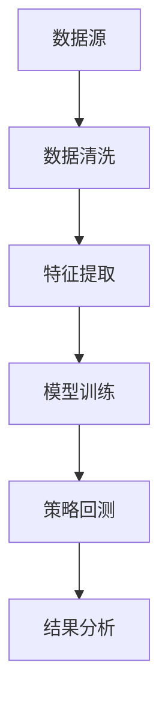

                 


# AI驱动的价值投资策略回测与优化

## 关键词：AI，价值投资，回测，机器学习，深度学习，投资策略优化

## 摘要：  
本文系统地探讨了如何利用人工智能技术优化价值投资策略的回测与优化过程。通过结合传统价值投资的核心理念与现代AI技术，本文提出了一套基于机器学习和深度学习的策略优化框架，并详细分析了其在实际投资中的应用。文章首先介绍了价值投资的基本概念和AI技术的核心原理，然后深入探讨了AI驱动的策略优化算法及其数学模型，最后通过实际案例展示了如何构建一个完整的AI驱动的价值投资回测系统。

---

## 第1章 引言

### 1.1 价值投资的核心概念  
价值投资是一种以基本面分析为基础的投资策略，旨在通过识别市场中被低估的资产来实现长期收益。其核心理念包括：  
- **基本面分析**：研究公司的财务状况、行业地位、盈利能力等。  
- **安全边际**：买入价格低于内在价值，以降低投资风险。  
- **长期视角**：关注企业的长期增长潜力而非短期市场波动。  

### 1.2 AI技术的基本原理  
人工智能（AI）通过模拟人类学习和推理能力，利用数据驱动的方法解决复杂问题。其核心技术包括：  
- **机器学习**：基于数据训练模型，使其能够自动识别模式并做出预测。  
- **深度学习**：一种基于人工神经网络的机器学习方法，能够处理非结构化数据（如文本、图像等）。  
- **自然语言处理（NLP）**：用于分析文本数据，提取情感、主题等信息。  

### 1.3 价值投资与AI结合的意义  
传统价值投资依赖于人工分析，存在主观性强、效率低、覆盖面窄等问题。AI技术的引入能够：  
1. 提高数据分析效率，发现潜在投资机会。  
2. 利用大数据挖掘市场规律，优化投资策略。  
3. 通过算法回测和优化，降低投资风险。  

---

## 第2章 价值投资策略的核心要素

### 2.1 基本面分析  
基本面分析是价值投资的核心，主要包括以下指标：  
- **市盈率（P/E）**：衡量股票价格是否合理。  
- **市净率（P/B）**：反映股票价格与账面价值的关系。  
- **股息率**：评估股票的分红能力。  

### 2.2 市场情绪分析  
市场情绪对投资决策有重要影响，可以通过以下方式捕捉：  
- **新闻 sentiment**：分析媒体报道和社交媒体情绪。  
- **投资者行为数据**：通过高频交易数据识别市场情绪。  

### 2.3 财务指标分析  
财务指标是衡量企业健康状况的重要工具，包括：  
- **盈利能力**：如净利润率、ROE（净资产收益率）。  
- **成长能力**：如收入增长率、净利润增长率。  
- **财务风险**：如资产负债率、流动比率。  

---

## 第3章 AI驱动的价值投资策略优化

### 3.1 数据预处理与特征提取  
数据是AI模型的基础，特征提取是关键步骤：  
1. **数据清洗**：处理缺失值、异常值和重复数据。  
2. **特征工程**：将原始数据转化为对模型有用的特征，如归一化、PCA降维。  

#### 示例：使用Python进行数据预处理  
```python
import pandas as pd
from sklearn.preprocessing import StandardScaler

# 数据加载与清洗
df = pd.read_csv('stock_data.csv')
df.dropna(inplace=True)  # 删除缺失值
df = df[ df['volume'] > 0 ]  # 过滤掉成交量为0的记录

# 特征工程
features = df[['open', 'high', 'low', 'close', 'volume']]
scaler = StandardScaler()
features_scaled = scaler.fit_transform(features)
```

### 3.2 机器学习模型构建  
常用的机器学习算法包括：  
- **线性回归**：用于预测目标变量（如股价）的变化趋势。  
- **随机森林**：通过集成学习提高模型的准确性和鲁棒性。  
- **支持向量机（SVM）**：适用于分类和回归任务。  

#### 示例：使用随机森林进行预测  
```python
from sklearn.ensemble import RandomForestRegressor

# 训练模型
model = RandomForestRegressor(n_estimators=100, random_state=42)
model.fit(features_scaled, df['target'])  # target为标签变量
```

### 3.3 深度学习模型优化  
深度学习在处理非结构化数据（如新闻文本）方面具有优势，常用模型包括：  
- **LSTM**：适合时间序列数据的预测。  
- **Transformer**：用于捕捉长距离依赖关系。  

#### 示例：使用LSTM进行时间序列预测  
```python
from keras.layers import LSTM, Dense
from keras.models import Sequential

# 构建模型
model = Sequential()
model.add(LSTM(64, input_shape=(timesteps, features)))
model.add(Dense(1))  # 输出层
model.compile(loss='mean_squared_error', optimizer='adam')
```

---

## 第4章 系统架构与实现

### 4.1 系统模块划分  
AI驱动的价值投资回测系统主要包括以下模块：  
- **数据获取模块**：从数据库或API获取历史数据。  
- **特征提取模块**：对数据进行清洗和特征工程。  
- **模型训练模块**：基于特征数据训练AI模型。  
- **回测模块**：模拟投资过程，评估策略的收益与风险。  

### 4.2 系统架构设计  
系统架构采用分层设计，包括数据层、算法层和应用层。  

#### 系统架构图（Mermaid）  


### 4.3 实际案例分析  
以某股票为例，构建一个完整的回测系统：  
1. 数据获取：从Yahoo Finance获取历史数据。  
2. 特征提取：提取股价、成交量、市盈率等指标。  
3. 模型训练：使用随机森林预测股价走势。  
4. 策略回测：模拟投资过程，计算收益和风险指标（如夏普比率）。  

---

## 第5章 总结与展望

### 5.1 总结  
本文详细探讨了AI驱动的价值投资策略优化方法，提出了基于机器学习和深度学习的策略回测框架。通过实际案例展示了如何利用AI技术提高投资效率和准确性。  

### 5.2 展望  
未来的研究方向包括：  
- 结合NLP技术，进一步挖掘市场情绪。  
- 开发更复杂的深度学习模型，如GPT-3，用于生成投资策略。  
- 研究多资产类别（如债券、基金）的投资策略优化。  

---

## 作者  
作者：AI天才研究院 & 禅与计算机程序设计艺术

