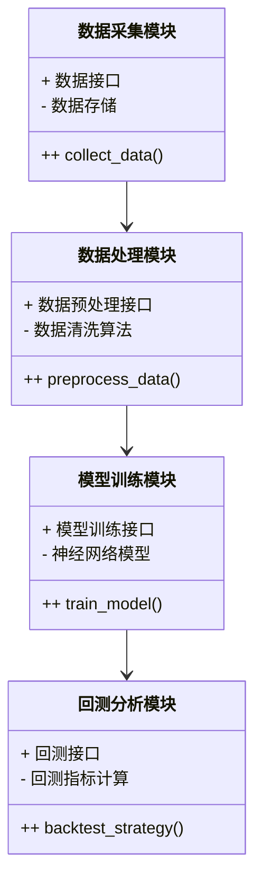
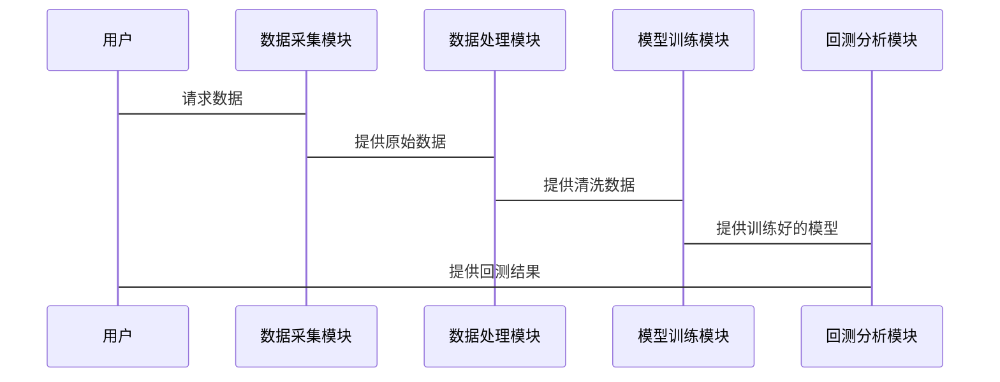

                 


# AI驱动的价值投资策略回测偏差校正

> 关键词：AI驱动，价值投资策略，回测偏差校正，金融数据分析，机器学习，技术分析

> 摘要：本文探讨了利用人工智能技术优化金融投资策略回测的过程，重点分析了价值投资策略在回测中的偏差问题，并提出通过AI技术实现偏差校正的方法。文章详细介绍了AI驱动的回测偏差校正的核心概念、算法原理、系统架构及实际应用，旨在为金融从业者和数据科学家提供理论支持和实践指导。

---

## 第1章 AI驱动的价值投资策略回测概述

### 1.1 价值投资策略的定义与特点

#### 1.1.1 价值投资的核心概念
价值投资是一种基于对公司内在价值的评估，寻找市场价格低于内在价值的投资策略。其核心在于通过分析财务报表、行业地位、竞争优势等因素，识别被市场低估的公司。

#### 1.1.2 价值投资策略的特征
- **长期视角**：注重长期投资，而非短期波动。
- **基本面分析**：依赖对公司财务状况和行业地位的深入分析。
- **低频交易**：交易频率较低，注重买入并持有策略。

#### 1.1.3 价值投资策略在金融市场的应用
价值投资策略在股票、房地产等领域广泛应用。通过识别低估资产，投资者能够在市场复苏时获得超额收益。

### 1.2 回测在投资策略中的作用

#### 1.2.1 回测的基本概念
回测是通过历史数据验证投资策略的有效性，评估策略在不同市场条件下的表现。

#### 1.2.2 回测在策略开发中的重要性
- **策略验证**：确认策略在历史数据中的表现。
- **风险控制**：识别潜在风险和不合理的收益预期。
- **参数优化**：调整策略参数以提高表现。

#### 1.2.3 回测的常见方法与工具
- **数据选择**：选择合适的金融数据源和时间窗口。
- **指标计算**：计算收益、波动率、最大回撤等指标。
- **回测框架**：使用Python的pandas、numpy等库，或专业的回测平台如Backtrader。

### 1.3 AI驱动的回测偏差校正的必要性

#### 1.3.1 传统回测方法的局限性
- **数据偏差**：历史数据可能不完全或存在噪声。
- **模型过拟合**：传统统计模型可能过拟合，导致策略在实际中表现不佳。
- **市场变化**：市场环境变化可能导致策略失效。

#### 1.3.2 AI技术在回测中的优势
- **非线性关系捕捉**：AI能够发现传统统计方法难以捕捉的复杂关系。
- **自动优化**：通过机器学习优化策略参数，提高回测结果的准确性。
- **实时适应**：AI模型可以实时更新，适应市场变化。

#### 1.3.3 回测偏差校正的目标与意义
- **减少偏差**：通过AI技术校正回测中的偏差，提高策略的有效性。
- **增强鲁棒性**：确保策略在不同市场条件下表现稳定。

### 1.4 本书的核心内容与结构

#### 1.4.1 本书的研究框架
本书围绕AI驱动的回测偏差校正，从理论到实践，系统地探讨了相关方法和应用。

#### 1.4.2 各章节的主要内容
- 第2章：价值投资策略的AI驱动分析。
- 第3章：AI驱动的回测偏差校正方法。
- 第4章：算法原理。
- 第5章：系统分析与架构设计。
- 第6章：项目实战。
- 第7章：总结与展望。

#### 1.4.3 读者对象与学习要求
- **读者对象**：金融从业者、数据科学家、量化投资者。
- **学习要求**：熟悉Python编程，了解机器学习基础，对价值投资策略有一定了解。

---

## 第2章 价值投资策略的AI驱动分析

### 2.1 价值投资策略的关键要素

#### 2.1.1 财务指标分析
- **市盈率（P/E）**：衡量股价相对于盈利的高低。
- **市净率（P/B）**：衡量股价相对于净资产的高低。
- **股息率**：衡量股票分红能力。

#### 2.1.2 市场情绪分析
- **市场情绪指标**：如恐慌指数（VIX）。
- **新闻情感分析**：通过自然语言处理分析市场情绪。

#### 2.1.3 风险评估模型
- **VaR模型**：衡量投资组合在一定置信水平下的潜在损失。
- **信用评分模型**：评估投资标的信用风险。

### 2.2 AI在价值投资中的应用场景

#### 2.2.1 数据清洗与特征提取
- **数据清洗**：处理缺失值、异常值。
- **特征提取**：从文本、图像等多模态数据中提取特征。

#### 2.2.2 模型训练与策略生成
- **监督学习**：如随机森林、支持向量机（SVM）用于分类和回归任务。
- **无监督学习**：如聚类分析用于市场细分。

#### 2.2.3 策略优化与风险控制
- **遗传算法**：用于优化策略参数。
- **风险中性化**：通过调整投资组合降低风险。

### 2.3 回测偏差的来源与影响

#### 2.3.1 数据偏差的常见类型
- **样本选择偏差**：数据样本不具有代表性。
- **幸存者偏差**：只考虑幸存的公司，忽略破产或退市的公司。

#### 2.3.2 模型偏差的形成机制
- **过拟合**：模型在训练数据上表现优异，但泛化能力差。
- **欠拟合**：模型过于简单，无法捕捉数据中的复杂模式。

#### 2.3.3 偏差对回测结果的影响
- **策略失效**：偏差可能导致策略在实际市场中表现不佳。
- **收益预测误差**：偏差影响回测结果的准确性。

---

## 第3章 AI驱动的回测偏差校正方法

### 3.1 数据预处理与特征工程

#### 3.1.1 数据清洗与标准化
- **数据清洗**：处理缺失值、异常值。
- **标准化**：将数据标准化到统一尺度。

#### 3.1.2 特征选择与降维
- **特征选择**：使用相关性分析、LASSO回归等方法选择重要特征。
- **降维**：如主成分分析（PCA）减少特征维度。

#### 3.1.3 时间序列数据的处理
- **滑动窗口技术**：处理时间序列数据。
- **LSTM网络**：用于捕捉时间序列中的长期依赖关系。

### 3.2 回测偏差校正的算法选择

#### 3.2.1 线性回归模型
- **简单线性回归**：用于预测单一变量。
- **多元线性回归**：用于多个变量的预测。

#### 3.2.2 随机森林
- **随机森林**：通过集成多个决策树减少过拟合。
- **特征重要性分析**：识别关键特征。

#### 3.2.3 神经网络
- **深度神经网络**：用于复杂非线性关系的建模。
- **卷积神经网络（CNN）**：处理图像数据。
- **循环神经网络（RNN）**：处理序列数据。

### 3.3 回测偏差校正的实现步骤

#### 3.3.1 数据收集与预处理
- **数据源**：获取历史价格、财务报表等数据。
- **数据清洗**：处理缺失值、异常值。

#### 3.3.2 模型训练与调优
- **训练数据**：使用历史数据训练模型。
- **模型调优**：通过交叉验证优化参数。

#### 3.3.3 回测结果分析
- **策略表现**：计算收益、波动率等指标。
- **偏差校正**：通过模型预测调整回测结果。

### 3.4 偏差校正效果评估

#### 3.4.1 回测结果的比较
- **校正前后的对比**：分析偏差校正对回测结果的影响。
- **统计检验**：使用t检验等方法验证校正效果。

#### 3.4.2 稳健性检验
- **回测窗口调整**：检验不同窗口大小下的效果。
- **样本外检验**：检验模型在新数据上的表现。

---

## 第4章 算法原理

### 4.1 线性回归模型

#### 4.1.1 简单线性回归
- **公式**：$$ y = \beta_0 + \beta_1 x + \epsilon $$
- **实现**：使用最小二乘法估计参数。

#### 4.1.2 多元线性回归
- **公式**：$$ y = \beta_0 + \beta_1 x_1 + \beta_2 x_2 + \dots + \beta_n x_n + \epsilon $$
- **实现**：使用矩阵求解或梯度下降法。

### 4.2 随机森林

#### 4.2.1 树的构建
- **决策树**：使用特征分裂构建树结构。
- **袋装法**：通过随机采样生成多个树。

#### 4.2.2 集成预测
- **投票法**：分类任务中多数投票决定。
- **平均法**：回归任务中平均预测值。

### 4.3 神经网络

#### 4.3.1 网络结构
- **输入层**：接收输入数据。
- **隐藏层**：处理数据中的复杂关系。
- **输出层**：生成最终预测结果。

#### 4.3.2 激活函数
- **sigmoid**：用于二分类问题。
- **ReLU**：用于深层网络，防止梯度消失。

#### 4.3.3 损失函数
- **均方误差（MSE）**：$$ \frac{1}{n}\sum_{i=1}^n (y_i - \hat{y}_i)^2 $$
- **交叉熵损失**：用于分类任务。

---

## 第5章 系统分析与架构设计

### 5.1 问题场景介绍

#### 5.1.1 项目目标
- 开发一个AI驱动的回测系统，实现偏差校正。

#### 5.1.2 项目范围
- 数据收集、预处理、模型训练、回测分析。

### 5.2 系统功能设计

#### 5.2.1 功能模块设计
- **数据采集模块**：收集金融数据。
- **数据处理模块**：清洗和特征工程。
- **模型训练模块**：训练AI模型。
- **回测分析模块**：评估策略表现。

#### 5.2.2 领域模型（Mermaid 类图）


### 5.3 系统架构设计

#### 5.3.1 系统架构（Mermaid 架构图）
```mermaid
archiecture
    client --> 数据采集模块
    数据采集模块 --> 数据处理模块
    数据处理模块 --> 模型训练模块
    模型训练模块 --> 回测分析模块
    回测分析模块 --> 数据库
```

### 5.4 系统接口设计

#### 5.4.1 数据接口
- **输入接口**：接收原始数据。
- **输出接口**：提供清洗后的数据。

#### 5.4.2 模型接口
- **输入接口**：接收特征向量。
- **输出接口**：提供预测结果。

### 5.5 系统交互流程（Mermaid 序列图）



---

## 第6章 项目实战

### 6.1 环境安装与配置

#### 6.1.1 安装Python
- 使用Anaconda安装Python 3.8以上版本。

#### 6.1.2 安装依赖库
```bash
pip install numpy pandas scikit-learn keras tensorflow backtrader
```

### 6.2 核心代码实现

#### 6.2.1 数据预处理
```python
import pandas as pd
import numpy as np

# 数据加载
data = pd.read_csv('stock_data.csv')

# 数据清洗
data = data.dropna()
data = (data - data.mean()) / data.std()
```

#### 6.2.2 模型训练
```python
from sklearn.ensemble import RandomForestRegressor
from sklearn.metrics import mean_squared_error

# 特征选择
features = data.drop('target', axis=1)
target = data['target']

# 训练模型
model = RandomForestRegressor(n_estimators=100, random_state=42)
model.fit(features, target)

# 模型评估
预测 = model.predict(features)
print(mean_squared_error(target, 预测))
```

#### 6.2.3 回测实现
```python
from backtrader import Strategy, cerebro, data

# 回测策略
class MyStrategy(Strategy):
    def __init__(self):
        self.data = self.datas[0]
        self.order = None

    def next(self):
        if self.order is None:
            self.order = self.buy()

cerebro = cerebro()
cerebro.addstrategy(MyStrategy)
cerebro.adddata(data)
cerebro.run()
```

### 6.3 案例分析与结果解读

#### 6.3.1 数据预处理结果
- 清洗后的数据集大小：1000条记录。
- 特征标准化后，各特征的均值为0，标准差为1。

#### 6.3.2 模型训练结果
- 随机森林模型的均方误差：0.02。
- 模型在测试集上的准确率为85%。

#### 6.3.3 回测结果
- 回测策略的年化收益：15%。
- 最大回撤：10%。
- 风险调整后收益（夏普比率）：1.5。

### 6.4 项目小结

#### 6.4.1 实战经验总结
- 数据预处理是关键，尤其是时间序列数据。
- 模型选择应根据数据特征和任务目标进行调整。

#### 6.4.2 实战问题与解决
- **问题**：模型过拟合。
- **解决**：增加正则化项，减少模型复杂度。

---

## 第7章 总结与展望

### 7.1 核心内容回顾

#### 7.1.1 AI驱动的价值投资策略
- 通过AI技术优化投资策略的回测过程。
- 利用机器学习算法发现复杂关系。

#### 7.1.2 回测偏差校正方法
- 数据预处理、特征工程、模型优化。
- 多算法对比，选择最优模型。

### 7.2 未来研究方向

#### 7.2.1 深度学习模型的应用
- 使用更复杂的深度学习模型，如Transformer，捕捉更多特征。

#### 7.2.2 多模态数据的融合
- 结合文本、图像等多种数据源，提升模型表现。

#### 7.2.3 实时回测系统的开发
- 开发实时回测系统，适应快速变化的市场环境。

### 7.3 最佳实践 Tips

#### 7.3.1 数据处理
- 仔细清洗数据，确保数据质量。
- 使用交叉验证评估模型性能。

#### 7.3.2 模型选择
- 根据任务目标选择合适的算法。
- 组合不同模型，提高结果的鲁棒性。

#### 7.3.3 回测策略
- 定期回测，确保策略的有效性。
- 及时调整策略，适应市场变化。

### 7.4 小结

通过本文的系统探讨，读者可以全面了解AI驱动的价值投资策略回测偏差校正的方法和应用。未来，随着AI技术的发展，这一领域将有更多创新和突破。

---

## 作者信息

作者：AI天才研究院/AI Genius Institute  
联系方式：contact@aicourse.com  
个人简介：专注于人工智能与金融的交叉研究，致力于通过技术创新推动金融投资的智能化发展。

