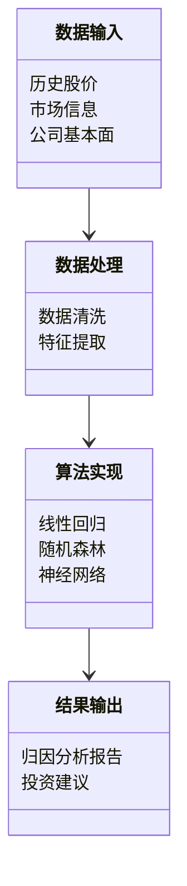
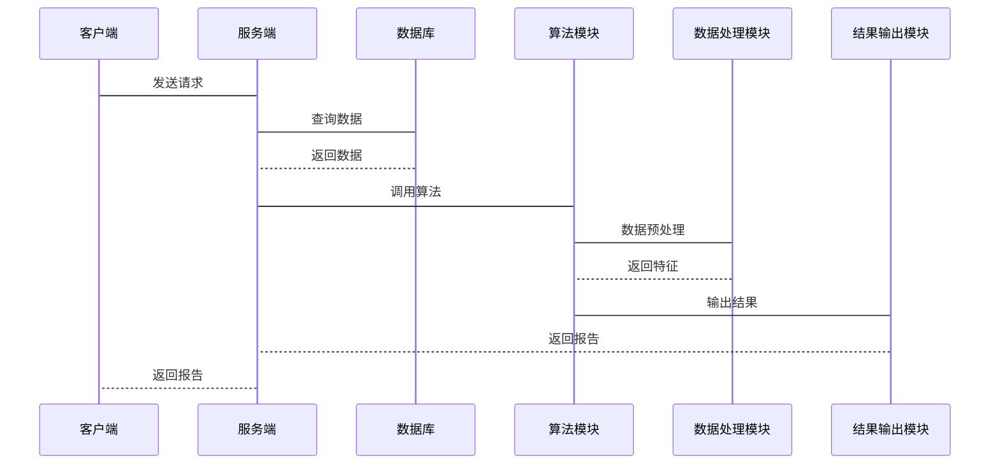

                 


# AI驱动的价值投资策略归因分析

> 关键词：价值投资，AI，策略归因，机器学习，量化投资

> 摘要：本文探讨了如何利用人工智能技术分析和归因价值投资策略的表现，通过深度分析策略归因的核心原理、算法实现和系统架构，结合实际案例，展示了AI驱动的策略归因分析在投资决策中的应用和优势。

---

## 第一部分: AI驱动的价值投资概述

### 第1章: 价值投资与AI的结合

#### 1.1 价值投资的基本概念

##### 1.1.1 价值投资的定义与核心理念

价值投资是一种投资策略，其核心理念是通过分析企业的基本面（如财务状况、行业地位、盈利能力等），寻找市场价格低于其内在价值的股票进行投资。这种策略强调长期投资、买入并持有，追求企业价值的长期增长。

##### 1.1.2 价值投资的核心要素

价值投资的核心要素包括：
- **内在价值**：企业未来现金流的现值，是衡量股票价格是否合理的标准。
- **安全边际**：买入价格低于内在价值，以降低投资风险。
- **长期视角**：关注企业的长期增长潜力，而非短期价格波动。

##### 1.1.3 价值投资的策略类型

价值投资的策略类型包括：
- **低市盈率策略**：寻找市盈率低于行业平均水平的股票。
- **低市净率策略**：寻找市净率低于行业平均水平的股票。
- **高股息率策略**：关注高股息率的股票，尤其是那些股息支付稳定且增长的企业。

#### 1.2 AI在金融投资中的作用

##### 1.2.1 AI在金融分析中的应用

人工智能在金融分析中的应用包括：
- **市场预测**：利用机器学习模型预测股票价格走势。
- **风险控制**：通过AI技术识别和评估投资风险。
- **量化交易**：利用算法交易系统进行高频交易。

##### 1.2.2 AI如何提升投资决策的效率

AI通过以下方式提升投资决策的效率：
- **数据处理能力**：AI能够快速处理大量数据，提取有用的信号。
- **模式识别**：AI能够发现数据中的复杂模式，帮助投资者做出更明智的决策。
- **自动化交易**：AI驱动的交易系统能够在毫秒级别完成交易决策。

##### 1.2.3 AI在风险管理中的重要性

AI在风险管理中的重要性体现在：
- **实时监控**：AI系统能够实时监控市场动态，识别潜在风险。
- **情景分析**：AI能够模拟不同市场条件下的投资组合表现，帮助投资者制定应对策略。
- **风险对冲**：AI通过量化方法优化投资组合，降低风险敞口。

#### 1.3 价值投资策略的归因分析

##### 1.3.1 什么是策略归因分析

策略归因分析是指将投资组合的收益分解为各个因素（如市场风险、行业选择、个股选择等）的贡献，以识别策略的有效性和潜在风险。

##### 1.3.2 策略归因分析的必要性

策略归因分析的必要性包括：
- **评估策略的有效性**：通过归因分析，可以判断投资策略的实际效果。
- **优化投资组合**：归因分析能够识别出哪些因素对收益贡献最大，从而优化投资组合。
- **风险控制**：归因分析能够识别出潜在风险因素，帮助投资者制定风险管理策略。

##### 1.3.3 策略归因分析的常见方法

策略归因分析的常见方法包括：
- **因子分解法**：将投资收益分解为各个因子的贡献。
- **排序法**：通过排序股票的表现，分析策略的选股能力。
- **情景分析法**：通过模拟不同市场情景，分析策略的稳健性。

---

### 第2章: AI驱动的价值投资技术基础

#### 2.1 机器学习在投资中的应用

##### 2.1.1 机器学习的基本概念

机器学习是一种人工智能技术，通过数据训练模型，使其能够识别数据中的模式并做出预测或分类。

##### 2.1.2 机器学习在金融时间序列分析中的应用

在金融时间序列分析中，机器学习可以用于：
- **预测股票价格**：通过ARIMA、LSTM等模型预测股票价格走势。
- **识别市场趋势**：通过模式识别技术识别市场的上升或下降趋势。
- **异常检测**：通过异常检测算法识别市场中的异常波动。

##### 2.1.3 机器学习在股票分类中的应用

股票分类是将股票分为不同类别（如上涨、下跌、震荡等）的过程。机器学习可以通过以下步骤实现：
1. **数据收集**：收集历史股价、成交量、技术指标等数据。
2. **特征提取**：提取有用的特征，如移动平均线、相对强弱指数等。
3. **模型训练**：使用分类算法（如SVM、随机森林等）训练分类模型。
4. **模型评估**：通过测试数据评估模型的准确性。

#### 2.2 自然语言处理在投资中的应用

##### 2.2.1 NLP的基本概念

自然语言处理（NLP）是人工智能的一个分支，专注于处理和理解人类语言。在投资中，NLP可以用于分析新闻、财报等文本数据，提取有用的信息。

##### 2.2.2 NLP在新闻和财报分析中的应用

在新闻和财报分析中，NLP可以用于：
- **情感分析**：分析新闻和社交媒体的情绪，预测市场走势。
- **关键词提取**：提取与公司相关的关键词，识别潜在的投资机会。
- **实体识别**：识别公司名称、行业、地理位置等实体信息。

##### 2.2.3 NLP在情感分析中的应用

情感分析是通过分析文本的情感倾向，判断市场情绪。在投资中，情感分析可以帮助投资者预测市场走势。

#### 2.3 统计套利与量化投资

##### 2.3.1 统计套利的基本概念

统计套利是一种利用市场中的定价偏差进行套利的策略。统计套利的核心思想是通过数学模型识别市场的不一致定价，并利用这种不一致赚取利润。

##### 2.3.2 量化投资的核心理念

量化投资是一种基于数学模型的投资策略，通过算法交易系统进行投资决策。量化投资的核心理念是利用数据和模型，而不是人为判断。

##### 2.3.3 统计套利与AI的结合

统计套利与AI的结合可以通过以下方式实现：
- **数据挖掘**：利用AI技术挖掘市场中的定价偏差。
- **模型优化**：通过机器学习优化套利模型。
- **风险控制**：利用AI技术实时监控市场动态，识别潜在风险。

---

### 第3章: 价值投资策略归因分析的AI实现

#### 3.1 策略归因分析的核心模型

##### 3.1.1 线性回归模型

线性回归模型是一种统计模型，通过线性关系描述因变量与自变量之间的关系。在策略归因分析中，线性回归可以用于分解投资收益的来源。

##### 3.1.2 主成分分析（PCA）

主成分分析是一种降维技术，通过提取数据的主要成分，简化数据的复杂性。在策略归因分析中，PCA可以用于识别影响投资收益的主要因素。

##### 3.1.3 因子分析模型

因子分析模型是一种统计模型，通过识别潜在的因子（如市场风险、流动性风险等）来解释数据的变化。在策略归因分析中，因子分析可以用于分解投资收益的来源。

#### 3.2 基于机器学习的归因分析

##### 3.2.1 支持向量回归（SVR）

支持向量回归是一种基于支持向量机的回归算法，通过构建非线性模型，预测投资收益的来源。

##### 3.2.2 随机森林回归

随机森林回归是一种基于树模型的回归算法，通过集成学习方法，提高模型的准确性和稳定性。

##### 3.2.3 神经网络模型

神经网络模型是一种基于人工神经网络的模型，通过多层神经元之间的连接，学习数据中的复杂模式。在策略归因分析中，神经网络可以用于分解投资收益的来源。

#### 3.3 基于深度学习的归因分析

##### 3.3.1 卷积神经网络（CNN）

卷积神经网络是一种基于卷积操作的深度学习模型，通过提取图像中的特征，识别图像中的物体。在策略归因分析中，CNN可以用于分析图像数据中的投资信号。

##### 3.3.2 循环神经网络（RNN）

循环神经网络是一种基于循环结构的深度学习模型，通过处理序列数据，预测未来的价格走势。在策略归因分析中，RNN可以用于分析时间序列数据。

---

## 第四部分: 系统架构与项目实战

### 第4章: 系统架构设计

#### 4.1 问题场景介绍

在本章中，我们将介绍如何设计一个基于AI的价值投资策略归因分析系统。系统的目标是通过分析股票的历史数据和市场信息，识别影响股票价格的主要因素，并归因分析投资收益的来源。

#### 4.2 系统功能设计

##### 4.2.1 领域模型设计

以下是领域模型的mermaid类图：



#### 4.3 系统架构设计

以下是系统架构的mermaid图：


#### 4.4 系统接口设计

以下是系统接口的mermaid序列图：



---

## 第五部分: 项目实战

### 第5章: 项目实战

#### 5.1 环境安装

在本节中，我们将介绍如何安装和配置环境，以便运行我们的AI驱动的价值投资策略归因分析系统。

##### 5.1.1 安装Python

安装Python的最新版本（建议使用Python 3.8或更高版本）。

##### 5.1.2 安装必要的库

安装以下Python库：
- pandas
- numpy
- scikit-learn
- xgboost
- matplotlib
- seaborn

安装命令如下：
```bash
pip install pandas numpy scikit-learn xgboost matplotlib seaborn
```

##### 5.1.3 安装深度学习框架

安装TensorFlow或PyTorch，用于深度学习模型的实现。

安装TensorFlow：
```bash
pip install tensorflow
```

安装PyTorch：
```bash
pip install torch
```

#### 5.2 系统核心实现源代码

以下是系统核心实现的源代码示例：

##### 5.2.1 数据处理模块

```python
import pandas as pd
import numpy as np

def data_cleaning(data):
    # 删除缺失值
    data = data.dropna()
    # 处理异常值
    data = data[(np.abs(data - data.mean()) <= 3 * data.std())]
    return data

def feature_engineering(data):
    # 添加技术指标
    data['MA_20'] = data['收盘价'].rolling(20).mean()
    data['MA_50'] = data['收盘价'].rolling(50).mean()
    data['RSI'] = (data['收盘价'] - data['收盘价'].rolling(14).mean()) / data['收盘价'].rolling(14).std() * 100
    return data
```

##### 5.2.2 算法实现模块

```python
from sklearn.linear_model import LinearRegression
from sklearn.ensemble import RandomForestRegressor
from xgboost import XGBRegressor
from tensorflow.keras.models import Sequential
from tensorflow.keras.layers import Dense

def linear_regression(X_train, y_train):
    model = LinearRegression()
    model.fit(X_train, y_train)
    return model

def random_forest(X_train, y_train):
    model = RandomForestRegressor()
    model.fit(X_train, y_train)
    return model

def xgboost(X_train, y_train):
    model = XGBRegressor()
    model.fit(X_train, y_train)
    return model

def neural_network(X_train, y_train):
    model = Sequential()
    model.add(Dense(64, activation='relu', input_dim=X_train.shape[1]))
    model.add(Dense(1))
    model.compile(optimizer='adam', loss='mean_squared_error')
    model.fit(X_train, y_train, epochs=100, batch_size=32)
    return model
```

##### 5.2.3 结果输出模块

```python
import matplotlib.pyplot as plt

def visualize_results(actual, predicted, title):
    plt.figure(figsize=(10, 6))
    plt.plot(actual, label='实际值')
    plt.plot(predicted, label='预测值')
    plt.title(title)
    plt.xlabel('时间')
    plt.ylabel('价格')
    plt.legend()
    plt.show()

def generate_report(results):
    # 生成归因分析报告
    pass
```

#### 5.3 代码应用解读与分析

##### 5.3.1 数据处理模块

数据处理模块包括数据清洗和特征工程两部分。数据清洗用于处理缺失值和异常值，特征工程用于提取技术指标（如移动平均线和相对强弱指数）。

##### 5.3.2 算法实现模块

算法实现模块包括线性回归、随机森林、XGBoost和神经网络四种算法。每种算法都有其优缺点，需要根据具体情况选择合适的算法。

##### 5.3.3 系统输出模块

系统输出模块用于生成归因分析报告和投资建议。归因分析报告包括投资收益的来源分解和风险提示，投资建议包括买入、卖出或持有建议。

#### 5.4 实际案例分析和详细讲解剖析

##### 5.4.1 数据获取与预处理

假设我们有一个包含股票历史数据的CSV文件，我们可以使用以下代码进行数据获取和预处理：

```python
import pandas as pd

# 获取数据
data = pd.read_csv('stock_data.csv')

# 数据清洗
clean_data = data_cleaning(data)

# 特征工程
feature_data = feature_engineering(clean_data)
```

##### 5.4.2 模型训练与评估

假设我们已经将数据分为训练集和测试集，我们可以使用以下代码进行模型训练和评估：

```python
# 线性回归模型
lr_model = linear_regression(X_train, y_train)
lr_predictions = lr_model.predict(X_test)
visualize_results(y_test, lr_predictions, '线性回归预测结果')

# 随机森林模型
rf_model = random

