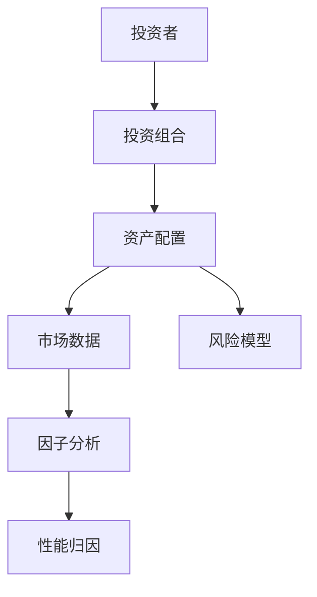
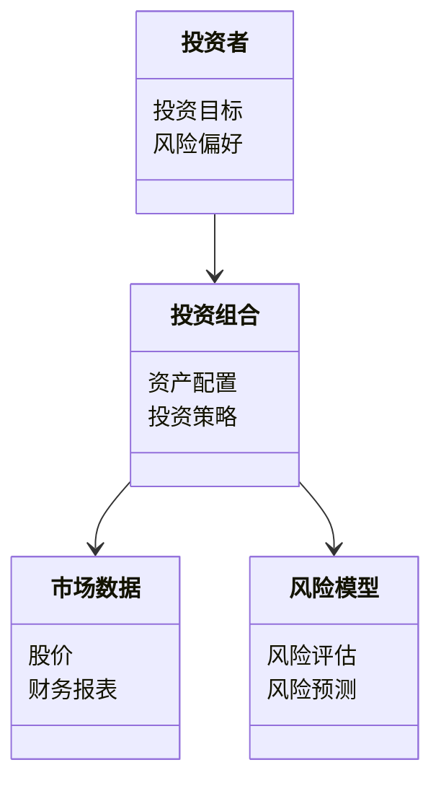
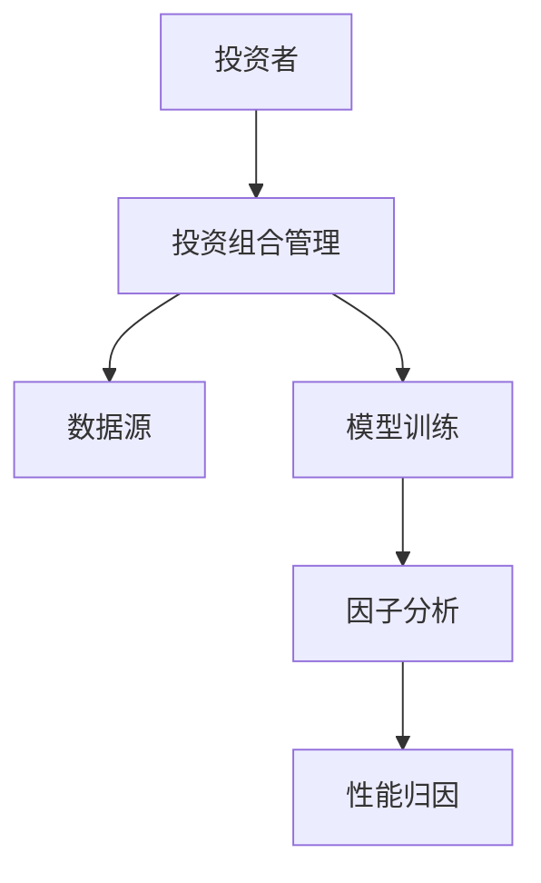

                 


# AI驱动的价值投资策略性能归因

> 关键词：AI驱动、价值投资、性能归因、机器学习、金融分析、投资策略

> 摘要：本文深入探讨了AI驱动的价值投资策略在性能归因中的应用。通过结合传统的价值投资理念与现代的人工智能技术，分析了如何利用机器学习算法对投资组合的收益来源进行分解和优化。文章详细讲解了相关的核心概念、算法原理、系统架构设计以及实际案例，为读者提供了一个全面的视角来理解和实现AI驱动的价值投资策略性能归因。

---

# 第一部分: AI驱动的价值投资策略性能归因基础

## 第1章: 背景介绍

### 1.1 价值投资的基本概念
#### 1.1.1 价值投资的定义与核心理念
价值投资是一种投资策略，核心理念是通过分析企业的基本面（如盈利能力、财务状况、行业地位等）来寻找被市场低估的股票。其核心在于寻找具有长期竞争优势和合理估值的企业。

#### 1.1.2 价值投资的历史与发展
价值投资的理念起源于20世纪初，本杰明·格雷厄姆和戴维·多德是这一理念的奠基人。经过几十年的发展，价值投资在实践中不断完善，并逐渐与其他投资策略（如成长投资、趋势投资等）形成了互补关系。

#### 1.1.3 价值投资在现代金融中的地位
随着金融市场的复杂化和数据量的爆炸式增长，传统的价值投资方法逐渐暴露出效率低下、主观性强等问题。AI技术的引入为价值投资注入了新的活力，使其能够更高效地应对复杂市场环境。

### 1.2 AI在金融领域的应用现状
#### 1.2.1 AI在金融分析中的应用
AI技术在金融领域的应用主要集中在数据处理、市场预测、风险评估等方面。例如，自然语言处理（NLP）技术可以分析新闻和财报，生成对公司价值的初步评估。

#### 1.2.2 AI在投资决策中的作用
AI通过机器学习算法，可以从海量数据中发现传统方法难以捕捉的模式和趋势。例如，基于强化学习的投资策略可以在模拟市场环境中优化投资组合。

#### 1.2.3 AI在风险管理中的应用
AI可以帮助投资者实时监控市场风险，通过构建风险预测模型，提前识别潜在的市场波动。

### 1.3 价值投资策略与性能归因的结合
#### 1.3.1 价值投资策略的性能归因概念
性能归因是指对投资组合的收益来源进行分解，找出哪些因素（如市场波动、行业选择、个股选择等）对收益贡献最大。

#### 1.3.2 AI在性能归因中的优势
AI技术可以处理大量非结构化数据（如新闻、社交媒体），并通过复杂的数据挖掘算法，发现传统方法难以察觉的收益驱动因素。

#### 1.3.3 价值投资策略与AI结合的可行性分析
AI技术可以提高价值投资策略的效率和准确性，帮助投资者更快地识别低估的股票，并优化投资组合的配置。

---

## 第2章: 核心概念与联系

### 2.1 核心概念原理
#### 2.1.1 价值投资策略的数学模型
价值投资策略的核心在于对企业的内在价值进行评估，常用的方法包括市盈率（P/E）、市净率（P/B）等指标。这些指标可以通过简单的数学公式进行计算。

#### 2.1.2 性能归因的基本原理
性能归因是将投资组合的收益分解为各个因素的贡献。例如，可以将收益分解为市场收益、行业收益和个股收益。

#### 2.1.3 AI在性能归因中的算法原理
AI算法（如因子分解机、随机森林）可以对复杂的非线性关系进行建模，帮助投资者更准确地分解收益来源。

### 2.2 核心概念属性特征对比
| 概念      | 传统价值投资 | AI驱动的价值投资 |
|-----------|---------------|-------------------|
| 数据来源  | 财务报表、行业数据 | 财务报表、新闻、社交媒体 |
| 分析方法  | 人工分析       | 机器学习算法     |
| 效率       | 较低           | 高                |
| 准确性     | 受主观因素影响较大 | 较高               |

### 2.3 ER实体关系图架构


### 2.4 本章小结
通过对比传统价值投资和AI驱动的价值投资，我们发现AI技术可以显著提高投资策略的效率和准确性，尤其是在处理海量数据和复杂关系方面。

---

## 第3章: 算法原理讲解

### 3.1 机器学习模型在投资策略中的应用
#### 3.1.1 线性回归模型
线性回归模型用于分析变量之间的线性关系。例如，可以用来分析某个行业对整体投资组合收益的贡献。

```python
import pandas as pd
from sklearn.linear_model import LinearRegression

# 示例数据加载
data = pd.read_csv('investment_data.csv')

# 特征工程
features = data[['factor1', 'factor2', 'factor3']]
target = data['return']

# 模型训练
model = LinearRegression()
model.fit(features, target)

# 预测与评估
predictions = model.predict(features)
print('预测值:', predictions)
```

#### 3.1.2 支持向量机（SVM）
支持向量机适用于非线性分类问题，可以用于识别市场趋势。

#### 3.1.3 随机森林与梯度提升树
随机森林和梯度提升树是常用的集成学习算法，可以用于特征重要性分析。

### 3.2 基于因子分析的性能归因
#### 3.2.1 因子分解方法
因子分析是一种统计技术，可以将复杂的投资收益分解为几个关键因子。

#### 3.2.2 因子权重的计算
通过机器学习算法，可以计算出每个因子对整体收益的权重。

#### 3.2.3 因子贡献度的评估
评估每个因子对收益的具体贡献，帮助投资者优化投资组合。

### 3.3 时间序列分析与预测
#### 3.3.1 ARIMA模型
ARIMA模型用于时间序列预测，可以用于预测市场未来走势。

#### 3.3.2 GARCH模型
GARCH模型用于估计市场风险，可以帮助投资者更好地进行风险管理。

#### 3.3.3 LSTM网络
LSTM网络是一种深度学习模型，适用于处理复杂的时间序列数据。

---

## 第4章: 数学模型与公式

### 4.1 价值投资策略的数学模型
#### 4.1.1 投资组合的收益计算公式
$$ \text{收益} = \sum_{i=1}^{n} w_i \times r_i $$
其中，$w_i$ 是第i个资产的权重，$r_i$ 是第i个资产的收益率。

#### 4.1.2 投资组合的风险计算公式
$$ \text{风险} = \sqrt{\sum_{i=1}^{n} w_i^2 \times \sigma_i^2} $$
其中，$\sigma_i$ 是第i个资产的收益率波动率。

### 4.2 性能归因的数学模型
#### 4.2.1 因子贡献度计算公式
$$ \text{因子贡献度} = \sum_{i=1}^{m} \beta_i \times f_i $$
其中，$\beta_i$ 是第i个因子的权重，$f_i$ 是第i个因子的值。

---

## 第5章: 系统分析与架构设计方案

### 5.1 问题场景介绍
本章将介绍一个AI驱动的价值投资策略性能归因系统的实际应用场景，包括数据获取、模型训练和结果分析。

### 5.2 系统功能设计
#### 5.2.1 领域模型


#### 5.2.2 系统架构设计


---

## 第6章: 项目实战

### 6.1 环境安装
安装必要的Python库：
```bash
pip install numpy pandas scikit-learn
```

### 6.2 核心实现源代码
```python
import pandas as pd
from sklearn.ensemble import RandomForestRegressor

# 数据加载
data = pd.read_csv('investment_data.csv')

# 特征工程
features = data[['factor1', 'factor2', 'factor3']]
target = data['return']

# 模型训练
model = RandomForestRegressor()
model.fit(features, target)

# 预测与解释
importances = model.feature_importances_
print('特征重要性:', importances)
```

### 6.3 案例分析
以某行业为例，分析AI驱动的价值投资策略如何优化投资组合。

---

## 第7章: 总结与展望

### 7.1 本章总结
本文详细介绍了AI驱动的价值投资策略性能归因的核心概念、算法原理和系统架构设计，并通过实际案例展示了AI技术在价值投资中的应用。

### 7.2 未来展望
随着AI技术的不断发展，价值投资策略性能归因将更加智能化和自动化。未来的研究方向包括提高模型的解释性和数据的实时性。

### 7.3 最佳实践Tips
- 数据质量是关键，确保数据的完整性和准确性。
- 模型解释性是重要的，避免使用“黑箱”模型。
- 定期更新模型，以适应市场的变化。

---

# 作者：AI天才研究院/AI Genius Institute & 禅与计算机程序设计艺术 /Zen And The Art of Computer Programming

