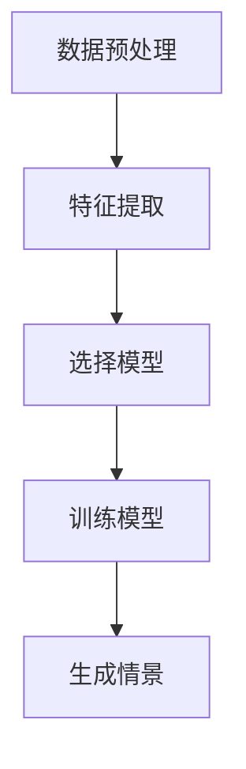
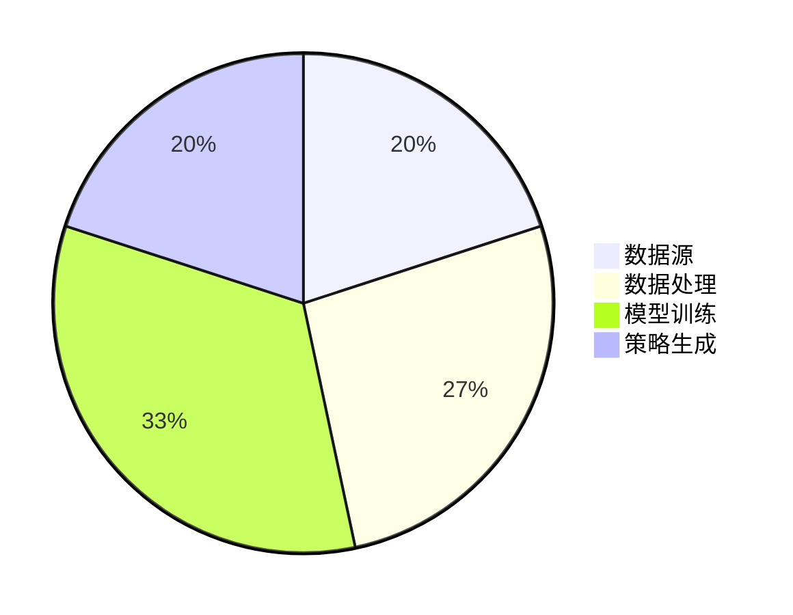

                 


# AI驱动的价值投资策略情景分析

> 关键词：价值投资、人工智能、情景分析、因子模型、机器学习、投资策略

> 摘要：本文探讨了如何利用人工智能技术提升价值投资策略的情景分析能力。通过结合金融数据和机器学习算法，我们提出了一种基于AI的策略生成框架，以帮助投资者在复杂多变的市场中做出更明智的投资决策。

---

## 第一部分：价值投资与AI的结合

### 第1章：价值投资的基本概念

#### 1.1 价值投资的定义与核心理念
- **价值投资**是一种投资策略，旨在通过分析企业的基本面（如财务状况、行业地位、竞争优势等）来识别被市场低估的投资标的。
- 其核心理念是寻找那些具有长期稳定增长潜力的公司，而不是盲目追随市场波动。
- 价值投资强调安全边际，即买入价格低于内在价值，以降低投资风险。

#### 1.2 AI在金融领域的应用
- **数据处理能力**：AI能够快速处理海量金融数据，包括历史价格、财务报表、新闻舆情等。
- **预测能力**：通过机器学习模型，AI可以预测市场走势和个股表现。
- **自动化交易**：AI驱动的算法交易能够在毫秒级别完成决策和执行。

#### 1.3 价值投资与AI结合的可行性
- AI可以辅助分析师快速筛选和分析数据，提高投资决策的效率。
- AI的预测能力能够帮助投资者更好地把握市场趋势，优化投资组合。

---

### 第2章：价值投资策略的情景分析

#### 2.1 情景分析的基本概念
- **情景分析**是通过假设不同的市场条件，评估投资组合在不同环境下的表现。
- 在价值投资中，情景分析可以帮助投资者识别潜在风险和机会，制定更有弹性的投资策略。

#### 2.2 AI驱动情景分析的优势
- **数据驱动**：AI能够基于历史数据和市场信号，构建多种情景模型。
- **实时更新**：AI系统可以实时跟踪市场变化，动态调整情景分析的结果。
- **复杂场景处理**：AI擅长处理非线性关系和复杂市场环境，能够捕捉传统方法难以发现的模式。

#### 2.3 AI在情景分析中的应用
- **市场波动预测**：通过时间序列模型预测市场波动，帮助投资者做好风险准备。
- **行业对比分析**：利用机器学习模型，分析不同行业的景气度和投资价值。
- **个股筛选**：基于多因子模型，筛选出具有潜在上涨空间的个股。

---

## 第二部分：AI驱动的价值投资策略模型

### 第3章：因子模型与情景分析模型

#### 3.1 因子模型
- **因子模型**是一种用于解释资产回报的统计模型，常见的因子包括市值、价值、动量、质量和成长等。
- **AI在因子模型中的应用**：通过机器学习优化因子权重，构建更有效的多因子模型。

#### 3.2 情景分析模型
- **情景分析模型**将市场分为不同的情景（如牛市、熊市、震荡市等），并为每种情景制定相应的投资策略。
- **AI驱动的情景分析**：利用聚类算法将市场状态进行分类，动态调整投资组合。

#### 3.3 因子模型与情景分析模型的对比

| 模型类型   | 核心目标             | 输入数据         | 输出结果         |
|------------|----------------------|------------------|------------------|
| 因子模型   | 解释资产回报         | 历史价格、财务数据 | 因子权重、投资建议 |
| 情景分析模型 | 分类市场状态         | 市场指标、经济数据 | 不同情景下的策略 |

---

### 第4章：AI驱动的情景分析算法

#### 4.1 时间序列预测模型
- **ARIMA模型**：用于预测未来的价格走势。
- **LSTM模型**：适用于捕捉时间序列中的长期依赖关系。

#### 4.2 机器学习模型
- **随机森林**：用于分类市场状态（牛市、熊市等）。
- **XGBoost**：用于回归分析，预测个股的潜在回报。

#### 4.3 算法流程图（mermaid）



---

### 第5章：系统架构与设计方案

#### 5.1 系统功能设计
- **数据采集模块**：从多个来源获取实时和历史数据。
- **模型训练模块**：基于机器学习算法生成情景分析结果。
- **策略生成模块**：根据模型输出制定投资策略。

#### 5.2 系统架构设计（mermaid）



#### 5.3 接口设计与交互流程
- **输入接口**：接收市场数据和用户需求。
- **输出接口**：提供情景分析结果和投资建议。

---

## 第三部分：项目实战与案例分析

### 第6章：环境安装与代码实现

#### 6.1 环境安装
- 安装Python和相关库（如pandas、scikit-learn、xgboost）。

#### 6.2 核心代码实现
```python
import pandas as pd
from sklearn.ensemble import RandomForestClassifier
from sklearn.metrics import accuracy_score

# 加载数据
data = pd.read_csv('market_data.csv')

# 特征工程
features = data[['PE', 'PB', 'ROE', 'Revenue Growth']]
labels = data['Market State']

# 模型训练
model = RandomForestClassifier()
model.fit(features, labels)

# 模型预测
test_features = data[['PE', 'PB', 'ROE', 'Revenue Growth']].iloc[-1]
test_labels = model.predict([test_features])

print(f'预测市场状态：{test_labels}')
```

#### 6.3 代码解读与分析
- 通过随机森林模型预测市场状态，帮助投资者制定不同的投资策略。

---

## 第四部分：总结与展望

### 第7章：总结与最佳实践

#### 7.1 最佳实践
- 定期更新模型，以适应市场变化。
- 结合多模型结果，提高预测准确性。

#### 7.2 小结
- AI驱动的价值投资策略情景分析能够显著提升投资效率和准确性。
- 通过合理配置资源和不断优化模型，投资者可以在复杂市场中获得更好的收益。

#### 7.3 注意事项
- AI模型的结果仅供参考，投资决策需结合实际情况。
- 注意市场波动和模型的局限性，避免过度依赖AI。

#### 7.4 拓展阅读
- 建议进一步研究强化学习在投资中的应用。
- 关注最新的金融数据分析工具和技术。

---

## 作者

作者：AI天才研究院 & 禅与计算机程序设计艺术

