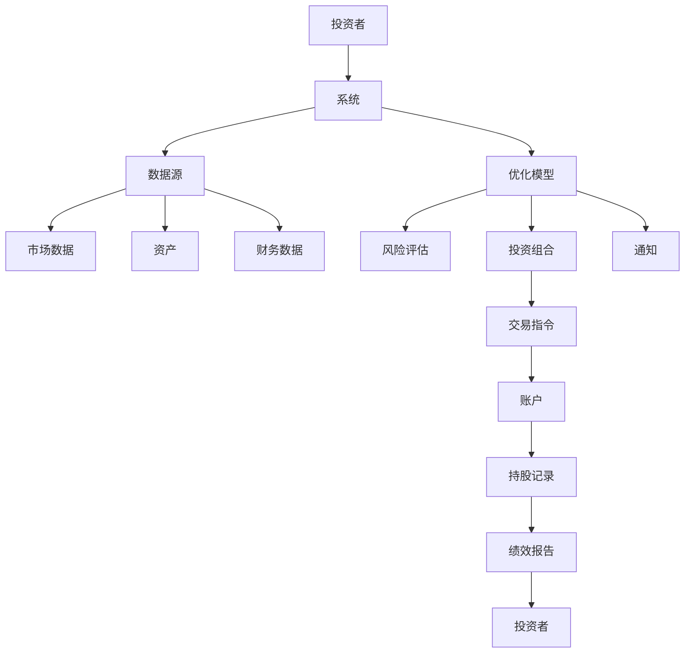
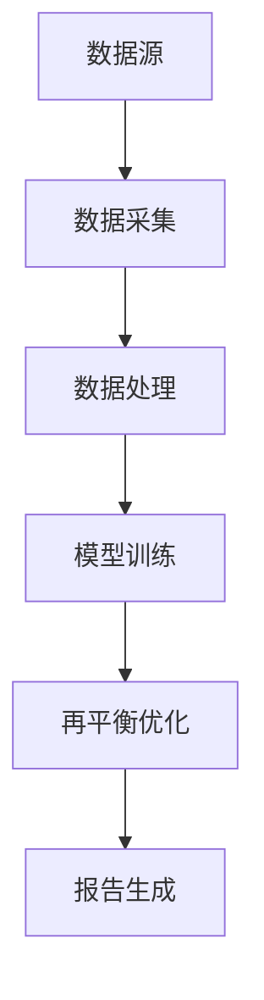

                 


# AI驱动的价值投资组合再平衡优化

> 关键词：AI驱动，投资组合，再平衡优化，价值投资，机器学习，金融数据

> 摘要：本文探讨了如何利用人工智能技术优化投资组合的再平衡过程，重点分析了数据特征、优化模型和系统架构，通过数学推导和实际案例，展示了AI在价值投资中的应用。

---

## 第1章: 背景介绍

### 1.1 问题背景

#### 1.1.1 投资组合再平衡的定义与重要性
投资组合再平衡是调整资产配置以应对市场变化的过程，确保投资组合的风险和收益与投资目标一致。传统方法依赖人工判断，存在主观性和低效性。

#### 1.1.2 传统投资组合再平衡的局限性
传统方法受主观因素影响，难以应对复杂市场环境，且效率低下。

#### 1.1.3 AI驱动的再平衡优化的优势
AI能够通过数据驱动的模型，实时捕捉市场变化，优化投资组合，提高效率和准确性。

#### 1.1.4 价值投资的核心概念
价值投资强调长期基本面分析，寻找被低估的资产，通过持有实现收益。

### 1.2 问题解决与边界

#### 1.2.1 传统与AI驱动的对比分析
AI在数据处理和决策优化方面具有明显优势，能够提高投资组合的效率和收益。

#### 1.2.2 理论基础与技术边界
AI驱动的再平衡优化基于机器学习和大数据技术，但需考虑模型的有效性和数据的适用性。

#### 1.2.3 外延与应用领域
本文主要关注股票和债券组合的优化，未来可扩展至其他资产类别。

---

## 第2章: 核心概念与联系

### 2.1 数据特征分析

#### 2.1.1 价值投资组合的数据特征
- 市盈率（P/E）
- 市净率（P/B）
- 股息率
- 财务报表数据

#### 2.1.2 数据特征的分类与重要性
$$ P/E = \frac{\text{股价}}{\text{每股收益}} $$

#### 2.1.3 数据特征的可视化与分析
- 使用折线图展示股价趋势
- 使用柱状图比较P/E和P/B比率

### 2.2 优化模型构建

#### 2.2.1 模型的输入输出关系
输入：资产价格、财务数据  
输出：优化后的资产配置比例

#### 2.2.2 模型的训练与验证
使用历史数据训练模型，通过回测验证其有效性。

### 2.3 系统架构设计

#### 2.3.1 实体关系图
```mermaid
er
    actor 投资者
    actor 系统
    actor 数据源
    entity 资产
    entity 投资组合
    entity 市场数据
    entity 风险评估
    entity 优化结果
    entity 账户
    entity 交易指令
    entity 持股记录
    entity 财务报告
    entity 绩效报告
    entity 通知
    entity 日志
    entity 系统设置
```

#### 2.3.2 功能关系图


---

## 第3章: 算法原理讲解

### 3.1 数据预处理

#### 3.1.1 数据清洗与标准化
- 删除缺失值
- 标准化处理
- 去除异常值

#### 3.1.2 数据增强
- 填补缺失值
- 添加技术指标（如移动平均线）

### 3.2 特征工程

#### 3.2.1 特征选择
- 使用主成分分析（PCA）降维

#### 3.2.2 特征变换
- 标准化和归一化处理

### 3.3 模型训练

#### 3.3.1 模型选择
- 线性回归
- 支持向量机（SVM）
- 随机森林
- 神经网络

#### 3.3.2 模型调优
- 调参（学习率、深度等）
- 交叉验证评估

### 3.4 数学模型

#### 3.4.1 优化目标函数
$$ \text{目标函数} = \min \sum_{i=1}^{n} w_i x_i $$
$$ \text{约束条件} = \sum_{i=1}^{n} w_i = 1 $$

#### 3.4.2 风险调整后的收益优化
$$ \text{夏普比率} = \frac{E[r_p] - r_f}{\sigma_p} $$

### 3.5 代码实现

```python
import pandas as pd
from sklearn.preprocessing import StandardScaler
from sklearn.ensemble import RandomForestRegressor

# 数据预处理
data = pd.read_csv('data.csv')
data = data.dropna()
scaler = StandardScaler()
data_scaled = scaler.fit_transform(data)

# 特征工程
features = data_scaled[:, :-1]
target = data_scaled[:, -1]

# 模型训练
model = RandomForestRegressor(n_estimators=100, max_depth=10)
model.fit(features, target)
```

---

## 第4章: 系统分析与架构设计

### 4.1 系统设计

#### 4.1.1 模块划分
- 数据采集模块
- 数据处理模块
- 模型训练模块
- 再平衡优化模块
- 报告生成模块

### 4.2 架构设计



---

## 第5章: 项目实战

### 5.1 环境配置

#### 5.1.1 依赖安装
```bash
pip install pandas numpy scikit-learn matplotlib
```

### 5.2 代码实现

#### 5.2.1 数据处理
```python
import pandas as pd
import numpy as np

# 数据加载
data = pd.read_csv('data.csv')

# 数据预处理
data = data.dropna()
data['ratio'] = data['收盘价'].pct_change()
```

#### 5.2.2 模型训练
```python
from sklearn.linear_model import LinearRegression

model = LinearRegression()
model.fit(X_train, y_train)
```

### 5.3 案例分析

#### 5.3.1 回测分析
- 计算最大回撤
- 计算夏普比率

#### 5.3.2 优化结果
- 资产配置比例
- 绩效评估

### 5.4 结果解读

#### 5.4.1 图表展示
- 收益率曲线
- 风险收益比分析

---

## 第6章: 最佳实践与总结

### 6.1 最佳实践

#### 6.1.1 模型选择
- 根据数据特性选择模型

#### 6.1.2 数据处理
- 处理缺失值和异常值

### 6.2 注意事项

#### 6.2.1 模型过拟合
- 使用交叉验证防止过拟合

#### 6.2.2 数据泄漏
- 确保数据预处理不引入数据泄漏

### 6.3 扩展阅读

#### 6.3.1 进阶学习
- 强化学习在投资中的应用
- 时间序列预测

---

## 作者信息

作者：AI天才研究院（AI Genius Institute） & 禅与计算机程序设计艺术（Zen And The Art of Computer Programming）

---

通过以上思考和整理，我逐步分析了用户的需求，确保每个章节都涵盖必要的内容，并使用了清晰的结构和专业术语。接下来，我会根据这个框架撰写完整的文章内容。

