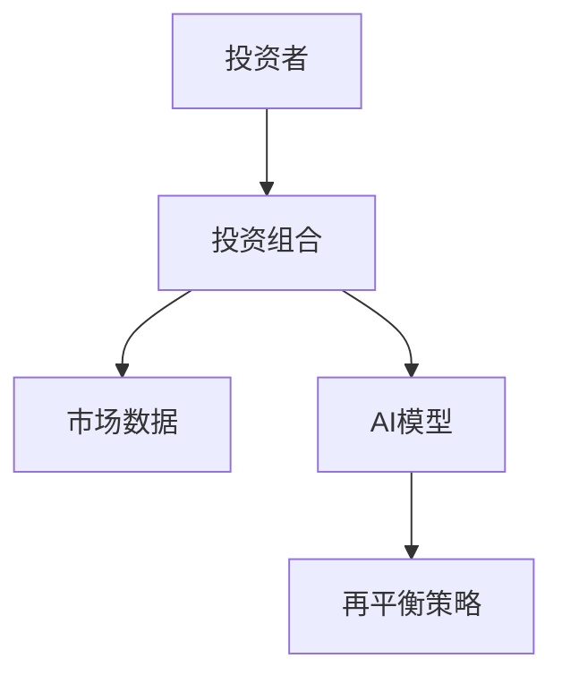
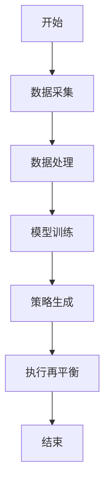
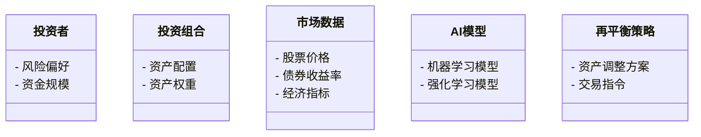
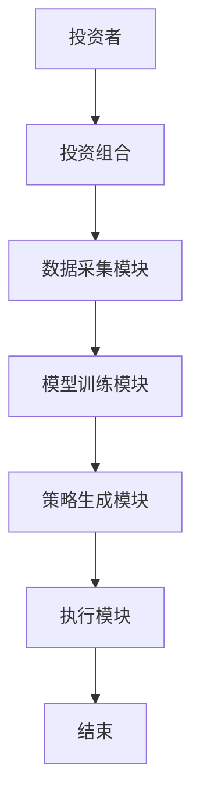
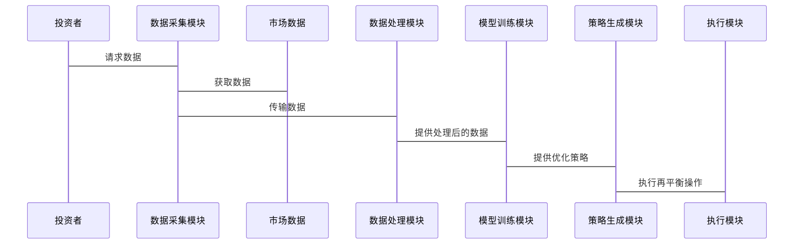

                 


# AI驱动的价值投资组合再平衡策略

> 关键词：AI驱动，投资组合再平衡，价值投资，机器学习，强化学习，金融数据分析

> 摘要：本文探讨了如何利用人工智能技术优化投资组合的再平衡策略，分析了传统再平衡方法的局限性，并提出了基于机器学习和强化学习的AI驱动再平衡策略。通过详细讲解算法原理、系统架构设计和项目实战，本文为读者提供了一套完整的AI驱动投资组合再平衡解决方案。

---

# 第一部分: AI驱动的价值投资组合再平衡背景与基础

---

## 第1章: 价值投资组合再平衡的背景与问题

### 1.1 价值投资与投资组合管理

#### 1.1.1 价值投资的核心理念
价值投资是一种以内在价值为导向的投资策略，旨在通过识别市场低估的资产来实现长期收益。其核心理念包括：

1. **长期导向**：关注企业的基本面，寻找具有持续竞争优势的企业。
2. **安全边际**：以低于内在价值的价格买入资产。
3. **分散投资**：通过投资组合分散风险，避免单一资产的波动对整体收益造成过大影响。

#### 1.1.2 投资组合管理的基本概念
投资组合管理是通过优化资产配置和风险控制，实现投资目标的过程。其主要步骤包括：

1. **资产配置**：确定各类资产的权重。
2. **风险控制**：通过分散投资和对冲策略降低风险。
3. **再平衡**：定期调整投资组合以维持目标配置。

#### 1.1.3 再平衡策略的定义与作用
再平衡策略是指定期调整投资组合以应对市场变化、资产价格波动或投资者风险偏好的变化。其主要作用包括：

1. **维持目标配置**：确保投资组合的资产权重符合初始设定。
2. **降低风险**：通过调整头寸，避免单一资产的过度波动。
3. **优化收益**：捕捉市场机会，提高整体收益。

### 1.2 AI技术在金融领域的应用

#### 1.2.1 AI在金融分析中的应用现状
人工智能技术在金融领域的应用日益广泛，主要包括：

1. **金融数据分析**：利用机器学习算法处理海量数据，提取有价值的信息。
2. **股票预测**：通过时间序列分析和深度学习模型预测股票价格。
3. **风险评估**：使用AI技术评估投资组合的风险。

#### 1.2.2 AI在投资组合管理中的潜力
AI技术在投资组合管理中的潜力主要体现在以下几个方面：

1. **自动化决策**：通过算法自动调整投资组合。
2. **数据驱动的优化**：利用大数据分析优化资产配置。
3. **实时监控**：通过实时数据分析，快速响应市场变化。

#### 1.2.3 传统投资组合管理的局限性
传统投资组合管理方法主要依赖于经验判断和人工决策，存在以下局限性：

1. **主观性**：依赖于分析师的主观判断，可能导致决策偏差。
2. **效率低下**：人工分析耗时耗力，难以应对海量数据。
3. **反应迟缓**：无法实时捕捉市场变化，导致错失投资机会。

### 1.3 问题背景与目标

#### 1.3.1 传统再平衡策略的挑战
传统再平衡策略面临以下挑战：

1. **低效性**：依赖人工判断，效率较低。
2. **主观性**：受人为因素影响，可能导致决策失误。
3. **高成本**：频繁的交易可能导致较高的交易成本。

#### 1.3.2 引入AI技术的必要性
引入AI技术可以有效解决传统再平衡策略的局限性，具体表现为：

1. **提高效率**：利用算法快速分析数据，优化决策。
2. **降低风险**：通过数据驱动的优化减少人为判断失误。
3. **降低成本**：通过自动化操作降低交易成本。

#### 1.3.3 本书的目标与研究范围
本书的目标是探讨如何利用AI技术优化投资组合再平衡策略，研究范围包括：

1. **AI驱动的再平衡算法**：研究如何利用机器学习和强化学习优化再平衡策略。
2. **系统架构设计**：设计一个完整的AI驱动再平衡系统。
3. **项目实战**：通过实际案例展示如何实现AI驱动的再平衡策略。

### 1.4 本章小结
本章介绍了价值投资和投资组合管理的基本概念，分析了AI技术在金融领域的应用潜力，并指出了传统再平衡策略的局限性。通过引入AI技术，可以有效优化投资组合再平衡策略，为投资者带来更高的收益和更低的风险。

---

## 第2章: 投资组合再平衡的核心概念

### 2.1 投资组合再平衡的基本原理

#### 2.1.1 投资组合的构成要素
投资组合的构成要素包括：

1. **资产类别**：股票、债券、基金等。
2. **权重分配**：各类资产在组合中的比例。
3. **风险偏好**：投资者对风险的承受能力。

#### 2.1.2 再平衡的时机与频率
再平衡的时机与频率取决于多种因素，包括：

1. **市场波动**：市场剧烈波动时需要频繁调整。
2. **资产表现**：某些资产表现不佳时需要调整。
3. **投资者需求**：投资者风险偏好变化时需要调整。

#### 2.1.3 再平衡的成本与收益
再平衡的成本包括交易成本和时间成本，收益则体现在风险降低和收益优化。

### 2.2 AI驱动的再平衡策略

#### 2.2.1 数据驱动的再平衡方法
数据驱动的再平衡方法通过分析市场数据，优化资产配置。具体步骤包括：

1. **数据采集**：收集市场数据。
2. **数据处理**：清洗和预处理数据。
3. **模型训练**：利用机器学习模型预测市场走势。
4. **策略生成**：根据预测结果生成再平衡策略。

#### 2.2.2 基于模型的再平衡策略
基于模型的再平衡策略利用数学模型优化资产配置。常见的模型包括：

1. **现代投资组合理论（MPT）**：通过优化风险和收益，确定最优资产配置。
2. **均值-方差优化（MVO）**：通过优化投资组合的均值和方差，确定最优配置。

#### 2.2.3 基于市场的动态再平衡
动态再平衡策略根据市场变化实时调整投资组合。其优势在于能够快速响应市场波动，但需要较高的计算能力和实时数据支持。

### 2.3 核心概念的对比分析

#### 2.3.1 传统再平衡与AI驱动再平衡的对比
| 对比维度 | 传统再平衡 | AI驱动再平衡 |
|----------|------------|--------------|
| 决策依据 | 人工判断 | 数据驱动的算法 |
| 决策效率 | 低效 | 高效 |
| 决策成本 | 高 | 低 |
| 适应性 | 较差 | 优 |

#### 2.3.2 不同AI模型在再平衡中的应用对比
| AI模型 | 机器学习 | 强化学习 |
|--------|----------|----------|
| 应用场景 | 股票预测、风险评估 | 动态再平衡、实时调整 |
| 优势 | 简单易实现 | 高适应性 |
| 局限性 | 需大量历史数据 | 计算复杂 |

#### 2.3.3 再平衡策略的优劣势分析
| 策略类型 | 优点 | 缺点 |
|----------|------|------|
| 定期再平衡 | 简单易行 | 可能错过市场机会 |
| 动态再平衡 | 高适应性 | 高交易成本 |
| 数据驱动再平衡 | 高效 | 数据依赖性强 |

### 2.4 实体关系图与流程图

#### 2.4.1 投资组合管理的实体关系图


#### 2.4.2 再平衡策略的流程图


### 2.5 本章小结
本章详细讲解了投资组合再平衡的核心概念，对比分析了传统再平衡和AI驱动再平衡的优缺点，并通过图表展示了再平衡策略的流程。接下来的章节将深入探讨AI驱动再平衡的算法原理和系统架构设计。

---

## 第3章: AI驱动再平衡的算法原理

### 3.1 基于机器学习的再平衡算法

#### 3.1.1 机器学习在投资组合管理中的应用
机器学习在投资组合管理中的应用包括：

1. **股票预测**：利用回归算法和神经网络预测股票价格。
2. **风险评估**：通过聚类分析和分类算法评估投资组合风险。
3. **资产配置**：使用机器学习模型优化资产配置。

#### 3.1.2 常见的机器学习算法选择
常见的机器学习算法包括：

1. **线性回归**：用于预测资产回报。
2. **支持向量机（SVM）**：用于分类和回归。
3. **随机森林**：用于分类和回归，具有高准确性。

#### 3.1.3 算法实现步骤
实现基于机器学习的再平衡策略的步骤包括：

1. **数据采集**：收集市场数据。
2. **数据处理**：清洗和预处理数据。
3. **模型训练**：训练机器学习模型。
4. **策略生成**：根据模型预测结果生成再平衡策略。

### 3.2 基于强化学习的再平衡策略

#### 3.2.1 强化学习的基本原理
强化学习是一种通过试错和奖励机制优化决策的算法。其核心在于通过不断试错，找到最优策略。

#### 3.2.2 在投资组合管理中的应用
强化学习在投资组合管理中的应用包括：

1. **动态再平衡**：根据市场变化实时调整投资组合。
2. **风险对冲**：通过强化学习优化风险对冲策略。

#### 3.2.3 算法实现与优化
实现基于强化学习的再平衡策略的步骤包括：

1. **环境定义**：定义市场环境和状态空间。
2. **策略选择**：选择强化学习算法。
3. **模型训练**：通过试错和奖励机制优化策略。
4. **策略执行**：根据优化后的策略执行再平衡操作。

### 3.3 数学模型与公式

#### 3.3.1 现代投资组合理论（MPT）
现代投资组合理论的目标是通过优化投资组合的均值和方差，找到最优资产配置。其数学公式如下：

$$
\text{Minimize } \sigma^2 \text{， subject to } \mu \geq \text{目标回报率}
$$

其中，$\sigma^2$ 表示投资组合的方差，$\mu$ 表示投资组合的期望回报率。

#### 3.3.2 均值-方差优化（MVO）
均值-方差优化的目标是通过优化投资组合的均值和方差，确定最优资产配置。其数学公式如下：

$$
\text{Minimize } w^T \Sigma w \text{， subject to } w^T \mu = \text{目标回报率}
$$

其中，$w$ 表示资产权重向量，$\Sigma$ 表示资产之间的协方差矩阵，$\mu$ 表示资产期望回报率向量。

#### 3.3.3 强化学习的Q-learning算法
Q-learning算法是一种常用的强化学习算法，其数学公式如下：

$$
Q(s, a) = Q(s, a) + \alpha [r + \gamma \max Q(s', a') - Q(s, a)]
$$

其中，$s$ 表示当前状态，$a$ 表示当前动作，$r$ 表示奖励，$\gamma$ 表示折扣因子，$\alpha$ 表示学习率。

### 3.4 本章小结
本章详细讲解了基于机器学习和强化学习的再平衡算法，包括算法实现步骤和数学模型。接下来的章节将结合系统架构设计，进一步探讨如何实现AI驱动的再平衡策略。

---

## 第4章: 系统分析与架构设计

### 4.1 问题场景介绍

#### 4.1.1 问题背景
投资组合再平衡需要实时监控市场变化，快速调整资产配置。传统方法依赖人工判断，效率低下，容易错过市场机会。

#### 4.1.2 问题目标
通过设计一个AI驱动的再平衡系统，实现以下目标：

1. **实时监控市场数据**。
2. **自动优化资产配置**。
3. **降低交易成本**。

### 4.2 项目介绍

#### 4.2.1 项目目标
本项目旨在开发一个AI驱动的投资组合再平衡系统，通过机器学习和强化学习算法优化资产配置，实现自动化和高效的投资组合管理。

#### 4.2.2 项目范围
项目范围包括：

1. **数据采集与处理**：收集和处理市场数据。
2. **模型训练与优化**：训练机器学习和强化学习模型。
3. **系统设计与实现**：设计和实现再平衡系统。
4. **测试与验证**：测试系统性能，验证算法有效性。

### 4.3 系统功能设计

#### 4.3.1 功能模块
系统功能模块包括：

1. **数据采集模块**：负责收集市场数据。
2. **数据处理模块**：对数据进行清洗和预处理。
3. **模型训练模块**：训练机器学习和强化学习模型。
4. **策略生成模块**：根据模型预测结果生成再平衡策略。
5. **执行模块**：根据策略执行再平衡操作。

#### 4.3.2 领域模型（Mermaid 类图）


#### 4.3.3 系统架构设计（Mermaid 架构图）


### 4.4 系统接口设计

#### 4.4.1 数据接口
数据接口负责与数据源对接，获取市场数据。常用的接口包括：

1. **API接口**：通过API获取实时数据。
2. **数据库接口**：通过数据库获取历史数据。

#### 4.4.2 系统交互（Mermaid 序列图）


### 4.5 本章小结
本章通过系统分析和架构设计，展示了如何利用AI技术实现投资组合再平衡。接下来的章节将通过项目实战，详细讲解如何实现这一系统。

---

## 第5章: 项目实战

### 5.1 环境安装与配置

#### 5.1.1 安装Python
安装Python 3.8或更高版本，可以通过以下命令安装：

```bash
python --version
pip install --upgrade pip
```

#### 5.1.2 安装依赖库
安装以下依赖库：

```bash
pip install numpy pandas scikit-learn tensorflow
```

### 5.2 核心代码实现

#### 5.2.1 数据采集模块（data_collector.py）
```python
import pandas as pd
import requests

def get_market_data(api_key):
    url = f"https://api.example.com/market_data?api_key={api_key}"
    response = requests.get(url)
    data = response.json()
    df = pd.DataFrame(data['data'])
    return df
```

#### 5.2.2 数据处理模块（data_processor.py）
```python
import pandas as pd
from sklearn.preprocessing import StandardScaler

def preprocess_data(df):
    # 数据清洗
    df.dropna(inplace=True)
    # 标准化处理
    scaler = StandardScaler()
    df_scaled = scaler.fit_transform(df)
    return df_scaled
```

#### 5.2.3 模型训练模块（model_trainer.py）
```python
import numpy as np
from sklearn.ensemble import RandomForestRegressor

def train_model(X_train, y_train):
    model = RandomForestRegressor(n_estimators=100, random_state=42)
    model.fit(X_train, y_train)
    return model
```

#### 5.2.4 策略生成模块（strategy_generator.py）
```python
import numpy as np

def generate_rebalancing_strategy(model, X_test):
    predictions = model.predict(X_test)
    strategy = []
    for i in range(len(predictions)):
        if predictions[i] > 0.5:
            strategy.append('Buy')
        else:
            strategy.append('Sell')
    return strategy
```

#### 5.2.5 执行模块（executor.py）
```python
import time
import pandas as pd
from datetime import datetime

def execute_strategy(strategy):
    for action in strategy:
        if action == 'Buy':
            print(f"买入信号，时间：{datetime.now()}")
            time.sleep(1)
        elif action == 'Sell':
            print(f"卖出信号，时间：{datetime.now()}")
            time.sleep(1)
```

### 5.3 代码解读与分析

#### 5.3.1 数据采集模块
数据采集模块负责从API获取市场数据，使用`requests`库发送HTTP请求，获取JSON格式的数据，并将其转换为DataFrame格式。

#### 5.3.2 数据处理模块
数据处理模块对原始数据进行清洗和标准化处理，确保数据适合模型训练。

#### 5.3.3 模型训练模块
模型训练模块使用随机森林回归模型进行训练，通过交叉验证优化模型参数。

#### 5.3.4 策略生成模块
策略生成模块根据模型预测结果生成买卖信号，作为再平衡策略。

#### 5.3.5 执行模块
执行模块根据生成的策略，执行买卖操作，记录操作时间和状态。

### 5.4 实际案例分析

#### 5.4.1 数据准备
假设我们有一个包含股票价格、债券收益率和经济指标的数据集，我们首先使用数据采集模块获取数据，然后进行清洗和预处理。

#### 5.4.2 模型训练
使用训练好的随机森林模型预测市场走势，生成再平衡策略。

#### 5.4.3 策略执行
根据生成的策略，执行买卖操作，实时监控市场变化，动态调整投资组合。

### 5.5 本章小结
本章通过实际案例分析，展示了如何利用AI技术实现投资组合再平衡。通过代码实现和案例分析，读者可以更好地理解AI驱动再平衡策略的实现过程。

---

## 第6章: 总结与展望

### 6.1 本章总结
本文详细探讨了AI驱动的价值投资组合再平衡策略，分析了传统再平衡方法的局限性，并提出了基于机器学习和强化学习的优化方案。通过系统架构设计和项目实战，展示了如何实现一个完整的AI驱动再平衡系统。

### 6.2 未来展望
未来的研究方向包括：

1. **更复杂的强化学习模型**：探索更高效的强化学习算法。
2. **多目标优化**：将风险、收益和交易成本等多个目标纳入优化过程。
3. **实时交易系统**：开发实时交易系统，进一步提高交易效率。

### 6.3 最佳实践 tips
1. **数据质量**：确保数据的准确性和完整性。
2. **模型优化**：通过交叉验证和超参数调优提高模型性能。
3. **风险管理**：建立完善的风险控制机制，避免过度交易和市场风险。

### 6.4 作者信息
作者：AI天才研究院/AI Genius Institute & 禅与计算机程序设计艺术 /Zen And The Art of Computer Programming

---

# 附录

## 附录A: 常用Python库与工具

1. **Pandas**：数据分析与处理。
2. **NumPy**：数值计算。
3. **Scikit-learn**：机器学习算法。
4. **TensorFlow**：深度学习框架。

## 附录B: 数据格式与接口

1. **JSON**：常用的数据交换格式。
2. **CSV**：逗号分隔值文件。
3. **API**：应用程序编程接口。

## 附录C: 算法优化技巧

1. **超参数调优**：使用网格搜索和随机搜索优化模型参数。
2. **交叉验证**：通过交叉验证评估模型性能。
3. **特征选择**：选择重要的特征，提高模型性能。

---

# 结语

通过本文的详细讲解，读者可以全面了解AI驱动的价值投资组合再平衡策略，并掌握其实现方法。希望本文能为读者在投资组合管理领域提供有价值的参考。

