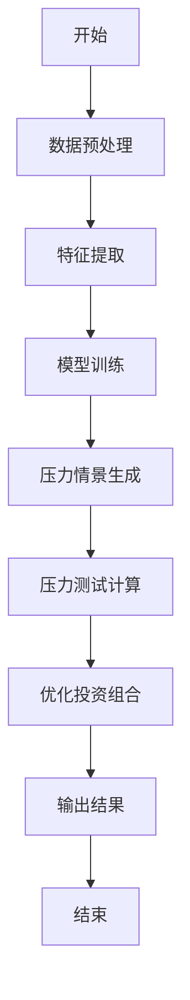
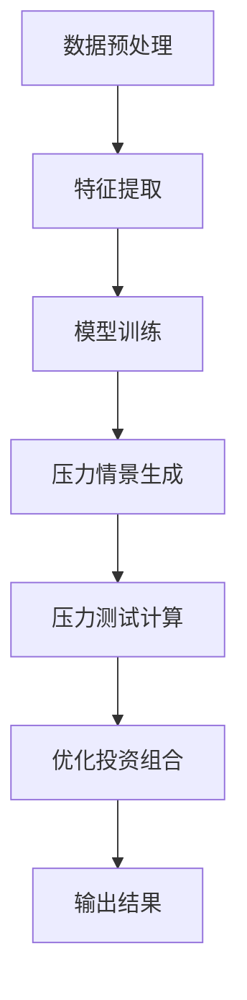
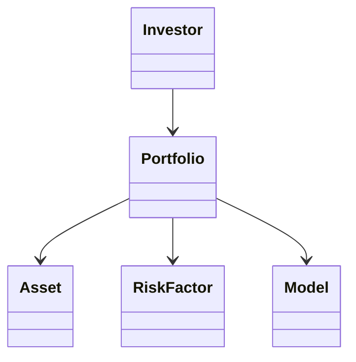
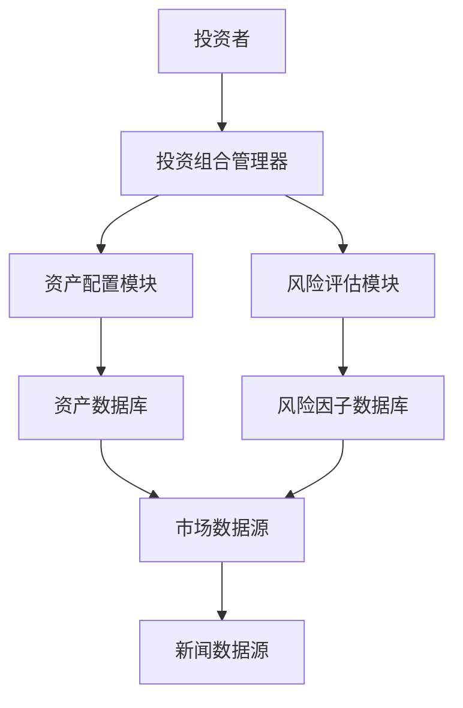
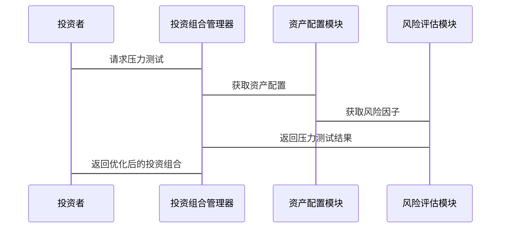

                 


# AI驱动的价值投资组合压力测试优化

> 关键词：AI驱动、价值投资组合、压力测试、优化算法、系统架构、风险管理、金融分析

> 摘要：本文将探讨如何利用人工智能技术优化价值投资组合的压力测试过程，从背景介绍、核心概念、算法原理、系统架构到项目实战，全面解析AI在投资组合压力测试中的应用。通过结合数学模型、机器学习算法和系统设计，本文旨在为读者提供一种高效、准确的压力测试优化方法，帮助投资者在复杂市场环境中做出更明智的决策。

---

## 第1章: 背景介绍

### 1.1 问题背景

#### 1.1.1 价值投资组合与压力测试的定义
- 价值投资组合：一种通过基本面分析选择具有长期增长潜力的股票，追求长期稳定收益的投资策略。
- 压力测试：评估投资组合在极端市场条件下的表现，识别潜在风险并制定应对策略。

#### 1.1.2 传统压力测试的局限性
- 传统压力测试依赖历史数据和假设情景，难以捕捉市场中的新兴风险。
- 手动分析耗时且易受主观因素影响，效率低下。
- 无法实时调整测试参数，难以应对快速变化的市场环境。

#### 1.1.3 AI驱动优化的必要性
- AI能够快速处理海量数据，发现传统方法难以察觉的模式。
- 通过机器学习模型，可以动态调整压力测试情景，提高测试的准确性和实时性。

### 1.2 核心概念与联系

#### 1.2.1 价值投资组合的核心要素
- 股票选择：基于公司基本面、财务指标和行业前景。
- 风险管理：控制投资组合的波动性和潜在损失。
- 绩效评估：通过收益、波动率和最大回撤等指标衡量表现。

#### 1.2.2 压力测试的基本原理
- 确定极端市场情景（如市场崩盘、经济衰退）。
- 计算投资组合在这些情景下的表现。
- 分析潜在损失并制定风险缓解策略。

#### 1.2.3 AI技术在压力测试中的应用
- 使用机器学习模型预测市场风险。
- 通过自然语言处理（NLP）分析新闻和社交媒体情绪，辅助情景设定。
- 运用强化学习优化压力测试策略。

### 1.3 问题描述与目标

#### 1.3.1 投资组合压力测试的常见问题
- 数据不足或质量不高。
- 压力测试情景假设过于简化。
- 计算复杂度高，难以实时分析。

#### 1.3.2 AI驱动优化的目标
- 提高压力测试的准确性和实时性。
- 发现传统方法难以识别的潜在风险。
- 优化投资组合的抗风险能力。

#### 1.3.3 边界与外延
- 本研究仅考虑股票市场，不包括其他资产类别。
- 重点优化压力测试过程，而非投资组合构建阶段。

### 1.4 核心概念结构与要素

#### 1.4.1 价值投资组合的结构化分析
- 股票池：筛选出具有成长潜力的股票。
- 权重分配：根据风险偏好分配各股票的权重。
- 再平衡：定期调整投资组合以维持预定策略。

#### 1.4.2 压力测试的关键指标
- 价值-at-风险（VaR）：在给定置信水平下，投资组合的最大可能损失。
- 条件VaR（CVaR）：VaR在极端情况下的扩展。
- 最大回撤：投资组合在一定时间内的最大亏损。

#### 1.4.3 AI算法的核心要素
- 数据来源：市场数据、新闻、社交媒体。
- 模型选择：回归模型、聚类模型、强化学习模型。
- 优化目标：最小化潜在损失，提高抗风险能力。

### 1.5 本章小结
本章介绍了价值投资组合和压力测试的基本概念，分析了传统压力测试的局限性，并提出了AI驱动优化的必要性和目标。通过结构化分析，明确了投资组合压力测试的核心要素和AI算法的关键组成部分。

---

## 第2章: AI驱动的价值投资组合压力测试模型

### 2.1 核心概念原理

#### 2.1.1 投资组合优化的数学模型
投资组合优化的目标是在给定风险水平下最大化收益，或在给定期望收益下最小化风险。数学模型如下：

$$ \text{目标函数}：\min_w \sigma^2(w) \quad \text{在} \quad \mu^T w \geq \mu_{\text{min}} \text{的约束下} $$

其中：
- \( w \) 是权重向量。
- \( \sigma^2(w) \) 是投资组合的波动率。
- \( \mu \) 是资产的期望收益向量。
- \( \mu_{\text{min}} \) 是最低期望收益。

#### 2.1.2 压力测试的AI算法原理
基于机器学习的压力测试模型通常包括以下几个步骤：
1. 数据预处理：清洗和特征提取。
2. 模型训练：使用历史数据训练机器学习模型。
3. 情景生成：根据模型预测生成极端市场情景。
4. 压力测试：计算投资组合在这些情景下的表现。

#### 2.1.3 模型的输入输出关系
- 输入：市场数据（如股价、成交量）、宏观经济指标、新闻情绪等。
- 输出：压力测试结果（如VaR、CVaR）、优化后的投资组合权重。

### 2.2 核心概念对比表格

#### 2.2.1 传统压力测试与AI驱动测试的对比
| 对比维度 | 传统压力测试 | AI驱动压力测试 |
|----------|----------------|------------------|
| 数据来源 | 历史数据       | 历史数据+实时数据 |
| 情景假设 | 固定情景       | 动态生成情景     |
| 计算效率 | 较低           | 较高             |

#### 2.2.2 不同AI算法的效果对比
| 算法类型 | 优点             | 缺点             |
|----------|------------------|------------------|
| 回归模型 | 简单易用         | 解释性较差       |
| 聚类模型 | 发现数据结构     | 需要大量数据     |
| 强化学习 | 实时优化         | 计算复杂度高     |

#### 2.2.3 压力测试指标的对比分析
| 指标名称 | 定义             | 作用             |
|----------|------------------|------------------|
| VaR      | 在一定置信水平下的最大损失 | 衡量投资组合的潜在风险 |
| CVaR     | VaR的扩展，考虑极端损失的平均值 | 更全面的尾部风险衡量 |
| 最大回撤  | 投资组合在一定时间内的最大亏损 | 衡量短期风险承受能力 |

### 2.3 ER实体关系图与流程图

#### 2.3.1 投资组合优化的ER图

```mermaid
erd
  investor
  portfolio
  asset
  risk_factor
  investor -o portfolio
  portfolio -o asset
  portfolio -o risk_factor
```

#### 2.3.2 AI驱动压力测试的流程图



### 2.4 本章小结
本章通过对比分析和流程图，详细介绍了AI驱动的价值投资组合压力测试模型的核心概念和原理，为后续的算法实现和系统设计奠定了基础。

---

## 第3章: 压力测试的AI算法实现

### 3.1 算法原理

#### 3.1.1 机器学习模型的选择
- 使用支持向量回归（SVR）或随机森林（Random Forest）进行市场预测。
- 通过主成分分析（PCA）提取特征。

#### 3.1.2 算法实现步骤



#### 3.1.3 数学模型与公式
- 回归模型的损失函数：
  $$ L = \sum_{i=1}^{n} (y_i - \hat{y}_i)^2 $$
- 优化目标：
  $$ \min_w L + \lambda \|w\|_2^2 $$

#### 3.1.4 代码实现示例

```python
import numpy as np
from sklearn.svm import SVR

# 数据预处理
X = np.array(range(100)).reshape(-1, 1)
y = np.sin(X).flatten()

# 模型训练
model = SVR(C=1.0, epsilon=0.2)
model.fit(X, y)

# 压力测试
test_X = np.array([100]).reshape(-1, 1)
predicted_y = model.predict(test_X)
```

### 3.2 算法优化

#### 3.2.1 超参数调优
- 使用网格搜索（Grid Search）或随机搜索（Random Search）优化模型参数。

#### 3.2.2 并行计算
- 利用分布式计算框架（如Spark）加速模型训练和压力测试过程。

### 3.3 本章小结
本章详细讲解了AI算法在压力测试中的实现过程，包括模型选择、数据预处理、算法实现和优化方法，为后续的系统设计提供了技术支持。

---

## 第4章: 系统分析与架构设计方案

### 4.1 问题场景介绍

#### 4.1.1 系统目标
- 提供实时的压力测试服务。
- 支持多种资产类别的投资组合优化。

#### 4.1.2 使用场景
- 投资者进行投资组合风险评估。
- 机构投资者监控市场风险。

### 4.2 系统功能设计

#### 4.2.1 领域模型（类图）



#### 4.2.2 系统架构设计（架构图）



#### 4.2.3 系统接口设计
- 输入接口：市场数据、宏观经济指标、新闻数据。
- 输出接口：压力测试结果、优化后的投资组合。

#### 4.2.4 系统交互（序列图）



### 4.3 本章小结
本章通过系统分析和架构设计，明确了AI驱动的价值投资组合压力测试系统的功能模块和交互流程，为后续的项目实施提供了指导。

---

## 第5章: 项目实战

### 5.1 环境安装

#### 5.1.1 安装Python和相关库
- 安装Python 3.8及以上版本。
- 安装库：`numpy`, `pandas`, `scikit-learn`, `mermaid`, `matplotlib`。

#### 5.1.2 数据源获取
- 股票数据：使用Yahoo Finance API。
- 新闻数据：使用Twitter API或Google News API。

### 5.2 系统核心实现源代码

#### 5.2.1 数据预处理代码

```python
import pandas as pd
import numpy as np

# 读取股票数据
data = pd.read_csv('stock_data.csv')
# 特征提取
features = data[['open', 'high', 'low', 'volume']]
```

#### 5.2.2 压力测试代码

```python
from sklearn.svm import SVR

# 训练模型
model = SVR(C=1.0, epsilon=0.2)
model.fit(features, data['close'])

# 预测极端情景
test_features = np.array([[100, 100, 100, 100]])
predicted_close = model.predict(test_features)
```

### 5.3 代码应用解读与分析

#### 5.3.1 数据预处理
- 清洗数据：处理缺失值和异常值。
- 特征工程：提取相关特征并进行标准化。

#### 5.3.2 压力测试实现
- 使用回归模型预测极端市场情景下的资产价格。
- 计算投资组合在这些情景下的VaR和CVaR。

### 5.4 实际案例分析

#### 5.4.1 数据来源
- 股票数据：苹果、微软、谷歌等科技股。
- 宏观经济指标：GDP增长率、失业率等。

#### 5.4.2 案例分析
- 假设市场崩盘，计算投资组合的VaR和CVaR。
- 根据模型预测，调整投资组合权重以最小化潜在损失。

### 5.5 本章小结
本章通过实际案例展示了AI驱动的压力测试优化过程，从数据预处理到模型训练，再到压力测试和优化，帮助读者掌握实际应用的方法。

---

## 第6章: 总结

### 6.1 最佳实践 Tips

#### 6.1.1 数据质量
- 确保数据来源可靠，特征提取要精准。
- 定期更新数据源，保持模型的实时性。

#### 6.1.2 模型选择
- 根据具体场景选择合适的机器学习模型。
- 定期重新训练模型，避免过时。

#### 6.1.3 系统设计
- 采用模块化设计，便于功能扩展。
- 确保系统具有良好的可扩展性和可维护性。

### 6.2 小结
本文详细探讨了AI驱动的价值投资组合压力测试优化的方法，从理论到实践，为读者提供了一套完整的解决方案。

### 6.3 注意事项

#### 6.3.1 数据风险
- 数据不足或质量不高可能导致模型预测不准确。
- 需要注意数据隐私和合规性问题。

#### 6.3.2 模型风险
- 过度依赖单一模型可能导致风险遗漏。
- 需要定期验证模型的准确性和稳定性。

#### 6.3.3 系统风险
- 系统设计不合理可能导致运行效率低下。
- 需要确保系统的安全性和稳定性。

### 6.4 拓展阅读
- 推荐阅读《机器学习实战》和《投资学导论》。
- 关注学术期刊中的最新研究成果。

---

## 作者：AI天才研究院/AI Genius Institute & 禅与计算机程序设计艺术/Zen And The Art of Computer Programming

---

以上是《AI驱动的价值投资组合压力测试优化》的技术博客文章目录大纲和详细内容设计，供您参考。如需进一步调整或补充，请随时告知！

