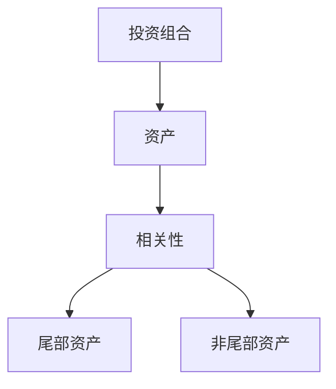

                 


# AI驱动的价值投资组合尾部相关性管理

## 关键词：
- AI驱动
- 投资组合
- 尾部相关性
- 价值投资
- 风险管理
- 机器学习
- 资产配置

## 摘要：
本文深入探讨了AI在价值投资组合管理中的应用，特别是尾部相关性管理这一关键领域。通过结合金融学原理和机器学习技术，我们提出了一种创新的方法，利用AI优化尾部资产的相关性预测与风险控制，从而提升投资组合的整体表现和稳定性。本文从问题背景、算法原理到系统架构，再到项目实战，全面阐述了AI驱动的尾部相关性管理的实现过程，为投资者和相关技术从业者提供了深入的理论指导和实践参考。

---

# 目录

## 第一部分: 背景介绍

### 第1章: 问题背景
- **1.1 问题背景**
  - 1.1.1 传统投资组合管理的局限性
    - 传统资产配置的不足
    - 尾部资产的风险忽视问题
  - 1.1.2 尾部相关性管理的重要性
    - 尾部资产对整体投资组合的影响
    - 尾部风险的传染效应
  - 1.1.3 AI技术在投资组合管理中的应用潜力
    - 机器学习在金融数据分析中的优势
    - 尾部相关性预测的AI驱动方法

- **1.2 问题描述**
  - 1.2.1 尾部相关性管理的核心问题
    - 尾部资产的相关性特征
    - 尾部风险的动态变化
  - 1.2.2 传统相关性计算的不足
    - 协方差矩阵的局限性
    - 尾部资产相关性预测的低效性
  - 1.2.3 AI驱动的相关性管理的优势
    - 非线性关系捕捉能力
    - 大数据分析能力

- **1.3 问题解决**
  - 1.3.1 AI如何优化尾部相关性管理
    - 基于机器学习的相关性预测模型
    - 尾部资产的风险控制策略
  - 1.3.2 基于机器学习的相关性预测方法
    - 算法选择与优化
    - 模型训练与验证
  - 1.3.3 尾部资产的风险控制策略
    - 多因子模型的应用
    - 动态再平衡策略

- **1.4 边界与外延**
  - 1.4.1 尾部相关性管理的边界条件
    - 数据质量与样本容量
    - 模型适用性与限制
  - 1.4.2 相关性管理的外延领域
    - 系统性风险的管理
    - 跨资产类别的相关性分析
  - 1.4.3 AI技术的应用范围与限制
    - 数据依赖性
    - 黑箱模型的解释性问题

- **1.5 概念结构与核心要素**
  - 1.5.1 尾部相关性管理的系统架构
    - 输入数据
    - 输出结果
    - 中间处理过程
  - 1.5.2 核心要素的定义与特征
    - 尾部资产
    - 相关性矩阵
    - 风险指标
  - 1.5.3 系统的输入输出关系
    - 输入：资产价格数据
    - 输出：尾部资产的相关性预测与风险控制建议

---

## 第二部分: 核心概念与联系

### 第2章: 核心概念解析
- **2.1 尾部相关性管理的原理**
  - 2.1.1 相关性计算的基本原理
    - 协方差与相关系数的定义
    - 尾部资产的相关性特征
  - 2.1.2 尾部资产的相关性预测
    - 传统方法的局限性
    - 基于机器学习的预测模型
  - 2.1.3 AI在相关性预测中的作用
    - 非线性关系的捕捉
    - 高维数据的处理能力

- **2.2 核心概念对比**
  - 2.2.1 不同相关性管理方法的对比分析
    - 传统方法 vs. AI驱动方法
    - 线性相关性 vs. 非线性相关性
  - 2.2.2 基于AI的相关性管理与传统方法的对比
    - 计算效率
    - 模型解释性
    - 预测精度
  - 2.2.3 尾部资产与整体资产的相关性差异
    - 尾部资产的相关性波动
    - 非尾部资产的相关性稳定性

- **2.3 ER实体关系图**


---

## 第三部分: 算法原理讲解

### 第3章: 算法流程与实现
- **3.1 相关性计算的算法流程**
  ```mermaid
  graph TD
      A[输入数据] --> B[数据预处理]
      B --> C[计算协方差矩阵]
      C --> D[计算相关系数矩阵]
      D --> E[AI模型训练]
      E --> F[输出相关性预测结果]
  ```

- **3.2 Python源代码实现**
  ```python
  import numpy as np
  import pandas as pd
  from sklearn.linear_model import LinearRegression

  def calculate_correlation_matrix(data):
      # 计算协方差矩阵
      cov_matrix = np.cov(data.T)
      # 计算相关系数矩阵
      corr_matrix = np.zeros_like(cov_matrix)
      for i in range(cov_matrix.shape[0]):
          for j in range(cov_matrix.shape[1]):
              corr_matrix[i,j] = cov_matrix[i,j] / (np.sqrt(cov_matrix[i,i]) * np.sqrt(cov_matrix[j,j]))
      return corr_matrix

  def ai_driven_correlation_model(data, tail_assets):
      # 数据预处理
      data_processed = data[tail_assets]
      # 模型训练
      model = LinearRegression()
      model.fit(data_processed.iloc[:,0].values.reshape(-1,1), data_processed.iloc[:,1].values)
      # 预测相关性
      predicted_correlation = model.predict(data_processed.iloc[:,0].values.reshape(-1,1))
      return predicted_correlation
  ```

- **3.3 数学公式与模型解释**
  - 3.3.1 协方差公式
    $$ \text{Cov}(X,Y) = \frac{1}{n-1} \sum_{i=1}^{n} (X_i - \bar{X})(Y_i - \bar{Y}) $$
  - 3.3.2 相关系数公式
    $$ \rho_{X,Y} = \frac{\text{Cov}(X,Y)}{\sqrt{\text{Var}(X)} \cdot \sqrt{\text{Var}(Y)}} $$
  - 3.3.3 线性回归模型
    $$ Y = aX + b $$

- **3.4 示例与解释**
  - 3.4.1 示例数据集
    - 选取尾部资产的回报数据
    - 计算相关系数矩阵
    - 构建线性回归模型预测尾部资产的相关性
  - 3.4.2 实验结果分析
    - 模型预测的准确性
    - 模型的鲁棒性与稳定性

---

## 第四部分: 系统分析与架构设计

### 第4章: 系统功能设计
- **4.1 问题场景介绍**
  - 尾部资产风险控制的场景
  - 投资组合优化的需求
- **4.2 系统功能设计**
  - 数据采集模块
    - 数据来源与预处理
  - 相关性计算模块
    - 协方差矩阵计算
    - 相关性矩阵计算
  - 优化模块
    - 风险控制策略
    - 资产再平衡
- **4.3 系统架构设计**
  ```mermaid
  graph TD
      A[数据源] --> B[数据采集模块]
      B --> C[数据预处理模块]
      C --> D[相关性计算模块]
      D --> E[优化模块]
      E --> F[输出结果]
  ```

### 第5章: 项目实战

- **5.1 项目介绍**
  - 项目目标
  - 项目范围
  - 项目技术选型
- **5.2 核心实现**
  - 环境安装
    ```bash
    pip install numpy pandas scikit-learn
    ```
  - 核心代码实现
    ```python
    import numpy as np
    import pandas as pd
    from sklearn.linear_model import LinearRegression

    # 加载数据
    data = pd.read_csv('tail_assets.csv')
    tail_assets = ['asset1', 'asset2', 'asset3']

    # 计算协方差矩阵
    cov_matrix = np.cov(data[tail_assets].T)

    # 计算相关系数矩阵
    corr_matrix = calculate_correlation_matrix(data[tail_assets])

    # AI驱动的相关性预测
    predicted_correlations = ai_driven_correlation_model(data, tail_assets)

    # 输出结果
    print(corr_matrix)
    print(predicted_correlations)
    ```
- **5.3 案例分析**
  - 数据来源与选择
  - 模型训练与验证
  - 结果分析与优化
- **5.4 项目小结**
  - 项目实现的关键点
  - 项目的价值与意义

### 第6章: 最佳实践与总结

- **6.1 最佳实践**
  - 数据质量的重要性
  - 模型选择与调优
  - 结果验证与持续优化
- **6.2 小结**
  - AI驱动尾部相关性管理的核心要点
  - 未来研究方向
- **6.3 注意事项**
  - 数据依赖性
  - 模型解释性
  - 算法的可扩展性
- **6.4 拓展阅读**
  - 推荐书籍与论文
  - 行业动态与趋势

---

## 作者：AI天才研究院/AI Genius Institute & 禅与计算机程序设计艺术 /Zen And The Art of Computer Programming

