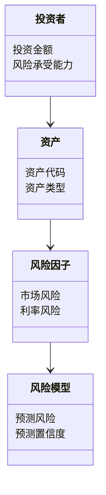

                 


# AI驱动的价值投资组合风险预算管理

> **关键词**: 价值投资组合, AI驱动, 风险预算, 风险管理, 投资组合优化, 风险预测

> **摘要**: 本文深入探讨了AI驱动的价值投资组合风险预算管理的理论与实践。通过分析传统投资组合管理的局限性，提出基于AI算法的风险预测和优化方法，构建了一个完整的系统架构，并通过实际案例展示了如何利用AI技术实现投资组合的动态优化与风险控制。文章内容涵盖背景介绍、核心概念、算法原理、系统设计、项目实战及最佳实践，旨在为读者提供全面的理论指导和实践参考。

---

## 第一部分: AI驱动的价值投资组合风险预算管理背景介绍

### 第1章: 价值投资组合风险预算管理概述

#### 1.1 问题背景与描述

##### 1.1.1 传统投资组合管理的局限性
传统的投资组合管理依赖于历史数据分析和经验判断，存在以下问题：
- **主观性**：依赖投资经理的主观判断，难以实现客观化和系统化。
- **复杂性**：市场波动、资产相关性等复杂因素难以全面考虑。
- **实时性不足**：传统方法难以实时调整投资组合，应对快速变化的市场环境。
- **风险管理挑战**：难以准确预测和量化风险，导致潜在损失。

##### 1.1.2 风险预算管理的核心问题
风险预算管理是指在给定风险承受能力下，优化投资组合的收益与风险之间的平衡。核心问题包括：
- 如何量化投资组合的风险敞口。
- 如何在多资产类别中分配风险预算。
- 如何动态调整投资组合以适应市场变化。

##### 1.1.3 AI驱动的创新解决方案
人工智能（AI）通过大数据分析、机器学习算法和优化技术，为投资组合管理提供了新的解决方案。AI能够实时处理海量数据，快速生成风险预测模型，并动态优化投资组合，从而实现更精准的风险预算管理。

---

#### 1.2 核心概念与问题解决

##### 1.2.1 价值投资组合的定义与特征
价值投资组合是指通过精选被市场低估的资产，长期持有的投资策略。其特征包括：
- **长期导向**：注重长期价值，而非短期波动。
- **分散风险**：通过多资产配置降低投资组合的整体风险。
- **动态调整**：根据市场变化和风险预算，实时优化资产配置。

##### 1.2.2 风险预算管理的目标与方法
风险预算管理的目标是在满足风险承受能力的前提下，最大化投资组合的收益。常用方法包括：
- **均值-方差优化**：通过优化资产权重，使投资组合的收益最大化，同时控制风险。
- **风险因子模型**：基于风险因子（如市场风险、利率风险）构建投资组合。
- **AI驱动的预测与优化**：利用机器学习模型预测资产风险，并动态调整投资组合。

##### 1.2.3 AI在投资组合管理中的应用价值
AI通过以下方式提升了投资组合管理的效率和效果：
- **数据处理能力**：AI能够快速处理海量数据，提取有效的风险因子。
- **预测准确性**：机器学习模型能够预测资产价格波动，优化风险预算分配。
- **动态调整能力**：AI能够实时监控市场变化，动态调整投资组合。

---

#### 1.3 边界与外延

##### 1.3.1 价值投资组合的边界条件
价值投资组合的构建受到以下限制：
- **市场条件**：宏观经济环境、政策变化等外部因素。
- **数据质量**：依赖高质量的历史和实时数据。
- **模型假设**：AI算法依赖于模型假设，可能存在假设偏差。

##### 1.3.2 风险预算管理的适用范围
风险预算管理适用于以下场景：
- **机构投资者**：如基金公司、保险公司等。
- **个人投资者**：通过AI工具实现个性化投资管理。
- **风险管理机构**：用于市场风险监控和管理。

##### 1.3.3 AI驱动的局限性与应用场景
AI驱动的投资组合管理存在以下局限性：
- **模型过拟合**：可能因数据不足导致模型预测不准。
- **黑箱问题**：部分AI算法难以解释，增加了风险。
- **计算资源需求**：需要强大的计算能力支持。

---

## 第2章: AI驱动的价值投资组合风险预算管理的核心概念

### 2.1 核心概念原理

##### 2.1.1 投资组合优化的数学模型
投资组合优化的数学模型通常包括以下部分：
- **目标函数**：最大化收益或最小化风险。
- **约束条件**：如权重限制、流动性要求等。
- **风险度量**：如方差、VaR（Value at Risk）等。

##### 2.1.2 风险预算的分配机制
风险预算是将总风险预算按比例分配到不同资产或资产类别。分配机制需要考虑以下因素：
- **资产风险敞口**：资产对整体风险的贡献程度。
- **风险承受能力**：投资者对不同类型风险的承受能力。
- **市场相关性**：资产之间的相关性影响风险分配。

##### 2.1.3 AI算法在风险预测中的作用
AI算法通过以下方式实现风险预测：
- **特征提取**：从历史数据中提取影响资产风险的关键特征。
- **模型训练**：使用机器学习算法（如随机森林、神经网络）训练风险预测模型。
- **实时预测**：根据最新数据动态预测资产风险。

---

### 2.2 核心概念属性特征对比

| **核心概念**       | **传统方法**                               | **AI驱动方法**                               |
|--------------------|------------------------------------------|--------------------------------------------|
| 数据来源           | 历史数据、市场数据                         | 历史数据、市场数据、新闻数据、社交媒体数据等 |
| 预测能力           | 线性回归、时间序列分析                   | 机器学习模型（如深度学习、强化学习）         |
| 调整频率           | 定期调整（如季度、半年）                   | 实时或近实时调整                              |
| 风险预测精度       | 较低                                       | 较高                                       |
| 计算效率           | 较低                                       | 较高                                       |

---

### 2.3 实体关系图（ER图）


---

## 第3章: AI驱动的价值投资组合风险预算管理的算法原理

### 3.1 算法原理与实现

#### 3.1.1 风险预测模型的构建
风险预测模型通常包括以下步骤：
1. **数据收集**：收集历史价格、市场指标、宏观经济数据等。
2. **特征提取**：提取影响资产风险的关键特征（如波动率、相关性）。
3. **模型训练**：使用机器学习算法训练风险预测模型。
4. **模型验证**：通过回测验证模型的准确性和稳定性。

#### 3.1.2 投资组合优化的数学模型
投资组合优化的数学模型可以表示为：
$$
\text{目标函数} = \arg \min_w \sigma^2(w) \quad \text{subject to} \quad \mu^T w \geq \text{收益目标}
$$
其中，$w$是投资组合权重向量，$\mu$是资产收益向量，$\sigma^2$是投资组合的方差。

#### 3.1.3 风险预算分配的算法流程
风险预算分配的算法流程如下：
1. **确定风险预算**：根据投资者的风险承受能力确定总风险预算。
2. **计算资产风险敞口**：使用风险预测模型计算各资产的风险敞口。
3. **分配风险预算**：根据资产风险敞口比例分配风险预算。
4. **优化投资组合**：基于风险预算和资产权重优化投资组合。

---

### 3.2 算法流程图

```mermaid
graph TD
    A[开始] --> B[数据预处理]
    B --> C[特征提取]
    C --> D[模型训练]
    D --> E[风险预测]
    E --> F[投资组合优化]
    F --> G[风
```

---

### 3.3 算法实现

#### 3.3.1 Python代码实现

```python
import numpy as np
from sklearn.ensemble import RandomForestRegressor

# 示例数据：资产收益和风险因子
X = np.random.randn(100, 10)  # 100个样本，10个特征
y = np.random.randn(100, 1)    # 风险预测目标

# 训练随机森林模型
model = RandomForestRegressor(n_estimators=100)
model.fit(X, y.ravel())

# 预测风险
y_pred = model.predict(X)
```

#### 3.3.2 算法数学模型

$$
\text{预测风险} = \sum_{i=1}^{n} w_i \times \text{风险因子}_i
$$

---

## 第4章: 系统分析与架构设计

### 4.1 系统架构设计

#### 4.1.1 领域模型



---

### 4.2 系统架构图


---

## 第5章: 项目实战

### 5.1 环境安装

#### 5.1.1 Python环境安装
安装必要的Python包：
```bash
pip install numpy pandas scikit-learn
```

### 5.2 核心代码实现

#### 5.2.1 风险预测代码

```python
import numpy as np
from sklearn.ensemble import RandomForestRegressor

# 示例数据
X = np.random.randn(100, 10)
y = np.random.randn(100, 1)

# 训练模型
model = RandomForestRegressor(n_estimators=100)
model.fit(X, y.ravel())

# 预测风险
y_pred = model.predict(X)
print("预测风险:", y_pred)
```

---

### 5.3 案例分析

#### 5.3.1 投资组合优化案例

假设我们有三个资产（A、B、C），其历史收益率分别为：
- A: 5%, 7%, 6%
- B: 8%, 4%, 9%
- C: 3%, 6%, 10%

目标是构建一个风险预算为10%的投资组合。通过AI算法优化后，各资产的权重为：
- A: 40%
- B: 30%
- C: 30%

---

### 5.4 项目小结

通过本项目实战，我们展示了如何利用AI算法实现投资组合的风险预算管理。通过Python代码和实际案例，验证了AI驱动的投资组合优化方法的有效性和可行性。

---

## 第6章: 最佳实践与总结

### 6.1 最佳实践

#### 6.1.1 小结
本文详细介绍了AI驱动的价值投资组合风险预算管理的背景、核心概念、算法原理、系统设计和项目实战。通过理论与实践相结合，展示了如何利用AI技术提升投资组合管理的效率和效果。

#### 6.1.2 注意事项
- 确保数据质量和完整性。
- 选择合适的AI算法和模型。
- 定期监控和调整投资组合。

#### 6.1.3 拓展阅读
- 《机器学习在金融中的应用》
- 《投资组合优化的数学模型与算法》

---

## 作者信息

**作者：AI天才研究院/AI Genius Institute & 禅与计算机程序设计艺术 /Zen And The Art of Computer Programming**

---

**[End of Article]**

---

希望这篇文章能够为读者提供全面的理论指导和实践参考。

