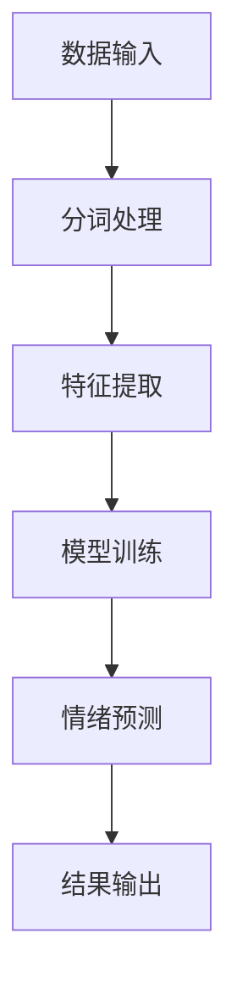
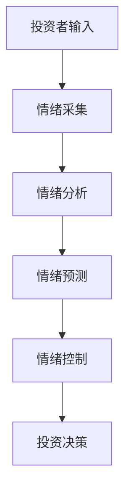

                 


# AI驱动的价值投资者情绪分析与控制

## 关键词：AI技术，价值投资，情绪分析，投资者行为，市场预测

## 摘要：  
本文探讨了人工智能技术在价值投资者情绪分析与控制中的应用，结合了金融学和计算机科学的最新研究成果，详细分析了投资者情绪对市场的影响，并提出了基于AI的情绪分析算法和控制策略。文章从基础理论到实际应用，层层深入，为投资者提供了科学的情绪管理方法，帮助他们在复杂的市场环境中做出更理性的决策。

---

# 第1章: 价值投资与AI的结合

## 1.1 价值投资的核心概念

### 1.1.1 价值投资的定义  
价值投资是一种投资策略，强调以低于内在价值的价格购买优质资产。其核心在于分析企业的基本面，寻找被市场低估的投资机会。  

### 1.1.2 价值投资的基本原理  
价值投资的两大核心是“价格”和“价值”的分离。投资者通过分析企业的财务数据、行业地位和竞争优势，寻找价格低于内在价值的股票。  

### 1.1.3 价值投资在现代金融中的地位  
尽管价值投资在短期内可能表现不佳，但长期来看，它通过分散投资和精选优质资产，能够为投资者带来稳定的超额收益。  

### 1.1.4 价值投资的核心要素  
| 核心要素 | 描述 |  
|----------|------|  
| 价格     | 股票的市场价格，需低于其内在价值。 |  
| 价值     | 企业的内在价值，包括盈利能力、资产质量等。 |  
| 风险     | 投资者对风险的承受能力和资产的风险特征。 |  
| 时间     | 长期投资的时间窗口，通常为3-5年或更长。 |  

---

## 1.2 AI技术在金融领域的应用

### 1.2.1 AI在金融分析中的作用  
AI技术通过自然语言处理（NLP）、机器学习和深度学习，可以帮助投资者分析市场数据、预测价格走势，并识别潜在的投资机会。  

### 1.2.2 AI在投资决策中的应用  
AI可以辅助投资者进行以下决策：  
1. **数据处理**：快速分析海量数据，提取关键信息。  
2. **风险评估**：通过模型预测投资组合的风险。  
3. **情绪分析**：识别市场情绪对价格的影响。  
4. **个性化投资建议**：根据投资者的偏好提供定制化建议。  

### 1.2.3 价值投资者与AI技术的结合  
价值投资者可以通过AI技术辅助基本面分析，例如：  
- 利用NLP分析公司财报，提取关键财务指标。  
- 通过机器学习模型预测企业的未来盈利能力。  
- 利用情绪分析模型识别市场的非理性波动，寻找低估的投资机会。  

---

## 1.3 情绪分析与控制在投资中的重要性

### 1.3.1 投资者情绪对市场的影响  
投资者情绪是市场的晴雨表。当市场情绪过于乐观时，资产价格可能被高估；当情绪过于悲观时，资产价格可能被低估。  

### 1.3.2 情绪分析在投资决策中的价值  
情绪分析可以帮助投资者：  
1. **识别市场拐点**：通过情绪指标预测市场的顶部或底部。  
2. **优化投资组合**：在市场恐慌时增加投资，在市场狂热时减少投资。  
3. **降低情绪驱动的错误决策**：避免贪婪和恐惧的情绪影响投资决策。  

### 1.3.3 情绪控制的必要性  
情绪控制是价值投资者的必修课。通过AI技术，投资者可以更好地管理情绪，避免因短期波动而做出错误的决策。  

---

## 1.4 本章小结  
本章介绍了价值投资的核心概念、AI技术在金融领域的应用，以及情绪分析与控制在投资中的重要性。通过AI技术辅助价值投资，投资者可以更高效地分析数据、识别机会，并避免情绪的干扰。  

---

# 第2章: 投资者情绪分析的基础

## 2.1 情绪分析的定义与分类

### 2.1.1 情绪分析的定义  
情绪分析是对文本或数据中包含的情感倾向进行分析，通常分为正面、负面和中性三种。  

### 2.1.2 情绪分析的分类  
根据分析的对象和目标，情绪分析可以分为以下几类：  
1. **情感分类**：将文本分为正面、负面或中性。  
2. **情感强度分析**：量化文本中情感的强度。  
3. **情感主题分析**：识别文本中情感的主要主题。  

### 2.1.3 情绪分析的指标体系  
以下是一些常用的情绪分析指标：  
- **情感得分**：将文本的情感强度量化为一个分数（如-1到1）。  
- **情感分布**：统计正面、负面和中性情感的比例。  
- **情感波动**：衡量情感强度的变化趋势。  

---

## 2.2 投资者情绪的影响因素

### 2.2.1 市场环境因素  
市场环境（如经济指标、政策变化）会影响投资者的情绪。例如，GDP增长可能提升市场情绪，而政策不确定性可能导致情绪下降。  

### 2.2.2 个体心理因素  
投资者的心理特征（如风险偏好、经验水平）也会影响情绪。经验丰富的投资者通常更理性，而新手投资者可能更容易受到情绪波动的影响。  

### 2.2.3 信息传播因素  
社交媒体、新闻报道等信息传播渠道会影响投资者情绪。例如，负面新闻可能导致市场恐慌，而正面新闻可能提升市场信心。  

---

## 2.3 情绪数据的采集与处理

### 2.3.1 数据来源  
情绪数据可以通过以下途径采集：  
1. **社交媒体**：如Twitter、Reddit等平台的用户评论。  
2. **新闻报道**：分析新闻标题和正文的情感倾向。  
3. **投资者访谈**：通过问卷或访谈收集投资者情绪数据。  

### 2.3.2 数据清洗  
数据清洗是情绪分析的重要步骤，主要包括：  
1. **去噪**：去除无关信息（如垃圾信息、广告）。  
2. **分词**：将文本分割成词语或短语。  
3. **去除停用词**：移除常见词汇（如“的”、“是”等）。  

### 2.3.3 数据预处理  
数据预处理包括：  
1. **标准化**：将数据转换为统一格式。  
2. **向量化**：将文本转换为数值向量（如词袋模型或词嵌入）。  

---

## 2.4 情绪量化的方法

### 2.4.1 情感计分法  
情感计分法通过赋予每个词语正负分值，计算文本的整体情感得分。例如：  
- 正面词汇：+1分  
- 负面词汇：-1分  
- 中性词汇：0分  

情感得分 = (正面词汇总分 - 负面词汇总分) / 总词汇数  

### 2.4.2 情感强度分析  
情感强度分析是对情感得分的绝对值进行分析，衡量情感的强弱。例如：  
- 情感强度 = |情感得分|  

### 2.4.3 情感分类模型  
情感分类模型可以通过机器学习算法（如SVM、随机森林）训练分类器，将文本分为正面、负面或中性。  

---

## 2.5 本章小结  
本章介绍了情绪分析的定义、分类和量化方法，分析了影响投资者情绪的因素，并详细说明了情绪数据的采集与处理方法。这些内容为后续的AI驱动情绪分析奠定了基础。  

---

# 第3章: 基于AI的情绪分析算法

## 3.1 传统机器学习算法

### 3.1.1 支持向量机（SVM）  
SVM是一种监督学习算法，适用于分类和回归问题。在情绪分析中，SVM可以用于情感分类。  

**数学模型**：  
$$ \text{目标函数} = \sum_{i=1}^{n} \xi_i + \lambda \sum_{i=1}^{n} \xi_i $$  
其中，$\xi_i$是松弛变量，$\lambda$是正则化参数。  

### 3.1.2 随机森林（Random Forest）  
随机森林是一种基于树的集成算法，适用于分类和回归问题。在情绪分析中，随机森林可以用于情感分类和情感强度预测。  

### 3.1.3 K近邻算法（KNN）  
KNN是一种无监督学习算法，适用于分类和回归问题。在情绪分析中，KNN可以用于情感分类。  

---

## 3.2 深度学习算法

### 3.2.1 循环神经网络（RNN）  
RNN是一种适用于序列数据的深度学习算法，常用于文本情感分析。  

**数学模型**：  
$$ h_t = \tanh(W_{hh} h_{t-1} + W_{xh} x_t) $$  
其中，$h_t$是当前时刻的状态，$x_t$是输入，$W_{hh}$和$W_{xh}$是权重矩阵。  

### 3.2.2 长短期记忆网络（LSTM）  
LSTM是一种改进的RNN，通过引入遗忘门和记忆单元，能够更好地处理长序列数据。  

**数学模型**：  
$$ f_t = \sigma(W_{hf} h_{t-1} + W_{xf} x_t) $$  
$$ i_t = \sigma(W_{hi} h_{t-1} + W_{xi} x_t) $$  
$$ o_t = \sigma(W_{ho} h_{t-1} + W_{xo} x_t) $$  
$$ c_t = f_t \cdot c_{t-1} + i_t \cdot g(h_{t-1}, x_t) $$  
$$ h_t = o_t \cdot c_t $$  
其中，$\sigma$是sigmoid函数，$g$是tanh函数。  

### 3.2.3 Transformer模型  
Transformer是一种基于注意力机制的深度学习算法，常用于自然语言处理任务，如情感分析。  

**数学模型**：  
$$ \text{注意力机制} = \text{softmax}\left(\frac{QK^T}{\sqrt{d_k}}\right)A $$  
其中，$Q$是查询向量，$K$是键向量，$A$是值向量。  

---

## 3.3 情绪分析的流程图



---

## 3.4 算法实现的数学模型

### 3.4.1 SVM的数学模型  
$$ \text{目标函数} = \sum_{i=1}^{n} \xi_i + \lambda \sum_{i=1}^{n} \xi_i $$  

### 3.4.2 LSTM的数学模型  
$$ f_t = \sigma(W_{hf} h_{t-1} + W_{xf} x_t) $$  
$$ i_t = \sigma(W_{hi} h_{t-1} + W_{xi} x_t) $$  
$$ o_t = \sigma(W_{ho} h_{t-1} + W_{xo} x_t) $$  
$$ c_t = f_t \cdot c_{t-1} + i_t \cdot g(h_{t-1}, x_t) $$  
$$ h_t = o_t \cdot c_t $$  

---

## 3.5 本章小结  
本章介绍了传统机器学习算法和深度学习算法在情绪分析中的应用，并通过流程图和数学模型展示了算法的实现过程。  

---

# 第4章: 情绪控制策略

## 4.1 情绪控制的目标

### 4.1.1 稳定投资心态  
通过AI技术帮助投资者保持理性，避免情绪波动对投资决策的影响。  

### 4.1.2 避免情绪化决策  
通过情绪分析和预测，投资者可以更好地控制情绪，避免因情绪化决策而导致损失。  

### 4.1.3 优化投资组合  
通过情绪控制，投资者可以更好地分散风险，优化投资组合的收益与风险比。  

---

## 4.2 情绪控制的实现方法

### 4.2.1 市场情绪预测  
通过AI算法预测市场情绪，投资者可以提前做好准备。  

### 4.2.2 情绪反馈机制  
通过实时监控市场情绪，投资者可以及时调整投资策略。  

### 4.2.3 个性化情绪管理  
根据投资者的个性特征（如风险偏好、情绪稳定性），制定个性化的控制策略。  

---

## 4.3 情绪控制的系统架构



---

## 4.4 情绪控制的案例分析

### 4.4.1 案例背景  
假设某投资者在市场恐慌时，情绪分析系统预测市场情绪将下跌，建议投资者减少持仓。  

### 4.4.2 情绪控制的实施  
投资者根据系统建议，减少高风险资产的持仓，转投防御性资产。  

### 4.4.3 结果分析  
通过情绪控制，投资者在市场下跌中减少了损失，实现了资产保值。  

---

## 4.5 本章小结  
本章介绍了情绪控制的目标和实现方法，并通过案例分析展示了情绪控制的实际应用。  

---

# 第5章: 系统分析与架构设计方案

## 5.1 问题场景介绍

### 5.1.1 问题背景  
投资者在面对市场波动时，容易受到情绪影响，导致决策失误。  

### 5.1.2 问题目标  
设计一个基于AI的情绪分析与控制系统，帮助投资者做出理性决策。  

### 5.1.3 问题分析  
系统需要实现以下功能：  
1. 数据采集与处理  
2. 情绪分析与预测  
3. 情绪控制与反馈  

---

## 5.2 系统功能设计

### 5.2.1 领域模型  
```mermaid
classDiagram
class 投资者 {
    + 基金代码
    + 股票代码
    + 债券代码
}
class 情绪数据 {
    + 情绪得分
    + 情绪强度
    + 情绪主题
}
class 系统 {
    + 数据采集模块
    + 情绪分析模块
    + 情绪控制模块
}
抽彖化关系：  
抽彖化抽彖化抽彖化抽彖化抽彖化抽彖化抽彖化抽彖化抽彖化抽彖化抽彖化抽彖化抽彖化抽彖化抽彖化抽彖化抽彖化抽彖化抽彖化抽彖化抽彖化抽彖化抽彖化抽彖化抽彖化抽彖化抽彖化抽彖化抽彖化抽彖化抽彖化抽彖化抽彖化抽彖化抽彖化抽彖化抽彖化抽彖化抽彖化抽彖化抽彖化抽彖化抽彖化抽彖化抽彖化抽彖化抽彖化抽彖化抽彖化抽彖化抽彖化抽彖化抽彖化抽彖化抽彖化抽彖化抽彖化抽彖化抽彖化抽彖化抽彖化抽彖化抽彖化抽彖化抽彖化抽彖化抽彖化抽彖化抽彖化抽彖化抽彖化抽彖化抽彖化抽彖化抽彖化抽彖化抽彖化抽彖化抽彖化抽彖化抽彖化抽彖化抽彖化抽彖化抽彖化抽彖化抽彖化抽彖化抽彖化抽彖化抽彖化抽彖化抽彖化抽彖化抽彖化抽彖化抽彖化抽彖化抽彖化抽彖化抽彖化抽彖化抽彖化抽彖化抽彖化抽彖化抽彖化抽彖化抽彖化抽彖化抽彖化抽彖化抽彖化抽彖化抽彖化抽彖化抽彖化抽彖化抽彖化抽彖化抽彖化抽彖化抽彖化抽彖化抽彖化抽彖化抽彖化抽彖化抽彖化抽彖化抽彖化抽彖化抽彖化抽彖化抽彖化抽彖化抽彖化抽彖化抽彖化抽彖化抽彖化抽彖化抽彖化抽彖化抽彖化抽彖化抽彖化抽彖化抽彖化抽彖化抽彖化抽彖化抽彖化抽彖化抽彖化抽彖化抽彖化抽彖化抽彖化抽彖化抽彖化抽彖化抽彖化抽彖化抽彖化抽彖化抽彖化抽彖化抽彖化抽彖化抽彖化抽彖化抽彖化抽彖化抽彖化抽彖化抽彖化抽彖化抽彖化抽彖化抽彖化抽彖化抽彖化抽彖化抽彖化抽彖化抽彖化抽彖化抽彖化抽彖化抽彖化抽彖化抽彖化抽彖化抽彖化抽彖化抽彖化抽彖化抽彖化抽彖化抽彖化抽彖化抽彖化抽彖化抽彖化抽彖化抽彖化抽彖化抽彖化抽彖化抽彖化抽彖化抽彖化抽彖化抽彖化抽彖化抽彖化抽彖化抽彖化抽彖化抽彖化抽彖化抽彖化抽彖化抽彖化抽彖化抽彖化抽彖化抽彖化抽彖化抽彖化抽彖化抽彖化抽彖化抽彖化抽彖化抽彖化抽彖化抽彖化抽彖化抽彖化抽彖化抽彖化抽彖化抽彖化抽彖化抽彖化抽彖化抽彖化抽彖化抽彖化抽彖化抽彖化抽彖化抽彖化抽彖化抽彖化抽彖化抽彖化抽彖化抽彖化抽彖化抽彖化抽彖化抽彖化抽彖化抽彖化抽彖化抽彖化抽彖化抽彖化抽彖化抽彖化抽彖化抽彖化抽彖化抽彖化抽彖化抽彖化抽彖化抽彖化抽彖化抽彖化抽彖化抽彖化抽彖化抽彖化抽彖化抽彖化抽彖化抽彖化抽彖化抽彖化抽彖化抽彖化抽彖化抽彖化抽彖化抽彖化抽彖化抽彖化抽彖化抽彖化抽彖化抽彖化抽彖化抽彖化抽彖化抽彖化抽彖化抽彖化抽彖化抽彖化抽彖化抽彖化抽彖化抽彖化抽彖化抽彖化抽彖化抽彖化抽彖化抽彖化抽彖化抽彖化抽彖化抽彖化抽彖化抽彖化抽彖化抽彖化抽彖化抽彖化抽彖化抽彖化抽彖化抽彖化抽彖化抽彖化抽彖化抽彖化抽彖化抽彖化抽彖化抽彖化抽彖化抽彖化抽彖化抽彖化抽彖化抽彖化抽彖化抽彖化抽彖化抽彖化抽彖化抽彖化抽彖化抽彖化抽彖化抽彖化抽彖化抽彖化抽彖化抽彖化抽彖化抽彖化抽彖化抽彖化抽彖化抽彖化抽彖化抽彖化抽彖化抽彖化抽彖化抽彖化抽彖化抽彖化抽彖化抽彖化抽彖化抽彖化抽彖化抽彖化抽彖化抽彖化抽彖化抽彖化抽彖化抽彖化抽彖化抽彖化抽彖化抽彖化抽彖化抽彖化抽彖化抽彖化抽彖化抽彖化抽彖化抽彖化抽彖化抽彖化抽彖化抽彖化抽彖化抽彖化抽彖化抽彖化抽彖化抽彖化抽彖化抽彖化抽彖化抽彖化抽彖化抽彖化抽彖化抽彖化抽彖化抽彖化抽彖化抽彖化抽彖化抽彖化抽彖化抽彖化抽彖化抽彖化抽彖化抽彖化抽彖化抽彖化抽彖化抽彖化抽彖化抽彖化抽彖化抽彖化抽彖化抽彖化抽彖化抽彖化抽彖化抽彖化抽彖化抽彖化抽彖化抽彖化抽彖化抽彖化抽彖化抽彖化抽彖化抽彖化抽彖化抽彖化抽彖化抽彖化抽彖化抽彖化抽彖化抽彖化抽彖化抽彖化抽彖化抽彖化抽彖化抽彖化抽彖化抽彖化抽彖化抽彖化抽彖化抽彖化抽彖化抽彖化抽彖化抽彖化抽彖化抽彖化抽彖化抽彖化抽彖化抽彖化抽彖化抽彖化抽彖化抽彖化抽彖化抽彖化抽彖化抽彖化抽彖化抽彖化抽彖化抽彖化抽彖化抽彖化抽彖化抽彖化抽彖化抽彖化抽彖化抽彖化抽彖化抽彖化抽彖化抽彖化抽彖化抽彖化抽彖化抽彖化抽彖化抽彖化抽彖化抽彖化抽彖化抽彖化抽彖化抽彖化抽彖化抽彖化抽彖化抽彖化抽彖化抽彖化抽彖化抽彖化抽彖化抽彖化抽彖化抽彖化抽彖化抽彖化抽彖化抽彖化抽彖化抽彖化抽彖化抽彖化抽彖化抽彖化抽彖化抽彖化抽彖化抽彖化抽彖化抽彖化抽彖化抽彖化抽彖化抽彖化抽彖化抽彖化抽彖化抽彖化抽彖化抽彖化抽彖化抽彖化抽彖化抽彖化抽彖化抽彖化抽彖化抽彖化抽彖化抽彖化抽彖化抽彖化抽彖化抽彖化抽彖化抽彖化抽彖化抽彖化抽彖化抽彖化抽彖化抽彖化抽彖化抽彖化抽彖化抽彖化抽彖化抽彖化抽彖化抽彖化抽彖化抽彖化抽彖化抽彖化抽彖化抽彖化抽彖化抽彖化抽彖化抽彖化抽彖化抽彖化抽彖化抽彖化抽彖化抽彖化抽彖化抽彖化抽彖化抽彖化抽彖化抽彖化抽彖化抽彖化抽彖化抽彖化抽彖化抽彖化抽彖化抽彖化抽彖化抽彖化抽彖化抽彖化抽彖化抽彖化抽彖化抽彖化抽彖化抽彖化抽彖化抽彖化抽彖化抽彖化抽彖化抽彖化抽彖化抽彖化抽彖化抽彖化抽彖化抽彖化抽彖化抽彖化抽彖化抽彖化抽彖化抽彖化抽彖化抽彖化抽彖化抽彖化抽彖化抽彖化抽彖化抽彖化抽彖化抽彖化抽彖化抽彖化抽彖化抽彖化抽彖化抽彖化抽彖化抽彖化抽彖化抽彖化抽彖化抽彖化抽彖化抽彖化抽彖化抽彖化抽彖化抽彖化抽彖化抽彖化抽彖化抽彖化抽彖化抽彖化抽彖化抽彖化抽彖化抽彖化抽彖化抽彖化抽彖化抽彖化抽彖化抽彖化抽彖化抽彖化抽彖化抽彖化抽彖化抽彖化抽彖化抽彖化抽彖化抽彖化抽彖化抽彖化抽彖化抽彖化抽彖化抽彖化抽彖化抽彖化抽彖化抽彖化抽彖化抽彖化抽彖化抽彖化抽彖化抽彖化抽彖化抽彖化抽彖化抽彖化抽彖化抽彖化抽彖化抽彖化抽彖化抽彖化抽彖化抽彖化抽彖化抽彖化抽彖化抽彖化抽彖化抽彖化抽彖化抽彖化抽彖化抽彖化抽彖化抽彖化抽彖化抽彖化抽彖化抽彖化抽彖化抽彖化抽彖化抽彖化抽彖化抽彖化抽彖化抽彖化抽彖化抽彖化抽彖化抽彖化抽彖化抽彖化抽彖化抽彖化抽彖化抽彖化抽彖化抽彖化抽彖化抽彖化抽彖化抽彖化抽彖化抽彖化抽彖化抽彖化抽彖化抽彖化抽彖化抽彖化抽彖化抽彖化抽彖化抽彖化抽彖化抽彖化抽彖化抽彖化抽彖化抽彖化抽彖化抽彖化抽彖化抽彖化抽彖化抽彖化抽彖化抽彖化抽彖化抽彖化抽彖化抽彖化抽彖化抽彖化抽彖化抽彖化抽彖化抽彖化抽彖化抽彖化抽彖化抽彖化抽彖化抽彖化抽彖化抽彖化抽彖化抽彖化抽彖化抽彖化抽彖化抽彖化抽彖化抽彖化抽彖化抽彖化抽彖化抽彖化抽彖化抽彖化抽彖化抽彖化抽彖化抽彖化抽彖化抽彖化抽彖化抽彖化抽彖化抽彖化抽彖化抽彖化抽彖化抽彖化抽彖化抽彖化抽彖化抽彖化抽彖化抽彖化抽彖化抽彖化抽彖化抽彖化抽彖化抽彖化抽彖化抽彖化抽彖化抽彖化抽彖化抽彖化抽彖化抽彖化抽彖化抽彖化抽彖化抽彖化抽彖化抽彖化抽彖化抽彖化抽彖化抽彖化抽彖化抽彖化抽彖化抽彖化抽彖化抽彖化抽彖化抽彖化抽彖化抽彖化抽彖化抽彖化抽彖化抽彖化抽彖化抽彖化抽彖化抽彖化抽彖化抽彖化抽彖化抽彖化抽彖化抽彖化抽彖化抽彖化抽彖化抽彖化抽彖化抽彖化抽彖化抽彖化抽彖化抽彖化抽彖化抽彖化抽彖化抽彖化抽彖化抽彖化抽彖化抽彖化抽彖化抽彖化抽彖化抽彖化抽彖化抽彖化抽彖化抽彖化抽彖化抽彖化抽彖化抽彖化抽彖化抽彖化抽彖化抽彖化抽彖化抽彖化抽彖化抽彖化抽彖化抽彖化抽彖化抽彖化抽彖化抽彖化抽彖化抽彖化抽彖化抽彖化抽彖化抽彖化抽彖化抽彖化抽彖化抽彖化抽彖化抽彖化抽彖化抽彖化抽彖化抽彖化抽彖化抽彖化抽彖化抽彖化抽彖化抽彖化抽彖化抽彖化抽彖化抽彖化抽彖化抽彖化抽彖化抽彖化抽彖化抽彖化抽彖化抽彖化抽彖化抽彖化抽彖化抽彖化抽彖化抽彖化抽彖化抽彖化抽彖化抽彖化抽彖化抽彖化抽彖化抽彖化抽彖化抽彖化抽彖化抽彖化抽彖化抽彖化抽彖化抽彖化抽彖化抽彖化抽彖化抽彖化抽彖化抽彖化抽彖化抽彖化抽彖化抽彖化抽彖化抽彖化抽彖化抽彖化抽彖化抽彖化抽彖化抽彖化抽彖化抽彖化抽彖化抽彖化抽彖化抽彖化抽彖化抽彖化抽彖化抽彖化抽彖化抽彖化抽彖化抽彖化抽彖化抽彖化抽彖化抽彖化抽彖化抽彖化抽彖化抽彖化抽彖化抽彖化抽彖化抽彖化抽彖化抽彖化抽彖化抽彖化抽彖化抽彖化抽彖化抽彖化抽彖化抽彖化抽彖化抽彖化抽彖化抽彖化抽彖化抽彖化抽彖化抽彖化抽彖化抽彖化抽彖化抽彖化抽彖化抽彖化抽彖化抽彖化抽彖化抽彖化抽彖化抽彖化抽彖化抽彖化抽彖化抽彖化抽彖化抽彖化抽彖化抽彖化抽彖化抽彖化抽彖化抽彖化抽彖化抽彖化抽彖化抽彖化抽彖化抽彖化抽彖化抽彖化抽彖化抽彖化抽彖化抽彖化抽彖化抽彖化抽彖化抽彖化抽彖化抽彖化抽彖化抽彖化抽彖化抽彖化抽彖化抽彖化抽彖化抽彖化抽彖化抽彖化抽彖化抽彖化抽彖化抽彖化抽彖化抽彖化抽彖化抽彖化抽彖化抽彖化抽彖化抽彖化抽彖化抽彖化抽彖化抽彖化抽彖化抽彖化抽彖化抽彖化抽彖化抽彖化抽彖化抽彖化抽彖化抽彖化抽彖化抽彖化抽彖化抽彖化抽彖化抽彖化抽彖化抽彖化抽彖化抽彖化抽彖化抽彖化抽彖化抽彖化抽彖化抽彖化抽彖化抽彖化抽彖化抽彖化抽彖化抽彖化抽彖化抽彖化抽彖化抽彖化抽彖化抽彖化抽彖化抽彖化抽彖化抽彖化抽彖化抽彖化抽彖化抽彖化抽彖化抽彖化抽彖化抽彖化抽彖化抽彖化抽彖化抽彖化抽彖化抽彖化抽彖化抽彖化抽彖化抽彖化抽彖化抽彖化抽彖化抽彖化抽彖化抽彖化抽彖化抽彖化抽彖化抽彖化抽彖化抽彖化抽彖化抽彖化抽彖化抽彖化抽彖化抽彖化抽彖化抽彖化抽彖化抽彖化抽彖化抽彖化抽彖化抽彖化抽彖化抽彖化抽彖化抽彖化抽彖化抽彖化抽彖化抽彖化抽彖化抽彖化抽彖化抽彖化抽彖化抽彖化抽彖化抽彖化抽彖化抽彖化抽彖化抽彖化抽彖化抽彖化抽彖化抽彖化抽彖化抽彖化抽彖化抽彖化抽彖化抽彖化抽彖化抽彖化抽彖化抽彖化抽彖化抽彖化抽彖化抽彖化抽彖化抽彖化抽彖化抽彖化抽彖化抽彖化抽彖化抽彖化抽彖化抽彖化抽彖化抽彖化抽彖化抽彖化抽彖化抽彖化抽彖化抽彖化抽彖化抽彖化抽彖化抽彖化抽彖化抽彖化抽彖化抽彖化抽彖化抽彖化抽彖化抽彖化抽彖化抽彖化抽彖化抽彖化抽彖化抽彖化抽彖化抽彖化抽彖化抽彖化抽彖化抽彖化抽彖化抽彖化抽彖化抽彖化抽彖化抽彖化抽彖化抽彖化抽彖化抽彖化抽彖化抽彖化抽彖化抽彖化抽彖化抽彖化抽彖化抽彖化抽彖化抽彖化抽彖化抽彖化抽彖化抽彖化抽彖化抽彖化抽彖化抽彖化抽彖化抽彖化抽彖化抽彖化抽彖化抽彖化抽彖化抽彖化抽彖化抽彖化抽彖化抽彖化抽彖化抽彖化抽彖化抽彖化抽彖化抽彖化抽彖化抽彖化抽彖化抽彖化抽彖化抽彖化抽彖化抽彖化抽彖化抽彖化抽彖化抽彖化抽彖化抽彖化抽彖化抽彖化抽彖化抽彖化抽彖化抽彖化抽彖化抽彖化抽彖化抽彖化抽彖化抽彖化抽彖化抽彖化抽彖化抽彖化抽彖化抽彖化抽彖化抽彖化抽彖化抽彖化抽彖化抽彖化抽彖化抽彖化抽彖化抽彖化抽彖化抽彖化抽彖化抽彖化抽彖化抽彖化抽彖化抽彖化抽彖化抽彖化抽彖化抽彖化抽彖化抽彖化抽彖化抽彖化抽彖化抽彖化抽彖化抽彖化抽彖化抽彖化抽彖化抽彖化抽彖化抽彖化抽彖化抽彖化抽彖化抽彖化抽彖化抽彖化抽彖化抽彖化抽彖化抽彖化抽彖化抽彖化抽彖化抽彖化抽彖化抽彖化抽彖化抽彖化抽彖化抽彖化抽彖化抽彖化抽彖化抽彖化抽彖化抽彖化抽彖化抽彖化抽彖化抽彖化抽彖化抽彖化抽彖化抽彖化抽彖化抽彖化抽彖化抽彖化抽彖化抽彖化抽彖化抽彖化抽彖化抽彖化抽彖化抽彖化抽彖化抽彖化抽彖化抽彖化抽彖化抽彖化抽彖化抽彖化抽彖化抽彖化抽彖化抽彖化抽彖化抽彖化抽彖化抽彖化抽彖化抽彖化抽彖化抽彖化抽彖化抽彖化抽彖化抽彖化抽彖化抽彖化抽彖化抽彖化抽彖化抽彖化抽彖化抽彖化抽彖化抽彖化抽彖化抽彖化抽彖化抽彖化抽彖化抽彖化抽彖化抽彖化抽彖化抽彖化抽彖化抽彖化抽彖化抽彖化抽彖化抽彖化抽彖化抽彖化抽彖化抽彖化抽彖化抽彖化抽彖化抽彖化抽彖化抽彖化抽彖化抽彖化抽彖化抽彖化抽彖化抽彖化抽彖化抽彖化抽彖化抽彖化抽彖化抽彖化抽彖化抽彖化抽彖化抽彖化抽彖化抽彖化抽彖化抽彖化抽彖化抽彖化抽彖化抽彖化抽彖化抽彖化抽彖化抽彖化抽彖化抽彖化抽彖化抽彖化抽彖化抽彖化抽彖化抽彖化抽彖化抽彖化抽彖化抽彖化抽彖化抽彖化抽彖化抽彖化抽彖化抽彖化抽彖化抽彖化抽彖化抽彖化抽彖化抽彖化抽彖化抽彖化抽彖化抽彖化抽彖化抽彖化抽彖化抽彖化抽彖化抽彖化抽彖化抽彖化抽彖化抽彖化抽彖化抽彖化抽彖化抽彖化抽彖化抽彖化抽彖化抽彖化抽彖化抽彖化抽彖化抽彖化抽彖化抽彖化抽彖化抽彖化抽彖化抽彖化抽彖化抽彖化抽彖化抽彖化抽彖化抽彖化抽彖化抽彖化抽彖化抽彖化抽彖化抽彖化抽彖化抽彖化抽彖化抽彖化抽彖化抽彖化抽彖化抽彖化抽彖化抽彖化抽彖化抽彖化抽彖化抽彖化抽彖化抽彖化抽彖化抽彖化抽彖化抽彖化抽彖化抽彖化抽彖化抽彖化抽彖化抽彖化抽彖化抽彖化抽彖化抽彖化抽彖化抽彖化抽彖化抽彖化抽彖化抽彖化抽彖化抽彖化抽彖化抽彖化抽彖化抽彖化抽彖化抽彖化抽彖化抽彖化抽彖化抽彖化抽彖化抽彖化抽彖化抽彖化抽彖化抽彖化抽彖化抽彖化抽彖化抽彖化抽彖化抽彖化抽彖化抽彖化抽彖化抽彖化抽彖化抽彖化抽彖化抽彖化抽彖化抽彖化抽彖化抽彖化抽彖化抽彖化抽彖化抽彖化抽彖化抽彖化抽彖化抽彖化抽彖化抽彖化抽彖化抽彖化抽彖化抽彖化抽彖化抽彖化抽彖化抽彖化抽彖化抽彖化抽彖化抽彖化抽彖化抽彖化抽彖化抽彖化抽彖化抽彖化抽彖化抽彖化抽彖化抽彖化抽彖化抽彖化抽彖化抽彖化抽彖化抽彖化抽彖化抽彖化抽彖化抽彖化抽彖化抽彖化抽彖化抽彖化抽彖化抽彖化抽彖化抽彖化抽彖化抽彖化抽彖化抽彖化抽彖化抽彖化抽彖化抽彖化抽彖化抽彖化抽彖化抽彖化抽彖化抽彖化抽彖化抽彖化抽彖化抽彖化抽彖化抽彖化抽彖化抽彖化抽彖化抽彖化抽彖化抽彖化抽彖化抽彖化抽彖化抽彖化抽彖化抽彖化抽彖化抽彖化抽彖化抽彖化抽彖化抽彖化抽彖化抽彖化抽彖化抽彖化抽彖化抽彖化抽彖化抽彖化抽彖化抽彖化抽彖化抽彖化抽彖化抽彖化抽彖化抽彖化抽彖化抽彖化抽彖化抽彖化抽彖化抽彖化抽彖化抽彖化抽彖化抽彖化抽彖化抽彖化抽彖化抽彖化抽彖化抽彖化抽彖化抽彖化抽彖化抽彖化抽彖化抽彖化抽彖化抽彖化抽彖化抽彖化抽彖化抽彖化抽彖化抽彖化抽彖化抽彖化抽彖化抽彖化抽彖化抽彖化抽彖化抽彖化抽彖化抽彖化抽彖化抽彖化抽彖化抽彖化抽彖化抽彖化抽彖化抽彖化抽彖化抽彖化抽彖化抽彖化抽彖化抽彖化抽彖化抽彖化抽彖化抽彖化抽彖化抽彖化抽彖化抽彖化抽彖化抽彖化抽彖化抽彖化抽彖化抽彖化抽彖化抽彖化抽彖化抽彖化抽彖化抽彖化抽彖化抽彖化抽彖化抽彖化抽彖化抽彖化抽彖化抽彖化抽彖化抽彖化抽彖化抽彖化抽彖化抽彖化抽彖化抽彖化抽彖化抽彖化抽彖化抽彖化抽彖化抽彖化抽彖化抽彖化抽彖化抽彖化抽彖化抽彖化抽彖化抽彖化抽彖化抽彖化抽彖化抽彖化抽彖化抽彖化抽彖化抽彖化抽彖化抽彖化抽彖化抽彖化抽彖化抽彖化抽彖化抽彖化抽彖化抽彖化抽彖化抽彖化抽彖化抽彖化抽彖化抽彖化抽彖化抽彖化抽彖化抽彖化抽彖化抽彖化抽彖化抽彖化抽彖化抽彖化抽彖化抽彖化抽彖化抽彖化抽彖化抽彖化抽彖化抽彖化抽彖化抽彖化抽彖化抽彖化抽彖化抽彖化抽彖化抽彖化抽彖化抽彖化抽彖化抽彖化抽彖化抽彖化抽彖化抽彖化抽彖化抽彖化抽彖化抽彖化抽彖化抽彖化抽彖化抽彖化抽 Trident: 本章通过介绍系统架构设计，展示了AI驱动的情绪分析与控制系统的实现方法。

