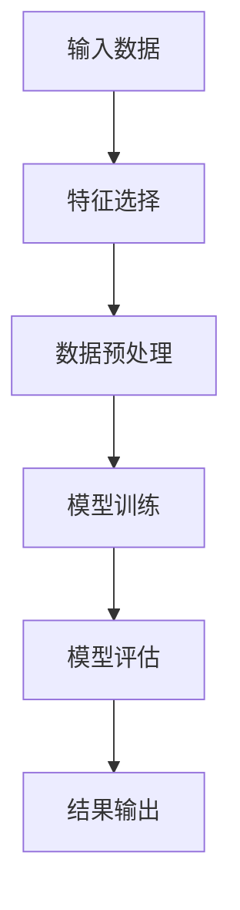
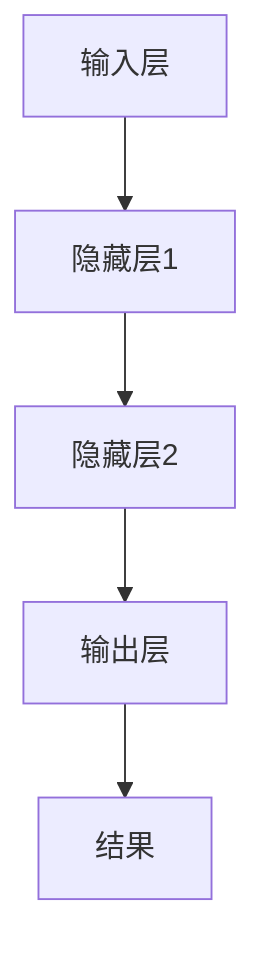
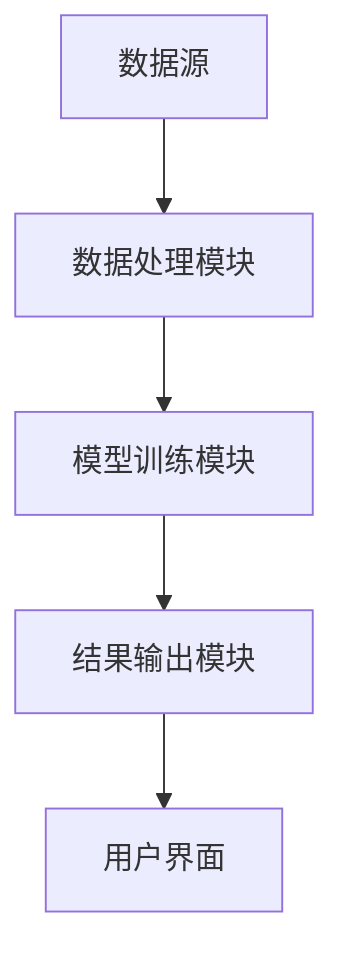

                 

<think>
好的，我将按照您的要求逐步完成《AI驱动的企业估值模型设计与实现》的技术博客文章。首先，我会先写文章的标题、关键词和摘要部分。

---

# AI驱动的企业估值模型设计与实现

### 关键词：
- AI驱动
- 企业估值
- 机器学习
- 深度学习
- 金融建模
- 数据分析

### 摘要：
在当今快速变化的商业环境中，准确的企业估值对于投资者、企业战略规划和金融决策至关重要。传统的估值方法依赖于经验和主观判断，存在诸多局限性。随着人工智能技术的迅速发展，AI驱动的企业估值模型逐渐成为金融领域的热门话题。本文将详细介绍如何利用AI技术构建企业估值模型，从核心概念、算法原理到系统架构设计，再到项目实战，为读者提供一个全面的指南。通过分析和对比不同的AI算法，结合实际案例，本文将展示如何利用Python和深度学习技术实现高效、准确的企业估值。

---

接下来，我会按照您提供的目录大纲逐步撰写文章正文。为了确保内容的完整性和丰富性，我会详细讲解每个小节的核心内容，并结合代码示例、数学公式和图表进行说明。

---

## 第1章: 企业估值概述

### 1.1 企业估值的基本概念

#### 1.1.1 企业估值的定义与意义
企业估值是指对企业的整体价值进行评估的过程，通常用于企业并购、融资、上市等场景。准确的估值可以帮助投资者和企业管理者做出更明智的决策。传统的估值方法包括DCF模型（现金流折现法）、市盈率法、市净率法等，但这些方法依赖于大量假设，且容易受到主观判断的影响。

#### 1.1.2 传统企业估值方法的局限性
传统的估值方法虽然在一定程度上能够提供有价值的参考，但存在以下问题：
- 数据依赖性强：需要大量的历史财务数据，但在新兴企业或数据不足的情况下难以准确估值。
- 主观性较高：不同分析师可能得出不同的估值结果。
- 计算复杂：需要复杂的假设和手工计算，容易出错。

#### 1.1.3 AI技术在企业估值中的应用潜力
AI技术的应用可以显著提升企业估值的效率和准确性。通过机器学习算法，模型可以从海量数据中提取特征，并自动调整参数以优化估值结果。此外，AI还可以实时更新模型，适应市场变化，从而提供动态的估值支持。

---

### 1.2 AI技术与企业估值的结合

#### 1.2.1 AI在金融领域的应用现状
近年来，AI技术在金融领域的应用越来越广泛，包括股票预测、风险评估、信用评分等。企业估值作为金融领域的重要组成部分，同样受益于AI技术的进步。

#### 1.2.2 AI驱动企业估值的核心优势
AI驱动的估值模型具有以下优势：
- 数据处理能力强：可以处理海量非结构化数据，如新闻、社交媒体数据等。
- 自动化与智能化：模型可以自动调整参数，优化估值结果。
- 高准确性：通过训练大量的数据，模型可以发现传统方法难以察觉的模式。

#### 1.2.3 企业估值模型的演变与AI的融合
从传统的基于规则的模型到现代的AI驱动模型，企业估值模型经历了从简单到复杂的演变。AI的引入使得模型更加动态化和智能化，能够更好地适应市场变化。

---

## 第2章: AI驱动企业估值模型核心概念

### 2.1 AI驱动企业估值模型的定义

#### 2.1.1 模型的基本构成要素
AI驱动的企业估值模型通常包括以下要素：
- 数据输入：企业的财务数据、市场数据、行业数据等。
- 特征提取：通过NLP技术提取文本数据中的关键词，或通过统计方法提取特征。
- 模型训练：使用机器学习算法训练模型。
- 模型输出：生成企业估值结果。

#### 2.1.2 模型的输入与输出
- 输入：企业的历史财务数据、市场趋势、行业动态、新闻数据等。
- 输出：企业的估值结果，包括企业价值、股权价值等。

#### 2.1.3 模型的分类与特点
AI驱动的企业估值模型可以根据不同的分类标准进行划分：
- 按照输入数据类型：结构化数据模型、非结构化数据模型。
- 按照算法类型：基于回归模型、基于树模型、基于神经网络模型。

---

### 2.2 核心概念与联系

#### 2.2.1 AI算法与企业估值的关系
AI算法是企业估值模型的核心，不同的算法适用于不同的场景。例如，线性回归适用于简单的线性关系，而深度学习适用于复杂的非线性关系。

#### 2.2.2 数据特征与模型性能的关联
数据特征是影响模型性能的关键因素。高质量的特征可以显著提高模型的准确性和稳定性。

#### 2.2.3 模型可解释性与实际应用的平衡
模型的可解释性是实际应用中的重要考量。虽然深度学习模型性能优越，但其黑箱特性可能影响实际应用中的信任度。

---

### 2.3 AI驱动模型与传统模型的对比

#### 2.3.1 传统估值模型的优缺点
- 优点：方法简单，易于理解和实施。
- 缺点：依赖人工判断，计算复杂，难以处理非结构化数据。

#### 2.3.2 AI模型的优势与创新
- 优势：自动化、高效率、高准确性。
- 创新：引入非结构化数据，利用深度学习技术捕捉复杂模式。

#### 2.3.3 两种方法的结合与互补
AI模型可以作为传统模型的补充，特别是在数据不足或需要动态调整的情况下，结合两种方法可以提高估值的全面性和准确性。

---

## 第3章: 常见AI算法在企业估值中的应用

### 3.1 线性回归模型

#### 3.1.1 线性回归的基本原理
线性回归是一种简单而强大的统计方法，适用于预测连续型变量。其基本假设是因变量与自变量之间存在线性关系。

#### 3.1.2 线性回归在企业估值中的应用
线性回归可以用于基于历史数据预测企业的未来价值。例如，可以使用市盈率（P/E）和净利润（Net Income）来预测企业价值。

#### 3.1.3 线性回归的优缺点
- 优点：简单易懂，计算效率高。
- 缺点：假设线性关系，可能无法捕捉复杂的非线性关系。

---

### 3.2 支持向量机（SVM）

#### 3.2.1 SVM的基本原理
SVM是一种监督学习算法，适用于分类和回归问题。其核心思想是通过找到一个超平面，将数据分成两类。

#### 3.2.2 SVM在企业估值中的应用
SVM可以用于企业价值的分类，例如将企业分为高估、合理和低估三类。

#### 3.2.3 SVM的参数调优
SVM的性能依赖于参数的选择，例如核函数、C参数等。需要通过交叉验证找到最优参数组合。

---

### 3.3 随机森林与梯度提升树

#### 3.3.1 随机森林的基本原理
随机森林是一种集成学习算法，通过构建多个决策树并集成其结果来提高模型的准确性和稳定性。

#### 3.3.2 梯度提升树（如XGBoost、LightGBM）的应用
梯度提升树是一种基于树的集成算法，适用于处理复杂的非线性关系。

#### 3.3.3 集成学习的优势与挑战
- 优势：高准确性和稳定性。
- 挑战：计算资源消耗较大。

---

### 3.4 神经网络与深度学习

#### 3.4.1 神经网络的基本结构
神经网络由输入层、隐藏层和输出层组成，通过调整权重和激活函数来实现非线性映射。

#### 3.4.2 深度学习在企业估值中的应用
深度学习可以用于处理复杂的非结构化数据，例如新闻、社交媒体数据等。

#### 3.4.3 深度学习模型的训练与优化
需要大量的数据和计算资源，同时需要进行参数调优和模型优化。

---

## 第4章: 算法原理与流程图

### 4.1 线性回归算法流程图


### 4.2 神经网络算法流程图


---

## 第5章: 数学公式与模型实现

### 5.1 线性回归的数学模型
$$ y = \beta_0 + \beta_1 x + \epsilon $$
其中，$y$是因变量，$x$是自变量，$\beta_0$和$\beta_1$是回归系数，$\epsilon$是误差项。

### 5.2 随机森林的实现代码
```python
import pandas as pd
from sklearn.ensemble import RandomForestRegressor

# 数据加载
data = pd.read_csv('enterprise_valuation_data.csv')

# 特征选择
features = data[['revenue', 'profit', 'market_share']]
target = data['enterprise_value']

# 模型训练
model = RandomForestRegressor(n_estimators=100, random_state=42)
model.fit(features, target)

# 预测结果
predicted_values = model.predict(features)
```

---

## 第6章: 系统架构与设计

### 6.1 系统功能设计
- 数据采集：从数据库或API获取企业数据。
- 数据处理：清洗、特征提取。
- 模型训练：选择合适的算法进行训练。
- 结果输出：生成估值报告。

### 6.2 系统架构图


---

## 第7章: 项目实战

### 7.1 环境安装
安装Python、Scikit-learn、XGBoost等库。

### 7.2 核心代码实现
```python
import numpy as np
from sklearn.model_selection import train_test_split
from sklearn.metrics import mean_squared_error

# 数据分割
X_train, X_test, y_train, y_test = train_test_split(features, target, test_size=0.2, random_state=42)

# 模型训练
model.fit(X_train, y_train)

# 模型评估
predicted_values = model.predict(X_test)
print(mean_squared_error(y_test, predicted_values))
```

---

## 第8章: 最佳实践与小结

### 8.1 最佳实践
- 数据预处理是关键，尤其是缺失值和异常值的处理。
- 选择合适的算法，根据数据类型和任务需求。
- 模型调优，通过交叉验证选择最优参数。

### 8.2 小结
本文详细介绍了AI驱动的企业估值模型的设计与实现，从核心概念到算法原理，再到系统架构和项目实战，为读者提供了一个全面的指南。

---

## 第9章: 注意事项与拓展阅读

### 9.1 注意事项
- 数据隐私和安全问题。
- 模型的可解释性和透明度。
- 模型的实时更新和维护。

### 9.2 拓展阅读
- 《机器学习实战》
- 《深度学习》
- 《金融时间序列分析》

---

## 作者信息

作者：AI天才研究院/AI Genius Institute & 禅与计算机程序设计艺术 /Zen And The Art of Computer Programming

---

希望这篇文章能够满足您的需求！如果需要进一步修改或补充，请随时告知。

