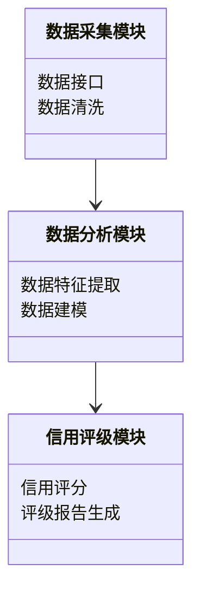
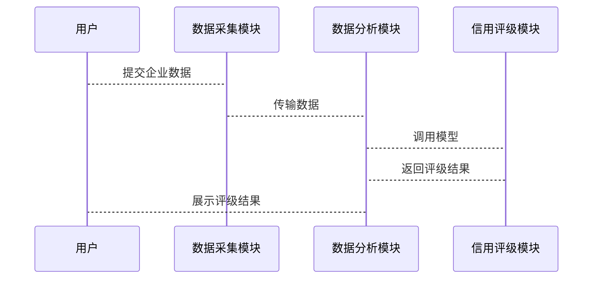

                 


# AI驱动的企业信用评级

## 关键词：企业信用评级，人工智能，机器学习，自然语言处理，数据挖掘，信用评分模型，AI驱动

## 摘要：  
随着人工智能技术的快速发展，企业信用评级的传统方法正面临前所未有的挑战和变革。本文将详细探讨AI技术如何驱动企业信用评级的创新，从背景、核心概念到算法原理、系统架构，再到项目实战，全面解析AI在信用评级中的应用。通过深入分析和具体案例，本文旨在为企业信用评级提供一种高效、准确的解决方案，为金融机构和企业决策者提供有价值的参考。

---

# 第一部分: AI驱动的企业信用评级概述

## 第1章: 企业信用评级的背景与挑战

### 1.1 企业信用评级的基本概念  
企业信用评级是通过对企业的财务状况、经营能力、偿债能力等多维度信息进行综合评估，确定其信用等级的过程。信用评级结果通常用于金融机构的贷款审批、投资决策等场景。  

#### 1.1.1 信用评级的定义与作用  
信用评级是衡量企业信用风险的重要指标，其作用包括：  
1. **降低交易风险**：帮助金融机构识别高风险企业，避免资金损失。  
2. **提高融资效率**：信用评级高的企业更容易获得贷款，且利率更低。  
3. **优化资源配置**：通过信用评级，资金可以流向更高效、更可靠的企业。  

#### 1.1.2 企业信用评级的分类  
企业信用评级通常分为内部评级和外部评级两种类型：  
- **内部评级**：由企业内部财务部门根据自身数据进行评估。  
- **外部评级**：由专业的评级机构（如穆迪、标普）基于公开信息进行评估。  

#### 1.1.3 传统信用评级的局限性  
传统信用评级方法主要依赖财务数据，存在以下问题：  
1. **数据局限性**：仅依赖财务数据，忽略了非结构化数据（如文本信息）的价值。  
2. **人工干预过多**：评级过程耗时长，且容易受到主观因素影响。  
3. **模型单一性**：传统模型难以捕捉复杂市场环境下的动态变化。  

### 1.2 AI技术在信用评级中的应用前景  
人工智能技术的快速发展为信用评级带来了新的可能性。  

#### 1.2.1 AI技术的基本概念  
人工智能（AI）是指模拟人类智能的计算机系统，包括学习、推理、自我改进等能力。  

#### 1.2.2 AI在信用评级中的优势  
- **高效性**：AI能够快速处理大量数据，显著提高评级效率。  
- **准确性**：通过机器学习算法，AI能够发现传统方法难以察觉的规律。  
- **适应性**：AI模型能够动态调整，适应市场环境的变化。  

#### 1.2.3 企业信用评级与AI技术的结合  
AI技术可以整合企业内外部数据，构建更加全面的信用评估模型。  

### 1.3 本章小结  
本章介绍了企业信用评级的基本概念、分类及其传统方法的局限性，同时探讨了AI技术在信用评级中的应用前景。

---

## 第2章: 企业信用评级的核心要素  

### 2.1 企业信用评级的关键指标  
企业信用评级的关键指标包括：  

#### 2.1.1 财务指标  
- 资产负债率  
- 利润率  
- 现金流  

#### 2.1.2 经营指标  
- 市场份额  
- 管理团队稳定性  

#### 2.1.3 偿债能力指标  
- 流动比率  
- 速动比率  

### 2.2 企业信用评级的流程  
企业信用评级的典型流程包括：  

#### 2.2.1 数据收集  
- 内部数据：财务报表、经营数据  
- 外部数据：行业趋势、市场信息  

#### 2.2.2 数据分析  
- 数据清洗  
- 数据特征提取  

#### 2.2.3 评级结果输出  
- 信用等级（如AAA、BBB等）  
- 评级报告  

### 2.3 企业信用评级的模型  
企业信用评级模型包括：  

#### 2.3.1 传统信用评级模型  
- Z分数模型  
- Altman Z值模型  

#### 2.3.2 基于机器学习的信用评级模型  
- 逻辑回归模型  
- 支持向量机模型  

#### 2.3.3 混合型信用评级模型  
结合传统模型和机器学习模型的优势。  

### 2.4 本章小结  
本章详细介绍了企业信用评级的关键指标、流程和模型，为后续章节的分析奠定了基础。

---

## 第3章: AI驱动的信用评级核心概念  

### 3.1 机器学习在信用评级中的应用  

#### 3.1.1 监督学习  
- 算法：随机森林、支持向量机  
- 应用：基于标签数据的信用评分  

#### 3.1.2 非监督学习  
- 算法：聚类分析  
- 应用：客户群体划分  

#### 3.1.3 强化学习  
- 算法：Q-learning  
- 应用：动态信用评级调整  

### 3.2 自然语言处理在信用评级中的应用  

#### 3.2.1 文本挖掘  
- 技术：分词、关键词提取  
- 应用：分析企业新闻、财报中的关键词  

#### 3.2.2 情感分析  
- 技术：基于深度学习的情感分析模型  
- 应用：评估企业声誉  

#### 3.2.3 实体识别  
- 技术：NER（Named Entity Recognition）  
- 应用：提取企业名称、地址等信息  

### 3.3 数据挖掘在信用评级中的应用  

#### 3.3.1 数据清洗  
- 技术：去除重复数据、处理缺失值  

#### 3.3.2 数据特征提取  
- 技术：主成分分析（PCA）  
- 应用：降低数据维度  

#### 3.3.3 数据建模  
- 技术：决策树、神经网络  
- 应用：预测企业信用风险  

### 3.4 本章小结  
本章详细探讨了AI技术在信用评级中的核心应用，包括机器学习、自然语言处理和数据挖掘。

---

## 第4章: 常见信用评级算法原理  

### 4.1 逻辑回归算法  

#### 4.1.1 算法原理  
逻辑回归是一种监督学习算法，用于分类问题。其核心思想是通过sigmoid函数将线性回归的结果映射到概率空间。  

#### 4.1.2 算法流程  
1. 数据预处理  
2. 模型训练  
3. 模型评估  

#### 4.1.3 算法优缺点  
- 优点：简单易懂，适合二分类问题  
- 缺点：不适合多分类问题  

### 4.2 支持向量机算法  

#### 4.2.1 算法原理  
支持向量机（SVM）是一种监督学习算法，适用于分类和回归问题。其核心思想是通过找到一个超平面，将数据分为两类。  

#### 4.2.2 算法流程  
1. 数据预处理  
2. 模型训练  
3. 模型评估  

#### 4.2.3 算法优缺点  
- 优点：适合高维数据，泛化能力强  
- 缺点：计算复杂度高  

### 4.3 随机森林算法  

#### 4.3.1 算法原理  
随机森林是一种基于树的集成学习算法，通过构建多个决策树并取其平均，提高模型的准确性和鲁棒性。  

#### 4.3.2 算法流程  
1. 数据预处理  
2. 模型训练  
3. 模型评估  

#### 4.3.3 算法优缺点  
- 优点：抗过拟合能力强，适合高维数据  
- 缺点：计算资源消耗较大  

### 4.4 本章小结  
本章详细介绍了三种常见的信用评级算法：逻辑回归、支持向量机和随机森林，分析了它们的优缺点及应用场景。

---

## 第5章: 信用评级的数学模型与公式  

### 5.1 信用评分模型  

#### 5.1.1 FICO信用评分模型  
FICO模型是一种经典的信用评分模型，其公式如下：  
$$ \text{FICO分数} = a \cdot x_1 + b \cdot x_2 + c \cdot x_3 + \dots + z \cdot x_n $$  
其中，$x_i$ 表示各个特征，$a, b, c, \dots, z$ 表示对应的权重系数。  

#### 5.1.2 企业信用评分模型  
企业信用评分模型通常基于财务指标和经营指标，公式如下：  
$$ \text{信用评分} = \sum_{i=1}^{n} w_i \cdot x_i $$  
其中，$w_i$ 表示各个指标的权重，$x_i$ 表示各个指标的值。  

### 5.2 机器学习模型的数学公式  

#### 5.2.1 逻辑回归模型  
逻辑回归的损失函数为：  
$$ \text{损失函数} = -\sum_{i=1}^{m} y_i \cdot \ln(p_i) + (1 - y_i) \cdot \ln(1 - p_i) $$  
其中，$p_i$ 是预测概率，$y_i$ 是真实标签。  

#### 5.2.2 支持向量机模型  
支持向量机的目标是最小化以下目标函数：  
$$ \text{目标函数} = \frac{1}{2} \cdot \|w\|^2 + C \cdot \sum_{i=1}^{m} \xi_i $$  
其中，$w$ 是权重向量，$\xi_i$ 是松弛变量，$C$ 是惩罚系数。  

### 5.3 本章小结  
本章通过数学公式详细介绍了信用评分模型和机器学习模型的原理，为后续的算法实现奠定了理论基础。

---

## 第6章: 企业信用评级的系统架构设计  

### 6.1 问题场景介绍  
企业信用评级系统需要处理大量内外部数据，包括财务数据、文本数据、市场数据等。  

### 6.2 系统功能设计  

#### 6.2.1 领域模型（mermaid 类图）  



#### 6.2.2 系统架构设计（mermaid 架构图）  


### 6.3 系统接口设计  

#### 6.3.1 数据接口  
- 数据输入接口：接收企业数据  
- 数据输出接口：输出信用评级结果  

#### 6.3.2 模型接口  
- 模型训练接口：训练信用评级模型  
- 模型预测接口：预测企业信用评分  

### 6.4 系统交互设计（mermaid 序列图）  



### 6.5 本章小结  
本章详细设计了企业信用评级系统的架构，包括功能模块、接口设计和系统交互流程。

---

## 第7章: 项目实战  

### 7.1 环境安装  

#### 7.1.1 安装Python  
```bash
pip install python
```

#### 7.1.2 安装机器学习库  
```bash
pip install numpy pandas scikit-learn
```

### 7.2 系统核心实现  

#### 7.2.1 数据采集与处理  
```python
import pandas as pd
import numpy as np

# 数据采集
data = pd.read_csv('enterprise_data.csv')

# 数据清洗
data.dropna(inplace=True)
```

#### 7.2.2 模型训练  
```python
from sklearn.model_selection import train_test_split
from sklearn.linear_model import LogisticRegression

# 数据分割
X_train, X_test, y_train, y_test = train_test_split(data.drop('rating', axis=1), data['rating'], test_size=0.2)

# 模型训练
model = LogisticRegression()
model.fit(X_train, y_train)
```

#### 7.2.3 信用评分  
```python
# 模型预测
y_pred = model.predict(X_test)

# 评分报告
from sklearn.metrics import classification_report

print(classification_report(y_test, y_pred))
```

### 7.3 实际案例分析  
以某企业为例，分析其信用评级过程，并展示模型的预测结果。

### 7.4 本章小结  
本章通过具体代码实现，展示了AI驱动的企业信用评级系统的实际应用。

---

## 第8章: 总结与展望  

### 8.1 本章总结  
本文详细探讨了AI驱动的企业信用评级的背景、核心概念、算法原理、系统架构和项目实战，展示了AI技术在信用评级中的巨大潜力。  

### 8.2 未来展望  
未来，随着AI技术的进一步发展，企业信用评级将更加智能化和个性化，可能的方向包括：  
1. **多模态数据融合**：整合文本、图像等多种数据源。  
2. **实时评级**：基于流数据的实时处理技术。  
3. **可解释性增强**：提高模型的可解释性，便于用户理解。  

### 8.3 最佳实践 Tips  
- 数据预处理是关键，确保数据质量和完整性。  
- 选择合适的算法，结合业务需求进行模型调优。  
- 注重模型的可解释性，避免“黑箱”模型。  

### 8.4 小结  
本章总结了全文内容，并展望了未来的发展方向。

---

## 附录  

### 附录A: 代码实现细节  
详细代码实现，包括数据处理、模型训练和结果展示的完整代码。  

### 附录B: 参考文献  
列出本文参考的相关文献和资料。

---

# 作者：AI天才研究院/AI Genius Institute & 禅与计算机程序设计艺术 /Zen And The Art of Computer Programming

