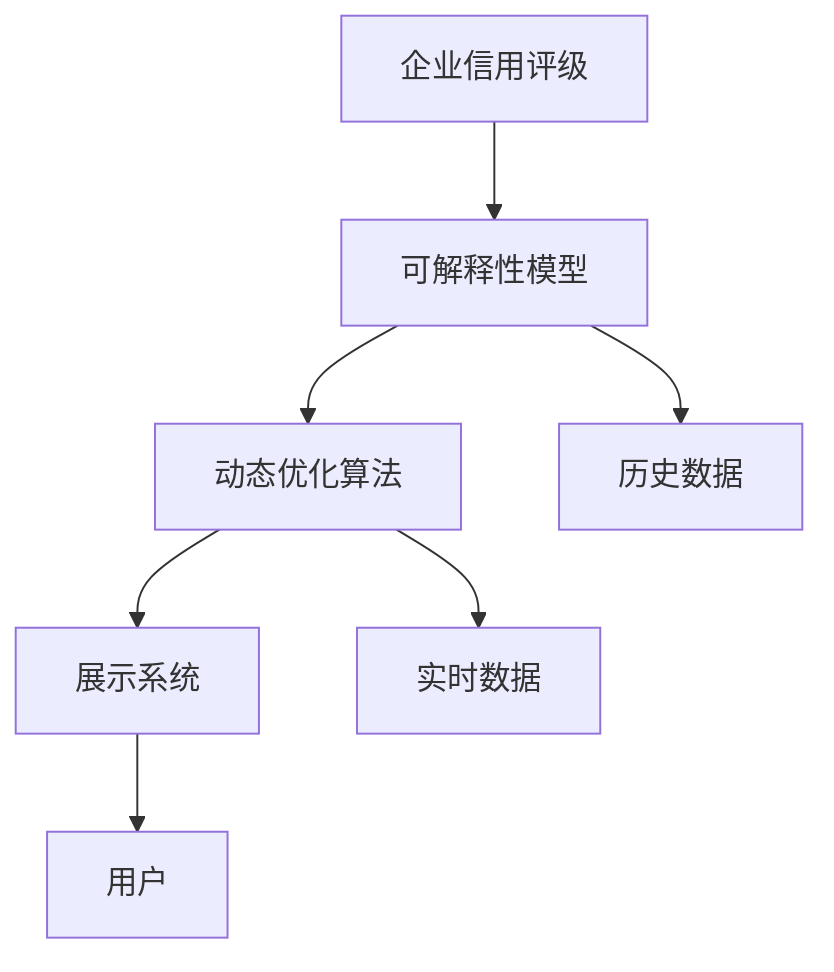

                 

# 《AI驱动的企业信用评级模型可解释性动态优化与展示系统》

---

## 关键词：
AI技术、企业信用评级、可解释性模型、动态优化算法、展示系统设计

---

## 摘要：
本文深入探讨了AI技术在企业信用评级中的应用，重点分析了可解释性模型、动态优化算法以及展示系统设计的核心原理和实现方法。文章从背景介绍、核心概念、算法原理、系统架构、项目实战到最佳实践，全面阐述了构建高效、可解释、动态优化的企业信用评级模型的全过程。通过具体案例分析和代码实现，展示了如何利用AI技术提升信用评级的效率与准确性，同时确保模型的可解释性和系统的动态优化能力。

---

# 第一部分：AI驱动的企业信用评级模型概述

---

## 第1章：企业信用评级模型的背景与挑战

### 1.1 企业信用评级的定义与意义

#### 1.1.1 企业信用评级的基本概念
企业信用评级是对企业财务状况、经营能力和偿债能力的综合评估，旨在量化企业的信用风险。信用评级结果通常用于银行贷款审批、投资决策等领域。

#### 1.1.2 信用评级对企业的重要性
- **融资支持**：帮助企业获得更低利率的贷款。
- **风险管理**：帮助金融机构降低信用风险。
- **市场信任**：提升企业在市场中的信誉度。

#### 1.1.3 信用评级对金融市场的意义
- **定价基准**：信用评级影响债券、贷款的市场定价。
- **市场稳定**：通过透明的评级体系维护金融市场秩序。

---

### 1.2 AI技术在信用评级中的应用背景

#### 1.2.1 传统信用评级的局限性
- **主观性**：依赖人工判断，存在主观偏差。
- **效率低**：人工评级耗时长，难以应对海量数据。
- **模型单一**：传统模型缺乏灵活性，难以适应复杂多变的市场环境。

#### 1.2.2 AI技术如何提升信用评级的效率与准确性
- **数据处理能力**：AI能够快速处理大量非结构化数据，如文本、图像。
- **模型优化**：AI算法（如机器学习、深度学习）能够发现传统模型难以捕捉的复杂模式。
- **实时更新**：AI模型可以动态优化，实时反映市场变化。

#### 1.2.3 企业信用评级的数字化转型趋势
随着大数据和AI技术的发展，企业信用评级正从传统的人工模式向数字化、智能化方向转型。

---

### 1.3 可解释性与动态优化的重要性

#### 1.3.1 可解释性在信用评级中的必要性
- **用户信任**：模型决策需要透明，才能让用户信任。
- **合规要求**：金融行业通常要求模型决策可追溯、可解释。
- **风险控制**：可解释性有助于识别模型的潜在风险。

#### 1.3.2 动态优化对企业信用评级的意义
- **实时更新**：企业经营状况动态变化，模型需要实时优化。
- **适应市场**：动态优化使模型能够适应市场环境的变化。
- **提升准确性**：通过不断优化，模型预测更加精准。

#### 1.3.3 展示系统在信用评级中的作用
- **可视化**：通过图表展示模型输出，便于用户理解。
- **交互性**：用户可以通过展示系统与模型互动，获取实时反馈。
- **决策支持**：展示系统为用户提供决策支持，帮助其做出明智选择。

---

### 1.4 本章小结

#### 1.4.1 企业信用评级的核心问题
企业信用评级的核心问题是如何准确、高效地评估企业的信用风险。

#### 1.4.2 AI技术在信用评级中的应用前景
AI技术为信用评级带来了更高的效率和准确性，同时也带来了新的挑战，如可解释性和动态优化。

#### 1.4.3 可解释性与动态优化的双重目标
在AI驱动的信用评级模型中，可解释性和动态优化是两个关键目标，它们共同确保模型的实用性和可靠性。

---

## 第2章：企业信用评级模型的核心概念与联系

### 2.1 可解释性模型的定义与特点

#### 2.1.1 可解释性模型的定义
可解释性模型是指模型的决策过程可以被人类理解和解释的模型。与黑箱模型不同，可解释性模型能够揭示决策背后的原因。

#### 2.1.2 可解释性模型的核心属性
- **透明性**：模型的决策过程清晰可见。
- **可解释性**：模型的决策逻辑可以被解释。
- **可追溯性**：可以追溯决策的来源和依据。

#### 2.1.3 可解释性与模型复杂性的关系
模型复杂性越高，通常可解释性越低。因此，在设计模型时需要在复杂性和可解释性之间找到平衡。

---

### 2.2 动态优化算法的原理与实现

#### 2.2.1 动态优化的基本概念
动态优化是指在模型运行过程中，根据实时数据和环境变化，不断优化模型参数和结构的过程。

#### 2.2.2 常见动态优化算法的对比
| 算法名称 | 描述 | 优点 | 缺点 |
|----------|------|------|------|
| 随机梯度下降 | 基于随机样本更新参数 | 计算效率高 | 收敛速度慢 |
| Adam优化器 | 结合动量和自适应学习率 | 收敛速度快 | 参数调整复杂 |

#### 2.2.3 动态优化在信用评级中的应用
- **实时更新**：根据最新的财务数据动态调整模型参数。
- **适应市场**：动态优化使模型能够适应经济环境的变化。

---

### 2.3 展示系统的设计与功能

#### 2.3.1 展示系统的核心功能
- **数据可视化**：通过图表展示企业的信用评分、风险等级等信息。
- **模型解释**：展示模型的决策逻辑和依据。
- **交互功能**：用户可以通过输入新的数据，实时查看模型的预测结果。

#### 2.3.2 可视化展示的关键技术
- **图表库**：如Matplotlib、D3.js等。
- **数据可视化框架**：如Tableau、Power BI等。

#### 2.3.3 展示系统的用户交互设计
- **用户界面**：设计直观的用户界面，方便用户操作。
- **反馈机制**：系统需要提供实时反馈，帮助用户理解模型的决策过程。

---

### 2.4 核心概念之间的关系

#### 2.4.1 可解释性与动态优化的关系
- **相互依赖**：可解释性为动态优化提供透明的决策依据，动态优化为可解释性提供实时更新的数据支持。
- **协同作用**：两者共同确保模型的准确性和可靠性。

#### 2.4.2 动态优化与展示系统的协同作用
- **数据流**：动态优化算法处理数据后，展示系统将结果可视化。
- **用户反馈**：用户通过展示系统与模型互动，影响动态优化的过程。

#### 2.4.3 核心概念的系统架构图

---

## 本章小结

通过本章的分析，我们了解了企业信用评级模型的核心概念，包括可解释性模型、动态优化算法和展示系统的设计。这些概念之间的相互作用，确保了模型的高效性、准确性和可解释性。

---

接下来，我们将深入探讨AI驱动的企业信用评级模型的算法原理和系统架构设计。

