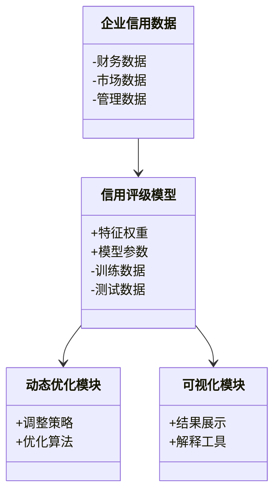

                 


# AI驱动的企业信用评级模型可解释性动态优化系统

> 关键词：AI驱动、企业信用评级、可解释性、动态优化、系统架构、算法原理、项目实战

> 摘要：本文详细探讨了基于AI的企业信用评级模型的可解释性动态优化系统。通过分析传统信用评级方法的局限性，介绍了可解释性动态优化系统的核心概念与实现原理，包括算法原理、系统架构设计、项目实战和最佳实践等内容，帮助读者全面理解并掌握该系统的构建与优化方法。

---

## 第1章: 企业信用评级与AI驱动的概述

### 1.1 企业信用评级的背景与意义

#### 1.1.1 问题背景
企业信用评级是评估企业信用状况的重要工具，传统的评级方法依赖于人工分析和经验判断，存在主观性强、效率低、难以量化等问题。随着企业规模的扩大和市场复杂性的增加，传统的评级方法已无法满足现代金融市场的需求。

#### 1.1.2 问题描述
传统信用评级方法的局限性主要体现在以下几个方面：
1. **主观性强**：依赖分析师的个人经验和判断，容易受到主观因素的影响。
2. **效率低下**：人工分析耗时长，难以应对海量数据的处理需求。
3. **难以量化**：缺乏统一的量化标准，难以准确评估企业的信用风险。
4. **动态调整不足**：市场环境变化时，评级结果难以及时更新和优化。

#### 1.1.3 解决方法
AI技术的引入为信用评级带来了新的可能性。通过机器学习、深度学习等技术，可以实现对企业信用风险的自动化、智能化评估。同时，结合动态优化算法，可以实时调整模型参数，提升评级结果的准确性和可解释性。

#### 1.1.4 核心目标
本文的核心目标是构建一个基于AI的可解释性动态优化系统，能够实时更新企业信用评级模型，提高评级结果的准确性和透明度。

---

### 1.2 AI驱动信用评级的核心概念

#### 1.2.1 可解释性模型的定义
可解释性模型是指模型的输出结果能够被人类理解其背后的逻辑和原因。在信用评级中，可解释性意味着评级结果可以追溯到具体的特征和因素，帮助用户理解评级结果的依据。

#### 1.2.2 动态优化系统的特征
动态优化系统是指系统能够根据实时数据和市场变化，自动调整模型参数和特征权重，以保持评级结果的准确性。动态优化的核心在于实时更新和自适应调整。

#### 1.2.3 企业信用评级的多维度分析
企业信用评级需要考虑多个维度，包括财务状况、市场表现、管理能力、行业风险等。通过AI技术，可以整合这些多维度数据，构建综合的评级模型。

---

## 第2章: 可解释性动态优化系统的原理与算法

### 2.1 可解释性模型的原理与实现

#### 2.1.1 可解释性的实现方式
1. **特征重要性分析**：通过特征重要性排序，确定各个特征对评级结果的影响程度。
2. **模型解释工具**：使用SHAP值、LIME等解释工具，对模型的输出结果进行解释。
3. **规则集生成**：将复杂的模型转化为简单的规则集，便于理解和解释。

#### 2.1.2 解释性与预测性能的平衡
在追求可解释性的同时，需要保证模型的预测性能。这需要在模型设计和优化过程中权衡两者的 trade-off。

#### 2.1.3 可解释性对动态优化的影响
可解释性是动态优化的基础。只有理解模型的决策逻辑，才能有效调整模型参数和优化模型性能。

---

### 2.2 动态优化算法的实现

#### 2.2.1 动态优化的基本概念
动态优化是指根据实时数据和环境变化，动态调整模型参数和特征权重，以保持模型的准确性和适应性。

#### 2.2.2 常见动态优化算法的对比
1. **在线学习算法**：实时更新模型参数，适用于数据流场景。
2. **强化学习算法**：通过奖励机制优化模型决策。
3. **自适应优化算法**：根据模型表现自动调整优化策略。

#### 2.2.3 基于AI的动态优化实现
结合机器学习和在线学习算法，构建动态优化系统，实时更新模型参数和特征权重。

---

### 2.3 可解释性与动态优化的结合

#### 2.3.1 可解释性对动态优化的影响
可解释性是动态优化的基石。只有理解模型的决策逻辑，才能有效优化模型性能。

#### 2.3.2 动态优化对可解释性的提升
动态优化通过实时调整模型参数和特征权重，可以提高模型的可解释性，帮助用户更好地理解评级结果。

#### 2.3.3 两者的协同优化机制
通过协同优化，可以在保持模型性能的同时，提高模型的可解释性，实现动态调整和优化。

---

## 第3章: 企业信用评级系统的功能设计

### 3.1 系统功能模块划分

#### 3.1.1 数据采集与处理模块
负责采集和处理企业信用数据，包括财务数据、市场数据等。

#### 3.1.2 模型构建与训练模块
基于采集的数据，构建和训练信用评级模型。

#### 3.1.3 动态优化与调整模块
根据实时数据和模型表现，动态调整模型参数和特征权重。

#### 3.1.4 可视化与解释模块
提供模型输出结果的可视化展示和解释，帮助用户理解评级结果。

---

### 3.2 系统架构设计

#### 3.2.1 分层架构设计
系统架构采用分层设计，包括数据层、模型层、优化层和交互层。

#### 3.2.2 模块之间的交互关系
各模块之间通过接口进行交互，确保系统的高效运行。

#### 3.2.3 系统的可扩展性设计
系统设计具有良好的可扩展性，能够适应未来的业务需求和技术发展。

---

## 第4章: 算法原理与数学模型

### 4.1 传统信用评级方法

#### 4.1.1 传统信用评级方法的局限性
传统方法依赖人工分析，难以量化和动态调整。

#### 4.1.2 传统方法的数学模型
传统的信用评级方法通常基于线性回归模型，如：
$$
\text{Rating} = \beta_0 + \beta_1 X_1 + \beta_2 X_2 + \ldots + \beta_n X_n + \epsilon
$$
其中，$X_i$ 表示各个特征，$\beta_i$ 表示特征权重，$\epsilon$ 为误差项。

---

### 4.2 基于机器学习的信用评级模型

#### 4.2.1 机器学习模型的数学模型
以随机森林为例，模型的输出概率为：
$$
P(Y=1|X) = \sum_{i=1}^n \frac{1}{n} \cdot I(\text{树} i \text{的预测结果为1})
$$
其中，$n$ 是树的数量，$I$ 是指示函数。

#### 4.2.2 解释性算法的数学模型
SHAP值的计算公式为：
$$
\text{SHAP}(i, j) = \phi_i - \phi_j
$$
其中，$\phi_i$ 表示特征 $i$ 的贡献值，$\phi_j$ 表示特征 $j$ 的贡献值。

---

## 第5章: 系统分析与架构设计方案

### 5.1 系统功能设计

#### 5.1.1 领域模型类图


#### 5.1.2 系统架构图


---

## 第6章: 项目实战

### 6.1 环境安装

#### 6.1.1 安装依赖
```bash
pip install numpy pandas scikit-learn matplotlib
```

#### 6.1.2 安装可视化工具
```bash
pip install plotly
```

---

### 6.2 系统核心实现

#### 6.2.1 数据处理代码
```python
import pandas as pd

# 加载数据
data = pd.read_csv('企业信用数据.csv')

# 数据预处理
data = data.dropna()
```

#### 6.2.2 模型训练代码
```python
from sklearn.ensemble import RandomForestClassifier
from sklearn.model_selection import train_test_split

# 划分数据集
X_train, X_test, y_train, y_test = train_test_split(data.drop('评级结果', axis=1), data['评级结果'])

# 训练模型
model = RandomForestClassifier()
model.fit(X_train, y_train)
```

#### 6.2.3 动态优化代码
```python
from sklearn.metrics import accuracy_score
from sklearn.model_selection import GridSearchCV

# 定义参数搜索空间
param_grid = {'n_estimators': [100, 200], 'max_depth': [None, 10]}

# 参数优化
grid_search = GridSearchCV(model, param_grid, cv=5)
grid_search.fit(X_train, y_train)

# 获取最优模型
best_model = grid_search.best_estimator_
```

---

### 6.3 实际案例分析

#### 6.3.1 案例背景
某企业财务数据如下：
| 特征     | 数据值 |
|----------|--------|
| 营业收入 | 100万  |
| 净利润   | 20万   |
| 偿债能力 | 0.8     |
| 行业风险 | 0.6     |

#### 6.3.2 模型预测
```python
# 预测结果
predicted = best_model.predict(X_test)
print('准确率:', accuracy_score(y_test, predicted))
```

---

## 第7章: 最佳实践与总结

### 7.1 最佳实践

#### 7.1.1 数据质量管理
确保数据的完整性和准确性，避免噪声数据对模型的影响。

#### 7.1.2 模型解释性优化
选择合适的解释性工具，提高模型输出的可解释性。

#### 7.1.3 动态优化策略
根据业务需求和数据变化，制定合理的动态优化策略。

---

### 7.2 小结

本文详细介绍了AI驱动的企业信用评级模型可解释性动态优化系统的构建与优化过程。通过结合可解释性模型和动态优化算法，能够有效提升信用评级的准确性和透明度。未来的研究方向包括更高效的动态优化算法和更强大的解释性工具。

---

## 作者：AI天才研究院/AI Genius Institute & 禅与计算机程序设计艺术 /Zen And The Art of Computer Programming

