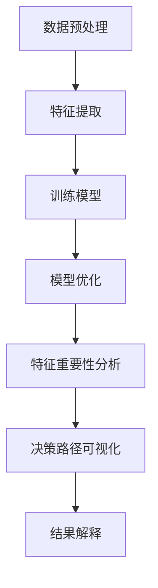
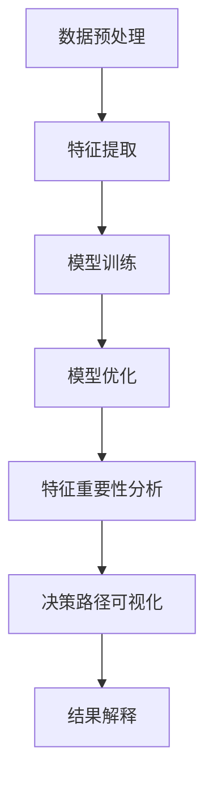
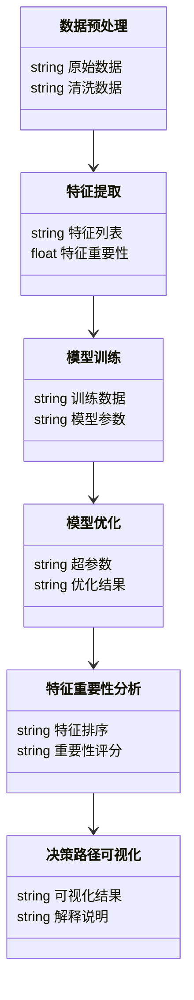
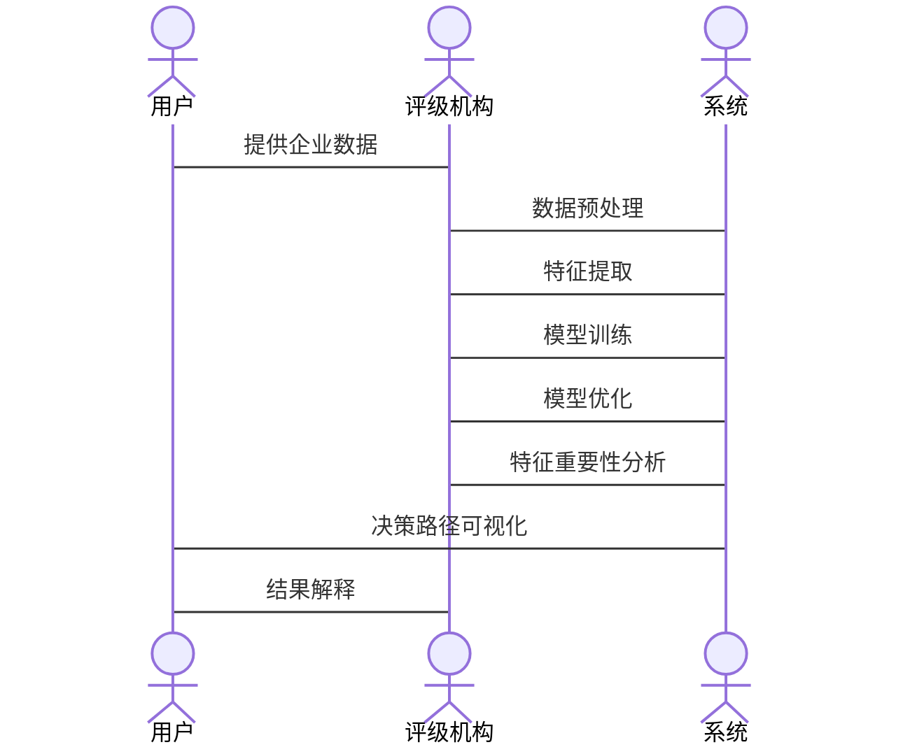

                 


# AI驱动的企业信用评级模型可解释性增强系统

> 关键词：AI，信用评级，可解释性，企业信用，系统架构

> 摘要：本文探讨了如何利用人工智能技术提升企业信用评级模型的可解释性。通过分析传统信用评级模型的局限性，提出了基于AI的可解释性增强系统，并详细阐述了该系统的算法原理、系统架构设计、项目实战及最佳实践。

---

# 第1章 背景介绍

## 1.1 问题背景

### 1.1.1 传统信用评级模型的局限性
传统信用评级模型主要依赖于统计方法和规则-based的评分系统，存在以下问题：
- **可解释性不足**：复杂的统计模型（如逻辑回归）难以解释每个特征对最终评分的具体影响。
- **特征选择受限**：传统方法难以处理非结构化数据（如文本、图像）。
- **动态调整能力差**：面对市场变化和企业行为的动态调整，传统模型难以快速响应。

### 1.1.2 AI技术在信用评级中的应用潜力
人工智能技术（如机器学习、深度学习）在信用评级中的应用可以显著提升模型的性能和可解释性：
- **特征工程自动化**：AI能够自动提取和选择重要特征。
- **非结构化数据处理**：AI可以处理文本、图像等非结构化数据。
- **动态调整能力**：AI模型能够实时更新，适应市场变化。

### 1.1.3 可解释性在信用评级中的重要性
可解释性是企业信用评级模型的关键要求，尤其是在金融领域：
- **合规性**：金融机构需要向监管机构解释评分结果。
- **信任度**：客户需要理解评分逻辑，以信任评分结果。
- **风险控制**：可解释性有助于识别和管理风险。

## 1.2 问题描述

### 1.2.1 信用评级模型的核心目标
信用评级模型的核心目标是根据企业的财务状况、经营历史、市场表现等信息，预测其违约风险，并给出信用评分。

### 1.2.2 当前模型的可解释性挑战
- **黑箱问题**：许多机器学习模型（如随机森林、神经网络）被认为是“黑箱”，难以解释其决策过程。
- **特征重要性**：难以量化每个特征对最终评分的具体贡献。
- **动态变化**：企业经营状况可能随时间变化，模型需要动态更新，但传统模型难以快速调整。

### 1.2.3 企业信用评级的复杂性
企业信用评级涉及多个维度，包括财务数据、市场表现、管理团队、行业风险等，这些因素相互作用，增加了模型的复杂性。

## 1.3 问题解决

### 1.3.1 引入AI技术的必要性
AI技术可以解决传统模型的可解释性问题，同时提升模型的准确性和动态调整能力。

### 1.3.2 可解释性增强的目标
通过AI技术，增强信用评级模型的可解释性，使其能够满足监管要求、客户信任和风险控制需求。

### 1.3.3 解决方案的可行性分析
- **技术可行性**：AI技术已经在金融领域得到广泛应用，具备技术基础。
- **数据可行性**：企业信用评级需要大量结构化和非结构化数据，AI能够有效处理这些数据。
- **业务可行性**：可解释性增强能够提升模型的透明度和信任度，符合业务需求。

## 1.4 边界与外延

### 1.4.1 系统的边界定义
本系统仅关注企业信用评级模型的可解释性增强，不涉及其他业务模块（如贷款发放、风险控制）。

### 1.4.2 相关领域的外延
- **数据预处理**：涉及数据清洗、特征工程等。
- **模型优化**：涉及模型调参、超参数优化等。
- **用户交互**：涉及模型结果的可视化展示。

### 1.4.3 应用场景的限制
- **数据要求**：需要企业提供的结构化和非结构化数据。
- **模型适用性**：适用于中、小企业，大型企业的复杂性可能超出模型处理能力。

## 1.5 核心概念与组成

### 1.5.1 企业信用评级模型的基本组成
- **输入数据**：包括企业财务数据、市场数据、管理团队信息等。
- **模型算法**：如逻辑回归、随机森林、梯度提升树等。
- **输出结果**：信用评分、违约概率等。

### 1.5.2 AI驱动系统的组成部分
- **数据处理模块**：负责数据清洗、特征工程。
- **模型训练模块**：负责模型训练、优化。
- **可解释性增强模块**：负责模型解释、结果可视化。

### 1.5.3 可解释性增强系统的结构
- **特征重要性分析**：量化每个特征对模型输出的贡献。
- **决策路径可视化**：展示模型的决策逻辑。
- **结果解释工具**：提供用户友好的解释界面。

---

# 第2章 核心概念与联系

## 2.1 可解释性与信用评级模型的关系

### 2.1.1 可解释性的定义与特征
可解释性是指模型能够清晰地解释其输出结果的逻辑和依据。特征包括：
- **透明性**：模型的决策过程是否透明。
- **可理解性**：模型的决策逻辑是否易于理解。
- **可追溯性**：模型的决策过程是否可追溯。

### 2.1.2 信用评级模型的可解释性需求
- **监管需求**：金融机构需要向监管机构解释评分结果。
- **客户需求**：企业客户需要理解评分逻辑，以采取相应的措施。
- **内部管理需求**：金融机构需要通过可解释性优化模型，降低风险。

### 2.1.3 AI增强系统的可解释性提升
通过AI技术，可以实现以下可解释性提升：
- **特征重要性排序**：通过特征重要性分析，量化每个特征对模型输出的贡献。
- **决策路径可视化**：通过可视化工具展示模型的决策逻辑。
- **模型解释工具**：提供用户友好的解释工具，帮助用户理解模型输出。

## 2.2 核心概念原理

### 2.2.1 信用评级模型的原理
信用评级模型通过输入企业的相关信息，输出信用评分或违约概率。传统模型（如逻辑回归）基于统计分析，而机器学习模型（如随机森林、梯度提升树）基于特征学习。

### 2.2.2 AI驱动系统的原理
AI驱动系统通过数据预处理、模型训练和可解释性增强，提升信用评级模型的可解释性和准确性。具体步骤包括：
1. 数据预处理：清洗数据，提取特征。
2. 模型训练：选择合适的算法，训练模型。
3. 可解释性增强：通过特征重要性分析、决策路径可视化等方法，提升模型的可解释性。

### 2.2.3 可解释性增强的原理
可解释性增强系统通过以下方式实现：
- **特征重要性分析**：通过特征重要性排序，量化每个特征对模型输出的贡献。
- **决策路径可视化**：通过可视化工具展示模型的决策逻辑。
- **模型解释工具**：提供用户友好的解释工具，帮助用户理解模型输出。

## 2.3 概念属性对比表格

| 概念               | 可解释性 | 信用评级模型 | AI增强系统 |
|--------------------|----------|--------------|------------|
| 输入数据           | 结构化数据 | 结构化数据    | 结构化+非结构化数据 |
| 输出结果           | 信用评分 | 信用评分      | 增强的信用评分 |
| 可解释性           | 低       | 中            | 高          |

## 2.4 ER实体关系图

```mermaid
erDiagram
    actor 顾客 {
        string id
        string name
    }
    actor 企业 {
        string id
        string name
    }
    actor 评级机构 {
        string id
        string name
    }
    entity 信用记录 {
        string id
        date 时间
        float 评分
    }
    entity 评级结果 {
        string id
        date 时间
        float 评分
        actor 企业
    }
    entity 模型 {
        string id
        string 类型
        string 参数
    }
    entity 特征 {
        string id
        string 名称
        float 重要性
    }
    entity 可解释性结果 {
        string id
        float 重要性排序
        string 决策路径
    }
    顾客 --> 评级机构 : 委托评级
    企业 --> 评级机构 : 提供数据
    评级机构 --> 模型 : 训练模型
    模型 --> 信用记录 : 处理数据
    模型 --> 评级结果 : 输出结果
    模型 --> 特征 : 特征提取
    模型 --> 可解释性结果 : 可视化解释
```

---

# 第3章 算法原理讲解

## 3.1 算法选择与原理

### 3.1.1 算法选择
选择梯度提升树（如XGBoost）作为模型算法，原因如下：
- **高准确性**：梯度提升树在信用评级中表现出色。
- **可解释性**：通过特征重要性排序，可以量化每个特征对模型输出的贡献。
- **易于实现**：梯度提升树的实现相对简单，且有成熟的库（如XGBoost）支持。

### 3.1.2 算法原理
梯度提升树是一种集成学习方法，通过训练多个弱分类器（树）来提升模型的性能。其核心思想是通过梯度下降法不断优化损失函数，逐步逼近最优解。

### 3.1.3 梯度提升树的数学模型
损失函数为：
$$
L = -\frac{1}{n}\sum_{i=1}^{n} y_i \cdot \text{log}(p_i) + (1 - y_i) \cdot \text{log}(1 - p_i)
$$

分裂条件为：
$$
\text{分裂增益} = \text{基尼指数} \text{或} \text{信息增益}
$$

## 3.2 算法实现

### 3.2.1 Python代码实现
```python
import xgboost as xgb
from sklearn.metrics import accuracy_score, classification_report
from sklearn.datasets import make_classification

# 生成数据集
X, y = make_classification(n_samples=1000, n_features=20, n_informative=15, n_redundant=5, random_state=42)

# 训练模型
model = xgb.XGBClassifier(n_estimators=100, learning_rate=0.1, max_depth=6, random_state=42)
model.fit(X, y)

# 预测结果
y_pred = model.predict(X)

# 计算准确率
print("Accuracy:", accuracy_score(y, y_pred))
print("Classification Report:", classification_report(y, y_pred))

# 特征重要性分析
feature_importance = model.feature_importances_
print("Feature Importances:", feature_importance)
```

### 3.2.2 算法流程图


## 3.3 算法优化与调优

### 3.3.1 超参数调优
- **n_estimators**：树的数量。
- **learning_rate**：学习率，控制树的生长速度。
- **max_depth**：树的最大深度。

### 3.3.2 模型评估与优化
- **评估指标**：准确率、召回率、F1分数。
- **交叉验证**：使用交叉验证评估模型的泛化能力。

---

# 第4章 系统分析与架构设计方案

## 4.1 系统分析

### 4.1.1 系统应用场景
企业信用评级模型广泛应用于金融行业，包括银行、保险公司、投资机构等。

### 4.1.2 系统功能模块
- **数据预处理模块**：清洗数据，提取特征。
- **模型训练模块**：训练模型，优化参数。
- **可解释性增强模块**：分析特征重要性，可视化决策路径。

## 4.2 系统架构设计

### 4.2.1 系统架构图


### 4.2.2 领域模型


### 4.2.3 系统交互


---

# 第5章 项目实战

## 5.1 环境安装

### 5.1.1 Python环境安装
安装Python和必要的库：
```bash
pip install xgboost scikit-learn mermaid4jupyter
```

### 5.1.2 数据准备
下载企业信用数据集，格式为CSV。

## 5.2 核心代码实现

### 5.2.1 数据预处理
```python
import pandas as pd
from sklearn.preprocessing import StandardScaler

# 读取数据集
data = pd.read_csv('企业信用数据.csv')

# 数据清洗
data.dropna(inplace=True)

# 特征提取
X = data.drop(columns=['信用评分'])
y = data['信用评分']

# 标准化处理
scaler = StandardScaler()
X_scaled = scaler.fit_transform(X)
```

### 5.2.2 模型训练
```python
from xgboost import XGBClassifier
from sklearn.metrics import accuracy_score, classification_report

# 训练模型
model = XGBClassifier(n_estimators=100, learning_rate=0.1, max_depth=6, random_state=42)
model.fit(X_scaled, y)

# 预测结果
y_pred = model.predict(X_scaled)

# 评估模型
print("Accuracy:", accuracy_score(y, y_pred))
print("Classification Report:", classification_report(y, y_pred))
```

### 5.2.3 可解释性增强
```python
# 特征重要性分析
feature_importance = model.feature_importances_
print("Feature Importances:", feature_importance)

# 决策路径可视化
from xgboost import plot_importance
import matplotlib.pyplot as plt

plot_importance(model)
plt.show()
```

## 5.3 实际案例分析

### 5.3.1 案例背景
某中型企业申请贷款，信用评分较低。通过模型分析，发现其财务数据异常。

### 5.3.2 模型分析
- **特征重要性**：财务数据（如资产负债率）是最重要的特征。
- **决策路径**：模型通过财务数据判断企业的偿债能力，进而决定信用评分。

### 5.3.3 结果解读
通过模型分析，发现该企业的财务数据存在问题，导致信用评分较低。进一步调查发现，企业存在关联交易，影响了财务数据的真实性。

---

# 第6章 最佳实践

## 6.1 小结
AI驱动的企业信用评级模型可解释性增强系统通过数据预处理、模型训练和可解释性增强，显著提升了信用评级模型的可解释性和准确性。

## 6.2 注意事项
- **数据质量**：确保数据的准确性和完整性。
- **模型选择**：根据具体场景选择合适的算法。
- **结果解释**：通过可视化工具帮助用户理解模型输出。

## 6.3 拓展阅读
- **相关书籍**：《机器学习实战》、《深入理解机器学习》
- **技术博客**：Towards Data Science、Kaggle

---

# 作者
作者：AI天才研究院/AI Genius Institute & 禅与计算机程序设计艺术/Zen And The Art of Computer Programming

---

本文通过详细分析AI驱动的企业信用评级模型可解释性增强系统的背景、核心概念、算法原理、系统架构设计和项目实战，为读者提供了从理论到实践的全面指导。通过本文，读者可以掌握如何利用AI技术提升信用评级模型的可解释性，从而在实际应用中更好地进行风险管理和信用评估。

