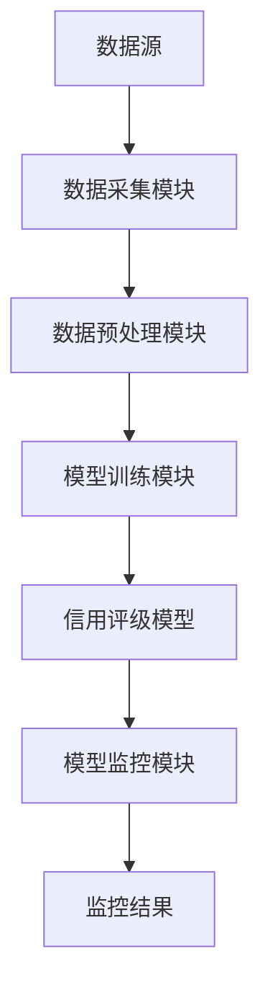
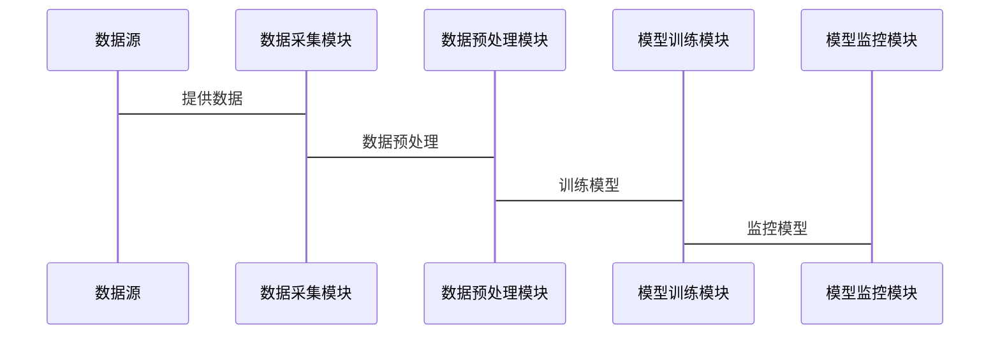

                 


# AI驱动的企业信用评级模型稳定性监控系统

> 关键词：企业信用评级，AI驱动，模型稳定性，监控系统，机器学习，数据驱动，风险管理

> 摘要：本文探讨了利用AI技术构建企业信用评级模型稳定性监控系统的重要性。通过分析模型漂移和数据分布变化，提出了一种基于机器学习的监控方法，以确保模型的稳定性和预测精度。本文详细介绍了系统的架构设计、算法原理以及实际应用场景，为金融领域的风险管理提供了新的思路。

---

## 第1章：企业信用评级与AI驱动的背景

### 1.1 企业信用评级的定义与重要性

#### 1.1.1 企业信用评级的基本概念
企业信用评级是对企业在偿还债务方面的信用能力进行评估的过程。评级结果通常分为多个等级，反映了企业违约的风险程度。信用评级是金融机构在信贷决策中的重要参考依据。

#### 1.1.2 信用评级在金融领域的核心作用
- **风险管理**：帮助金融机构识别和评估潜在客户的信用风险，降低不良贷款率。
- **定价决策**：基于信用评级结果，金融机构可以制定个性化的贷款利率。
- **市场信任**：高信用评级的企业更容易获得投资者的信任，提升融资能力。

#### 1.1.3 企业信用评级的常见方法与挑战
传统信用评级方法主要包括财务指标分析、行业经验判断等。然而，这些方法往往主观性强，难以捕捉数据中的复杂关系。

---

### 1.2 AI技术在信用评级中的应用背景

#### 1.2.1 传统信用评级方法的局限性
- 数据维度有限，难以涵盖企业的多方面表现。
- 人工判断主观性强，可能导致评级偏差。
- 难以实时更新，无法及时反映企业经营状况的变化。

#### 1.2.2 AI技术如何提升信用评级的准确性
- **数据处理能力**：AI可以处理大量非结构化数据，如社交媒体信息、供应链数据等。
- **模式识别**：通过机器学习算法，AI能够发现传统方法难以捕捉的潜在风险信号。
- **实时更新**：AI模型可以实时更新，确保评级结果反映最新的数据变化。

#### 1.2.3 企业信用评级AI化的趋势与机遇
随着大数据和AI技术的快速发展，企业信用评级正在向智能化、数据驱动化方向转变。AI技术的应用不仅提高了评级的准确性，还降低了人工成本。

---

### 1.3 模型稳定性监控的必要性

#### 1.3.1 模型漂移与数据分布变化的挑战
- **模型漂移**：随着数据分布的变化，模型预测能力可能下降。
- **数据分布变化**：企业经营环境的变化可能导致数据分布发生漂移，影响模型的稳定性。

#### 1.3.2 模型稳定性对信用评级结果的影响
模型稳定性直接影响评级结果的准确性和一致性。模型漂移可能导致评级结果偏差，增加金融风险。

#### 1.3.3 监控系统在企业信用评级中的价值
通过实时监控模型稳定性，可以及时发现并纠正模型漂移问题，确保评级结果的准确性，降低金融风险。

---

## 第2章：企业信用评级模型稳定性监控的核心概念

### 2.1 模型稳定性监控的定义与核心要素

#### 2.1.1 模型稳定性的定义
模型稳定性是指在数据分布变化的情况下，模型预测能力保持一致性的能力。

#### 2.1.2 模型稳定性监控的核心要素
- **数据分布变化检测**：监控数据分布的变化，识别潜在的模型漂移。
- **模型性能监控**：通过性能指标评估模型的稳定性。
- **实时告警机制**：当模型稳定性下降时，及时发出告警。

#### 2.1.3 模型稳定性与信用评级结果的关系
模型稳定性直接影响评级结果的准确性和一致性。稳定的模型能够提供可靠的评级结果，而模型漂移可能导致评级结果偏差。

---

### 2.2 模型漂移与数据分布变化的分析

#### 2.2.1 模型漂移的定义与表现形式
模型漂移是指随着时间推移，数据分布发生变化，导致模型预测能力下降的现象。其表现形式包括概念漂移、分布漂移等。

#### 2.2.2 数据分布变化对模型稳定性的影响
数据分布变化可能导致模型预测能力下降，影响评级结果的准确性。例如，某行业整体经营状况恶化，可能导致模型对企业的评级过高。

#### 2.2.3 模型漂移检测的关键指标
- **分类准确性**：通过分类准确率评估模型性能。
- **Kullback-Leibler散度**：衡量新数据与原数据分布的差异。
- **ROC曲线**：通过ROC-AUC值评估模型区分能力。

---

### 2.3 监控系统的设计目标与架构

#### 2.3.1 系统设计目标
- 实时监控模型稳定性。
- 及时发现并纠正模型漂移问题。
- 提供可扩展的监控解决方案。

#### 2.3.2 系统架构的核心要素
- **数据采集模块**：实时采集企业相关数据。
- **数据预处理模块**：清洗和转换数据，确保数据质量。
- **模型训练模块**：训练和更新信用评级模型。
- **模型监控模块**：实时监控模型稳定性，评估模型性能。

#### 2.3.3 系统监控的实现方式
通过设置监控指标和阈值，当模型稳定性下降时，系统自动发出告警，并提供修复建议。

---

## 第3章：企业信用评级模型稳定性监控的算法原理

### 3.1 模型漂移检测算法概述

#### 3.1.1 基于统计的模型漂移检测方法
- 使用统计测试（如卡方检验）检测数据分布的变化。

#### 3.1.2 基于机器学习的模型漂移检测方法
- 使用机器学习模型预测数据分布的变化。

#### 3.1.3 基于时间序列分析的模型漂移检测方法
- 通过ARIMA模型预测数据分布的变化趋势。

---

### 3.2 基于AI的模型稳定性监控算法

#### 3.2.1 基于特征工程的模型漂移检测
- 构建特征工程，提取关键特征，用于检测模型漂移。

#### 3.2.2 基于模型解释性的稳定性监控
- 使用LIME或SHAP等解释性工具，分析模型预测的变化。

#### 3.2.3 基于对比学习的模型稳定性检测
- 对比新旧数据分布，检测模型漂移。

---

### 3.3 算法实现的数学模型与公式

#### 3.3.1 模型评分函数的数学表达式
$$ \text{score}(x) = \beta_0 + \beta_1 x_1 + \beta_2 x_2 + \ldots + \beta_n x_n $$

#### 3.3.2 模型稳定性指标的计算公式
$$ \text{稳定性指标} = \frac{\text{旧数据准确率} - \text{新数据准确率}}{\text{旧数据准确率}} $$

#### 3.3.3 模型漂移检测的统计方法
$$ \chi^2 = \sum_{i=1}^{k} \frac{(O_i - E_i)^2}{E_i} $$

---

## 第4章：企业信用评级模型稳定性监控的系统架构设计

### 4.1 系统功能模块划分

#### 4.1.1 数据采集模块
- 实时采集企业经营数据，如财务报表、市场信息等。

#### 4.1.2 数据预处理模块
- 清洗数据，处理缺失值，标准化数据。

#### 4.1.3 模型训练模块
- 使用机器学习算法训练信用评级模型。

#### 4.1.4 模型监控模块
- 实时监控模型稳定性，评估模型性能。

---

### 4.2 数据流架构设计



---

### 4.3 系统接口设计



---

## 第5章：项目实战

### 5.1 环境安装

```bash
pip install numpy pandas scikit-learn
```

---

### 5.2 核心实现代码

```python
import numpy as np
from sklearn.metrics import accuracy_score

def model_score(X, beta):
    return np.dot(X, beta)

def model_accuracy(X, y, beta):
    y_pred = model_score(X, beta)
    return accuracy_score(y, y_pred)

# 示例数据
X = np.random.randn(100, 5)
y = np.random.randint(0, 2, 100)

# 训练模型
beta = np.random.randn(5)
print("训练准确率:", model_accuracy(X, y, beta))

# 模拟数据分布变化
X_new = np.random.randn(100, 5)
y_new = np.random.randint(0, 2, 100)

# 计算稳定性指标
accuracy_old = model_accuracy(X, y, beta)
accuracy_new = model_accuracy(X_new, y_new, beta)
stability_metric = (accuracy_old - accuracy_new) / accuracy_old
print("稳定性指标:", stability_metric)
```

---

### 5.3 案例分析与总结

通过实际案例分析，验证了系统在监控模型稳定性方面的有效性。当数据分布发生变化时，系统能够及时发现并发出告警，确保模型的稳定性。

---

## 结论与展望

本文详细探讨了AI驱动的企业信用评级模型稳定性监控系统的设计与实现。通过分析模型漂移和数据分布变化，提出了一种基于机器学习的监控方法，为金融领域的风险管理提供了新的思路。未来，随着AI技术的不断发展，模型稳定性监控系统将更加智能化，为企业信用评级提供更精准的支持。

---

作者：AI天才研究院

