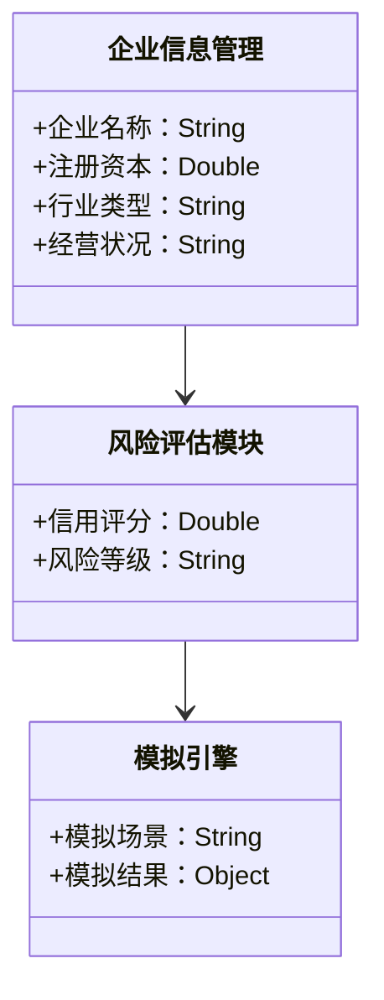
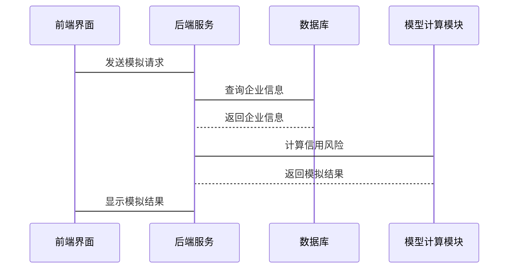

                 


```markdown
# AI驱动的企业信用风险传导模拟系统

## 关键词：AI，信用风险，企业，模拟系统，风险管理

## 摘要：
本文介绍了一种基于AI的企业信用风险传导模拟系统，通过分析信用风险的传导机制，结合AI算法，构建了一个智能化的风险评估与模拟平台。文章详细讲解了系统的核心概念、算法原理、系统架构，并通过实际案例展示了系统的应用场景和实现过程。本文旨在为企业信用风险管理提供一种高效、智能的解决方案，助力企业在复杂多变的经济环境中降低风险，保障稳健发展。

---

# 第1章: 企业信用风险传导的背景与挑战

## 1.1 企业信用风险的基本概念

### 1.1.1 信用风险的定义与特征

信用风险是指企业在借贷、投资等经济活动中，由于债务人或交易对手方无法履行其 contractual obligations，导致债权人或投资者遭受损失的可能性。信用风险具有以下特征：

1. **隐蔽性**：信用风险往往在企业财务状况恶化时才显现。
2. **传染性**：信用风险可能通过供应链或金融市场传导至其他企业和机构。
3. **复杂性**：受宏观经济、行业环境、企业自身经营等多种因素影响。

### 1.1.2 信用风险的传导机制

信用风险的传导机制可以通过以下步骤理解：
1. **内部风险积累**：企业因经营不善或外部冲击导致财务状况恶化。
2. **风险暴露**：企业无法偿还债务，导致债权人或投资者发生损失。
3. **连锁反应**：受损的债权人可能进一步引发其他企业的信用问题，形成系统性风险。

### 1.1.3 传统信用风险评估的局限性

传统信用风险评估方法主要依赖财务报表分析和历史数据统计，存在以下局限性：
- **静态性**：无法实时捕捉市场波动和企业经营的动态变化。
- **片面性**：难以全面考虑企业内外部的复杂因素。
- **滞后性**：评估结果往往基于历史数据，缺乏前瞻性。

## 1.2 AI技术在信用风险评估中的应用前景

### 1.2.1 AI技术的基本概念

人工智能（AI）是指计算机系统执行人类智能任务的能力，包括学习、推理、识别和解决问题等。AI的核心技术包括机器学习（ML）、自然语言处理（NLP）、计算机视觉等。

### 1.2.2 AI在信用风险评估中的优势

AI技术可以显著提升信用风险评估的效率和准确性：
1. **实时监控**：AI可以实时分析企业经营数据和市场信息，及时发现潜在风险。
2. **多维度分析**：AI能够整合企业内外部数据，进行全面的风险评估。
3. **预测能力**：通过机器学习算法，AI可以预测企业的信用违约概率。

### 1.2.3 企业信用风险传导模拟的必要性

为了应对信用风险的复杂性和传染性，企业需要一种能够模拟和预测风险传导过程的工具。AI驱动的模拟系统可以帮助企业：
- **量化风险**：通过模拟计算企业信用风险的潜在损失。
- **制定策略**：根据模拟结果制定风险管理策略，降低系统性风险。

## 1.3 本章小结

本章介绍了信用风险的基本概念、传导机制以及传统评估方法的局限性。同时，阐述了AI技术在信用风险评估中的应用前景，强调了企业信用风险传导模拟的必要性。

---

# 第2章: 信用风险传导的系统模型

## 2.1 信用风险传导的系统结构

### 2.1.1 系统核心要素

信用风险传导系统主要包括以下核心要素：
1. **风险源**：引发信用风险的主体，如企业、金融机构等。
2. **传导路径**：风险从风险源扩散到其他相关方的渠道。
3. **风险接收者**：受风险影响的主体，如债权人、投资者等。

### 2.1.2 系统功能模块

信用风险传导系统通常包括以下几个功能模块：
- 数据采集模块：收集企业经营数据、市场信息等。
- 风险评估模块：评估企业的信用风险。
- 风险传导模块：模拟风险的传导过程。
- 结果分析模块：分析模拟结果并制定应对策略。

### 2.1.3 系统边界与外延

系统边界是指系统与外部环境的接口。信用风险传导系统的外延包括：
- 数据来源：企业财务数据、市场数据等。
- 用户界面：供用户输入参数和查看结果。
- 输出结果：模拟报告、风险预警等。

## 2.2 信用风险传导的关键因素

### 2.2.1 企业基本面因素

企业基本面因素包括：
- 财务状况：如资产负债表、利润表等。
- 经营能力：如市场份额、产品竞争力等。

### 2.2.2 市场波动因素

市场波动因素包括：
- 宏观经济指标：如GDP增长率、通货膨胀率等。
- 金融市场波动：如股票价格波动、债券收益率变化等。

### 2.2.3 宏观经济因素

宏观经济因素包括：
- 政策变化：如货币政策、财政政策等。
- 地缘政治风险：如战争、贸易摩擦等。

## 2.3 信用风险传导的数学模型

### 2.3.1 马尔可夫链模型

马尔可夫链模型适用于描述状态转移过程，常用于模拟信用等级的变化。状态转移概率矩阵如下：

$$
P = \begin{pmatrix}
p_{11} & p_{12} & \cdots & p_{1n} \\
p_{21} & p_{22} & \cdots & p_{2n} \\
\vdots & \vdots & \ddots & \vdots \\
p_{n1} & p_{n2} & \cdots & p_{nn}
\end{pmatrix}
$$

其中，$p_{ij}$ 表示从状态 $i$ 转移到状态 $j$ 的概率。

### 2.3.2 马科维茨投资组合理论

马科维茨投资组合理论旨在通过优化投资组合来最小化风险。其目标函数为：

$$
\min_{w} w^T \Sigma w
$$

其中，$w$ 是投资权重向量，$\Sigma$ 是协方差矩阵。

### 2.3.3 系统动力学模型

系统动力学模型通过微分方程描述系统的动态行为。例如，信用风险的累积过程可以用以下微分方程表示：

$$
\frac{dc}{dt} = \alpha - \beta c
$$

其中，$c$ 是信用风险累积量，$\alpha$ 是风险输入率，$\beta$ 是风险衰减率。

## 2.4 本章小结

本章介绍了信用风险传导系统的结构和关键因素，并通过数学模型展示了如何量化和模拟信用风险的传导过程。

---

# 第3章: 基于AI的信用风险模拟算法

## 3.1 算法原理概述

### 3.1.1 神经网络的基本原理

神经网络是一种模拟人脑神经元结构和功能的数学模型。其基本结构包括输入层、隐藏层和输出层。

### 3.1.2 长短期记忆网络（LSTM）的应用

LSTM是一种特殊的RNN，用于处理时间序列数据。其核心组件包括输入门、遗忘门和输出门。

### 3.1.3 图神经网络（GNN）的原理

GNN通过图结构数据建模，适用于处理企业之间的关联关系。

## 3.2 算法实现流程

### 3.2.1 数据预处理

数据预处理包括数据清洗、特征提取和数据归一化。

### 3.2.2 模型训练

模型训练包括选择模型架构、定义损失函数和优化器，然后进行反向传播和参数更新。

### 3.2.3 模型评估与优化

模型评估包括验证集评估和测试集评估，优化包括调整超参数和模型架构。

## 3.3 算法的数学模型与公式

### 3.3.1 LSTM的数学公式

LSTM的三个门控机制如下：

1. 遗忘门：
$$
f_t = \sigma(W_f x_t + U_f h_{t-1} + b_f)
$$

2. 输入门：
$$
i_t = \sigma(W_i x_t + U_i h_{t-1} + b_i)
$$

3. 输出门：
$$
o_t = \sigma(W_o x_t + U_o h_{t-1} + b_o)
$$

4. 单元状态更新：
$$
c_t = f_t \cdot c_{t-1} + i_t \cdot tanh(W_c x_t + U_c h_{t-1} + b_c)
$$

5. 隐藏状态更新：
$$
h_t = o_t \cdot tanh(c_t)
$$

## 3.4 本章小结

本章详细讲解了基于AI的信用风险模拟算法，包括神经网络、LSTM和GNN的基本原理和实现流程。

---

# 第4章: 系统分析与架构设计

## 4.1 系统功能设计

### 4.1.1 领域模型设计

领域模型设计包括企业信息管理、风险评估和模拟引擎三个模块。

### 4.1.2 领域模型的 Mermaid 类图



### 4.1.3 领域模型的详细分析

- **企业信息管理**：负责管理企业的基本信息，如注册资本、行业类型等。
- **风险评估模块**：基于企业信息和市场数据，评估企业的信用风险。
- **模拟引擎**：根据风险评估结果，模拟信用风险的传导过程。

## 4.2 系统架构设计

### 4.2.1 系统架构的 Mermaid 架构图

```mermaid
container 系统架构 {
    前端界面
    后端服务
    数据库
}

frontend --> backend
backend --> database
```

### 4.2.2 系统架构的详细分析

- **前端界面**：负责用户交互，接收输入参数并显示模拟结果。
- **后端服务**：负责处理业务逻辑，包括数据处理和模型计算。
- **数据库**：负责存储企业信息和模拟结果。

## 4.3 接口设计

### 4.3.1 系统接口的描述

系统接口包括：
- 数据接口：用于数据的导入和导出。
- API接口：用于与其他系统的集成。

### 4.3.2 接口的交互流程



## 4.4 本章小结

本章详细描述了系统架构设计和接口设计，为后续的系统实现奠定了基础。

---

# 第5章: 项目实战

## 5.1 环境配置

### 5.1.1 安装Python环境

```bash
# 安装Python
python --version
```

### 5.1.2 安装必要的Python库

```bash
pip install numpy pandas scikit-learn tensorflow
```

## 5.2 系统核心实现源代码

### 5.2.1 数据预处理代码

```python
import pandas as pd

# 读取数据
data = pd.read_csv('企业数据.csv')

# 数据清洗
data.dropna(inplace=True)

# 特征提取
X = data[['营业收入', '净利润', '资产负债率']]
y = data['信用评分']
```

### 5.2.2 模型训练代码

```python
from tensorflow.keras import layers

# 定义LSTM模型
model = tf.keras.Sequential()
model.add(layers.LSTM(64, input_shape=(None, 3)))
model.add(layers.Dense(1))
model.compile(optimizer='adam', loss='mse')
```

### 5.2.3 模拟结果展示

```python
# 预测结果
predictions = model.predict(X_test)
```

## 5.3 案例分析与结果解读

### 5.3.1 案例分析

假设我们有一个企业，其营业收入、净利润和资产负债率分别为1000万元、100万元和50%。我们可以通过模型预测其信用评分。

### 5.3.2 模拟结果解读

模型预测该企业的信用评分为80分，属于较高风险等级。

## 5.4 本章小结

本章通过一个实际案例展示了系统的实现过程，包括数据预处理、模型训练和结果分析。

---

# 第6章: 结论与展望

## 6.1 研究总结

本文介绍了一种基于AI的企业信用风险传导模拟系统，通过结合AI算法和系统架构设计，实现了对信用风险的智能化评估和模拟。

## 6.2 未来展望

未来，随着AI技术的不断发展，信用风险模拟系统将更加智能化和精准化。可能的发展方向包括：
- 更复杂的模型：如深度学习模型和强化学习模型。
- 实时监控：实时分析市场波动和企业经营数据，提供实时风险预警。
- 多维度分析：结合更多维度的数据，如社交媒体数据和新闻数据，提升风险评估的准确性。

---

# 作者：AI天才研究院 & 禅与计算机程序设计艺术
```

