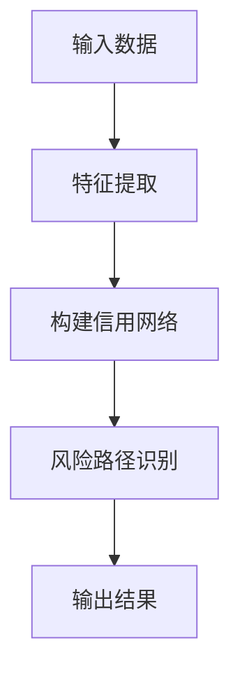
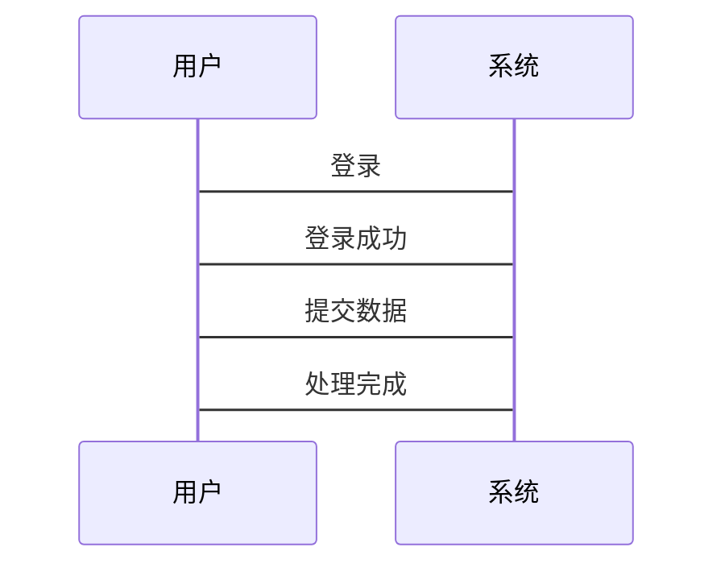

                 

# AI驱动的企业信用风险传导路径识别系统

## 关键词：企业信用风险、AI驱动、风险传导路径、系统设计、深度学习、图论、系统实现

## 摘要：本文介绍了一种基于AI的企业信用风险传导路径识别系统，通过图论和深度学习技术，分析企业间的信用风险传导路径，识别潜在风险点，帮助企业在复杂的经济环境中降低风险。

---

## 第1章: 企业信用风险传导路径识别的背景与挑战

### 1.1 企业信用风险的基本概念

#### 1.1.1 信用风险的定义与特征
信用风险是指由于债务人或交易对手无法履行其合同义务而给债权人带来的损失。其主要特征包括隐蔽性、传染性和复杂性。

#### 1.1.2 信用风险的分类与影响
信用风险可以分为系统性风险和非系统性风险。系统性风险影响整个市场，而非系统性风险仅影响特定企业。信用风险的传导会导致连锁反应，加剧金融市场的波动。

#### 1.1.3 信用风险传导的机制与路径
信用风险通常通过供应链、金融市场和企业间关系进行传导。例如，一家企业违约可能会影响其供应商和客户，进而影响整个产业链。

---

### 1.2 传统信用风险识别的局限性

#### 1.2.1 传统信用风险评估方法的不足
传统方法主要依赖财务指标和历史数据，难以捕捉复杂的风险传导路径。数据不足和模型复杂性也是传统方法的局限。

#### 1.2.2 数据不足与模型复杂性问题
传统方法在处理大规模、复杂数据时表现不佳，难以应对实时风险识别的需求。

#### 1.2.3 传统方法在风险传导路径识别中的局限性
传统方法难以识别复杂的多级传导路径，尤其是在涉及多个企业的情况下。

---

### 1.3 AI技术在信用风险识别中的应用前景

#### 1.3.1 AI技术在金融领域的应用现状
AI技术在金融领域的应用广泛，包括欺诈检测、信用评分和风险管理等。

#### 1.3.2 AI驱动信用风险识别的优势
AI能够处理大量数据，识别复杂模式，并实时更新模型，提高风险识别的准确性和效率。

#### 1.3.3 信用风险传导路径识别的创新方向
未来，AI技术可能会更加智能化，能够主动预测和阻止信用风险的发生。

---

### 1.4 本章小结
本章介绍了企业信用风险的基本概念和传统识别方法的局限性，强调了AI技术在信用风险识别中的重要性和应用前景。

---

## 第2章: 信用风险传导路径识别的核心概念与联系

### 2.1 信用风险传导路径的定义与结构

#### 2.1.1 信用风险传导路径的定义
信用风险传导路径是指风险从一个企业传递到另一个企业的路径和机制。

#### 2.1.2 传导路径的构成要素
包括风险源、传导媒介和风险接收者。

#### 2.1.3 传导路径的数学模型
通过图论模型表示企业间的信用关系，构建信用网络。

---

### 2.2 AI驱动的信用风险传导路径识别原理

#### 2.2.1 数据驱动的信用风险识别
利用企业数据，构建信用网络，识别关键节点。

#### 2.2.2 图论在信用风险传导中的应用
使用图论模型分析企业间的联系，识别风险传导路径。

#### 2.2.3 深度学习在风险传导路径识别中的作用
通过深度学习模型，自动学习风险特征，提高识别准确性。

---

### 2.3 ER实体关系图

| 特性 | 信用主体 | 风险因素 | 传导路径 |
|------|----------|----------|----------|
| 定义 | 企业或个人 | 影响信用的变量 | 风险传递的方式 |
| 示例 | 企业A | 利率变化 | 从企业A到银行 |

---

### 2.4 本章小结
本章详细阐述了信用风险传导路径的定义、结构及AI驱动识别的原理，并通过ER图展示了实体关系。

---

## 第3章: 基于AI的信用风险传导路径识别算法原理

### 3.1 算法原理概述

#### 3.1.1 基于图论的信用传导网络构建
构建信用网络，分析节点间的连接强度。

#### 3.1.2 基于深度学习的风险路径识别
利用神经网络学习风险特征，识别传导路径。

#### 3.1.3 算法的输入输出与流程
从数据输入到特征提取，再到风险路径识别，最后输出结果。

---

### 3.2 算法流程图

---

### 3.3 数学模型与公式

#### 3.3.1 图论模型
$$C_{i,j} = \frac{A_{i,j}}{\sqrt{\sum_{k} A_{i,k}^2} \cdot \sqrt{\sum_{k} A_{j,k}^2}}$$

#### 3.3.2 深度学习模型
$$P(y|x) = \sigma(wx + b)$$

---

### 3.4 本章小结
本章详细介绍了算法的原理和实现过程，通过流程图和代码示例帮助读者理解。

---

## 第4章: 系统架构设计与实现

### 4.1 系统功能设计

#### 4.1.1 需求分析
明确系统需要实现的功能，如数据采集、风险评估等。

#### 4.1.2 领域模型
通过类图展示系统中的各个模块及其关系。

---

### 4.2 系统架构设计

#### 4.2.1 分层架构
展示系统的分层结构，包括数据层、业务逻辑层和表现层。

#### 4.2.2 接口设计
定义系统各模块之间的接口，确保模块间有效通信。

---

### 4.3 系统交互序列图

---

### 4.4 本章小结
本章详细描述了系统的架构设计，包括功能设计、架构图和接口设计。

---

## 第5章: 项目实战与案例分析

### 5.1 项目环境安装

#### 5.1.1 依赖管理
列出项目所需的依赖库，如Python的pandas、numpy等。

#### 5.1.2 环境配置
指导读者如何配置开发环境，确保项目顺利运行。

---

### 5.2 核心代码实现

#### 5.2.1 数据预处理
展示如何清洗和处理数据，提取特征。

#### 5.2.2 模型训练
展示深度学习模型的训练过程，包括数据加载、模型定义和训练循环。

#### 5.2.3 结果可视化
展示如何将风险传导路径可视化，帮助用户理解结果。

---

### 5.3 案例分析

#### 5.3.1 数据来源
介绍案例所用的数据来源，如公开的企业信用数据。

#### 5.3.2 具体分析
通过具体案例，展示系统如何识别风险传导路径，帮助企业规避风险。

---

### 5.4 本章小结
本章通过项目实战，展示了系统的实现过程，并通过案例分析验证了系统的有效性。

---

## 第6章: 总结与展望

### 6.1 系统总结

#### 6.1.1 系统优势
总结系统的主要优势，如高准确性和实时性。

#### 6.1.2 项目成果
展示项目的主要成果，如核心算法和系统实现。

---

### 6.2 未来展望

#### 6.2.1 技术创新
展望未来可能的技术创新，如更复杂的深度学习模型和更高效的算法优化。

#### 6.2.2 应用场景扩展
探讨系统在更多领域的应用前景，如供应链金融和风险管理。

---

### 6.3 本章小结
本章总结了项目的成果，并展望了未来的发展方向。

---

## 作者信息
作者：AI天才研究院 & 禅与计算机程序设计艺术

--- 

以上就是《AI驱动的企业信用风险传导路径识别系统》的技术博客文章，通过详细的章节划分和内容阐述，确保文章逻辑清晰、结构紧凑，为读者提供了丰富的知识和实践指导。

