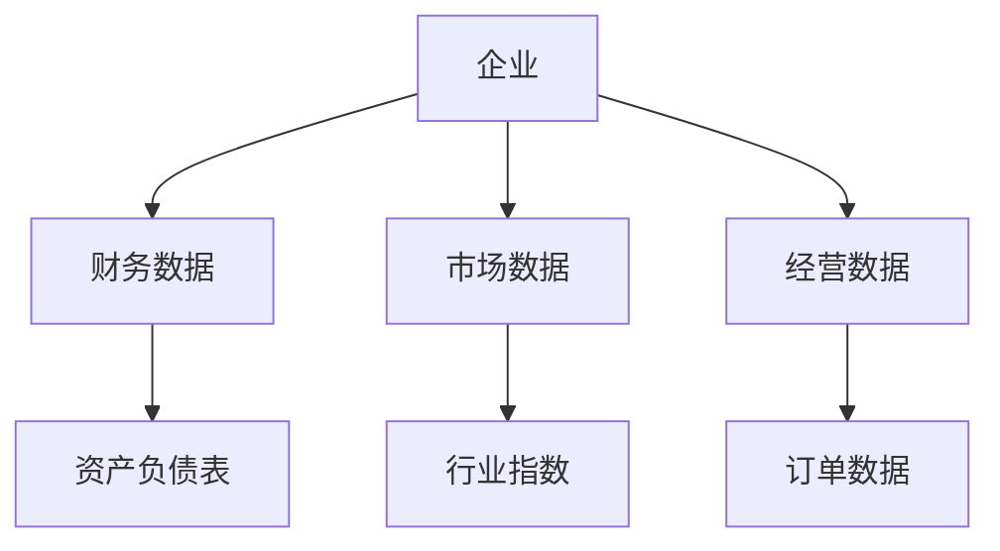
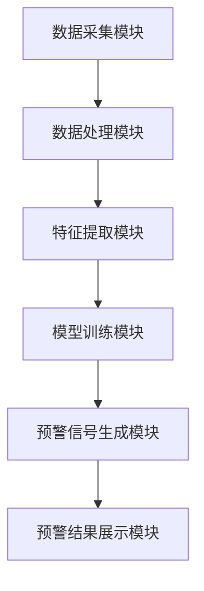

                 


# AI驱动的企业信用风险早期预警信号识别系统

> 关键词：人工智能，信用风险，早期预警，机器学习，深度学习，企业信用评估

> 摘要：随着全球经济的快速发展，企业信用风险的早期预警变得越来越重要。本文详细探讨了如何利用人工智能技术，特别是机器学习和深度学习算法，构建一个高效的信用风险早期预警系统。文章从背景介绍、核心概念、算法原理、系统架构到项目实战，全面解析了该系统的实现过程。通过对企业财务数据、市场表现、管理状况等多维度数据的分析，结合先进的AI技术，本文提出了一种创新的解决方案，为企业信用风险管理提供了新的思路和方法。

---

# 第1章: 企业信用风险早期预警的背景与意义

## 1.1 企业信用风险的基本概念

### 1.1.1 信用风险的定义与内涵

信用风险是指在信用交易中，由于交易对手或债务人未能履行其义务，导致债权人遭受损失的可能性。在企业层面，信用风险主要表现在企业未能按时偿还贷款、履行合同义务或支付账款等方面。信用风险的大小通常与企业的财务状况、经营能力和市场环境密切相关。

### 1.1.2 信用风险对企业的影响

信用风险不仅影响企业的正常经营，还可能引发连锁反应，影响整个金融系统的稳定性。例如，一家企业的违约可能导致其供应商和客户的连锁违约，进而影响整个产业链的运行。因此，及时识别和预警信用风险，对于企业自身和整个金融系统的稳定运行具有重要意义。

### 1.1.3 信用风险的分类与特征

信用风险可以分为系统性风险和非系统性风险。系统性风险是由于经济周期波动、政策变化等因素引起的，影响范围广泛；非系统性风险是由于企业自身经营状况不佳或管理不善导致的。信用风险的特征包括隐蔽性、扩散性和不可预测性，这些特点使得早期预警变得尤为重要。

## 1.2 早期预警信号的重要性

### 1.2.1 早期预警信号的作用

早期预警信号是指在信用风险尚未完全显现之前，通过分析企业经营数据、财务指标等信息，发现潜在风险信号。及时识别这些信号，可以帮助企业采取预防措施，避免风险的进一步扩大。例如，通过分析企业的现金流变化、应收账款增长等指标，可以提前发现企业可能存在的流动性风险。

### 1.2.2 早期预警信号的类型

早期预警信号可以分为财务信号、经营信号和市场信号三大类。财务信号包括利润率下降、资产负债率上升等；经营信号包括订单减少、员工离职率上升等；市场信号包括行业景气度下降、市场竞争加剧等。这些信号的综合分析可以帮助更准确地判断企业的信用风险状况。

### 1.2.3 早期预警信号的识别方法

早期预警信号的识别方法主要包括定性分析和定量分析两种。定性分析主要是通过对企业的经营环境、行业趋势等进行分析；定量分析则是通过对企业的财务数据、市场数据等进行统计分析。结合定性分析和定量分析，可以更全面地识别信用风险。

## 1.3 AI技术在信用风险预警中的应用前景

### 1.3.1 AI技术在金融领域的应用现状

人工智能技术在金融领域的应用越来越广泛，尤其是在信用评估、风险控制、投资决策等领域。AI技术可以帮助金融机构更高效地处理大量数据，发现潜在风险，优化决策流程。

### 1.3.2 AI技术在信用风险预警中的优势

AI技术在信用风险预警中的优势主要体现在数据处理能力、模型复杂性和实时性三个方面。AI技术可以处理海量数据，发现传统方法难以察觉的潜在风险；复杂的模型可以更好地捕捉数据中的非线性关系；实时性使得预警系统可以及时响应风险变化。

### 1.3.3 企业信用风险早期预警系统的发展趋势

随着AI技术的不断进步，企业信用风险早期预警系统将朝着智能化、个性化和实时化方向发展。智能化体现在预警系统的自我学习和优化能力；个性化体现在针对不同企业定制化预警模型；实时化体现在预警系统能够实时监控企业的经营状况，及时发出预警信号。

## 1.4 本章小结

本章介绍了企业信用风险的基本概念、早期预警信号的重要性以及AI技术在信用风险预警中的应用前景。通过对企业信用风险的深入分析，我们可以更好地理解为什么需要构建一个AI驱动的信用风险早期预警系统。

---

# 第2章: 企业信用风险早期预警系统的核心概念

## 2.1 企业信用风险的识别框架

### 2.1.1 信用风险识别的流程

信用风险识别的流程主要包括数据采集、特征提取、模型训练和预警信号生成四个阶段。数据采集是通过企业财务数据、市场数据等多源数据的整合；特征提取是通过对数据进行筛选和处理，提取关键特征；模型训练是利用机器学习算法训练预警模型；预警信号生成是通过模型预测结果，生成预警信号。

### 2.1.2 信用风险识别的关键指标

信用风险识别的关键指标主要包括财务指标、经营指标和市场指标。财务指标包括资产负债率、净利润率等；经营指标包括订单增长率、员工离职率等；市场指标包括行业景气度、市场竞争度等。

### 2.1.3 信用风险识别的模型选择

信用风险识别的模型选择需要根据企业的实际情况和数据特征来决定。常用的模型包括逻辑回归、决策树、随机森林和梯度提升树（如XGBoost）。这些模型各有优缺点，选择合适的模型可以提高预警的准确性和效率。

## 2.2 AI驱动的信用风险预警系统架构

### 2.2.1 数据采集与处理

数据采集与处理是信用风险预警系统的第一步。需要采集企业的财务数据、市场数据、经营数据等多源数据，并对数据进行清洗、预处理和特征提取，确保数据的质量和可用性。

### 2.2.2 特征提取与模型训练

特征提取与模型训练是信用风险预警系统的核心部分。通过对数据的特征提取，可以更好地捕捉企业的信用风险特征；模型训练则是利用机器学习算法，训练出一个能够准确预测信用风险的模型。

### 2.2.3 预警信号的生成与反馈

预警信号的生成与反馈是信用风险预警系统的最终目标。通过模型预测结果，生成预警信号，并根据预警信号的严重程度，采取相应的措施。预警信号的反馈可以进一步优化模型，提高预警的准确性和效率。

## 2.3 核心概念与联系

### 2.3.1 ER实体关系图



### 2.3.2 核心概念属性对比表

| 概念 | 属性 | 描述 |
|------|------|------|
| 企业 | 财务数据 | 包括资产负债表、利润表等 |
| 市场数据 | 行业指数 | 包括行业景气度、市场竞争度等 |
| 经营数据 | 订单数据 | 包括订单增长率、客户满意度等 |

## 2.4 本章小结

本章详细介绍了企业信用风险识别的框架、AI驱动的信用风险预警系统架构以及核心概念与联系。通过ER实体关系图和属性对比表，可以更清晰地理解系统的各个组成部分及其相互关系。

---

# 第3章: AI驱动的信用风险预警系统算法原理

## 3.1 信用风险预警的特征工程

### 3.1.1 数据预处理

数据预处理是特征工程的第一步，包括数据清洗、缺失值处理、异常值处理等。数据清洗主要是去除无效数据和重复数据；缺失值处理可以采用均值填补、随机填补等方法；异常值处理可以通过统计方法或机器学习方法进行。

### 3.1.2 特征提取

特征提取是通过选择或创建能够最好地预测信用风险的特征。常用的特征提取方法包括主成分分析（PCA）、Lasso回归等。特征提取可以帮助减少数据维度，提高模型的训练效率和准确率。

### 3.1.3 特征选择

特征选择是通过选择最重要的特征来提高模型的性能。常用的特征选择方法包括Lasso回归、递归特征消除（RFE）等。特征选择可以减少过拟合的风险，提高模型的泛化能力。

## 3.2 信用风险预警的模型训练

### 3.2.1 逻辑回归模型

逻辑回归是一种常用的分类算法，适用于二分类问题。其基本思想是通过构建一个线性回归模型，将输入特征映射到0和1之间，表示概率。逻辑回归模型的损失函数通常采用对数损失函数。

$$ \text{损失函数} = -\sum_{i=1}^{n} [y_i \ln(p_i) + (1 - y_i) \ln(1 - p_i)] $$

其中，\( p_i \) 是第i个样本的预测概率，\( y_i \) 是标签。

### 3.2.2 XGBoost模型

XGBoost是一种强大的集成学习算法，基于树模型。其核心思想是通过多次训练弱分类器（树模型），并通过加权的方式提高整体模型的性能。XGBoost模型在处理非线性关系和高维数据方面表现尤为突出。

## 3.3 算法实现流程

### 3.3.1 数据预处理与特征提取

```python
import pandas as pd
from sklearn.preprocessing import StandardScaler
from sklearn.decomposition import PCA

# 加载数据
data = pd.read_csv('credit_risk.csv')

# 删除缺失值
data = data.dropna()

# 标准化处理
scaler = StandardScaler()
data_scaled = scaler.fit_transform(data)

# 主成分分析
pca = PCA(n_components=10)
data_pca = pca.fit_transform(data_scaled)
```

### 3.3.2 模型训练与评估

```python
from sklearn.model_selection import train_test_split
from sklearn.linear_model import LogisticRegression
from xgboost import XGBClassifier
from sklearn.metrics import accuracy_score, precision_score, recall_score

# 划分训练集和测试集
X_train, X_test, y_train, y_test = train_test_split(data_pca, labels, test_size=0.2)

# 逻辑回归模型训练
lr_model = LogisticRegression()
lr_model.fit(X_train, y_train)
y_pred_lr = lr_model.predict(X_test)
print(f'逻辑回归准确率: {accuracy_score(y_test, y_pred_lr)}')

# XGBoost模型训练
xgb_model = XGBClassifier()
xgb_model.fit(X_train, y_train)
y_pred_xgb = xgb_model.predict(X_test)
print(f'XGBoost准确率: {accuracy_score(y_test, y_pred_xgb)}')
```

## 3.4 算法优缺点对比

### 3.4.1 逻辑回归的优点
- 简单易懂，易于解释
- 计算效率高
- 对异常值相对鲁棒

### 3.4.2 逻辑回归的缺点
- 仅适用于二分类问题
- 对非线性关系的捕捉能力较弱

### 3.4.3 XGBoost的优点
- 高准确性
- 强大的特征重要性解释能力
- 能够处理高维数据

### 3.4.4 XGBoost的缺点
- 参数较多，调优复杂
- 易于过拟合
- 计算资源消耗较大

## 3.5 本章小结

本章详细介绍了信用风险预警系统中常用的特征工程方法和模型训练算法，包括逻辑回归和XGBoost。通过对不同算法的优缺点分析，可以更好地选择适合实际场景的算法，提高预警系统的准确性和效率。

---

# 第4章: AI驱动的信用风险预警系统设计与实现

## 4.1 系统设计

### 4.1.1 系统架构设计



### 4.1.2 系统功能设计

- 数据采集模块：负责采集企业的财务数据、市场数据、经营数据等多源数据。
- 数据处理模块：对采集到的数据进行清洗、预处理和特征提取。
- 模型训练模块：利用机器学习算法训练信用风险预警模型。
- 预警信号生成模块：根据模型预测结果生成预警信号。
- 预警结果展示模块：将预警信号以可视化的方式展示给用户。

## 4.2 系统实现

### 4.2.1 数据处理与特征提取

```python
import pandas as pd
from sklearn.decomposition import PCA

# 加载数据
data = pd.read_csv('credit_risk.csv')

# 删除缺失值
data = data.dropna()

# 标准化处理
from sklearn.preprocessing import StandardScaler
scaler = StandardScaler()
data_scaled = scaler.fit_transform(data)

# 主成分分析
from sklearn.decomposition import PCA
pca = PCA(n_components=10)
data_pca = pca.fit_transform(data_scaled)
```

### 4.2.2 模型训练与预警信号生成

```python
from sklearn.model_selection import train_test_split
from xgboost import XGBClassifier
from sklearn.metrics import accuracy_score, confusion_matrix

# 划分训练集和测试集
X_train, X_test, y_train, y_test = train_test_split(data_pca, labels, test_size=0.2)

# XGBoost模型训练
xgb_model = XGBClassifier()
xgb_model.fit(X_train, y_train)

# 预测并生成预警信号
y_pred = xgb_model.predict(X_test)

# 计算准确率
print(f'准确率: {accuracy_score(y_test, y_pred)}')

# 绘制混淆矩阵
from sklearn.metrics import plot_confusion_matrix
import matplotlib.pyplot as plt
plot_confusion_matrix(xgb_model, X_test, y_test)
plt.show()
```

## 4.3 系统实现流程

### 4.3.1 系统环境搭建

- 安装Python环境：建议使用Anaconda或Miniconda
- 安装所需库：包括pandas、numpy、scikit-learn、xgboost、matplotlib等

### 4.3.2 系统核心代码实现

```python
import pandas as pd
import numpy as np
from sklearn.decomposition import PCA
from xgboost import XGBClassifier
from sklearn.metrics import accuracy_score, confusion_matrix
import matplotlib.pyplot as plt

# 加载数据
data = pd.read_csv('credit_risk.csv')

# 删除缺失值
data = data.dropna()

# 标准化处理
from sklearn.preprocessing import StandardScaler
scaler = StandardScaler()
data_scaled = scaler.fit_transform(data)

# 主成分分析
pca = PCA(n_components=10)
data_pca = pca.fit_transform(data_scaled)

# 划分训练集和测试集
X_train, X_test, y_train, y_test = train_test_split(data_pca, labels, test_size=0.2)

# XGBoost模型训练
xgb_model = XGBClassifier()
xgb_model.fit(X_train, y_train)

# 预测并生成预警信号
y_pred = xgb_model.predict(X_test)

# 计算准确率
print(f'准确率: {accuracy_score(y_test, y_pred)}')

# 绘制混淆矩阵
from sklearn.metrics import plot_confusion_matrix
plot_confusion_matrix(xgb_model, X_test, y_test)
plt.show()
```

## 4.4 系统实现注意事项

- 数据隐私与安全：在处理企业数据时，需要注意数据隐私和安全问题，确保数据不被泄露或滥用。
- 模型调优：根据实际场景和数据特征，调整模型参数，优化模型性能。
- 系统实时性：为了提高预警的实时性，可以采用流数据处理技术，实时更新模型。

## 4.5 本章小结

本章详细介绍了AI驱动的信用风险预警系统的整体设计与实现过程，包括系统架构设计、功能设计、数据处理、模型训练和预警信号生成等部分。通过具体的代码实现，可以帮助读者更好地理解系统的工作原理和实现细节。

---

# 第5章: 信用风险预警系统的实际应用与案例分析

## 5.1 实际应用场景

### 5.1.1 金融机构的应用

金融机构可以通过信用风险预警系统，提前识别客户的信用风险，优化贷款审批流程，降低违约率。

### 5.1.2 企业的内部风险管理

企业可以利用信用风险预警系统，实时监控自身的财务状况和经营状况，及时发现潜在风险，采取预防措施。

### 5.1.3 供应链金融的应用

在供应链金融中，信用风险预警系统可以帮助核心企业监控上下游企业的信用状况，降低供应链的信用风险。

## 5.2 案例分析

### 5.2.1 案例背景

某制造企业由于原材料价格上涨和市场需求下降，导致企业利润大幅下降，现金流出现紧张。通过信用风险预警系统，可以提前发现企业的财务风险，及时采取措施，避免企业进一步恶化。

### 5.2.2 数据分析

通过对企业的财务数据和市场数据进行分析，发现企业的应收账款周转率下降，存货周转率下降，说明企业的经营状况出现恶化迹象。

### 5.2.3 预警信号生成

根据模型预测结果，生成预警信号，并根据预警信号的严重程度，采取相应的措施，如加强应收账款管理、优化库存管理等。

## 5.3 案例总结

通过实际案例分析，可以验证信用风险预警系统的有效性和实用性。在案例中，信用风险预警系统成功地识别了企业的潜在风险，帮助企业及时采取措施，避免了更大的损失。

## 5.4 本章小结

本章通过实际应用场景和案例分析，展示了AI驱动的信用风险预警系统的实际价值和应用效果。通过案例分析，可以帮助读者更好地理解系统在实际中的应用和意义。

---

# 第6章: 系统优化与未来展望

## 6.1 系统优化建议

### 6.1.1 数据源的扩展

为了提高预警系统的准确性和效率，可以尝试引入更多的数据源，如社交媒体数据、新闻数据等，通过多源数据的融合，提高预警的全面性。

### 6.1.2 模型优化

随着深度学习技术的发展，可以尝试引入深度学习模型，如LSTM、BERT等，进一步提高模型的预测能力和复杂性。

### 6.1.3 系统实时性优化

为了提高预警的实时性，可以采用流数据处理技术，实时更新模型，及时发现潜在风险。

## 6.2 未来发展趋势

### 6.2.1 多模态数据融合

未来的信用风险预警系统将更加注重多模态数据的融合，如文本数据、图像数据等，通过多模态数据的综合分析，提高预警的准确性和全面性。

### 6.2.2 自动化预警系统

随着自动化技术的发展，信用风险预警系统将朝着自动化方向发展，系统能够自动识别风险信号，自动调整预警策略，减少人工干预。

### 6.2.3 个性化预警服务

未来的信用风险预警系统将更加注重个性化，根据企业的具体需求和数据特征，定制化预警模型，提供个性化的预警服务。

## 6.3 本章小结

本章从系统优化和未来发展趋势两个方面，探讨了信用风险预警系统的改进方向和未来发展。通过系统的优化和技术创新，可以进一步提高预警系统的准确性和效率，为企业信用风险管理提供更有力的支持。

---

# 结语

AI驱动的企业信用风险早期预警信号识别系统是一个复杂的系统工程，涉及数据采集、特征提取、模型训练等多个环节。通过人工智能技术的应用，可以更高效地识别信用风险，提前发出预警信号，帮助企业规避风险，保障金融系统的稳定运行。随着技术的不断进步，信用风险预警系统将朝着更智能化、更个性化的方向发展，为企业信用风险管理提供更全面、更精准的支持。

---

# 作者：AI天才研究院/AI Genius Institute & 禅与计算机程序设计艺术 /Zen And The Art of Computer Programming

