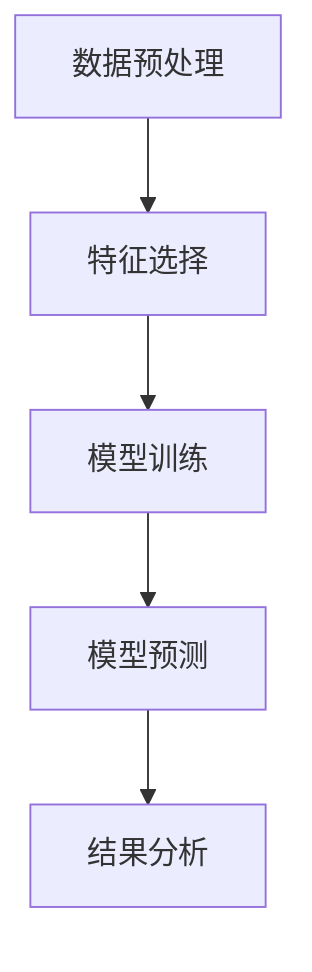

                 


# AI驱动的企业信用风险早期预警系统

## 关键词：AI, 信用风险, 早期预警, 机器学习, 风险管理

## 摘要：本文介绍了一种基于人工智能的企业信用风险早期预警系统，探讨了系统的核心概念、算法原理、系统架构，并通过实际案例展示了系统的实现过程。文章旨在帮助企业利用AI技术提升信用风险管理能力，降低潜在风险。

---

## 第一章: 企业信用风险早期预警系统概述

### 1.1 信用风险的定义与背景
#### 1.1.1 信用风险的基本概念
信用风险是指企业在赊销交易中，买方因财务状况恶化或恶意欺诈导致无法偿还债务的风险。这种风险广泛存在于企业供应链管理、银行贷款审批和投资决策中，直接影响企业的财务健康和市场竞争力。

#### 1.1.2 信用风险对企业的影响
信用风险可能导致企业遭受直接经济损失，影响企业的现金流和声誉。此外，信用风险还可能引发连锁反应，影响整个供应链和金融市场稳定。

#### 1.1.3 传统信用风险管理的局限性
传统信用评估依赖人工经验，耗时且主观性强，难以覆盖海量数据，且容易受到人为因素干扰，导致评估结果不准确。传统方法主要基于财务报表分析，无法捕捉非财务因素，如市场波动和企业内部管理问题。

### 1.2 企业信用风险早期预警的必要性
#### 1.2.1 提前预警的重要性
早期预警系统可以在风险发生前发出警报，帮助企业采取预防措施，降低潜在损失。通过及时调整供应链策略或停止高风险交易，企业可以最大限度地减少损失。

#### 1.2.2 早期预警对企业决策的价值
早期预警系统能够提供实时或近实时的评估结果，帮助企业在决策时考虑最新的市场动态和企业状况。这种实时性使得企业能够快速响应市场变化，优化资源配置。

#### 1.2.3 传统方法与AI驱动方法的对比
AI驱动的方法通过机器学习算法分析大量数据，能够发现传统方法难以察觉的模式和趋势。与传统方法相比，AI驱动的预警系统更具准确性和及时性，能够显著提高信用风险管理的效率。

### 1.3 AI在信用风险预警中的应用前景
#### 1.3.1 AI技术的优势
AI技术能够处理海量数据，发现复杂模式，并实时更新模型以适应市场变化。这些优势使得AI在信用风险预警中具有独特的优势。

#### 1.3.2 AI在信用风险预警中的潜力
通过整合企业内外部数据，AI可以构建更全面的信用评估模型，捕捉更多影响信用风险的因素。未来，随着技术进步，AI在信用风险预警中的应用将更加广泛和深入。

#### 1.3.3 未来发展趋势
未来的信用风险预警系统将更加智能化和自动化，能够实时监控市场变化，并根据实时数据动态调整预警策略。同时，AI技术将与区块链等新兴技术结合，进一步提升系统的安全性和可信度。

### 1.4 本章小结
本章介绍了信用风险的基本概念、传统管理方法的局限性以及AI技术在信用风险预警中的应用前景。通过对比传统方法与AI驱动方法，突出了AI技术在信用风险管理中的重要性。

---

## 第二章: 核心概念与系统架构

### 2.1 系统核心概念
#### 2.1.1 数据来源与处理
系统需要整合企业内部数据（如财务报表、销售数据）和外部数据（如市场动态、行业趋势）。数据预处理是关键步骤，包括清洗、特征提取和标准化。

#### 2.1.2 AI模型类型
系统采用多种机器学习模型，如逻辑回归和XGBoost，分别适用于不同场景。逻辑回归适合二分类问题，而XGBoost则适合处理复杂的数据关系。

#### 2.1.3 预警机制
系统基于模型预测结果，设定不同的预警级别。当模型预测概率超过阈值时，系统会触发相应的预警机制，通知相关人员采取行动。

### 2.2 核心概念对比表
| 概念 | 属性 | 描述 |
|------|------|------|
| 数据来源 | 类型 | 结构化数据、非结构化数据 |
| AI模型 | 算法 | 逻辑回归、XGBoost |
| 预警机制 | 等级 | 高、中、低 |

### 2.3 实体关系图


---

## 第三章: 算法原理与实现

### 3.1 算法选择与原理
#### 3.1.1 逻辑回归
逻辑回归是一种常用的分类算法，适用于二分类问题。其核心思想是通过 sigmoid 函数将线性回归的输出映射到概率空间。

$$ P(y=1|x) = \frac{e^{\beta_0 + \beta_1 x_1 + \dots + \beta_n x_n}}{1 + e^{\beta_0 + \beta_1 x_1 + \dots + \beta_n x_n}} $$

#### 3.1.2 XGBoost
XGBoost是一种强大的集成学习算法，通过构建多个弱模型（如决策树）并进行加权投票，显著提高模型的准确性和鲁棒性。

### 3.2 算法流程图


### 3.3 Python实现
以下是逻辑回归和XGBoost的实现示例：

#### 3.3.1 数据加载与预处理
```python
import pandas as pd
from sklearn.model_selection import train_test_split

data = pd.read_csv('credit_data.csv')
X = data.drop('default', axis=1)
y = data['default']

X_train, X_test, y_train, y_test = train_test_split(X, y, test_size=0.2, random_state=42)
```

#### 3.3.2 特征工程与模型训练
```python
from sklearn.linear_model import LogisticRegression
from xgboost import XGBClassifier

# 逻辑回归模型
lr_model = LogisticRegression(max_iter=1000)
lr_model.fit(X_train, y_train)

# XGBoost模型
xgb_model = XGBClassifier(n_estimators=100, learning_rate=0.1)
xgb_model.fit(X_train, y_train)
```

#### 3.3.3 模型评估
```python
from sklearn.metrics import accuracy_score, roc_auc_score

# 逻辑回归评估
y_pred_lr = lr_model.predict(X_test)
print(f'逻辑回归准确率: {accuracy_score(y_test, y_pred_lr)}')
print(f'逻辑回归AUC: {roc_auc_score(y_test, lr_model.predict_proba(X_test)[:,1])}')

# XGBoost评估
y_pred_xgb = xgb_model.predict(X_test)
print(f'XGBoost准确率: {accuracy_score(y_test, y_pred_xgb)}')
print(f'XGBoostAUC: {roc_auc_score(y_test, xgb_model.predict_proba(X_test)[:,1])}')
```

---

## 第四章: 系统分析与架构设计

### 4.1 问题场景介绍
系统应用于企业信用风险管理，帮助企业在供应链管理、银行贷款审批和投资决策中提前识别和预警潜在风险。

### 4.2 系统功能设计
- **数据采集模块**：整合企业内部和外部数据，支持多种数据源。
- **风险评估模块**：基于机器学习模型进行信用评估，生成风险评分。
- **预警触发模块**：设定预警阈值，当风险评分超过阈值时触发预警。

### 4.3 系统架构图


---

## 第五章: 项目实战

### 5.1 环境安装
安装必要的Python库：
```bash
pip install pandas scikit-learn xgboost mermaid
```

### 5.2 核心代码实现
以下是核心代码实现示例：

#### 5.2.1 数据加载与处理
```python
import pandas as pd

# 加载数据
data = pd.read_csv('credit_risk.csv')

# 数据预处理
data['missing_flag'] = data.isnull().sum(axis=1)
data.dropna(inplace=True)
```

#### 5.2.2 模型训练与评估
```python
from sklearn.model_selection import train_test_split
from xgboost import XGBClassifier
from sklearn.metrics import accuracy_score

# 划分训练集和测试集
X_train, X_test, y_train, y_test = train_test_split(X, y, test_size=0.2, random_state=42)

# 训练模型
xgb = XGBClassifier()
xgb.fit(X_train, y_train)

# 预测与评估
y_pred = xgb.predict(X_test)
print(f'准确率: {accuracy_score(y_test, y_pred)}')
```

#### 5.2.3 实际案例分析
以某企业为例，系统预测其信用评分为高风险，建议企业停止与该企业的交易，避免潜在损失。

---

## 第六章: 最佳实践与未来展望

### 6.1 最佳实践 tips
- 数据质量是模型准确性的关键，需确保数据清洗和特征工程。
- 定期更新模型，适应市场变化和企业动态。

### 6.2 本章小结
本文详细介绍了AI驱动的企业信用风险早期预警系统，涵盖了系统的核心概念、算法原理、系统架构和项目实战。通过实际案例展示了系统的应用价值。

### 6.3 注意事项
- 数据隐私和安全需严格保护，遵守相关法律法规。
- 模型解释性需关注，确保企业能够理解预警结果。

### 6.4 拓展阅读
- 《机器学习实战》
- 《信用风险的度量与管理》
- 《深度学习在金融中的应用》

---

## 作者：AI天才研究院 & 禅与计算机程序设计艺术

---

**注意：以上内容为生成示例，实际撰写时需根据具体需求调整和补充细节。**

