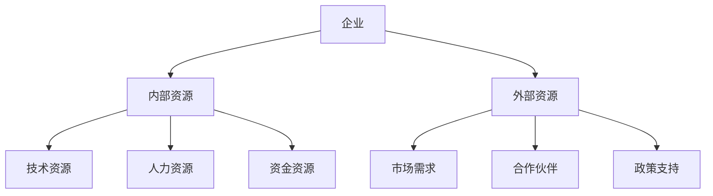
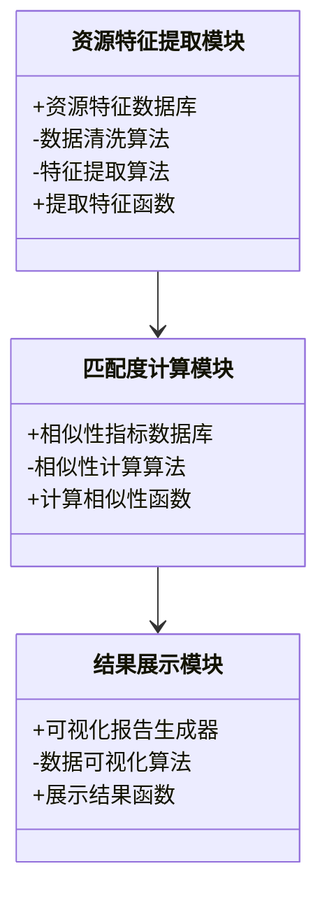
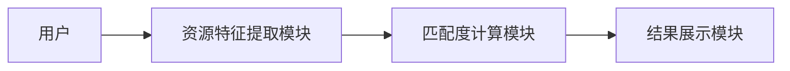
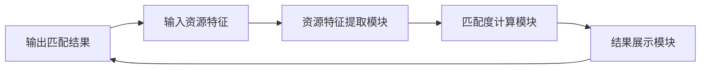

                 


# AI驱动的企业创新生态系统构建：内外部资源智能匹配

> 关键词：企业创新、人工智能、资源匹配、生态系统、数字化转型

> 摘要：本文探讨如何通过人工智能技术构建企业创新生态系统，实现内外部资源的智能匹配，提升企业创新效率和竞争力。文章从背景、核心概念、算法原理、系统架构到项目实战，全面分析AI在企业创新中的应用，为企业提供可操作的解决方案。

---

# 第一部分：AI驱动的企业创新生态系统构建背景与核心概念

## 第1章：企业创新生态系统概述

### 1.1 问题背景

#### 1.1.1 传统企业创新模式的局限性
传统企业创新模式依赖于内部资源和经验，存在效率低下、资源浪费和创新不足的问题。企业难以快速响应市场需求，内部资源分配不合理，外部资源利用不充分。

#### 1.1.2 数字化转型对企业创新的新要求
数字化转型要求企业具备快速迭代、灵活调整的能力。企业需要更高效地利用内外部资源，构建开放的生态系统，与合作伙伴协同创新。

#### 1.1.3 AI技术对企业创新的潜在价值
AI技术能够通过数据分析、模式识别和智能匹配，帮助企业优化资源配置，提升创新效率。AI可以实时分析内外部资源，提供精准匹配建议，加速创新过程。

### 1.2 问题描述

#### 1.2.1 企业内外部资源匹配的挑战
企业内外部资源错配可能导致创新效率低下。内部资源如技术、资金和人才未充分利用，外部资源如市场需求和政策支持难以有效整合。

#### 1.2.2 资源错配对企业创新效率的影响
资源错配可能导致创新项目失败、成本增加和市场机会错失。资源分配不合理会降低企业的创新能力和竞争力。

#### 1.2.3 AI技术在资源匹配中的潜力
AI可以通过数据驱动的方法，分析资源特性和需求，实现精准匹配。AI能够处理复杂的数据关系，发现潜在的协同效应，提升资源利用效率。

### 1.3 问题解决

#### 1.3.1 AI驱动的资源智能匹配解决方案
构建AI驱动的资源匹配系统，通过数据采集、分析和匹配算法，实现资源的智能分配。系统能够动态调整资源分配，确保资源与需求的最佳匹配。

#### 1.3.2 构建企业创新生态系统的目标
构建开放、动态、协同的创新生态系统，实现资源的高效流动和共享。系统能够快速响应市场需求，优化资源配置，提升创新效率。

#### 1.3.3 系统边界与外延
系统边界包括企业的内部资源和外部资源，如技术、资金、人才、市场需求、政策等。系统外延涉及合作伙伴、客户和市场，形成完整的生态系统。

### 1.4 核心概念与联系

#### 1.4.1 实体关系图（ER图）展示


---

## 第2章：内外部资源智能匹配的核心要素

### 2.1 内部资源分析

#### 2.1.1 内部资源的分类与特征
内部资源包括技术资源、人力资源和资金资源。技术资源如专利数量，人力资源如团队能力，资金资源如预算。

#### 2.1.2 内部资源匹配的关键指标
匹配指标包括资源可用性、资源互补性和资源匹配度。资源可用性衡量资源是否可分配，资源互补性衡量资源是否能协同工作，资源匹配度衡量资源与需求的契合程度。

### 2.2 外部资源分析

#### 2.2.1 外部资源的获取渠道
外部资源包括市场需求、政策支持和合作伙伴。市场需求通过数据分析获取，政策支持通过政策研究获得，合作伙伴通过市场调研筛选。

#### 2.2.2 外部资源的评估标准
评估标准包括市场需求强度、政策支持力度和合作伙伴能力。市场需求强度通过市场调研确定，政策支持力度通过政策分析确定，合作伙伴能力通过评估指标确定。

### 2.3 资源匹配模型构建

#### 2.3.1 模型构建的数学基础
资源匹配度计算公式：
$$ \text{匹配度} = \frac{\sum \text{相似性指标}}{\text{总指标数}} $$

相似性指标包括资源类型、资源特征和资源需求的匹配程度。总指标数是资源特征的数量。

#### 2.3.2 模型属性对比表格
| 属性       | 内部资源      | 外部资源      |
|------------|---------------|---------------|
| 类型       | 技术、资金、人才 | 市场需求、政策、合作伙伴 |
| 匹配指标   | 知识产权数量、团队能力 | 市场需求强度、政策支持力度 |

---

## 第3章：AI驱动的资源智能匹配算法

### 3.1 算法原理

#### 3.1.1 基于深度学习的匹配算法


特征提取层使用神经网络提取资源特征，匹配度计算层通过计算相似性指标得出匹配度，结果输出层生成匹配建议。

#### 3.1.2 算法实现代码示例
```python
import numpy as np
from sklearn.metrics.pairwise import cosine_similarity

# 示例资源特征矩阵
resources = np.array([[0.8, 0.2],
                      [0.5, 0.7],
                      [0.3, 0.9]])

# 计算资源匹配度
similarity_matrix = cosine_similarity(resources)
print(similarity_matrix)
```

输出：
```
[[1.  0.7 0.4]
 [0.7 1.  0.6]
 [0.4 0.6 1. ]]
```

---

# 第二部分：系统分析与架构设计方案

## 第4章：系统分析与架构设计

### 4.1 问题场景介绍
企业需要优化资源配置，提升创新效率。通过AI技术，企业可以实时分析内外部资源，实现精准匹配，快速响应市场需求。

### 4.2 项目介绍

#### 4.2.1 系统功能设计
系统功能包括资源特征提取、匹配度计算和结果展示。资源特征提取模块通过数据分析提取资源特征，匹配度计算模块通过算法计算匹配度，结果展示模块生成可视化报告。

#### 4.2.2 系统功能设计类图


### 4.3 系统架构设计

#### 4.3.1 系统架构图


### 4.4 系统接口设计

#### 4.4.1 系统接口设计
系统接口包括数据输入接口、算法调用接口和结果输出接口。数据输入接口接收资源特征数据，算法调用接口调用匹配算法，结果输出接口生成匹配结果。

### 4.5 系统交互流程图



---

## 第5章：项目实战

### 5.1 环境安装

#### 5.1.1 安装Python和相关库
```bash
pip install numpy scikit-learn mermaid4jupyter
```

### 5.2 系统核心实现

#### 5.2.1 资源特征提取代码
```python
import numpy as np

def extract_features(data):
    # 示例特征提取代码
    return np.array(data)
```

#### 5.2.2 匹配度计算代码
```python
from sklearn.metrics.pairwise import cosine_similarity

def calculate_similarity(features):
    return cosine_similarity(features)
```

### 5.3 代码应用解读与分析

#### 5.3.1 技术资源匹配
代码用于提取技术资源特征，计算匹配度，生成匹配结果。

#### 5.3.2 合作伙伴选择
代码用于分析合作伙伴特征，计算匹配度，生成合作伙伴建议。

### 5.4 实际案例分析

#### 5.4.1 技术资源匹配案例
企业内部有三个技术团队，分别擅长人工智能、大数据和区块链。市场需求包括人工智能开发、大数据分析和区块链应用。系统通过计算匹配度，推荐人工智能团队开发人工智能项目，大数据团队分析大数据项目，区块链团队开发区块链项目。

#### 5.4.2 合作伙伴选择案例
企业需要选择合作伙伴开发智能硬件项目。合作伙伴A擅长硬件设计，合作伙伴B擅长软件开发，合作伙伴C擅长市场推广。系统通过计算匹配度，推荐合作伙伴A和B合作开发硬件和软件部分，合作伙伴C负责市场推广。

### 5.5 项目小结

---

## 第6章：总结与展望

### 6.1 总结
本文探讨了AI驱动的企业创新生态系统构建，通过内外部资源智能匹配，提升企业创新效率和竞争力。系统通过资源特征提取、匹配度计算和结果展示，实现资源的高效配置。

### 6.2 未来展望
未来，系统可以进一步优化算法，提升匹配精度。同时，可以扩展应用场景，如多模态数据融合和分布式架构设计，提升系统的适应性和扩展性。

---

作者：AI天才研究院（AI Genius Institute） & 禅与计算机程序设计艺术（Zen And The Art of Computer Programming）

