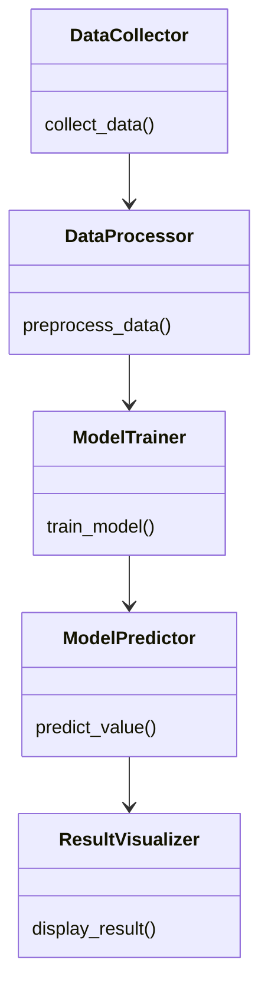
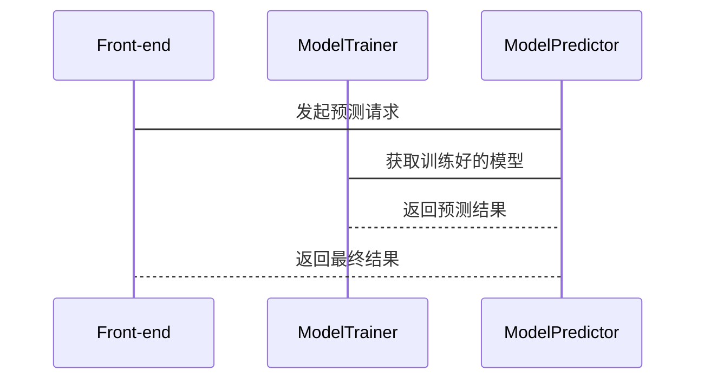

                 


# AI驱动的企业品牌价值动态量化系统

> 关键词：AI驱动，品牌价值，动态量化，企业价值评估，机器学习，数据分析，人工智能

> 摘要：  
在数字化时代，企业品牌价值的动态量化已成为企业战略决策的核心需求。本文通过AI技术驱动品牌价值的动态量化，提出了一种基于机器学习的动态量化系统，结合实时数据和深度学习模型，实现品牌价值的实时评估和预测。本文详细介绍了系统的构建过程，包括数据采集、特征工程、算法选择与实现、系统架构设计等，为企业提供了一套高效、准确的品牌价值动态量化解决方案。

---

# 第一部分: 问题背景与核心概念

## 第1章: 问题背景与核心概念

### 1.1 问题背景

随着市场竞争的加剧，企业品牌价值的动态评估变得至关重要。传统的品牌价值评估方法通常依赖于主观的市场调研和静态数据，难以捕捉品牌在市场中的实时变化。例如，一家企业在社交媒体上的声誉变化、市场活动的影响以及消费者行为的变化都会对品牌价值产生即时影响。然而，传统方法无法实时捕捉这些动态变化，导致品牌价值评估的滞后性和不准确性。

此外，企业需要基于品牌价值的动态变化做出快速决策，例如调整市场策略、优化资源配置等。因此，如何利用现代技术手段，尤其是人工智能技术，实现品牌价值的实时动态量化，成为企业面临的重要挑战。

### 1.2 核心概念与问题描述

#### 1.2.1 品牌价值的定义与构成要素
品牌价值是企业在市场中的综合表现，通常包括品牌知名度、品牌忠诚度、品牌声誉、品牌影响力等多个维度。品牌价值不仅反映了企业的市场地位，还与其财务表现、客户价值和未来潜力密切相关。

#### 1.2.2 动态量化的核心问题
动态量化的核心问题在于如何将实时数据（如社交媒体数据、销售数据、市场活动数据）转化为品牌价值的动态评估。传统的静态评估方法无法满足这一需求，因此需要引入动态量化模型，结合实时数据和历史数据，实现品牌价值的实时更新和预测。

#### 1.2.3 系统的目标与边界
本系统的目标是通过AI技术，实时采集和分析多源异构数据，构建动态量化模型，输出品牌价值的实时评估结果。系统的边界包括数据采集范围、模型训练范围以及评估结果的应用范围。

### 1.3 问题解决与系统架构

#### 1.3.1 系统的目标与功能
- 实时数据采集：从社交媒体、新闻媒体、电商平台等多个数据源采集品牌相关数据。
- 数据预处理：清洗、整合和特征提取，为后续模型训练提供高质量数据。
- 动态量化模型：基于机器学习算法，构建品牌价值动态量化模型，输出实时评估结果。
- 结果可视化：通过可视化界面展示品牌价值的变化趋势和实时评估结果。

#### 1.3.2 系统的边界与外延
系统的核心功能包括数据采集、模型训练和结果输出，但不包括企业内部的财务系统或其他外部数据源。系统的外延可能包括与其他系统的集成，例如CRM系统或市场分析工具。

#### 1.3.3 核心概念与系统架构的关系
系统的架构设计需要围绕核心概念展开，确保数据流、模型训练和结果输出的高效性和准确性。

---

# 第2章: AI驱动的品牌价值动态量化系统的核心概念

## 2.1 核心概念的原理

### 2.1.1 AI技术在品牌价值评估中的应用
AI技术可以通过自然语言处理（NLP）分析社交媒体上的文本数据，提取品牌相关的情感特征；通过计算机视觉技术分析图像数据，如品牌Logo的曝光情况；通过时间序列分析预测品牌价值的变化趋势。

### 2.1.2 动态量化的核心算法
动态量化模型通常基于时间序列分析和机器学习算法，例如长短时记忆网络（LSTM）和随机森林（Random Forest）。这些算法能够捕捉数据中的复杂模式，实现品牌价值的动态预测。

### 2.1.3 数据驱动的品牌价值模型
数据驱动的品牌价值模型通过多源异构数据的融合，构建品牌价值的多维度评估指标。例如，结合社交媒体情感数据和销售数据，构建品牌忠诚度和品牌影响力的评估模型。

## 2.2 核心概念的特征对比

### 2.2.1 不同品牌价值评估方法的对比分析
| 评估方法      | 优势                     | 劣势                     |
|---------------|--------------------------|--------------------------|
| 传统问卷调查  | 数据主观性低             | 数据采集成本高           |
| 财务指标评估  | 数据客观性高             | 无法反映品牌声誉变化     |
| AI驱动评估    | 实时性强，数据覆盖面广   | 技术门槛高               |

### 2.2.2 AI驱动方法的特征与优势
AI驱动方法的核心特征包括实时性、数据驱动性和可扩展性。例如，基于AI的动态量化系统可以实时更新品牌价值评估结果，并支持多品牌、多市场的扩展。

### 2.2.3 系统的可扩展性与实时性
系统的可扩展性体现在数据源的扩展和模型的更新上。实时性则体现在品牌价值评估结果的实时更新和输出。

## 2.3 ER实体关系图

```mermaid
erDiagram
    brand_value {
        uuid : UUID
        value : DECIMAL(10,2)
        timestamp : DATETIME
        brand_id : UUID
    }
    brand {
        id : UUID
        name : STRING
        industry : STRING
    }
    data_source {
        id : UUID
        type : STRING
        url : STRING
    }
    brand_value_data {
        id : UUID
        value : DECIMAL(10,2)
        timestamp : DATETIME
        brand_id : UUID
        data_source_id : UUID
    }
    brand_value_data <--- brand_value
    brand_value <--- brand
    brand_value <--- data_source
```

---

# 第3章: 算法原理与实现

## 3.1 算法原理

### 3.1.1 时间序列分析与LSTM网络
时间序列分析是动态量化的核心方法之一。LSTM（长短时记忆网络）是一种特殊的RNN（循环神经网络），适用于时间序列数据的建模和预测。

#### LSTM网络的结构
LSTM网络由输入门（Input Gate）、遗忘门（Forget Gate）和输出门（Output Gate）组成。每个门控机制通过sigmoid函数和点积操作，控制信息的流动和遗忘。

### 3.1.2 随机森林与特征选择
随机森林是一种基于决策树的集成学习方法，适用于特征选择和数据分类。在品牌价值评估中，随机森林可以用于筛选重要特征。

## 3.2 算法实现

### 3.2.1 LSTM网络的实现

```python
import numpy as np
from tensorflow.keras.models import Model
from tensorflow.keras.layers import LSTM, Dense, Input

# 输入数据
input_shape = (None, 100)  # 假设特征维度为100

# LSTM层
input_layer = Input(shape=input_shape)
lstm_layer = LSTM(64, return_sequences=False)(input_layer)
dense_layer = Dense(1, activation='sigmoid')(lstm_layer)

# 定义模型
model = Model(inputs=input_layer, outputs=dense_layer)
model.compile(loss='binary_crossentropy', optimizer='adam', metrics=['accuracy'])
```

### 3.2.2 随机森林的实现

```python
from sklearn.ensemble import RandomForestRegressor
from sklearn.model_selection import train_test_split
from sklearn.metrics import mean_squared_error

# 数据准备
X = ...  # 特征矩阵
y = ...  # 标签向量

# 划分训练集和测试集
X_train, X_test, y_train, y_test = train_test_split(X, y, test_size=0.2, random_state=42)

# 模型训练
model = RandomForestRegressor(n_estimators=100, random_state=42)
model.fit(X_train, y_train)

# 模型预测
y_pred = model.predict(X_test)

# 评估指标
mse = mean_squared_error(y_test, y_pred)
print(f'均方误差: {mse}')
```

### 3.2.3 算法原理的数学模型

#### LSTM网络的损失函数
$$ L = \frac{1}{N} \sum_{i=1}^{N} (y_i - \hat{y}_i)^2 $$
其中，$y_i$是真实值，$\hat{y}_i$是预测值，$N$是样本数量。

#### 随机森林的特征重要性
随机森林通过特征重要性评分（如Gini指数）筛选关键特征，从而降低模型的维度和复杂度。

---

# 第4章: 系统分析与架构设计

## 4.1 系统分析

### 4.1.1 问题场景介绍
系统需要实时采集多源异构数据，构建动态量化模型，并输出品牌价值的实时评估结果。例如，某企业的品牌价值受到社交媒体情感变化和销售数据波动的影响。

### 4.1.2 项目介绍
本项目旨在构建一个AI驱动的品牌价值动态量化系统，结合实时数据和深度学习模型，实现品牌价值的实时评估和预测。

## 4.2 系统功能设计

### 4.2.1 领域模型类图



## 4.3 系统架构设计

### 4.3.1 系统架构图

```mermaid
docker {
    api Gateway
    front-end
    backend1
    backend2
    database
    job_queue
    worker1
    worker2
    worker3
    storage
    message_queue
}

front-end --> api Gateway
api Gateway --> backend1
backend1 --> database
backend1 --> job_queue
job_queue --> worker1
worker1 --> ModelTrainer
worker1 --> storage
message_queue --> worker2
worker2 --> ModelPredictor
worker2 --> ResultVisualizer
```

### 4.3.2 系统接口设计

#### 数据采集接口
- 输入：API请求
- 输出：数据采集任务启动

#### 模型训练接口
- 输入：训练数据
- 输出：模型权重文件

#### 模型预测接口
- 输入：实时数据
- 输出：品牌价值预测结果

### 4.3.3 系统交互序列图



---

# 第5章: 项目实战

## 5.1 环境安装

```bash
pip install numpy pandas scikit-learn tensorflow-keras
pip install pymermaid matplotlib
```

## 5.2 系统核心实现

### 5.2.1 数据采集与预处理

```python
import requests
import json

def collect_data(url):
    response = requests.get(url)
    data = json.loads(response.text)
    return data

# 示例数据源：社交媒体情感数据
data = collect_data('https://api.socialdata.com/brand=example')
```

### 5.2.2 模型训练与预测

```python
from tensorflow.keras.models import load_model

# 加载预训练模型
model = load_model('brand_value_model.h5')

# 预测品牌价值
predicted_value = model.predict(new_data)
print(f'预测的品牌价值为: {predicted_value[0][0]}')
```

## 5.3 代码应用解读与分析

### 5.3.1 数据采集代码解读
- 数据采集函数：从指定URL获取社交媒体情感数据。
- 数据预处理：清洗和整合数据，提取特征。

### 5.3.2 模型训练代码解读
- 使用LSTM网络训练品牌价值预测模型。
- 保存训练好的模型，供后续预测使用。

## 5.4 实际案例分析

### 5.4.1 案例背景
某品牌在社交媒体上的负面评论激增，导致品牌价值下降。通过系统实时监测，发现负面评论的爆发点，并快速调整市场策略。

### 5.4.2 案例分析
- 数据采集：社交媒体情感数据、销售数据、市场活动数据。
- 数据预处理：清洗、整合和特征提取。
- 模型训练：基于LSTM网络训练品牌价值动态量化模型。
- 模型预测：实时预测品牌价值变化趋势。

## 5.5 项目小结

---

# 第6章: 最佳实践与总结

## 6.1 最佳实践

### 6.1.1 数据质量的重要性
确保数据的准确性和完整性，是模型训练和预测的基础。

### 6.1.2 模型调优的技巧
通过超参数优化和特征选择，提升模型的预测精度。

### 6.1.3 系统的可扩展性设计
设计模块化架构，方便后续功能的扩展和升级。

## 6.2 小结

## 6.3 注意事项

## 6.4 拓展阅读

---

# 作者

作者：AI天才研究院/AI Genius Institute & 禅与计算机程序设计艺术 /Zen And The Art of Computer Programming

