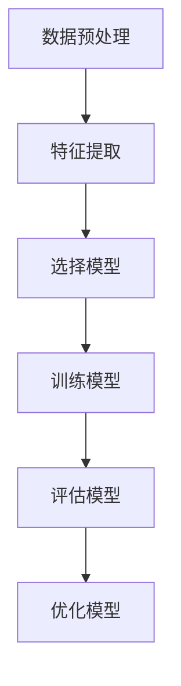
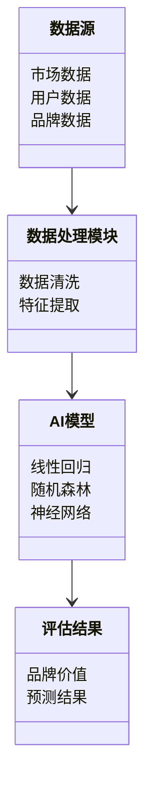

                 


# AI驱动的企业品牌价值量化评估系统

## 关键词
- 人工智能
- 品牌价值
- 数据驱动
- 量化评估
- 系统架构

## 摘要
《AI驱动的企业品牌价值量化评估系统》一书深入探讨了如何利用人工智能技术来量化评估企业品牌价值。通过数据驱动的方法，结合机器学习算法和系统架构设计，本书详细讲解了从数据收集、模型训练到系统实现的全过程。内容涵盖背景介绍、核心概念、算法原理、系统架构设计、项目实战以及最佳实践，帮助读者全面理解并掌握AI驱动的品牌价值评估系统的构建与应用。

---

# 第一部分: AI驱动的企业品牌价值量化评估系统背景介绍

## 第1章: 问题背景与描述

### 1.1 问题背景
#### 1.1.1 传统品牌价值评估的局限性
传统品牌价值评估方法依赖主观判断和经验分析，难以量化和实时更新。企业需要一种更高效、更精准的方法来评估品牌价值。

#### 1.1.2 数字化时代品牌价值的重要性
在数字化时代，品牌价值不仅体现在产品和服务上，还体现在品牌在社交媒体、用户反馈和市场表现中的影响力。

#### 1.1.3 AI技术在品牌价值评估中的潜力
AI技术可以通过大数据分析和机器学习算法，快速处理海量数据，为品牌价值评估提供更精准的预测和洞察。

### 1.2 问题描述
#### 1.2.1 品牌价值的多维度定义
品牌价值可以从市场表现、用户忠诚度、品牌影响力等多个维度进行评估。

#### 1.2.2 数据驱动的品牌价值评估需求
企业需要通过数据驱动的方法，量化品牌价值，以便更好地制定品牌战略和优化资源配置。

#### 1.2.3 当前品牌价值评估中的技术挑战
传统评估方法存在数据不足、模型简单、实时性差等问题，难以满足现代企业的需求。

### 1.3 问题解决
#### 1.3.1 AI驱动的解决方案概述
通过AI技术，构建一个能够实时分析数据、预测品牌价值的系统，帮助企业在复杂市场中做出更明智的决策。

#### 1.3.2 数据收集与处理的关键作用
数据是AI模型的基础，高质量的数据能够显著提升模型的预测精度和稳定性。

#### 1.3.3 AI算法在品牌价值预测中的应用
利用机器学习算法，如线性回归、随机森林和神经网络，构建品牌价值预测模型。

### 1.4 边界与外延
#### 1.4.1 系统的边界定义
系统仅关注品牌价值的量化评估，不涉及品牌战略的制定和执行。

#### 1.4.2 相关领域的外延分析
品牌价值评估与市场分析、消费者行为研究等领域密切相关，需要多学科的协同。

#### 1.4.3 与其他系统的区别与联系
与其他数据分析系统相比，本系统专注于品牌价值的量化，但需要与其他市场分析系统协同工作。

### 1.5 核心要素与组成
#### 1.5.1 数据来源的多样性
系统需要整合社交媒体数据、市场调研数据、用户行为数据等多源数据。

#### 1.5.2 模型算法的选择与优化
选择合适的算法并进行调优，确保模型的准确性和高效性。

#### 1.5.3 系统架构的设计原则
系统架构需要具备可扩展性、高可用性和良好的可维护性。

## 第2章: 核心概念与联系

### 2.1 核心概念原理
#### 2.1.1 品牌价值的多维度评估指标
品牌价值可以从市场表现、用户忠诚度、品牌影响力等多个维度进行评估。

#### 2.1.2 AI技术在品牌价值评估中的应用原理
通过机器学习算法，AI系统能够从海量数据中提取特征，构建预测模型，量化品牌价值。

#### 2.1.3 数据驱动的品牌价值预测模型
数据驱动的模型能够基于实时数据，动态更新品牌价值评估结果。

### 2.2 概念属性特征对比
| 概念 | 特征1 | 特征2 | 特征3 |
|------|-------|-------|-------|
| 品牌价值 | 数据驱动 | 多维度 | 动态变化 |
| AI算法 | 高效性 | 精准性 | 可扩展性 |

### 2.3 ER实体关系图
```mermaid
er
actor: 用户
model: 品牌价值评估模型
data: 数据源
process: 数据处理流程
result: 评估结果
actor --> data
data --> process
process --> model
model --> result
```

---

# 第二部分: 算法原理讲解

## 第3章: 算法原理

### 3.1 数据预处理
#### 3.1.1 数据清洗
去除无效数据、处理缺失值、标准化数据。

#### 3.1.2 数据特征提取
从原始数据中提取有意义的特征，如情感分析特征、市场表现特征。

### 3.2 机器学习模型
#### 3.2.1 线性回归模型
$$ y = \beta_0 + \beta_1x_1 + \beta_2x_2 + ... + \beta_nx_n $$
其中，$y$ 是品牌价值预测值，$x_i$ 是特征变量，$\beta_i$ 是模型参数。

#### 3.2.2 随机森林模型
随机森林是一种基于决策树的集成学习算法，能够处理高维数据和非线性关系。

#### 3.2.3 神经网络模型
神经网络通过多层感知机结构，能够捕捉复杂的特征关系，适合处理非线性问题。

### 3.3 模型训练与评估
#### 3.3.1 训练过程
使用训练数据训练模型，调整模型参数，优化预测精度。

#### 3.3.2 评估指标
- 均方误差（MSE）
- R平方值（R²）
- 混淆矩阵（适用于分类任务）

### 3.4 算法流程图


---

# 第三部分: 系统分析与架构设计

## 第4章: 系统分析与架构设计

### 4.1 项目背景
#### 4.1.1 项目目标
构建一个能够实时分析数据、预测品牌价值的AI系统。

#### 4.1.2 项目范围
系统仅关注品牌价值的量化评估，不涉及品牌战略的制定和执行。

### 4.2 系统功能设计
#### 4.2.1 领域模型


### 4.3 系统架构设计
#### 4.3.1 系统架构图


### 4.4 接口设计
#### 4.4.1 系统接口
- 数据输入接口
- 模型调用接口
- 结果输出接口

#### 4.4.2 交互流程
```mermaid
sequence
    用户 --> 数据源: 提供数据
    数据源 --> 数据处理模块: 请求处理
    数据处理模块 --> AI模型: 请求预测
    AI模型 --> 用户: 返回结果
```

---

# 第四部分: 项目实战

## 第5章: 项目实战

### 5.1 环境安装
#### 5.1.1 安装Python
安装Python 3.x，确保版本兼容性。

#### 5.1.2 安装库
安装必要的库，如numpy、pandas、scikit-learn、tensorflow等。

### 5.2 核心代码实现
#### 5.2.1 数据预处理
```python
import pandas as pd
import numpy as np

# 加载数据
data = pd.read_csv('brand_value.csv')

# 数据清洗
data.dropna(inplace=True)
data = data.drop_duplicates()
```

#### 5.2.2 模型训练
```python
from sklearn.model import LinearRegression
from sklearn.metrics import mean_squared_error

# 特征提取
X = data[['feature1', 'feature2', 'feature3']]
y = data['brand_value']

# 训练模型
model = LinearRegression()
model.fit(X, y)

# 预测结果
y_pred = model.predict(X)
print(mean_squared_error(y, y_pred))
```

### 5.3 项目总结
#### 5.3.1 成功经验
- 数据质量对模型性能的影响
- 模型选择与优化的重要性

#### 5.3.2 失败教训
- 数据不足可能导致模型性能不佳
- 模型解释性不足可能影响实际应用

---

# 第五部分: 最佳实践与总结

## 第6章: 最佳实践

### 6.1 小结
- AI驱动的品牌价值量化评估系统能够显著提升品牌评估的效率和精度。
- 数据质量和模型选择是系统成功的关键。

### 6.2 注意事项
- 确保数据的多样性和及时性
- 定期更新模型，避免过时
- 注意模型的可解释性和实用性

### 6.3 拓展阅读
- 《机器学习实战》
- 《深度学习》
- 《数据驱动的品牌管理》

---

# 作者：AI天才研究院 & 禅与计算机程序设计艺术

