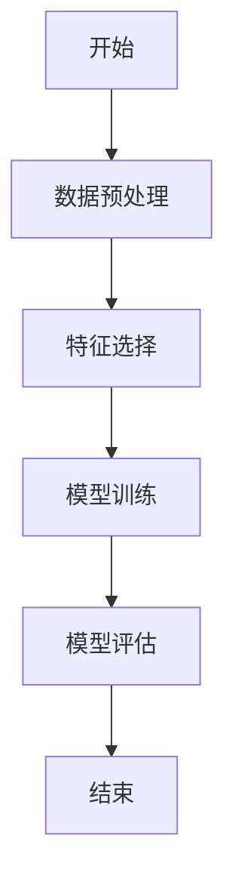
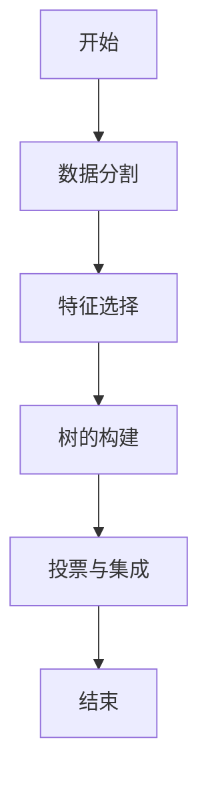
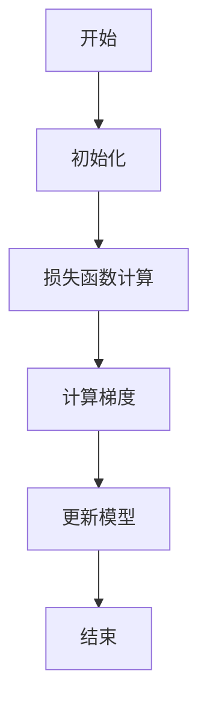
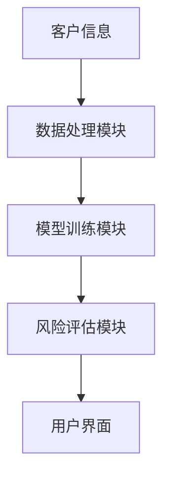

                 


# AI驱动的企业应收账款信用风险评估系统

> 关键词：AI，信用风险评估，应收账款，机器学习，风险管理

> 摘要：本文探讨了如何利用人工智能技术，特别是机器学习算法，来构建一个高效的企业应收账款信用风险评估系统。文章从信用风险评估的基本概念出发，逐步分析了AI在信用风险评估中的核心作用，详细讲解了相关算法的原理和实现，并通过实际案例展示了系统的构建过程和应用价值。

---

# 第一部分: 企业应收账款信用风险评估的背景与挑战

# 第1章: 信用风险评估的基本概念

## 1.1 信用风险的定义与特征

### 1.1.1 信用风险的定义
信用风险是指在信用交易中，交易对手方未能履行其合同义务，导致债权人遭受损失的可能性。在企业应收账款管理中，信用风险主要表现为客户未能按时支付账款，导致企业的资金链紧张甚至断裂。

### 1.1.2 信用风险的主要特征
- **不确定性**：信用风险的大小取决于多种不确定因素，如市场环境、客户信用状况等。
- **传染性**：信用风险可能在不同企业之间传播，尤其是在供应链中。
- **可测量性**：通过数据分析和建模，信用风险可以被量化和评估。

### 1.1.3 信用风险对企业的影响
- **财务损失**：直接导致企业收入减少，影响财务状况。
- **资金链压力**：增加企业的流动性风险，影响正常的经营运作。
- **声誉损失**：未能及时收款可能影响企业的信誉和市场形象。

## 1.2 企业应收账款管理的现状

### 1.2.1 应收账款的定义与重要性
应收账款是企业在赊销交易中应收取的款项，是企业流动资产的重要组成部分。有效的应收账款管理能够确保企业的资金周转和财务健康。

### 1.2.2 传统应收账款管理的局限性
- **主观性**：依赖于业务人员的经验判断，存在人为误差。
- **效率低下**：传统方法处理大量数据时效率不高，难以应对复杂多变的市场环境。
- **缺乏动态性**：难以及时捕捉市场变化和客户信用状况的变化。

### 1.2.3 现代企业应收账款管理的挑战
- **数据爆炸**：企业每天产生的数据量巨大，传统的管理方式难以处理。
- **复杂性增加**：客户信用状况受到多种因素影响，评估难度加大。
- **竞争压力**：企业需要更快、更准确的决策支持来应对激烈的市场竞争。

## 1.3 AI技术在信用风险评估中的应用价值

### 1.3.1 AI技术的核心优势
- **数据处理能力**：AI能够快速处理大量数据，提取有价值的信息。
- **精准预测**：通过机器学习算法，AI可以准确预测客户的信用风险。
- **实时性**：AI系统可以实时更新数据，提供及时的风险评估结果。

### 1.3.2 AI在信用风险评估中的独特作用
- **自动化评估**：AI能够自动分析客户的信用历史、财务状况等信息，提供客观的评估结果。
- **动态监控**：AI系统可以实时监控客户的信用状况变化，及时发出预警。
- **个性化评估**：AI可以根据客户的特定情况，提供个性化的信用评估报告。

### 1.3.3 应收账款信用风险评估的AI驱动模式
AI驱动的信用风险评估模式通过整合企业内外部数据，利用机器学习算法进行分析，帮助企业做出更科学、更精准的信用决策。

## 1.4 本章小结
本章介绍了信用风险的基本概念、企业应收账款管理的现状以及AI技术在信用风险评估中的应用价值。通过分析传统管理方式的局限性和AI技术的优势，为后续的系统构建奠定了理论基础。

---

# 第二部分: AI驱动信用风险评估的核心概念与联系

# 第2章: AI在信用风险评估中的核心概念

## 2.1 数据特征与风险评估

### 2.1.1 数据特征的提取与选择
在信用风险评估中，数据特征的选择至关重要。常见的特征包括：
- **客户的基本信息**：如注册资金、企业规模等。
- **财务数据**：如资产负债表、利润表中的关键指标。
- **信用历史**：如以往的付款记录、违约情况等。
- **市场数据**：如行业发展趋势、宏观经济指标等。

### 2.1.2 数据特征对信用风险的影响
- **财务指标**：如流动比率、速动比率等，能够反映企业的短期偿债能力。
- **信用历史**：历史违约情况是评估未来信用风险的重要依据。
- **市场因素**：行业景气度和宏观经济环境会影响企业的经营状况。

### 2.1.3 数据特征的可视化分析
通过可视化工具（如Matplotlib、Tableau）对数据特征进行分析，可以帮助更好地理解数据分布和相关性。例如，可以通过散点图分析销售收入与应收账款回收期之间的关系。

## 2.2 模型评估与风险评分

### 2.2.1 信用评分模型的定义
信用评分模型是根据客户的特征数据，预测其信用风险大小的模型。常用的评分模型包括逻辑回归、随机森林等。

### 2.2.2 常见信用评分模型的对比
| 模型名称       | 优点                     | 缺点                       |
|----------------|--------------------------|---------------------------|
| 逻辑回归       | 解释性强                 | 非线性关系处理能力有限     |
| 随机森林       | 抗过拟合能力强            | 解释性较差                 |
| 支持向量机     | 对小数据集表现良好        | 对大数据集处理效率较低     |

### 2.2.3 风险评分的计算与应用
通过模型计算出客户的信用评分后，可以根据评分结果将客户分为不同的信用等级，如AAA、AA、A、BBB、BB、B、CCC、DD等。不同信用等级对应的风险程度不同，企业可以根据信用等级制定相应的收款策略。

## 2.3 系统架构与功能模块

### 2.3.1 系统架构的组成
AI驱动的信用风险评估系统通常包括以下几个部分：
- **数据采集模块**：从企业内部系统和外部数据源获取相关信息。
- **数据处理模块**：对数据进行清洗、转换和特征提取。
- **模型训练模块**：利用机器学习算法对数据进行建模和训练。
- **风险评估模块**：根据模型输出信用评分和风险等级。
- **结果展示模块**：以可视化的方式呈现评估结果，并提供相应的决策支持。

### 2.3.2 功能模块的划分
- **数据管理**：负责数据的存储、查询和维护。
- **模型管理**：包括模型的训练、评估和部署。
- **用户界面**：供用户输入数据、查看结果和进行交互。

### 2.3.3 模块之间的关系与数据流
系统各模块之间通过数据流进行交互，数据从数据采集模块进入系统，经过数据处理模块后，被传递到模型训练模块进行建模，最终在风险评估模块中生成结果，并通过用户界面展示给用户。

## 2.4 本章小结
本章详细介绍了AI在信用风险评估中的核心概念，包括数据特征、模型评估和系统架构。通过对比不同模型的优缺点，帮助读者更好地理解如何选择合适的模型来评估信用风险。

---

# 第三部分: AI驱动信用风险评估的算法原理

# 第3章: 常见信用风险评估算法

## 3.1 逻辑回归模型

### 3.1.1 算法原理
逻辑回归是一种常用的分类算法，适用于二分类问题。其核心思想是通过Logit函数将线性回归的结果映射到概率空间。

### 3.1.2 算法流程图


### 3.1.3 逻辑回归的数学公式
$$ P(y=1|x) = \frac{e^{\beta x}}{1 + e^{\beta x}} $$

### 3.1.4 代码实现示例
```python
import pandas as pd
from sklearn.linear_model import LogisticRegression
from sklearn.metrics import accuracy_score

# 加载数据
data = pd.read_csv('credit_data.csv')
X = data[['年收入', '信用历史', '债务比率']]
y = data['违约情况']

# 模型训练
model = LogisticRegression()
model.fit(X, y)

# 模型预测
y_pred = model.predict(X)

# 模型评估
print('准确率:', accuracy_score(y, y_pred))
```

## 3.2 随机森林模型

### 3.2.1 算法原理
随机森林是一种基于树的集成算法，通过构建多个决策树并进行投票或平均来提高模型的准确性和稳定性。

### 3.2.2 算法流程图


### 3.2.3 随机森林的数学公式
$$ y = \sum_{i=1}^{n} \text{Tree}_i(x) $$

### 3.2.4 代码实现示例
```python
from sklearn.ensemble import RandomForestClassifier

# 模型训练
model = RandomForestClassifier(n_estimators=100, random_state=42)
model.fit(X, y)

# 模型预测
y_pred = model.predict(X)

# 模型评估
print('准确率:', accuracy_score(y, y_pred))
```

## 3.3 XGBoost模型

### 3.3.1 算法原理
XGBoost是一种基于梯度提升的算法，通过迭代优化模型来提高预测性能。

### 3.3.2 算法流程图


### 3.3.3 XGBoost的数学公式
$$ y = \sum_{i=1}^{n} \theta_i t_i $$

### 3.3.4 代码实现示例
```python
import xgboost as xgb

# 模型训练
model = xgb.XGBClassifier(n_estimators=100, learning_rate=0.1, max_depth=3)
model.fit(X, y)

# 模型预测
y_pred = model.predict(X)

# 模型评估
print('准确率:', accuracy_score(y, y_pred))
```

## 3.4 本章小结
本章详细介绍了三种常用的信用风险评估算法：逻辑回归、随机森林和XGBoost。通过对比分析，读者可以更好地理解不同算法的优缺点，并根据实际需求选择合适的算法进行模型训练。

---

# 第四部分: 系统分析与架构设计方案

# 第4章: 系统分析与架构设计

## 4.1 应用场景介绍

### 4.1.1 系统的目标
构建一个基于AI的信用风险评估系统，帮助企业准确评估客户的信用风险，优化应收账款管理。

### 4.1.2 系统的主要功能
- **数据采集**：从企业内部系统和外部数据源获取相关信息。
- **数据处理**：清洗、转换和特征提取。
- **模型训练**：利用机器学习算法进行建模和训练。
- **风险评估**：生成信用评分和风险等级。
- **结果展示**：以可视化的方式呈现评估结果，并提供决策支持。

## 4.2 系统功能设计

### 4.2.1 领域模型设计
```mermaid
classDiagram
class 客户信息 {
    + 姓名：String
    + 身份证号：String
    + 联系方式：String
}
class 账务信息 {
    + 应收账款：Float
    + 逾期天数：Integer
    + 违约记录：Boolean
}
class 风险评估 {
    + 信用评分：Float
    + 风险等级：String
}
客户信息 --> 账务信息：关联关系
客户信息 --> 风险评估：评估依据
```

### 4.2.2 系统架构设计


### 4.2.3 系统交互设计
```mermaid
sequenceDiagram
用户 -> 数据采集模块：提交客户信息
数据采集模块 -> 数据处理模块：传递数据
数据处理模块 -> 模型训练模块：传递处理后的数据
模型训练模块 -> 风险评估模块：传递模型结果
风险评估模块 -> 用户界面：显示评估结果
```

## 4.3 本章小结
本章通过领域模型和系统架构图，详细描述了AI驱动的信用风险评估系统的功能设计和交互流程。通过图表的形式，帮助读者更好地理解系统的构建过程。

---

# 第五部分: 项目实战

# 第5章: 项目实战

## 5.1 环境安装与配置

### 5.1.1 安装Python环境
建议使用Anaconda分布，它包含了Python、Jupyter Notebook以及常用的机器学习库。

```bash
conda install -n py38 python=3.8
```

### 5.1.2 安装机器学习库
```bash
pip install scikit-learn xgboost pandas matplotlib
```

## 5.2 系统核心功能实现

### 5.2.1 数据预处理
```python
import pandas as pd
from sklearn.preprocessing import StandardScaler

# 加载数据
data = pd.read_csv('credit_data.csv')

# 数据清洗
data.dropna(inplace=True)

# 特征选择
X = data[['年收入', '信用历史', '债务比率']]
y = data['违约情况']

# 数据标准化
scaler = StandardScaler()
X_scaled = scaler.fit_transform(X)
```

### 5.2.2 模型训练与评估
```python
from sklearn.ensemble import RandomForestClassifier
from sklearn.metrics import classification_report

# 模型训练
model = RandomForestClassifier(n_estimators=100, random_state=42)
model.fit(X_scaled, y)

# 模型预测
y_pred = model.predict(X_scaled)

# 模型评估
print(classification_report(y, y_pred))
```

### 5.2.3 结果可视化
```python
from sklearn.metrics import confusion_matrix, ConfusionMatrixDisplay

# 绘制混淆矩阵
cm = confusion_matrix(y, y_pred, labels=model.classes_)
disp = ConfusionMatrixDisplay(confusion_matrix=cm, display_labels=model.classes_)
disp.plot(cmap='Blues')
```

## 5.3 项目小结
本章通过实际案例，详细讲解了如何利用Python和机器学习库实现AI驱动的信用风险评估系统的核心功能。通过数据预处理、模型训练和结果可视化，展示了系统的实际应用价值。

---

# 第六部分: 最佳实践

# 第6章: 最佳实践

## 6.1 小结
通过本文的详细讲解，读者可以了解到AI技术在信用风险评估中的重要作用，并掌握如何利用机器学习算法构建高效的信用风险评估系统。

## 6.2 注意事项
- **数据隐私**：在处理客户数据时，必须遵守相关法律法规，保护数据隐私。
- **模型解释性**：在实际应用中，模型的解释性非常重要，尤其是在需要向管理层汇报时。
- **持续优化**：信用风险评估是一个动态过程，需要定期更新模型和数据，以适应市场环境的变化。

## 6.3 拓展阅读
- **《机器学习实战》**：学习更多机器学习算法的实现和应用。
- **《风险管理与信用评估》**：深入了解信用风险评估的理论基础和实践方法。

---

# 作者：AI天才研究院/AI Genius Institute & 禅与计算机程序设计艺术 /Zen And The Art of Computer Programming

