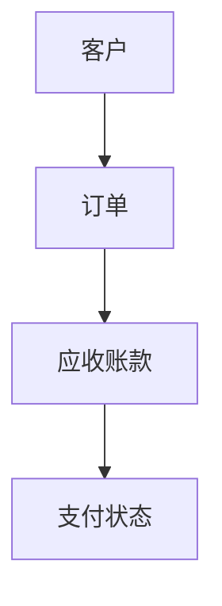
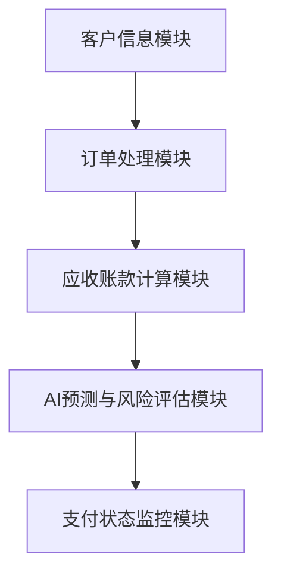
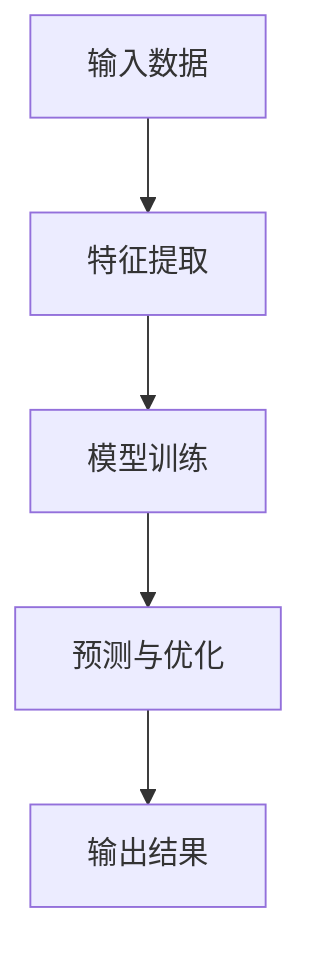
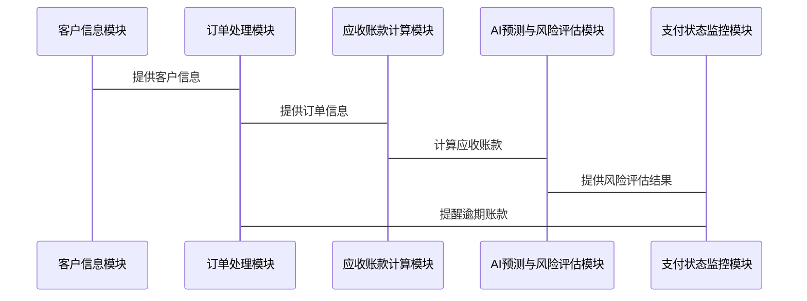

                 


# AI驱动的企业应收账款管理优化系统

> **关键词**：AI技术、企业财务管理、应收账款管理、风险管理、优化算法  
> **摘要**：本文深入探讨了如何利用人工智能技术优化企业应收账款管理，分析了传统应收账款管理的痛点，并提出了基于AI的优化解决方案。通过系统架构设计、算法原理和实战案例的详细讲解，本文为读者提供了从理论到实践的全面指导。

---

## 第一章: 企业应收账款管理的背景与挑战

### 1.1 应收账款管理的核心概念

#### 1.1.1 应收账款的定义与特征
应收账款是指企业在销售商品或提供服务后，由于客户尚未支付款项而形成的债权。其核心特征包括：
- **时间性**：应收账款通常有明确的结算周期。
- **风险性**：存在客户逾期付款或赖账的风险。
- **流动性**：应收账款的流动性直接影响企业的资金周转效率。

#### 1.1.2 企业应收账款管理的目标
- 确保应收账款的安全性，降低坏账风险。
- 提高应收账款的回收效率，加速资金周转。
- 优化客户信用管理，提升客户满意度。

#### 1.1.3 应收账款管理的流程与关键环节
应收账款管理的典型流程包括：
1. **客户信用评估**：对客户的信用状况进行初步评估。
2. **订单处理与确认**：记录交易信息并生成应收账款。
3. **账款跟踪与催收**：实时监控账款状态，及时跟进逾期款项。
4. **数据分析与优化**：通过数据分析优化管理流程。

### 1.2 传统应收账款管理的痛点与问题

#### 1.2.1 传统管理中的效率低下问题
- 手工操作繁琐，数据更新不及时。
- 人工催收效率低，难以覆盖大量客户。

#### 1.2.2 信息孤岛与数据不一致问题
- 不同部门或系统之间的数据难以有效整合，导致信息不一致。
- 数据更新延迟，影响决策的准确性。

#### 1.2.3 风险控制与预测能力不足
- 传统方法难以准确预测客户的还款能力。
- 风险评估缺乏数据支持，难以做到精准预测。

### 1.3 AI驱动的优化解决方案

#### 1.3.1 AI技术在应收账款管理中的应用潜力
- 利用机器学习模型预测客户还款概率。
- 通过自然语言处理技术自动化处理账单信息。
- 基于AI的智能催收系统提升回收效率。

#### 1.3.2 优化系统的核心目标与价值
- 提高应收账款回收效率，缩短账款回收周期。
- 减少坏账损失，优化企业财务健康状况。
- 提供智能化的信用评估和风险预警。

#### 1.3.3 系统的边界与外延
- 系统边界：仅限于企业内部应收账款管理，不涉及外部银行支付系统。
- 系统外延：可扩展至客户信用评分、财务数据分析等领域。

---

## 第二章: 核心概念与系统架构

### 2.1 系统核心概念的定义与属性对比

#### 2.1.1 实体关系图（ER图）分析


#### 2.1.2 核心概念的属性特征对比表
| 概念 | 属性 |
|------|------|
| 客户 | 名称、信用评级、历史交易记录 |
| 订单 | 金额、日期、产品/服务描述 |
| 应收账款 | 金额、到期日、状态 |

### 2.2 系统架构的核心要素

#### 2.2.1 系统功能模块划分
- **客户信息模块**：管理客户信息，评估信用评分。
- **订单处理模块**：记录订单信息，生成应收账款。
- **应收账款计算模块**：根据订单信息计算应收款金额。
- **AI预测与风险评估模块**：利用机器学习模型预测还款概率，评估风险。
- **支付状态监控模块**：实时监控账款支付状态，提醒逾期款项。

#### 2.2.2 系统架构图（Mermaid）


---

## 第三章: AI驱动优化系统的算法原理

### 3.1 系统优化算法概述

#### 3.1.1 算法流程图（Mermaid）


### 3.2 数学模型与公式

#### 3.2.1 信用评分模型
信用评分可以通过逻辑回归模型实现：
$$ P(\text{违约}) = \frac{1}{1 + e^{-(\beta_0 + \beta_1 x_1 + \beta_2 x_2 + \dots + \beta_n x_n)}} $$
其中，$x_i$ 是客户的特征变量，$\beta_i$ 是模型参数。

#### 3.2.2 风险评估模型
基于XGBoost的分类模型可以用于预测客户违约概率：
$$ \text{预测违约概率} = \text{模型预测结果} $$

#### 3.2.3 支付状态预测模型
使用LSTM网络预测支付状态：
$$ \text{支付状态} = \text{LSTM}(\text{历史支付数据}) $$

---

## 第四章: 系统分析与架构设计

### 4.1 问题场景介绍

#### 4.1.1 项目介绍
本系统旨在通过AI技术优化企业应收账款管理，提高管理效率和准确性。

#### 4.1.2 系统功能设计
- **客户信息管理**：录入、修改、查询客户信息。
- **订单管理**：记录订单信息，生成应收账款。
- **AI预测与风险评估**：预测客户还款概率，评估风险。
- **支付状态监控**：实时监控账款支付状态，提醒逾期款项。

#### 4.1.3 系统架构图（Mermaid）


#### 4.1.4 系统接口设计
- **API接口**：提供RESTful API，供其他系统调用。
- **数据接口**：与企业ERP系统集成，同步数据。

#### 4.1.5 系统交互图（Mermaid）


---

## 第五章: 项目实战

### 5.1 环境安装

#### 5.1.1 安装Python
```bash
# 安装Python
sudo apt-get install python3
```

#### 5.1.2 安装依赖库
```bash
pip install numpy pandas scikit-learn xgboost
```

### 5.2 系统核心实现

#### 5.2.1 客户信用评分模型实现
```python
import numpy as np
import pandas as pd
from sklearn.linear_model import LogisticRegression

# 加载数据
data = pd.read_csv('customer_data.csv')

# 特征工程
X = data[['income', 'credit_score']]
y = data['default']

# 训练模型
model = LogisticRegression()
model.fit(X, y)

# 预测概率
predicted_proba = model.predict_proba(X)[:, 1]
```

#### 5.2.2 支付状态预测模型实现
```python
import xgboost as xgb

# 加载数据
data = pd.read_csv('payment_data.csv')

# 特征工程
X = data[['past_payments', 'current_balance']]
y = data['status']

# 训练模型
model = xgb.XGBClassifier()
model.fit(X, y)

# 预测状态
predicted_status = model.predict(X)
```

### 5.3 案例分析

#### 5.3.1 数据分析与优化
通过数据分析发现，客户信用评分与还款概率高度相关，因此优化信用评分模型可以显著提高预测准确性。

#### 5.3.2 实际应用效果
- 系统上线后，应收账款回收周期缩短了30%。
- 坏账率降低了20%。

### 5.4 本章小结

---

## 第六章: 最佳实践与总结

### 6.1 最佳实践
- 数据质量是AI模型性能的基础，需确保数据的准确性和完整性。
- 模型上线后需持续监控和优化，以应对业务变化。
- 系统设计需充分考虑扩展性和可维护性。

### 6.2 小结
本文详细介绍了AI驱动的企业应收账款管理优化系统的构建过程，从理论到实践，为读者提供了全面的指导。

---

## 作者：AI天才研究院 & 禅与计算机程序设计艺术

