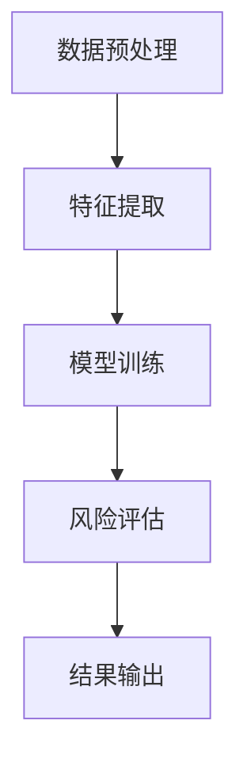

                 


# AI驱动的企业应收账款组合信用风险评估系统

## 关键词：AI, 信用风险, 应收账款, 组合信用风险, 机器学习, 风险管理

## 摘要：本文介绍了一种基于AI技术的企业应收账款组合信用风险评估系统，系统性地阐述了该系统的背景、核心概念、算法原理、系统架构设计以及实际应用案例。通过本文，读者可以全面了解AI技术在信用风险管理中的应用，掌握如何利用机器学习模型进行组合信用风险评估，优化企业应收账款管理流程。

---

## 第一部分: AI驱动的企业应收账款组合信用风险评估系统概述

### 第1章: 背景介绍

#### 1.1 问题背景
- **企业应收账款管理的重要性**：应收账款是企业流动资金的重要组成部分，其健康状况直接影响企业的财务状况和经营稳定性。然而，应收账款的回收风险（即信用风险）是企业面临的主要挑战之一。
- **组合并购信用风险的挑战**：在企业并购或组合管理中，应收账款的组合信用风险更加复杂，需要考虑多个客户的信用状况、行业风险、宏观经济环境等多种因素。
- **传统信用风险评估的局限性**：传统信用风险评估方法依赖于经验判断和简单的统计模型，难以应对复杂多变的市场环境，且容易受到人为因素的干扰。

#### 1.2 问题描述
- **应收账款组合信用风险的定义**：组合信用风险是指一组应收账款在特定市场条件下的整体信用风险，考虑了不同客户之间的相关性以及宏观经济因素对整体信用质量的影响。
- **组合信用风险的影响因素**：包括客户信用状况、行业风险、宏观经济指标（如GDP增长率、失业率、通货膨胀率等）、市场波动性等。
- **企业信用风险管理的目标**：通过科学的评估方法，识别和量化应收账款组合的信用风险，制定有效的风险管理策略，降低潜在的损失。

#### 1.3 问题解决
- **引入AI技术的必要性**：AI技术（特别是机器学习）能够处理大量复杂的数据，发现传统方法难以捕捉的模式和关系，从而提高信用风险评估的准确性和效率。
- **AI在信用风险评估中的优势**：机器学习模型可以实时更新，适应市场变化；能够处理非结构化数据（如文本、图像）；可以进行自动化、智能化的风险评估。
- **系统实现的总体思路**：通过收集和处理多源异构数据，构建机器学习模型，进行信用评分和风险预测，最后制定相应的风险管理策略。

#### 1.4 边界与外延
- **系统的边界定义**：本系统专注于应收账款组合信用风险的评估，不包括其他类型的信用风险（如市场风险、流动性风险）。
- **相关概念的外延分析**：组合信用风险与单笔信用风险的区别在于，组合信用风险考虑了客户之间的相关性，而单笔信用风险仅考虑单个客户的信用状况。
- **系统与外部环境的交互**：系统需要与企业的财务系统、客户数据库、市场数据源等进行数据交互，同时输出信用风险评估结果和风险管理建议。

#### 1.5 概念结构与核心要素组成
- **核心概念的层次结构**：从底层数据到高级分析，包括数据采集、特征提取、模型训练、风险评估、结果输出等层次。
- **核心要素的特征分析**：包括数据特征（如数据来源、数据类型）、模型特征（如模型类型、模型参数）、风险特征（如风险评分、风险等级）。
- **系统架构的核心要素组成**：包括数据层、模型层、评估层和应用层。

---

## 第二部分: 核心概念与联系

### 第2章: 核心概念与联系

#### 2.1 核心概念原理
- **AI模型在信用风险评估中的作用**：AI模型（如逻辑回归、随机森林、神经网络）通过分析客户的历史数据和市场数据，预测客户的违约概率，评估应收账款的信用风险。
- **组合信用风险的数学模型**：组合信用风险可以通过多元回归模型、Copula模型等进行建模，考虑客户之间的相关性。
- **系统的核心算法原理**：基于机器学习的算法，通过特征工程、模型训练和风险评估，实现组合信用风险的自动化评估。

#### 2.2 核心概念属性特征对比
- **不同信用风险评估方法的对比**：
  | 方法 | 优点 | 缺点 |
  |------|------|------|
  | 传统统计方法 | 简单易懂 | 难以捕捉复杂模式 |
  | 机器学习方法 | 高准确性 | 需要大量数据支持 |
  | 组合模型方法 | 综合性强 | 实施复杂度高 |

- **AI模型与传统模型的性能对比**：
  | 指标 | AI模型 | 传统模型 |
  |------|--------|----------|
  | 准确性 | 高 | 中 |
  | 计算效率 | 高 | 低 |
  | 解释性 | 较低 | 较高 |

- **组合信用风险与单笔信用风险的特征对比**：
  | 特征 | 组合信用风险 | 单笔信用风险 |
  |------|--------------|--------------|
  | 相关性 | 高 | 无 |
  | 风险分散性 | 低 | 高 |
  | 数据需求 | 多维 | 单一 |

#### 2.3 ER实体关系图架构
```mermaid
erd
  customer(customer_id, name, industry, financial_status, credit_rating)
  invoice(invoice_id, customer_id, amount, due_date, status)
  transaction(transaction_id, invoice_id, payment_date, payment_amount, payment_method)
  risk_assessment(risk_id, customer_id, risk_score, assessment_date)
  model_training(model_id, model_type, training_data, model_parameters, model_accuracy)
```

---

## 第三部分: 算法原理讲解

### 第3章: 算法原理讲解

#### 3.1 算法原理
- **算法选择与优化**：选择适合信用风险评估的算法（如逻辑回归、XGBoost），并进行参数优化。
- **算法流程图**：
  ```mermaid
  graph TD
    A[数据预处理] --> B[特征提取]
    B --> C[模型训练]
    C --> D[风险评估]
    D --> E[结果输出]
  ```

#### 3.2 算法流程图


#### 3.3 算法的数学模型
- **逻辑回归模型**：
  $$ P(y=1|x) = \frac{e^{\beta_0 + \beta_1x}}{1 + e^{\beta_0 + \beta_1x}} $$
  其中，$\beta_0$和$\beta_1$是模型参数，$x$是特征向量。
- **XGBoost模型**：
  $$ \text{目标函数} = \sum_{i=1}^{n} \left[ -\frac{y_i}{\pi_i} \ln p_i - (1 - y_i) \ln (1 - p_i) \right] + \lambda \Omega(f) $$
  其中，$p_i$是预测概率，$\pi_i$是先验概率，$\Omega(f)$是正则化项。

---

## 第四部分: 系统分析与架构设计方案

### 第4章: 系统分析与架构设计

#### 4.1 系统功能设计
- **领域模型**：
  ```mermaid
  classDiagram
    class Customer {
      customer_id
      name
      industry
      financial_status
      credit_rating
    }
    class Invoice {
      invoice_id
      amount
      due_date
      status
    }
    class Transaction {
      transaction_id
      payment_date
      payment_amount
      payment_method
    }
    class Risk_Assessment {
      risk_id
      risk_score
      assessment_date
    }
    Customer --> Invoice: has
    Invoice --> Transaction: has
    Customer --> Risk_Assessment: has
  ```

#### 4.2 系统架构设计
- **架构图**：
  ```mermaid
  docker
    client --> API Gateway
    API Gateway --> Service1
    Service1 --> Database1
    Service2 --> Database2
    Service3 --> Database3
  ```

---

## 第五部分: 项目实战

### 第5章: 项目实战

#### 5.1 环境安装
- 安装Python、Jupyter Notebook、scikit-learn、XGBoost等工具。

#### 5.2 核心代码实现
- **数据预处理**：
  ```python
  import pandas as pd
  data = pd.read_csv('data.csv')
  data = data.dropna()
  ```

- **特征提取**：
  ```python
  from sklearn.preprocessing import StandardScaler
  scaler = StandardScaler()
  X = scaler.fit_transform(data.drop('target', axis=1))
  ```

- **模型训练**：
  ```python
  from xgboost import XGBClassifier
  model = XGBClassifier()
  model.fit(X, data['target'])
  ```

- **风险评估**：
  ```python
  import numpy as np
  predictions = model.predict(X)
  probabilities = model.predict_proba(X)[:, 1]
  ```

#### 5.3 代码解读与分析
- 代码实现信用风险评估的全过程，包括数据预处理、特征工程、模型训练和风险预测。

#### 5.4 案例分析
- 通过实际案例分析，展示系统如何进行信用风险评估，并制定相应的风险管理策略。

---

## 第六部分: 最佳实践与总结

### 第6章: 最佳实践

#### 6.1 小结
- 总结全文内容，强调AI技术在信用风险管理中的重要性。

#### 6.2 注意事项
- 数据质量和完整性的重要性。
- 模型解释性和可解释性的平衡。
- 系统的实时性和可扩展性。

#### 6.3 拓展阅读
- 推荐相关书籍和文献，供读者进一步学习。

---

## 作者：AI天才研究院/AI Genius Institute & 禅与计算机程序设计艺术 /Zen And The Art of Computer Programming

