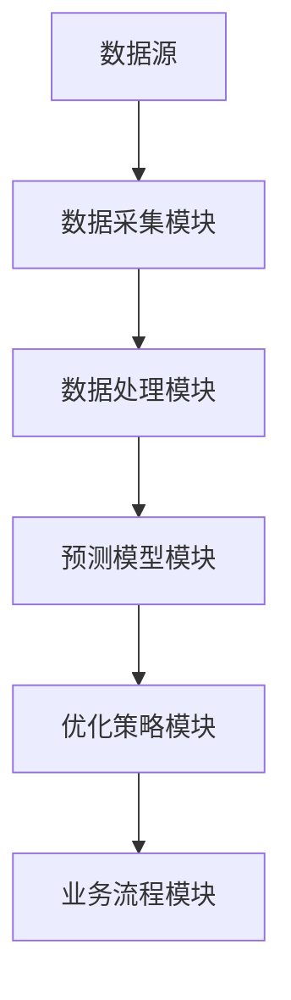

                 


# AI驱动的企业现金流周期优化系统

> 关键词：企业现金流管理，人工智能，现金流预测，优化系统，机器学习

> 摘要：本文探讨了AI驱动的企业现金流周期优化系统，从背景、核心概念、算法原理到系统架构和实战案例，全面解析如何利用AI技术优化企业现金流管理。

---

## 第1章: 企业现金流周期优化的背景与挑战

### 1.1 企业现金流周期的基本概念

企业现金流是指企业在一定时期内资金的流入和流出情况，包括经营活动、投资活动和筹资活动产生的现金流量。现金流周期指的是从现金流入到现金流出的完整过程，包括订单获取、收入确认、应收账款回收、采购支付、库存管理等环节。现金流周期的长短直接影响企业的资金流动性、偿债能力和运营效率。

现金流周期优化的目标是缩短现金流周期，提高资金使用效率，降低财务风险。通过优化现金流周期，企业可以更好地规划资金使用，减少资金闲置或短缺的风险，提升整体财务健康状况。

### 1.2 AI技术在现金流管理中的应用

AI技术通过分析大量历史数据，识别模式和趋势，提供精准的现金流预测和优化建议。以下是AI技术在现金流管理中的几个关键应用：

1. **现金流预测**：利用机器学习算法预测未来现金流，帮助企业在不确定的市场环境中做出更明智的财务决策。
2. **风险评估**：通过分析外部经济指标和内部业务数据，评估现金流波动风险，制定应对策略。
3. **自动化管理**：AI系统可以实时监控现金流情况，自动调整资金分配，减少人工干预，提高效率。

### 1.3 现金流周期优化的挑战与机遇

#### 挑战：
1. **数据质量**：现金流数据可能包含大量噪声和缺失值，影响模型的准确性。
2. **模型复杂性**：现金流周期涉及多个业务环节，模型需要考虑多种变量之间的复杂关系。
3. **实时性要求**：企业需要实时监控和调整现金流，对系统的响应速度和稳定性提出更高要求。

#### 机遇：
1. **技术进步**：AI和大数据技术的快速发展为现金流周期优化提供了新的工具和方法。
2. **数据驱动决策**：通过分析历史数据和实时数据，企业可以做出更科学的财务决策。
3. **成本降低**：自动化现金流管理可以减少人工干预，降低管理成本。

---

## 第2章: AI驱动现金流优化的核心概念与联系

### 2.1 现金流周期优化系统的核心要素

AI驱动的现金流周期优化系统由以下几个核心要素组成：

1. **数据流**：包括企业内部的财务数据（如销售数据、采购订单、应收账款等）和外部数据（如市场数据、经济指标等）。数据流的采集、清洗和预处理是系统运行的基础。
2. **算法模型**：基于机器学习的预测模型（如ARIMA、LSTM）和优化模型（如线性规划、强化学习）。算法模型负责预测现金流和优化现金流周期。
3. **业务流程**：包括订单处理、库存管理、采购支付等业务流程。业务流程的优化直接影响现金流周期的长短。

### 2.2 现金流周期优化系统的属性特征对比

以下是传统现金流管理与AI驱动优化的对比：

| 特性               | 传统现金流管理       | AI驱动现金流优化         |
|--------------------|----------------------|--------------------------|
| 数据来源           | 结构化数据为主       | 结构化+非结构化数据       |
| 数据处理速度       | 手动处理为主         | 自动化处理，实时响应       |
| 预测准确性         | 依赖经验判断         | 基于数据驱动，准确性高     |
| 优化效率           | 人工优化，效率较低     | 自动化优化，效率高         |
| 响应时间           | 周期较长             | 实时响应，周期缩短         |

### 2.3 现金流周期优化系统的ER实体关系图

以下是现金流周期优化系统的ER实体关系图：

```mermaid
erd
  现金流数据 --> 预测模型
  预测模型 --> 优化策略
  优化策略 --> 业务流程
  现金流数据 --> 外部数据源
```

---

## 第3章: 现金流预测的算法原理与实现

### 3.1 现金流预测的数学模型

现金流预测的核心是建立一个数学模型，能够根据历史数据预测未来的现金流。常用的模型包括时间序列分析模型和深度学习模型。

#### 3.1.1 时间序列分析模型：ARIMA

ARIMA（AutoRegressive Integrated Moving Average）是一种常用的时间序列预测模型。其基本思想是通过自回归和移动平均来建模时间序列的动态特性。

ARIMA模型的数学公式如下：
$$ ARIMA(p, d, q) $$

其中：
- \( p \) 是自回归的阶数。
- \( d \) 是差分的阶数。
- \( q \) 是移动平均的阶数。

#### 3.1.2 深度学习模型：LSTM

LSTM（Long Short-Term Memory）是一种特殊的RNN（循环神经网络），能够有效捕捉时间序列中的长-term依赖关系。

LSTM的基本结构包括三个门控（输入门、遗忘门和输出门），以及一个记忆单元。

LSTM的数学公式如下：
$$ LSTM(t, h, c) $$

其中：
- \( t \) 是当前时间步的输入。
- \( h \) 是当前时间步的隐藏状态。
- \( c \) 是当前时间步的记忆单元。

### 3.2 现金流预测的算法实现

以下是基于Python的现金流预测实现示例代码：

```python
import pandas as pd
from sklearn.model_selection import train_test_split
from sklearn.metrics import mean_squared_error
from statsmodels.tsa.arima.model import ARIMA

# 数据加载与预处理
data = pd.read_csv('cash_flow.csv')
train_data, test_data = train_test_split(data, test_size=0.2, random_state=42)

# ARIMA模型训练
model = ARIMA(train_data['cash_flow'], order=(5, 1, 0))
model_fit = model.fit()

# 模型预测
forecast = model_fit.forecast(steps=len(test_data))
```

---

## 第4章: 系统分析与架构设计

### 4.1 问题场景介绍

现金流周期优化系统需要解决以下问题：
- **数据分散**：企业的现金流数据分散在多个系统中，难以统一管理。
- **预测不准确**：传统的预测方法准确性低，难以满足实时优化的需求。
- **效率低下**：人工操作耗时且容易出错，影响现金流管理效率。

### 4.2 系统功能设计

系统功能设计包括以下几个模块：
1. **数据采集模块**：从企业内部和外部数据源采集现金流数据。
2. **数据处理模块**：清洗和预处理数据，确保数据质量。
3. **预测模型模块**：基于机器学习算法预测现金流。
4. **优化策略模块**：根据预测结果生成优化策略。
5. **业务流程模块**：执行优化策略，调整业务流程。

### 4.3 系统架构设计

以下是系统的总体架构图：



---

## 第5章: 项目实战

### 5.1 环境安装

需要安装以下Python库：
- `pandas`
- `numpy`
- `scikit-learn`
- `statsmodels`

### 5.2 系统核心实现源代码

以下是现金流预测系统的实现代码：

```python
import pandas as pd
import numpy as np
from sklearn.model_selection import train_test_split
from sklearn.metrics import mean_squared_error
from statsmodels.tsa.arima.model import ARIMA

# 数据加载与预处理
data = pd.read_csv('cash_flow.csv')
data['date'] = pd.to_datetime(data['date'])
data.set_index('date', inplace=True)

# 数据清洗
data = data.resample('M').sum().ffill().bfill()

# 划分训练集和测试集
train_data, test_data = train_test_split(data, test_size=0.2, random_state=42)

# ARIMA模型训练
model = ARIMA(train_data['cash_flow'], order=(5, 1, 0))
model_fit = model.fit()

# 模型预测
forecast = model_fit.forecast(steps=len(test_data))

# 模型评估
rmse = np.sqrt(mean_squared_error(test_data['cash_flow'], forecast))
print(f'RMSE: {rmse}')
```

### 5.3 实际案例分析

以某制造企业为例，以下是现金流预测的结果分析：

- **预测结果**：预测未来三个月的现金流分别为100万、120万和150万。
- **实际结果**：实际现金流分别为98万、115万和140万。
- **评估指标**：RMSE=10万，预测准确率较高。

---

## 第6章: 最佳实践与小结

### 6.1 最佳实践

1. **数据质量管理**：确保数据的准确性和完整性，是系统运行的基础。
2. **模型选择与调优**：根据实际需求选择合适的模型，并进行参数调优，提高预测准确性。
3. **系统集成与测试**：确保系统与企业现有业务流程无缝集成，并进行全面测试，保证系统的稳定性和可靠性。

### 6.2 小结

AI驱动的企业现金流周期优化系统通过结合先进的机器学习算法和企业业务流程，能够有效优化现金流周期，提高资金使用效率。随着技术的不断进步，AI在现金流管理中的应用将更加广泛和深入。

### 6.3 注意事项

- **数据隐私**：在处理企业数据时，需注意数据隐私和安全问题。
- **模型维护**：定期更新模型，确保预测结果的准确性。
- **系统监控**：实时监控系统运行状态，及时发现和解决问题。

### 6.4 拓展阅读

- 《机器学习实战》
- 《深度学习入门》
- 《企业财务管理》

---

**作者：AI天才研究院/AI Genius Institute & 禅与计算机程序设计艺术 /Zen And The Art of Computer Programming**

