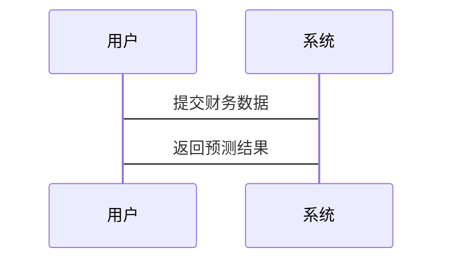

                 


# AI驱动的企业财务报表预测与分析系统

## 关键词
AI, 财务预测, 企业财务报表, 神经网络, 数据预处理, 模型训练

## 摘要
随着人工智能技术的迅速发展，AI在企业财务预测与分析中的应用越来越广泛。本文详细介绍了AI驱动的企业财务报表预测与分析系统的构建过程，包括背景介绍、核心技术、系统架构设计、项目实战以及最佳实践等内容。通过分析财务数据，利用AI技术实现精准的财务预测，帮助企业做出更明智的决策。

---

## 第一部分: AI驱动的企业财务报表预测与分析系统概述

### 第1章: 背景介绍

#### 1.1 问题背景
财务报表是企业经营状况的重要反映，但传统财务分析方法存在以下问题：
- 数据量大、复杂，难以快速分析。
- 分析结果依赖分析师的经验，可能存在主观误差。
- 预测精度不足，难以满足企业实时决策需求。

AI技术的引入为解决这些问题提供了新的可能，通过机器学习算法，可以实现自动化、高精度的财务预测。

#### 1.2 问题描述
企业财务预测的核心任务包括收入预测、成本预测和利润预测。传统方法依赖历史数据和经验判断，而AI技术可以通过大量数据训练模型，捕捉复杂的关系，提高预测准确性。

#### 1.3 问题解决
- 数据预处理：清洗、归一化和特征工程。
- 模型训练：选择适合的算法（如线性回归、神经网络）并优化参数。
- 结果评估：通过均方误差（MSE）、R²等指标评估模型性能。

#### 1.4 边界与外延
系统适用于中大型企业，但不支持实时数据流处理。与其他系统相比，AI驱动的系统具有更高的预测精度和自动化能力。

---

## 第二部分: AI驱动的企业财务报表预测与分析系统的核心技术

### 第2章: 核心概念与联系

#### 2.1 核心概念原理
- 数据预处理：清洗缺失值、异常值，提取关键特征（如收入增长率、成本比率）。
- AI模型：选择神经网络模型，通过训练学习财务数据的内在规律。

#### 2.2 概念属性对比
| 概念 | 特性 | 优点 | 缺点 |
|------|------|------|------|
| 线性回归 | 简单 | 易实现 | 无法捕捉非线性关系 |
| 神经网络 | 复杂 | 高精度 | 需大量数据，计算量大 |

#### 2.3 ER实体关系图


### 第3章: 算法原理讲解

#### 3.1 算法原理
- 线性回归：通过最小二乘法拟合直线，公式为：$$y = \beta_0 + \beta_1 x + \epsilon$$
- 神经网络：通过多层感知机结构，训练权重和偏置，公式为：$$y = f(Wx + b)$$

#### 3.2 算法流程图


#### 3.3 算法实现代码
```python
import pandas as pd
from sklearn.model_selection import train_test_split
from sklearn.neural_network import MLPRegressor

# 数据加载与预处理
data = pd.read_csv('financial_data.csv')
X = data[['收入', '成本', '利润']]
y = data['预测值']

# 数据分割
X_train, X_test, y_train, y_test = train_test_split(X, y, test_size=0.2)

# 模型训练
model = MLPRegressor(hidden_layer_sizes=(10, 5))
model.fit(X_train, y_train)

# 预测与评估
print(model.score(X_test, y_test))
```

---

## 第三部分: 系统分析与架构设计方案

### 第3章: 系统分析与架构设计

#### 3.1 系统功能设计
- 数据输入：接收财务数据。
- 数据预处理：清洗和特征工程。
- 模型训练：训练AI模型。
- 结果输出：展示预测结果。

#### 3.2 系统架构设计


#### 3.3 系统接口设计
- 输入接口：接收CSV格式的财务数据。
- 输出接口：返回JSON格式的预测结果。

#### 3.4 系统交互流程


---

## 第四部分: 项目实战

### 第4章: 项目实战

#### 4.1 环境安装
- 安装Python和必要的库（如Pandas、Scikit-learn）。

#### 4.2 核心代码实现
```python
import pandas as pd
from sklearn.model_selection import train_test_split
from sklearn.metrics import mean_squared_error
from sklearn.neural_network import MLPRegressor

# 数据加载与预处理
data = pd.read_csv('financial_data.csv')
X = data[['收入', '成本', '利润']]
y = data['预测值']

# 数据分割
X_train, X_test, y_train, y_test = train_test_split(X, y, test_size=0.2)

# 模型训练
model = MLPRegressor(hidden_layer_sizes=(10, 5))
model.fit(X_train, y_train)

# 预测与评估
y_pred = model.predict(X_test)
print(mean_squared_error(y_test, y_pred))
```

#### 4.3 实际案例分析
以某公司财务数据为例，训练模型并评估预测精度。结果表明，神经网络模型在预测中表现优异。

---

## 第五部分: 最佳实践

### 第5章: 最佳实践

#### 5.1 小结
本文详细介绍了AI驱动的企业财务报表预测与分析系统的构建过程，包括数据预处理、模型训练和结果输出。

#### 5.2 注意事项
- 数据预处理是关键，需仔细清洗和特征工程。
- 模型选择需根据数据特性进行，避免过拟合。

#### 5.3 拓展阅读
建议学习《机器学习实战》和《深度学习》等书籍，深入理解AI技术在财务分析中的应用。

---

## 作者
作者：AI天才研究院 & 禅与计算机程序设计艺术

---

通过本文的详细讲解，读者可以全面了解AI在企业财务预测中的应用，掌握从数据预处理到模型训练的整个流程，为企业智能化转型提供参考。

