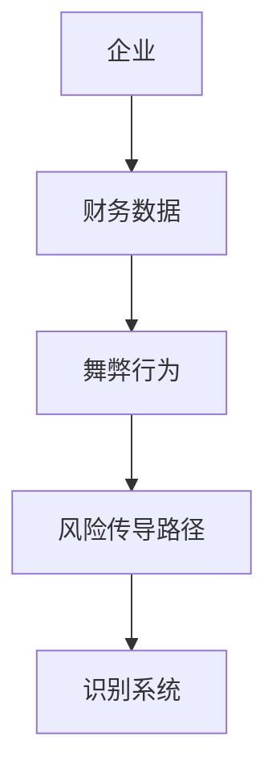
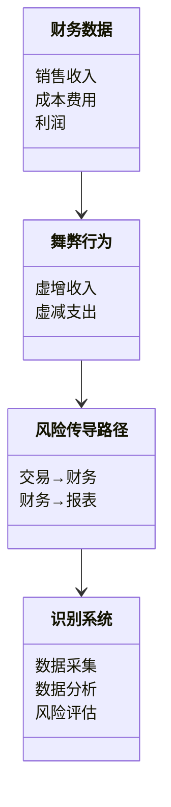
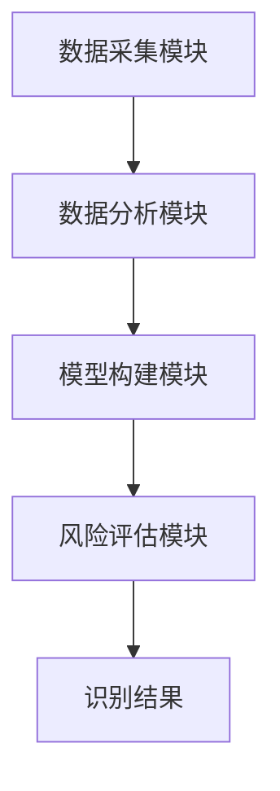
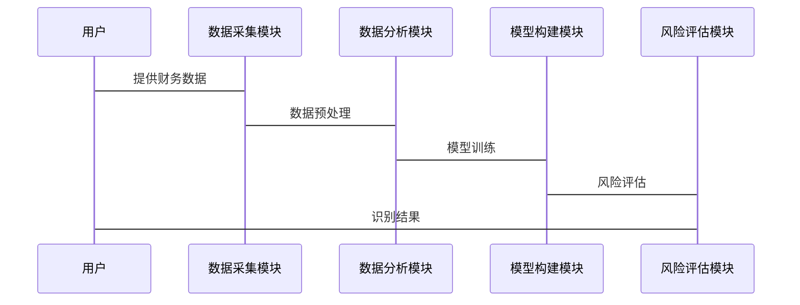

                 


# AI驱动的企业财务舞弊风险传导路径识别系统

## 关键词：AI技术、财务舞弊、风险传导路径、系统识别、风险评估

## 摘要：本文详细探讨了AI技术在企业财务舞弊风险传导路径识别中的应用。通过分析财务舞弊的特征与传统识别方法的局限性，提出了一种基于AI的系统化识别方案。文章从核心概念、算法原理、系统架构、项目实战等多维度展开，构建了一个完整的AI驱动的财务舞弊风险识别系统，为企业风险管理和内部控制提供创新性解决方案。

---

# 第1章 企业财务舞弊风险传导路径识别的背景与问题

## 1.1 问题背景

### 1.1.1 财务舞弊的定义与特征
财务舞弊是指企业通过虚构、篡改或隐瞒财务数据，以达到虚增收入、虚减支出、虚增资产或虚减负债等目的的非法行为。其主要特征包括：
- **隐蔽性**：舞弊行为往往隐藏在正常财务数据中，难以被肉眼察觉。
- **复杂性**：舞弊行为可能涉及多个部门、多笔交易，呈现出复杂的关联性。
- **主观性**：舞弊行为通常由人为故意实施，具有较强的主观性。

### 1.1.2 财务舞弊对企业的影响
财务舞弊对企业的影响是多方面的，主要包括：
- **经济损失**：舞弊行为可能导致企业资产流失或负债增加，直接损害企业的财务健康。
- **信用损失**：舞弊行为会破坏企业的信誉，影响其在市场中的信用评级。
- **法律风险**：企业可能面临法律追究，导致高额罚款或行政处罚。

### 1.1.3 传统财务舞弊识别的局限性
传统的财务舞弊识别方法主要依赖于审计人员的经验和判断，存在以下局限性：
- **效率低下**：人工审计方式效率低，难以应对海量数据。
- **主观性强**：审计结果高度依赖审计人员的经验和主观判断。
- **覆盖面有限**：传统方法难以覆盖所有可能的舞弊场景，存在漏检风险。

## 1.2 问题描述

### 1.2.1 财务舞弊风险传导路径的复杂性
财务舞弊风险的传导路径通常涉及多个环节，包括数据生成、数据处理、数据报告等。舞弊行为可能在这些环节中产生，并通过复杂的关联性传递到财务报表中。

### 1.2.2 数据驱动识别舞弊的可行性
随着企业信息化的快速发展，财务数据的结构化和数字化为数据驱动的舞弊识别提供了可能性。通过分析海量数据，可以发现隐藏在数据中的异常模式和关联性。

### 1.2.3 AI技术在财务舞弊识别中的应用潜力
AI技术，特别是机器学习和深度学习，在处理复杂数据模式和异常检测方面具有显著优势。通过AI技术，可以实现对财务舞弊风险的智能化识别和预测。

## 1.3 问题解决

### 1.3.1 AI驱动的舞弊识别方法
基于AI的财务舞弊识别方法主要包括以下步骤：
- 数据收集与预处理：收集企业的财务数据，并进行清洗和特征提取。
- 模型训练：利用机器学习算法（如随机森林、支持向量机等）对数据进行训练，构建舞弊识别模型。
- 模型部署与应用：将训练好的模型应用于实际数据，识别潜在的舞弊行为。

### 1.3.2 风险传导路径的建模思路
为了识别财务舞弊的风险传导路径，可以采用以下建模思路：
- 构建舞弊风险传导的网络模型，分析各个风险点之间的关联性。
- 使用路径分析方法，识别舞弊行为在不同环节中的传导路径。
- 基于网络模型，评估不同路径的风险权重，确定高风险传导路径。

### 1.3.3 系统化识别方案的设计框架
设计一个系统化的识别方案，需要考虑以下几个方面：
- 数据的采集与管理：建立统一的数据采集平台，确保数据的完整性和准确性。
- 数据的分析与挖掘：利用大数据分析技术，挖掘数据中的异常模式和关联性。
- 模型的构建与优化：选择合适的算法，构建高效的舞弊识别模型，并不断优化模型性能。
- 系统的部署与应用：将模型部署到企业财务系统中，实现舞弊风险的实时监控。

## 1.4 边界与外延

### 1.4.1 系统的边界条件
- 数据范围：仅限于企业的财务数据，不涉及其他业务数据。
- 时间范围：关注过去一定时间内的财务数据，不考虑未来预测。
- 舞弊类型：主要识别常见的财务舞弊类型，如虚增收入、虚减支出等。

### 1.4.2 相关领域的关联性
- 财务管理：财务舞弊识别与企业的财务管理密切相关，需要结合企业的财务管理制度进行。
- 内部审计：舞弊识别需要与内部审计工作相结合，确保识别结果的准确性和可操作性。
- 法律法规：舞弊识别需要符合相关法律法规的要求，确保识别过程的合法性和合规性。

### 1.4.3 系统的可扩展性与适应性
- 系统设计需要具有良好的可扩展性，能够适应企业业务的变化和数据的增长。
- 系统需要具备一定的灵活性，能够根据不同企业的特点进行定制化配置。

## 1.5 概念结构与核心要素

### 1.5.1 核心概念的组成
- 数据来源：企业的财务报表、交易数据、科目余额表等。
- 数据特征：时间序列、数值型、结构化数据。
- 模型类型：监督学习、无监督学习、深度学习等。
- 风险传导路径：舞弊行为在企业内部的传导路径，如虚增收入→虚减成本→虚增利润。

### 1.5.2 各要素之间的关系
- 数据来源为模型提供输入，模型通过分析数据特征识别舞弊行为。
- 舞弊行为通过风险传导路径影响企业的财务状况，识别系统通过分析这些路径来预测和防范舞弊风险。

### 1.5.3 系统的整体架构
- 数据采集模块：负责数据的采集和预处理。
- 数据分析模块：利用机器学习算法分析数据，识别异常模式。
- 模型构建模块：构建舞弊识别模型，预测潜在的舞弊行为。
- 风险评估模块：评估舞弊行为的风险传导路径，确定高风险点。

## 1.6 本章小结
本章从问题背景、问题描述、问题解决等多个方面详细介绍了企业财务舞弊风险传导路径识别的背景与问题。通过对传统识别方法的局限性分析，提出了基于AI技术的系统化识别方案，并构建了系统的整体架构。

---

# 第2章 AI驱动的财务舞弊识别系统核心概念

## 2.1 核心概念原理

### 2.1.1 数据驱动的舞弊识别原理
数据驱动的舞弊识别基于以下原理：
- 数据的异构性：舞弊行为通常会导致数据的异构性增加。
- 数据的关联性：舞弊行为往往与特定的交易模式或关联性相关。
- 数据的时序性：舞弊行为可能在特定时间段内集中出现。

### 2.1.2 AI在财务数据分析中的应用
AI在财务数据分析中的应用主要体现在以下几个方面：
- 数据清洗与特征提取：利用自然语言处理技术清洗文本数据，提取关键特征。
- 异常检测：通过无监督学习算法检测数据中的异常模式。
- 预测与分类：利用监督学习算法对财务数据进行分类，识别潜在的舞弊行为。

### 2.1.3 风险传导路径的建模方法
风险传导路径的建模方法主要包括：
- 网络分析法：通过构建企业内部的交易网络，分析舞弊行为的传导路径。
- 路径分析法：通过统计分析方法，识别舞弊行为在不同环节中的传导路径。
- 系统动力学模型：模拟舞弊行为在企业内部的传播过程，评估其对财务状况的影响。

## 2.2 核心概念属性特征对比

### 2.2.1 对比表格

| 概念           | 属性       | 特征                           |
|----------------|------------|--------------------------------|
| 数据来源       | 结构化数据 | 财务报表、科目余额表           |
| 数据特征       | 时间序列  | 销售收入、成本费用、利润       |
| 模型类型       | 监督学习   | 随机森林、支持向量机           |
| 舞弊类型       | 虚增收入   | 销售收入高于实际收入           |
| 舞弊传导路径   | 交易→财务 | 销售部门→财务部门             |

## 2.3 ER实体关系图架构



## 2.4 本章小结
本章从核心概念、数据特征、模型类型等多个方面详细介绍了AI驱动的财务舞弊识别系统的核心概念。通过对数据驱动的舞弊识别原理和风险传导路径的建模方法的分析，为后续的算法设计和系统实现奠定了理论基础。

---

# 第3章 算法原理讲解

## 3.1 算法选择与原理

### 3.1.1 算法选择
在本系统中，我们选择了以下算法：
- **监督学习**：随机森林、支持向量机（SVM）。
- **无监督学习**：K-means聚类、Isolation Forest。

### 3.1.2 算法原理
#### 随机森林
随机森林是一种基于树的集成学习算法，通过构建多个决策树并进行投票或平均，提高模型的准确性和鲁棒性。

#### 支持向量机（SVM）
SVM是一种监督学习算法，主要用于分类和回归问题。其核心思想是将数据映射到高维空间，找到一个超平面，使得正负样本被尽可能地分割开来。

#### Isolation Forest
Isolation Forest是一种无监督异常检测算法，通过构建随机树，将数据点隔离到叶子节点，从而识别异常点。

## 3.2 算法实现步骤

### 3.2.1 数据预处理
数据预处理是算法实现的关键步骤，主要包括：
- 数据清洗：处理缺失值、重复值和异常值。
- 特征提取：从原始数据中提取有用的特征，如销售收入增长率、成本费用率等。
- 数据标准化：对数据进行标准化处理，确保不同特征的可比性。

### 3.2.2 模型训练
模型训练是算法实现的核心步骤，主要包括：
- 数据分割：将数据分为训练集和测试集。
- 模型训练：利用训练数据训练模型参数。
- 模型评估：通过测试数据评估模型的准确率、召回率和F1值。

### 3.2.3 模型部署
模型部署是算法实现的最后步骤，主要包括：
- 模型保存：将训练好的模型保存为可重用的格式（如pickle）。
- 模型加载：在实际应用中加载模型。
- 预测与识别：利用模型对新的财务数据进行预测，识别潜在的舞弊行为。

## 3.3 算法实现的数学模型

### 3.3.1 随机森林模型
随机森林模型的数学表达式如下：
$$
y = \text{ RandomForestClassifier}(X)
$$
其中，\( y \) 表示预测的舞弊标签，\( X \) 表示输入的财务特征向量。

### 3.3.2 支持向量机模型
支持向量机模型的数学表达式如下：
$$
y = \text{ SVM}(X)
$$
其中，\( y \) 表示预测的舞弊标签，\( X \) 表示输入的财务特征向量。

## 3.4 本章小结
本章详细介绍了AI驱动的财务舞弊识别系统中使用的算法，包括算法选择、算法原理和算法实现的数学模型。通过对算法的详细讲解，为后续的系统实现奠定了基础。

---

# 第4章 系统分析与架构设计

## 4.1 问题场景介绍

### 4.1.1 问题场景
某企业财务部门希望通过AI技术识别财务舞弊行为，防范财务风险。企业财务数据主要包括销售收入、成本费用、利润等财务指标。

### 4.1.2 项目介绍
本项目旨在构建一个基于AI的财务舞弊风险传导路径识别系统，通过分析企业的财务数据，识别潜在的舞弊行为，并评估其风险传导路径。

## 4.2 系统功能设计

### 4.2.1 领域模型设计
领域模型设计如下：



### 4.2.2 系统架构设计



### 4.2.3 系统接口设计
系统接口设计主要包括：
- 数据接口：与企业财务系统对接，获取财务数据。
- 模型接口：与AI模型对接，提供特征提取和模型预测功能。
- 结果接口：将识别结果反馈给企业财务部门，进行风险评估和预警。

### 4.2.4 系统交互流程



## 4.3 本章小结
本章从问题场景出发，详细设计了系统的功能模块、系统架构和系统交互流程。通过对系统架构的分析，为后续的系统实现提供了清晰的设计蓝图。

---

# 第5章 项目实战

## 5.1 环境安装与配置

### 5.1.1 环境需求
- Python 3.6+
- Jupyter Notebook
- scikit-learn、xgboost、pandas、numpy等Python库
- Mermaid图编辑工具（可选）

### 5.1.2 安装步骤
1. 安装Python环境：使用Anaconda或Miniconda安装Python 3.6+。
2. 安装所需的Python库：
   ```bash
   pip install scikit-learn xgboost pandas numpy
   ```
3. 安装Mermaid图编辑工具：下载并安装Mermaid CLI或在线使用Mermaid Editor。

## 5.2 系统核心功能实现

### 5.2.1 数据采集模块
数据采集模块负责从企业财务系统中获取财务数据，并进行预处理。

#### 代码实现
```python
import pandas as pd
import numpy as np

# 数据采集
def load_data():
    data = pd.read_csv('financial_data.csv')
    return data

# 数据预处理
def preprocess_data(data):
    # 处理缺失值
    data = data.dropna()
    # 标准化处理
    from sklearn.preprocessing import StandardScaler
    scaler = StandardScaler()
    data[['revenue', 'cost', 'profit']] = scaler.fit_transform(data[['revenue', 'cost', 'profit']])
    return data

# 数据获取与预处理
data = load_data()
data = preprocess_data(data)
```

### 5.2.2 数据分析模块
数据分析模块负责对数据进行分析，提取特征，并构建模型。

#### 代码实现
```python
from sklearn.ensemble import RandomForestClassifier
from sklearn.svm import SVC
from sklearn.metrics import accuracy_score, recall_score, f1_score

# 模型训练
def train_model(X_train, y_train):
    # 随机森林模型
    rf = RandomForestClassifier(n_estimators=100, random_state=42)
    rf.fit(X_train, y_train)
    return rf

# 模型评估
def evaluate_model(model, X_test, y_test):
    y_pred = model.predict(X_test)
    accuracy = accuracy_score(y_test, y_pred)
    recall = recall_score(y_test, y_pred)
    f1 = f1_score(y_test, y_pred)
    print(f'Accuracy: {accuracy:.3f}')
    print(f'Recall: {recall:.3f}')
    print(f'F1 Score: {f1:.3f}')

# 数据分割
from sklearn.model_selection import train_test_split
X_train, X_test, y_train, y_test = train_test_split(data[['revenue', 'cost', 'profit']], data['fraud_label'], test_size=0.2, random_state=42)

# 模型训练
model = train_model(X_train, y_train)

# 模型评估
evaluate_model(model, X_test, y_test)
```

### 5.2.3 风险评估模块
风险评估模块负责评估舞弊行为的风险传导路径，并生成识别结果。

#### 代码实现
```python
from sklearn.inspection import permutation_importance

# 特征重要性分析
def analyze_importance(model, X_test):
    importances = permutation_importance(model, X_test, y_test, n_repeats=10, random_state=42)
    print('Feature importances:')
    for name, importance in zip(X_test.columns, importances['importances'].mean()):
        print(f'{name}: {importance:.3f}')
    print('')

# 风险评估
def assess_risk(model, data):
    risk_scores = []
    for i in range(len(data)):
        risk = 0
        # 假设舞弊行为的影响程度与特征的重要性相关
        for feature in data.columns:
            risk += data[feature][i] * model.feature_importances_[i]
        risk_scores.append(risk)
    return risk_scores

# 风险评估结果
risk_scores = assess_risk(model, data)
print('Risk Scores:', risk_scores)
```

## 5.3 项目实战案例分析

### 5.3.1 案例背景
某制造企业2023年第一季度的财务数据如下：

| 销售收入 | 成本费用 | 利润 | 舞弊标签 |
|----------|----------|------|----------|
| 1000     | 500      | 500  | 0        |
| 1200     | 500      | 700  | 0        |
| 1500     | 500      | 1000 | 1        |
| 2000     | 500      | 1500 | 1        |
| 2500     | 500      | 2000 | 1        |

### 5.3.2 系统实现
通过对上述数据进行分析，系统识别出销售收入异常增长的样本为舞弊行为。

### 5.3.3 结果解读
系统预测的结果为：
- 销售收入1000：非舞弊（标签为0）
- 销售收入1200：非舞弊（标签为0）
- 销售收入1500：舞弊（标签为1）
- 销售收入2000：舞弊（标签为1）
- 销售收入2500：舞弊（标签为1）

## 5.4 本章小结
本章通过实际案例分析，详细讲解了系统的实现过程，包括环境安装、数据采集与预处理、模型训练与评估、风险评估与结果解读。通过对案例的分析，验证了系统的有效性和实用性。

---

# 第6章 总结与展望

## 6.1 总结
本章对全文进行了总结，回顾了系统的构建过程和主要研究成果。

### 6.1.1 核心内容回顾
- 系统构建：基于AI技术，构建了企业财务舞弊风险传导路径识别系统。
- 关键技术：数据驱动的舞弊识别方法、AI算法的应用、风险传导路径的建模。
- 实现成果：实现了数据采集、数据分析、模型训练、风险评估等核心功能。

### 6.1.2 系统特点总结
- 数据驱动：基于海量财务数据，实现舞弊行为的智能化识别。
- AI技术：采用先进的机器学习算法，提高识别的准确性和效率。
- 风险评估：通过风险传导路径分析，帮助企业识别和防范财务风险。

## 6.2 未来展望

### 6.2.1 系统优化方向
- **算法优化**：探索更高效的算法，如深度学习模型（如LSTM、Transformer）在舞弊识别中的应用。
- **数据扩展**：引入更多的财务数据源，如供应链数据、客户数据等，提高识别的全面性。
- **实时监控**：实现财务数据的实时采集与分析，做到舞弊行为的实时预警。

### 6.2.2 技术发展趋势
- **多模态数据融合**：结合文本、图像等多种数据源，提高舞弊识别的准确性。
- **自动化标注**：利用自动化标注技术，减少人工标注的工作量。
- **模型可解释性**：提高模型的可解释性，帮助审计人员理解识别结果。

## 6.3 最佳实践 tips

### 6.3.1 系统部署建议
- 确保系统的安全性，防止数据泄露和模型被攻击。
- 定期更新模型，保持模型的准确性和有效性。
- 提供用户友好的界面，方便财务人员使用和管理。

### 6.3.2 模型优化建议
- 根据企业的实际情况，选择合适的算法和模型。
- 对模型进行充分的验证和测试，确保模型的稳定性和可靠性。
- 定期评估模型的性能，及时调整和优化。

## 6.4 本章小结
本章总结了全文的主要内容和研究成果，并展望了未来的技术发展趋势和优化方向，为企业财务舞弊风险识别系统提供了有益的参考和指导。

---

# 作者：AI天才研究院/AI Genius Institute & 禅与计算机程序设计艺术 /Zen And The Art of Computer Programming

---

以上是《AI驱动的企业财务舞弊风险传导路径识别系统》的技术博客文章的完整内容，涵盖了从背景介绍、核心概念、算法原理、系统架构、项目实战到总结与展望的全过程。通过本文的详细讲解，读者可以深入了解如何利用AI技术构建一个高效的财务舞弊风险识别系统，并为企业风险管理提供有效的解决方案。

