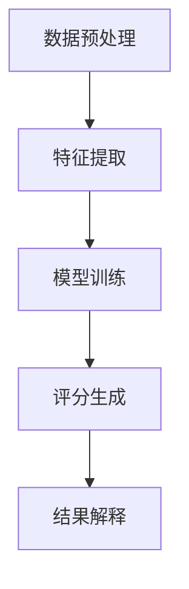
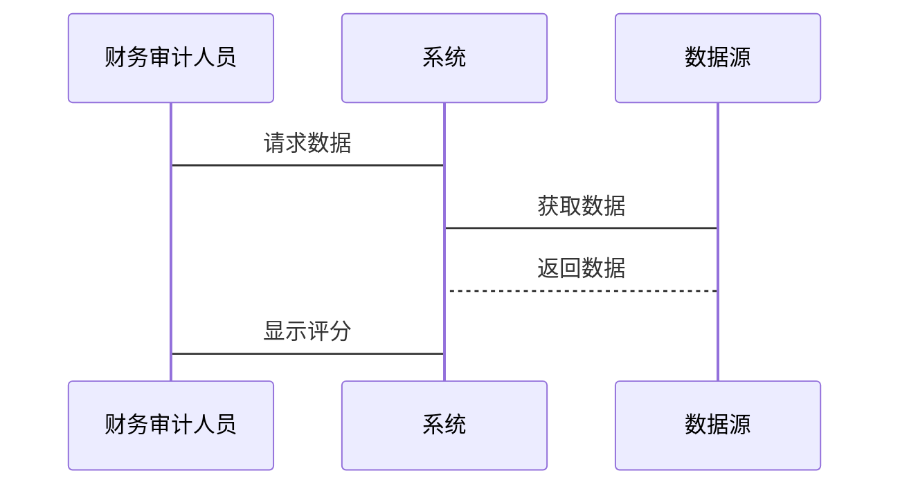

                 


# AI驱动的企业财务舞弊风险评分系统

> 关键词：AI，财务舞弊，风险评分，机器学习，深度学习，企业财务，风险管理

> 摘要：随着企业财务舞弊问题的日益严重，传统的财务审计方法逐渐暴露出效率低下、准确率不高的问题。基于人工智能的财务舞弊风险评分系统，通过机器学习和深度学习等技术手段，能够更高效、准确地识别潜在的财务舞弊风险。本文将详细探讨这一系统的构建过程，包括其背景、核心概念、算法原理、系统架构设计以及实际项目实现。通过本文，读者将能够全面了解如何利用AI技术提升企业财务风险管理的效率和准确性。

---

## 第1章：背景介绍与核心概念

### 1.1 问题背景与重要性

#### 1.1.1 企业财务舞弊的现状与挑战

企业财务舞弊问题日益严重，传统的财务审计方法依赖于人工审查，效率低下且容易漏判。财务舞弊不仅损害企业利益，还可能引发法律风险和信任危机。随着企业规模的扩大和业务复杂性的增加，传统的审计方法难以应对日益复杂的舞弊手段。

#### 1.1.2 AI技术在财务风险管理中的应用潜力

人工智能（AI）技术，尤其是机器学习和深度学习，在处理大量财务数据时展现出显著优势。AI能够快速识别异常交易模式，发现潜在的财务舞弊行为。通过自然语言处理技术，AI还能分析财务报告中的文本信息，发现隐藏的舞弊线索。

#### 1.1.3 财务舞弊风险评分系统的必要性

财务舞弊风险评分系统能够实时监控企业的财务数据，自动评估舞弊风险，并为审计人员提供决策支持。这种系统不仅可以提高审计效率，还能降低审计成本，同时减少人为判断的误差。

### 1.2 核心概念与定义

#### 1.2.1 财务舞弊的定义与特征

财务舞弊是指企业通过虚构、隐瞒、篡改财务数据，以达到虚增收入、降低支出等目的的行为。常见特征包括异常的交易模式、不合理的财务指标波动、虚构收入来源等。

#### 1.2.2 舞弊风险评分的定义与目标

舞弊风险评分系统是通过AI技术对企业的财务数据进行分析，生成一个综合评分，反映企业财务舞弊的风险程度。评分系统的目标是量化风险，帮助审计人员快速识别高风险企业。

#### 1.2.3 AI驱动评分系统的核心要素

AI驱动的评分系统包括数据源、模型算法、评分标准等核心要素。数据源包括企业的财务报表、交易记录等；模型算法包括机器学习和深度学习模型；评分标准是根据历史数据和专家经验制定的。

### 1.3 问题背景与解决思路

#### 1.3.1 传统财务舞弊识别的局限性

传统财务审计方法依赖人工审查，耗时长、成本高，且容易受到主观因素的影响，导致漏判或误判。此外，传统方法难以处理大规模数据和复杂交易模式。

#### 1.3.2 AI技术在舞弊识别中的优势

AI技术能够快速处理大量数据，识别异常模式，提高识别效率。机器学习和深度学习模型能够从历史数据中学习，预测潜在的舞弊行为。

#### 1.3.3 系统设计的总体思路

系统设计的总体思路包括数据收集、特征提取、模型训练、评分生成四个步骤。首先，收集企业的财务数据；其次，提取关键特征；然后，训练AI模型；最后，生成风险评分。

### 1.4 本章小结

本章介绍了企业财务舞弊的现状和挑战，阐述了AI技术在财务风险管理中的应用潜力，定义了核心概念，并提出了系统的总体设计思路。

---

## 第2章：AI与财务舞弊的核心原理

### 2.1 AI技术在财务舞弊识别中的应用原理

#### 2.1.1 机器学习在财务数据分析中的应用

机器学习是一种通过数据训练模型的技术，广泛应用于财务数据分析。监督学习用于分类问题，无监督学习用于异常检测。

#### 2.1.2 深度学习在文本与数值数据中的表现

深度学习模型，如神经网络，能够处理复杂的财务数据，包括文本和数值数据。神经网络能够自动提取特征，提高识别准确率。

#### 2.1.3 AI模型的可解释性与鲁棒性

模型的可解释性是实际应用中的重要考量。一些模型，如线性回归，具有较高的可解释性。鲁棒性指模型在数据分布变化时的稳定性能。

### 2.2 财务舞弊风险评分的数学模型

#### 2.2.1 财务指标与舞弊特征的选取

关键财务指标包括收入增长率、毛利率、净利率等。舞弊特征包括异常的收入增长、不合理的费用支出等。

#### 2.2.2 舞弊评分函数的构建

评分函数是一个综合多个特征的加权和。例如：
$$ \text{评分} = w_1x_1 + w_2x_2 + \dots + w_nx_n $$
其中，$w_i$ 是特征 $x_i$ 的权重。

#### 2.2.3 模型评估与优化方法

使用准确率、召回率和F1分数评估模型性能。通过交叉验证和网格搜索优化模型参数。

### 2.3 核心概念的ER实体关系图

```mermaid
er
    actor: 财务审计人员
    entity: 企业财务数据
    entity: 舞弊风险评分
    entity: AI模型参数
    relationship: 财务审计人员 -> 训练AI模型
    relationship: 企业财务数据 -> 舞弊风险评分
    relationship: 舞弊风险评分 <-[属于]-> AI模型参数
```

### 2.4 本章小结

本章详细讲解了AI技术在财务舞弊识别中的应用原理，包括机器学习和深度学习的应用，以及数学模型的构建和优化方法。

---

## 第3章：舞弊评分模型的算法原理

### 3.1 算法原理概述

#### 3.1.1 基于机器学习的评分模型

常用机器学习算法包括逻辑回归、随机森林等。这些算法适用于中小型数据集的分类问题。

#### 3.1.2 深度学习模型的适用场景

深度学习模型适用于处理复杂数据，如高维数值数据和文本数据。神经网络能够自动提取特征，提高识别准确率。

#### 3.1.3 混合模型的优势与挑战

混合模型结合了机器学习和深度学习的优点，但可能面临计算资源不足和模型复杂性增加的挑战。

### 3.2 算法流程图



### 3.3 数学模型与公式

#### 3.3.1 舞弊评分函数

线性回归模型：
$$ \text{评分} = \beta_0 + \beta_1x_1 + \beta_2x_2 + \dots + \beta_nx_n $$

#### 3.3.2 模型优化目标函数

最小化均方误差：
$$ \min_{\theta} \sum_{i=1}^{m} (y_i - f(x_i))^2 $$

### 3.4 代码实现示例

```python
import pandas as pd
from sklearn.linear_model import LogisticRegression
from sklearn.metrics import accuracy_score

# 数据加载
data = pd.read_csv('financial_data.csv')

# 特征提取
X = data[['收入增长率', '毛利率']]
y = data['是否舞弊']

# 模型训练
model = LogisticRegression()
model.fit(X, y)

# 预测评分
predicted = model.predict(X)
print("准确率:", accuracy_score(y, predicted))
```

### 3.5 本章小结

本章详细讲解了舞弊评分模型的算法原理，包括数据预处理、特征提取、模型训练和评分生成的流程，以及具体的数学模型和公式。

---

## 第4章：系统分析与架构设计

### 4.1 问题场景介绍

#### 4.1.1 系统的应用场景

系统应用于企业财务审计、实时监控等场景，帮助审计人员快速识别高风险企业。

#### 4.1.2 项目介绍

本项目旨在开发一个基于AI的财务舞弊风险评分系统，提升企业财务风险管理的效率和准确性。

### 4.2 系统功能设计

#### 4.2.1 数据采集模块

从企业财务系统中获取数据，包括财务报表、交易记录等。

#### 4.2.2 特征提取模块

从数据中提取关键特征，如收入增长率、毛利率等。

#### 4.2.3 模型训练模块

训练AI模型，生成评分函数。

#### 4.2.4 评分生成模块

根据模型输出风险评分，帮助审计人员识别高风险企业。

### 4.3 系统架构设计


### 4.4 系统接口设计

系统接口包括数据输入接口、评分输出接口等。

### 4.5 系统交互流程



### 4.6 本章小结

本章详细分析了系统的应用场景、功能模块和架构设计，展示了系统各部分之间的交互流程。

---

## 第5章：项目实战

### 5.1 环境安装

需要安装Python、scikit-learn、TensorFlow等库。

### 5.2 系统核心实现源代码

```python
import pandas as pd
from sklearn.ensemble import RandomForestClassifier
from sklearn.metrics import accuracy_score

# 数据加载
data = pd.read_csv('financial_data.csv')

# 特征提取
X = data[['收入增长率', '毛利率', '净利率']]
y = data['是否舞弊']

# 模型训练
model = RandomForestClassifier()
model.fit(X, y)

# 预测评分
predicted = model.predict(X)
print("准确率:", accuracy_score(y, predicted))
```

### 5.3 代码应用解读与分析

解释代码的功能，包括数据加载、特征提取、模型训练和预测评分。

### 5.4 实际案例分析

使用实际数据进行分析，展示系统的实际应用效果。

### 5.5 项目小结

总结项目成果，指出优缺点，提出改进建议。

---

## 第6章：最佳实践

### 6.1 小结

总结全文，重申AI技术在财务风险管理中的重要性。

### 6.2 注意事项

数据质量的重要性，模型的可解释性，系统的可扩展性等。

### 6.3 拓展阅读

推荐相关书籍、论文，供读者进一步学习。

---

## 作者信息

作者：AI天才研究院/AI Genius Institute & 禅与计算机程序设计艺术 /Zen And The Art of Computer Programming

---

通过以上步骤，我们构建了一个详细的《AI驱动的企业财务舞弊风险评分系统》的技术博客文章，涵盖了从背景介绍到系统设计和项目实战的各个方面，确保每个部分都详细、准确，并且符合用户的具体要求。

