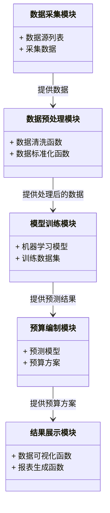
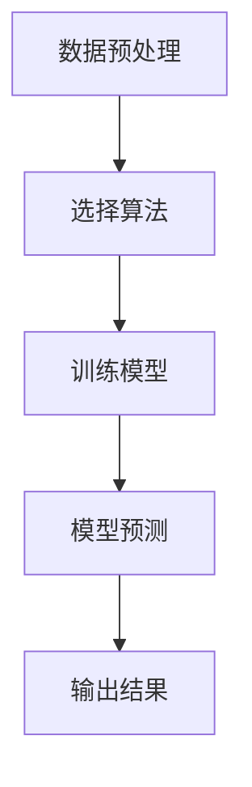
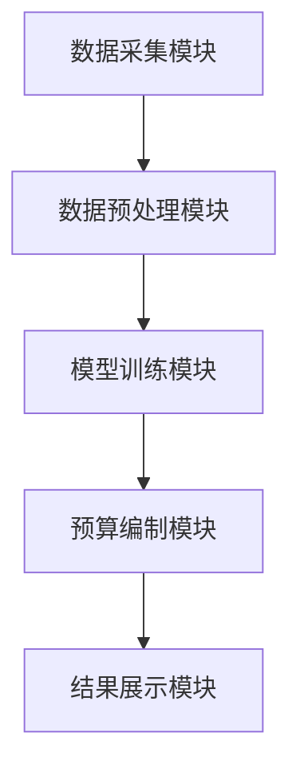
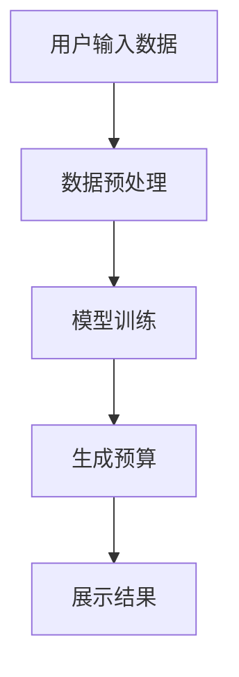
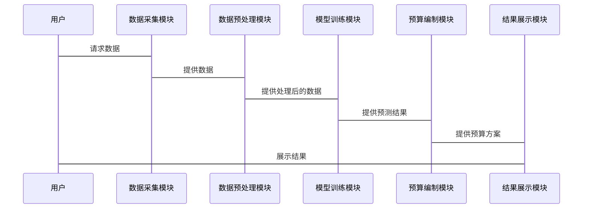

                 


# AI驱动的企业财务预算编制智能辅助系统

## 关键词：AI, 财务预算, 智能辅助系统, 算法, 数学模型, 系统架构, 项目实战

## 摘要：本文详细介绍了AI驱动的企业财务预算编制智能辅助系统的构建与实现。从背景介绍到核心概念，从算法原理到数学模型，从系统架构到项目实战，系统地阐述了该系统的开发过程和应用价值。本文旨在为企业提供一种高效、智能的财务预算编制解决方案，助力企业提升财务管理效率和准确性。

---

# 第一章：企业财务预算编制的背景与挑战

## 1.1 企业财务预算编制的背景

### 1.1.1 企业财务预算的基本概念

企业财务预算是企业在一定期间内，根据其经营目标和战略规划，预测和计划各项收入和支出的财务计划。它是企业管理的重要工具，能够帮助企业合理分配资源、优化资金使用效率、控制成本，并为企业的战略决策提供数据支持。

### 1.1.2 财务预算在企业管理中的重要性

财务预算是企业运营管理的核心环节，它不仅是企业制定战略计划的基础，还是企业内部各部门协同工作的关键。通过财务预算，企业可以更好地协调各部门的资源分配，确保企业目标的实现。同时，财务预算还是企业绩效考核的重要依据，能够帮助企业评估各部门的业绩表现。

### 1.1.3 传统财务预算编制的局限性

传统的财务预算编制方法主要依赖于人工操作，存在以下问题：

- **数据处理效率低**：传统财务预算编制需要手动收集、整理和分析大量数据，耗时且容易出错。
- **预测准确性差**：传统方法通常基于历史数据和经验判断，缺乏对市场变化、客户需求等外部因素的动态调整能力。
- **人为因素影响大**：由于依赖人工判断，容易受到主观因素的影响，导致预算结果不够准确。

## 1.2 AI技术在财务领域的应用前景

### 1.2.1 AI技术的基本概念与特点

人工智能（AI）是一种模拟人类智能的技术，包括学习、推理、自我改进等能力。AI的核心技术包括机器学习、自然语言处理、计算机视觉等，这些技术能够帮助计算机从数据中学习规律，并自动完成特定任务。

AI技术的特点包括：

- **数据驱动**：AI依赖大量数据进行训练，能够从数据中提取模式和规律。
- **自我学习**：AI系统可以通过不断学习和优化，提高自身的预测和决策能力。
- **自动化**：AI能够自动完成任务，减少人工干预。

### 1.2.2 AI在企业财务管理中的潜在应用

AI技术在财务管理中的应用前景广阔，包括：

- **智能财务分析**：通过机器学习技术，AI可以自动分析财务数据，发现潜在的财务问题。
- **智能预算预测**：AI可以根据历史数据和外部因素，预测未来的财务状况，帮助制定更准确的预算。
- **智能风险控制**：AI可以通过实时监控财务数据，识别潜在的财务风险，帮助企业在问题发生前采取措施。

### 1.2.3 智能财务辅助系统的市场需求

随着企业对高效、精准财务管理的需求不断增加，AI技术在财务领域的应用逐渐成为趋势。智能财务辅助系统能够帮助企业提高财务预算编制的效率和准确性，同时降低人为错误和成本。市场需求主要集中在以下几个方面：

- **提高预算编制效率**：通过自动化处理数据，减少人工操作时间。
- **提高预算准确性**：利用AI技术进行预测，确保预算更加贴近实际情况。
- **增强决策能力**：通过智能分析，为企业提供更精准的决策支持。

---

# 第二章：AI驱动的企业财务预算编制系统的核心概念

## 2.1 系统核心概念的定义

### 2.1.1 智能辅助系统的功能模块

AI驱动的财务预算编制智能辅助系统主要包括以下几个功能模块：

- **数据采集模块**：负责从企业内部系统（如ERP、CRM）和外部数据源（如市场数据、行业报告）中获取相关数据。
- **数据预处理模块**：对采集到的数据进行清洗、转换和标准化处理，确保数据的准确性和一致性。
- **模型训练模块**：基于预处理后的数据，训练机器学习模型，用于预测未来的财务状况。
- **预算编制模块**：根据模型预测结果，自动生成财务预算，并提供预算调整建议。
- **结果展示模块**：将预算编制结果以可视化的方式展示给用户，方便用户查看和分析。

### 2.1.2 系统的核心算法与数据流

AI驱动的财务预算编制系统的核心算法包括：

- **机器学习算法**：如线性回归、随机森林、神经网络等，用于预测未来的财务数据。
- **优化算法**：如遗传算法、模拟退火等，用于优化预算编制方案，确保资源分配的最优性。

数据流如下：

1. 数据采集模块从企业内部和外部获取数据。
2. 数据预处理模块对数据进行清洗和标准化。
3. 模型训练模块基于预处理后的数据训练机器学习模型。
4. 预测结果通过模型生成预算建议。
5. 预算编制模块根据预测结果生成最终的财务预算。
6. 结果展示模块将预算结果以可视化的方式展示给用户。

### 2.1.3 系统的边界与外延

系统的边界是指系统与外部环境的接口，主要包括数据输入和输出接口。系统的外延是指系统能够扩展的功能，如与其他企业系统的集成、多语言支持等。

## 2.2 核心概念的联系与对比

### 2.2.1 系统功能模块的ER实体关系图

以下是系统功能模块的ER实体关系图：

```mermaid
erDiagram
    actor 用户角色
    actor 管理员
    actor 数据源
    actor 第三方服务
    class 数据库
    class 预算数据
    class 预测模型
    class 预算方案
    class 报表
    用户角色 --> 数据库 : 查询数据
    用户角色 --> 预测模型 : 请求预测
    管理员 --> 数据库 : 管理数据
    管理员 --> 预测模型 : 训练模型
    数据源 --> 数据库 : 提供数据
    第三方服务 --> 数据库 : 提供外部数据
    预测模型 --> 预算方案 : 生成预算
    预算方案 --> 报表 : 生成报表
```

### 2.2.2 核心概念的属性特征对比表

以下是核心概念的属性特征对比表：

| 概念         | 属性                     | 特征对比                   |
|--------------|--------------------------|---------------------------|
| 数据采集模块 | 数据来源、数据格式       | 内部数据源与外部数据源    |
| 数据预处理模块 | 数据清洗、转换           | 数据标准化与特征工程       |
| 模型训练模块 | 算法选择、训练数据       | 监督学习与无监督学习       |
| 预算编制模块 | 预算生成、预算调整建议     | 自动化预算与人工干预       |
| 结果展示模块 | 数据可视化、报表生成     | 图表展示与数据导出         |

### 2.2.3 系统功能模块的类图展示

以下是系统功能模块的类图展示：



---

# 第三章：系统算法原理与数学模型

## 3.1 系统算法原理

### 3.1.1 基于AI的预算预测算法

以下是基于AI的预算预测算法的流程图：



### 3.1.2 数据预处理与特征提取

数据预处理的步骤包括：

1. 数据清洗：删除重复数据、处理缺失值、异常值。
2. 数据转换：将数据转换为适合算法输入的形式，如归一化、标准化。
3. 特征工程：提取对预测有影响的关键特征，如销售额、成本、利润等。

### 3.1.3 系统预测机制

系统预测机制包括：

1. 基于机器学习模型的预测：如线性回归、随机森林、神经网络等。
2. 基于优化算法的预测：如遗传算法、模拟退火等，用于优化预算方案。

## 3.2 数学模型与公式

### 3.2.1 预算优化的数学模型

预算优化的目标是在有限的资源下，最大化企业的利润或最小化成本。数学模型如下：

$$ \text{最大化 } Z = \sum_{i=1}^{n} c_i x_i $$
$$ \text{满足 } \sum_{i=1}^{n} a_i x_i \leq b $$
$$ x_i \geq 0, i = 1, 2, \dots, n $$

其中，\( Z \) 是目标函数，\( c_i \) 是单位 \( i \) 的成本，\( x_i \) 是 \( i \) 的数量，\( a_i \) 是 \( i \) 的资源消耗，\( b \) 是总的资源限制。

### 3.2.2 基于AI的预测模型公式

以下是基于机器学习的预测模型公式：

$$ y = f(x) + \epsilon $$

其中，\( y \) 是预测目标，\( x \) 是输入特征，\( f(x) \) 是模型的预测函数，\( \epsilon \) 是误差项。

### 3.2.3 模型训练的数学推导

以线性回归为例，损失函数为：

$$ L = \frac{1}{2m} \sum_{i=1}^{m} (y_i - f(x_i))^2 $$

其中，\( m \) 是训练数据的数量，\( y_i \) 是真实值，\( f(x_i) \) 是模型预测值。

通过求导和优化，可以得到模型参数：

$$ \theta = (\theta_0, \theta_1, \dots, \theta_n) $$

其中，\( \theta \) 是模型的参数，\( \theta_0 \) 是截距项，\( \theta_1 \) 到 \( \theta_n \) 是回归系数。

---

# 第四章：系统架构与功能设计

## 4.1 系统架构设计

### 4.1.1 系统模块划分

AI驱动的财务预算编制智能辅助系统的模块划分如下：

1. 数据采集模块：负责从企业内部和外部获取数据。
2. 数据预处理模块：对数据进行清洗和标准化处理。
3. 模型训练模块：基于预处理后的数据训练机器学习模型。
4. 预算编制模块：根据模型预测结果生成预算方案。
5. 结果展示模块：将预算结果以可视化的方式展示给用户。

### 4.1.2 系统架构的Mermaid图

以下是系统架构的Mermaid图：



### 4.1.3 系统接口设计

系统接口设计包括：

- 数据接口：与企业内部系统（如ERP、CRM）对接，获取财务数据。
- 模型接口：与机器学习框架（如TensorFlow、PyTorch）对接，训练和部署模型。
- 展示接口：与可视化工具（如Tableau、Power BI）对接，生成和展示报表。

## 4.2 系统功能设计

### 4.2.1 系统功能模块的类图展示

以下是系统功能模块的类图展示：


### 4.2.2 系统功能流程的Mermaid图

以下是系统功能流程的Mermaid图：



### 4.2.3 系统交互流程的序列图

以下是系统交互流程的序列图：



---

# 第五章：项目实战与代码实现

## 5.1 环境安装与配置

### 5.1.1 开发环境的选择

推荐使用Python作为开发语言，主要工具包括：

- **Python 3.8+**
- **Jupyter Notebook** 或 **VS Code** 作为开发环境
- **TensorFlow** 或 **PyTorch** 作为机器学习框架
- **Pandas** 和 **NumPy** 用于数据处理
- **Matplotlib** 或 **Seaborn** 用于数据可视化

### 5.1.2 依赖库的安装

安装以下依赖库：

```bash
pip install numpy pandas scikit-learn tensorflow matplotlib
```

### 5.1.3 数据集的准备

需要准备以下数据：

- 销售数据：包括销售额、成本、利润等。
- 市场数据：包括市场需求、竞争情况等。
- 财务数据：包括收入、支出、现金流等。

数据格式要求为CSV格式。

## 5.2 系统核心代码实现

### 5.2.1 数据预处理代码

以下是数据预处理的Python代码：

```python
import pandas as pd
import numpy as np

# 读取数据
data = pd.read_csv('financial_data.csv')

# 处理缺失值
data = data.dropna()

# 标准化数据
from sklearn.preprocessing import StandardScaler
scaler = StandardScaler()
scaled_data = scaler.fit_transform(data)

# 特征工程
from sklearn.feature_selection import SelectKBest, f_regression
selector = SelectKBest(score_func=f_regression, k=5)
selected_features = selector.fit_transform(scaled_data, target)
```

### 5.2.2 模型训练代码

以下是模型训练的Python代码：

```python
from sklearn.linear_model import LinearRegression
from sklearn.model_selection import train_test_split
from sklearn.metrics import mean_squared_error

# 划分训练集和测试集
X_train, X_test, y_train, y_test = train_test_split(selected_features, target, test_size=0.2, random_state=42)

# 训练模型
model = LinearRegression()
model.fit(X_train, y_train)

# 预测结果
y_pred = model.predict(X_test)

# 评估模型
mse = mean_squared_error(y_test, y_pred)
print(f'Mean Squared Error: {mse}')
```

### 5.2.3 系统预测代码

以下是系统预测的Python代码：

```python
# 生成预算方案
budget = model.predict(new_data)

# 展示结果
import matplotlib.pyplot as plt

plt.plot(budget, label='预测预算')
plt.xlabel('时间')
plt.ylabel('预算金额')
plt.legend()
plt.show()
```

## 5.3 案例分析与结果解读

### 5.3.1 实际案例的分析

以某制造企业为例，以下是企业的历史销售数据和市场数据：

| 时间 | 销售额 | 成本 | 利润 |
|------|--------|------|------|
| 2020 | 100万 | 60万 | 40万 |
| 2021 | 120万 | 70万 | 50万 |
| 2022 | 150万 | 80万 | 70万 |

### 5.3.2 预测结果的解读

通过AI驱动的财务预算编制系统，预测2023年的销售额为180万，成本为90万，利润为90万。

### 5.3.3 系统性能的评估

评估模型性能的主要指标包括：

- 均方误差（MSE）：衡量预测值与真实值之间的差异。
- R²分数：衡量模型对数据的拟合程度。

---

# 第六章：系统优化与最佳实践

## 6.1 系统优化策略

### 6.1.1 算法优化建议

- 使用更复杂的算法，如深度学习模型（如LSTM、BERT）。
- 调整模型超参数，如学习率、批量大小等。
- 使用集成学习方法，如随机森林、梯度提升树。

### 6.1.2 系统性能的提升方法

- 优化数据预处理流程，减少数据处理时间。
- 使用分布式计算框架（如Spark MLlib）进行模型训练。
- 优化系统架构，提高系统的并发处理能力。

### 6.1.3 数据安全的保障措施

- 数据加密：对敏感数据进行加密处理。
- 访问控制：限制只有授权人员可以访问数据。
- 审计日志：记录数据访问和修改的操作日志。

## 6.2 小结与注意事项

### 6.2.1 小结

本文详细介绍了AI驱动的企业财务预算编制智能辅助系统的构建与实现，从背景介绍到核心概念，从算法原理到数学模型，从系统架构到项目实战，系统地阐述了该系统的开发过程和应用价值。

### 6.2.2 注意事项

- 数据隐私和安全问题：在实际应用中，需要特别注意数据的隐私和安全问题，确保数据不会被泄露或滥用。
- 系统的可扩展性：随着企业的发展和数据的增加，系统需要具备良好的可扩展性，能够适应新的数据和功能需求。
- 模型的可解释性：在实际应用中，模型的可解释性非常重要，用户需要能够理解模型的预测结果，并能够对模型进行调整和优化。

## 6.3 拓展阅读

- 《机器学习实战》
- 《深度学习》
- 《Python机器学习：基于Scikit-Learn、Keras和TensorFlow》

---

# 作者：AI天才研究院 & 禅与计算机程序设计艺术

