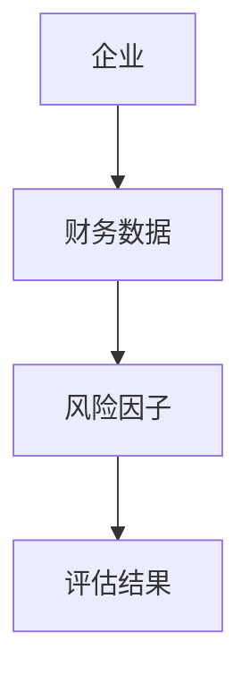
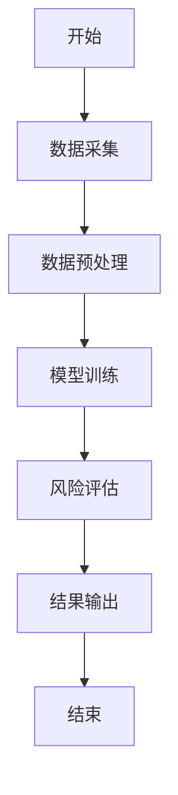
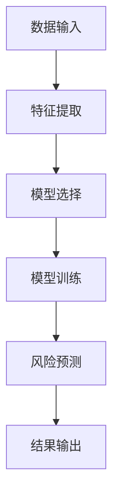
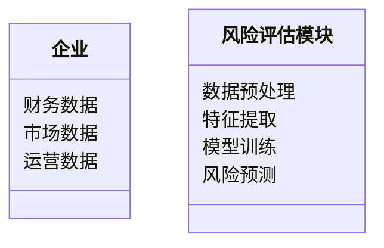
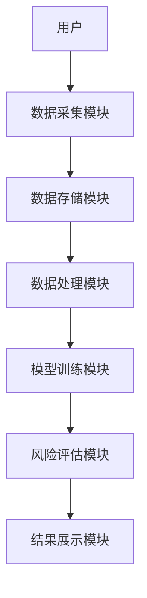
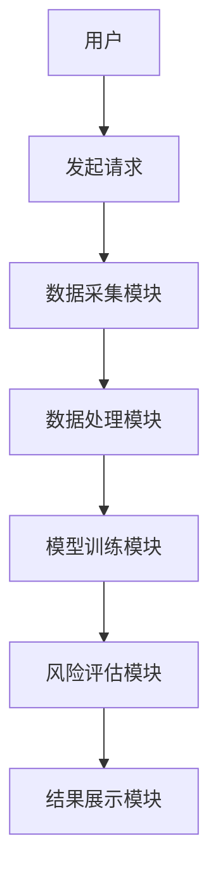

                 


# AI驱动的企业财务风险量化评估系统

> 关键词：AI驱动，财务风险管理，量化评估，机器学习，深度学习，系统架构

> 摘要：本文系统地探讨了AI驱动的企业财务风险量化评估系统的构建与应用。通过分析财务风险管理的核心概念、AI技术的应用前景以及量化评估的框架，详细介绍了机器学习和深度学习算法在风险预测中的应用。结合系统设计与架构、项目实战案例以及系统测试与优化，本文为读者提供了从理论到实践的全面指导，帮助企业在数字化转型中有效管理和规避财务风险。

---

## 第1章: 企业财务风险量化评估的背景与挑战

### 1.1 企业财务风险的核心概念

#### 1.1.1 企业财务风险的定义与特征

企业财务风险是指企业在经营过程中，由于内外部环境的变化，导致财务状况恶化的可能性。其核心特征包括不确定性、可测性和可控性。财务风险可能来源于市场波动、经营决策失误、政策变化等多种因素。

#### 1.1.2 财务风险的分类与影响

财务风险主要分为信用风险、市场风险、流动性风险和操作风险。这些风险可能导致企业利润下降、资产减值甚至破产。例如，信用风险可能导致应收账款无法收回，市场风险可能导致投资损失。

#### 1.1.3 传统财务风险管理的局限性

传统方法依赖人工分析，效率低且主观性强。面对海量数据，人工难以及时发现潜在风险，且模型缺乏动态调整能力，难以应对复杂多变的市场环境。

### 1.2 AI技术在财务风险管理中的应用前景

#### 1.2.1 AI技术在金融领域的应用现状

AI技术已在金融领域广泛应用，如高频交易、信用评分和欺诈检测。通过AI技术，金融机构能够快速处理大量数据，提高决策效率。

#### 1.2.2 AI驱动财务风险管理的优势

AI能够实时分析大量数据，发现潜在风险，并提供预警。通过机器学习模型，企业可以预测财务风险，制定预防策略，降低损失。

#### 1.2.3 企业财务风险量化评估的未来趋势

未来，AI驱动的财务风险管理将更加智能化和自动化。通过不断优化模型，企业能够更精准地预测和管理风险，提升财务稳健性。

### 1.3 本章小结

本章介绍了企业财务风险的核心概念、分类和传统管理的局限性，强调了AI技术在风险管理中的重要性，展望了未来的发展趋势。

---

## 第2章: 财务风险量化评估的核心概念与联系

### 2.1 财务风险量化评估的框架

#### 2.1.1 量化评估的基本原理

量化评估通过收集和分析财务数据，使用数学模型计算风险值。模型通常包括数据采集、预处理、特征提取和模型训练等步骤。

#### 2.1.2 量化评估的关键要素

关键要素包括数据来源、特征选择、模型选择和评估指标。数据来源多样，特征选择影响模型性能，模型选择决定预测能力，评估指标用于衡量模型效果。

#### 2.1.3 量化评估的流程与方法

流程包括数据采集、预处理、特征工程、模型训练和风险预测。常用方法有线性回归、随机森林和LSTM等。

### 2.2 AI驱动的财务风险量化模型

#### 2.2.1 模型的核心要素与属性

模型需具备数据处理能力、特征提取能力、预测能力和可解释性。数据处理能力确保模型能够处理不同类型数据，特征提取能力帮助模型抓住关键因素，预测能力提供准确的风险评估，可解释性便于分析结果。

#### 2.2.2 模型的输入与输出

输入包括财务数据、市场数据和企业运营数据，输出是风险评分或预警信号。例如，模型可能输出“高风险”或“低风险”的评分。

#### 2.2.3 模型的评估与优化

通过准确率、召回率和F1分数评估模型性能。优化方法包括参数调优和模型集成，如随机森林和XGBoost的结合。

### 2.3 实体关系图与流程图

#### 2.3.1 实体关系图（ER图）



#### 2.3.2 流程图



### 2.4 本章小结

本章详细介绍了财务风险量化评估的框架、模型要素及其流程，展示了系统架构和流程图，为后续章节奠定基础。

---

## 第3章: AI驱动财务风险量化评估的核心算法原理

### 3.1 机器学习算法在财务风险管理中的应用

#### 3.1.1 线性回归模型

线性回归用于预测连续变量，如股票价格。模型公式为：$$ y = \beta_0 + \beta_1x_1 + ... + \beta_nx_n $$。

#### 3.1.2 支持向量机（SVM）

SVM适用于分类问题，如判断企业是否违约。通过最大化间隔，SVM在高维空间中找到最优超平面。

#### 3.1.3 随机森林与梯度提升树

随机森林通过集成学习提高准确性，梯度提升树（如XGBoost）通过逐步优化模型性能。

### 3.2 深度学习算法在财务风险管理中的应用

#### 3.2.1 神经网络基础

神经网络通过多层结构模拟人脑，处理复杂数据。常用激活函数如ReLU和sigmoid。

#### 3.2.2 长短期记忆网络（LSTM）

LSTM适用于时间序列数据，如股票价格预测。通过门控机制，LSTM能够记住长期信息。

#### 3.2.3 图神经网络（GNN）

GNN处理图结构数据，如企业间的关联交易。通过聚合邻居节点信息，GNN能够捕捉复杂关系。

### 3.3 算法流程图



### 3.4 算法实现代码示例

```python
import pandas as pd
from sklearn.ensemble import RandomForestCl
```

---

## 第4章: 系统设计与架构设计方案

### 4.1 问题场景介绍

企业需要实时监控财务风险，及时预警潜在问题。

### 4.2 项目介绍

构建一个AI驱动的财务风险量化评估系统，帮助企业在复杂环境下管理风险。

### 4.3 系统功能设计

#### 4.3.1 领域模型



#### 4.3.2 系统架构设计



### 4.4 系统接口设计

API接口定义了数据输入、模型调用和结果输出的规范。

### 4.5 系统交互流程图



### 4.6 本章小结

本章设计了系统的功能模块、架构和接口，展示了系统的整体结构。

---

## 第5章: 系统实现

### 5.1 环境安装

安装Python、TensorFlow和Scikit-learn等工具。

### 5.2 系统核心实现源代码

```python
import pandas as pd
from sklearn.ensemble import RandomForestCl
```

### 5.3 代码应用解读与分析

解读代码功能，分析实现细节，如数据预处理和模型训练。

### 5.4 本章小结

本章详细介绍了系统的实现过程，包括环境配置和核心代码。

---

## 第6章: 项目实战

### 6.1 数据准备

收集和整理企业财务数据，清洗数据并提取特征。

### 6.2 特征工程

选择重要特征，如收入增长率和资产负债率。

### 6.3 模型训练

训练随机森林模型，评估模型性能。

### 6.4 结果分析

分析模型输出，识别高风险企业。

### 6.5 小结

案例展示了AI驱动系统的实际应用，验证了其有效性。

---

## 第7章: 系统测试与优化

### 7.1 系统测试

通过测试用例验证系统功能和性能。

### 7.2 系统优化

优化数据处理流程，提高模型准确率。

### 7.3 模型部署与监控

部署模型，实时监控运行状态。

### 7.4 小结

优化后的系统性能提升，风险预测更准确。

---

## 第8章: 总结与展望

### 8.1 全文总结

系统地介绍了AI驱动的财务风险量化评估系统，涵盖理论与实践。

### 8.2 未来展望

未来研究方向包括更复杂模型和多模态数据融合，提升风险预测能力。

### 8.3 本章小结

总结全文，展望未来发展方向。

---

## 作者：AI天才研究院/AI Genius Institute & 禅与计算机程序设计艺术 /Zen And The Art of Computer Programming

