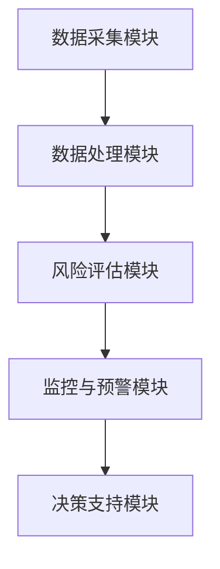

                 


# AI驱动的企业资金流动性风险管理系统

> 关键词：企业资金流动性风险管理，人工智能，机器学习，风险评估，系统架构设计

> 摘要：随着全球经济的快速发展和金融市场的日益复杂化，企业资金流动性风险管理变得至关重要。本文将探讨如何利用人工智能技术构建一个高效的资金流动性风险管理系统，从核心概念、算法原理、系统架构设计到项目实战，全面解析该系统的工作原理和实际应用。

---

## 第1章: 资金流动性风险概述

### 1.1 资金流动性风险的定义与特征

资金流动性风险是指企业在特定时间内无法以合理成本获得所需资金来满足其经营或债务偿还需求的风险。其主要特征包括时间性、不确定性、系统性以及传染性。时间性是指风险与资金的时间价值密切相关；不确定性源于市场环境的不可预测性；系统性则体现在金融市场的相互关联中；传染性则指风险在市场中的扩散效应。

### 1.2 企业资金流动性管理的重要性

企业资金流动性管理是确保企业正常运营的关键环节。良好的流动性管理可以降低企业的财务成本，优化资金配置，提升企业的市场竞争力。同时，它还能帮助企业规避因流动性不足导致的债务危机，保障企业的财务健康。

### 1.3 传统资金流动性管理的挑战

传统资金流动性管理主要依赖于人工分析和经验判断，这种方式存在效率低下、主观性强、风险滞后等问题。特别是在金融市场波动加剧的背景下，传统方法难以满足企业对实时性、精准性和前瞻性的要求。

---

## 第2章: AI驱动的资金流动性风险管理的优势

### 2.1 AI技术在金融领域的应用前景

人工智能技术在金融领域的应用前景广阔，尤其是在数据分析、风险评估和决策支持方面。AI技术可以通过大数据分析和机器学习算法，帮助金融机构和企业更精准地识别和预测风险。

### 2.2 AI驱动的资金流动性风险管理的核心优势

AI驱动的资金流动性风险管理具有以下核心优势：
- **实时性**：通过实时数据分析，快速识别潜在风险。
- **精准性**：利用机器学习算法，提高风险评估的准确性。
- **前瞻性**：通过预测模型，提前预判市场变化和企业资金需求。

### 2.3 AI技术在资金流动性管理中的具体应用

AI技术在资金流动性管理中的具体应用包括：
- **数据采集与处理**：利用自然语言处理技术，从多种数据源中提取相关信息。
- **风险预测与评估**：通过机器学习算法，构建资金流动性风险预测模型。
- **决策支持**：基于AI分析结果，提供优化的资金管理策略。

---

## 第3章: 系统核心概念与联系

### 3.1 系统的核心要素

资金流动性风险管理系统的核心要素包括：
- **数据源**：包括企业的财务数据、市场数据和行业数据。
- **风险评估模型**：用于评估企业资金流动性风险的数学模型。
- **预测算法**：用于预测未来资金流动性风险的机器学习算法。
- **监控模块**：实时监控企业资金流动状况，及时发出预警。
- **决策支持模块**：基于AI分析结果，提供资金管理决策支持。

### 3.2 系统的组成模块

系统的组成模块包括：
- **数据采集模块**：负责从多种数据源中采集数据。
- **数据处理模块**：对采集的数据进行清洗、标准化和特征提取。
- **风险评估模块**：基于处理后的数据，构建和训练风险评估模型。
- **监控与预警模块**：实时监控企业资金流动状况，发出预警信息。
- **决策支持模块**：基于AI分析结果，提供优化的资金管理策略。

### 3.3 核心概念的对比与联系

通过对比不同的风险评估模型和预测算法，可以更好地理解它们的优缺点及其适用场景。例如，线性回归模型适合处理线性关系，而随机森林模型则适合处理非线性关系。选择合适的模型和算法，可以显著提高系统的风险评估精度和预测能力。

---

## 第4章: 算法原理与数学模型

### 4.1 线性回归模型

#### 4.1.1 模型原理
线性回归模型是一种经典的统计学习方法，其基本假设是目标变量与特征变量之间存在线性关系。模型的数学公式为：
$$ y = \beta_0 + \beta_1x_1 + \beta_2x_2 + \ldots + \beta_nx_n + \epsilon $$
其中，$\beta_0$ 是截距，$\beta_1, \beta_2, \ldots, \beta_n$ 是回归系数，$x_1, x_2, \ldots, x_n$ 是特征变量，$\epsilon$ 是误差项。

#### 4.1.2 算法实现
线性回归模型的训练过程包括以下步骤：
1. 数据预处理：对数据进行标准化和特征提取。
2. 模型训练：通过最小二乘法优化回归系数。
3. 模型评估：计算模型的拟合优度和均方误差。

#### 4.1.3 应用案例
假设我们有一个企业的历史财务数据，包括销售额、应收账款和应付账款等特征变量。我们可以使用线性回归模型来预测企业的资金流动性风险。

---

## 第5章: 系统架构设计

### 5.1 系统功能设计

系统功能设计包括以下模块：
- **数据采集模块**：从企业财务系统、金融市场数据源等处采集数据。
- **数据处理模块**：对采集的数据进行清洗、标准化和特征提取。
- **风险评估模块**：基于处理后的数据，构建和训练风险评估模型。
- **监控与预警模块**：实时监控企业资金流动状况，发出预警信息。
- **决策支持模块**：基于AI分析结果，提供优化的资金管理策略。

### 5.2 系统架构图

以下是一个简单的系统架构图（使用Mermaid语法）：



### 5.3 系统接口设计

系统接口设计包括：
- **数据接口**：与企业财务系统和金融市场数据源对接。
- **用户接口**：提供友好的用户界面，方便用户查看风险评估结果和决策支持信息。
- **预警接口**：与企业的内部预警系统对接，实时发送预警信息。

---

## 第6章: 项目实战

### 6.1 环境配置

项目实战需要以下环境配置：
- **编程语言**：Python 3.8+
- **深度学习框架**：TensorFlow 2.0+
- **机器学习库**：Scikit-learn
- **数据处理工具**：Pandas、NumPy
- **可视化工具**：Matplotlib、Seaborn

### 6.2 核心代码实现

以下是系统的核心代码实现：

```python
import pandas as pd
import numpy as np
from sklearn.model_selection import train_test_split
from sklearn.linear_model import LinearRegression
from sklearn.metrics import mean_squared_error

# 数据预处理
data = pd.read_csv('financial_data.csv')
X = data.drop('target', axis=1)
y = data['target']

# 划分训练集和测试集
X_train, X_test, y_train, y_test = train_test_split(X, y, test_size=0.2, random_state=42)

# 模型训练
model = LinearRegression()
model.fit(X_train, y_train)

# 模型预测
y_pred = model.predict(X_test)

# 模型评估
mse = mean_squared_error(y_test, y_pred)
print(f'Mean Squared Error: {mse}')
```

### 6.3 代码解读与分析

上述代码实现了以下功能：
1. 数据预处理：读取数据并进行特征提取。
2. 数据划分：将数据划分为训练集和测试集。
3. 模型训练：使用线性回归模型训练风险评估模型。
4. 模型预测：基于训练好的模型进行预测。
5. 模型评估：计算模型的均方误差，评估模型的性能。

### 6.4 实际案例分析

假设我们有一个企业的历史财务数据，包括销售额、应收账款和应付账款等特征变量。我们可以使用上述代码来训练一个线性回归模型，预测企业的资金流动性风险。

---

## 第7章: 总结与展望

### 7.1 小结

本文详细介绍了AI驱动的企业资金流动性风险管理系统的核心概念、算法原理、系统架构设计和项目实战。通过结合理论与实践，展示了如何利用AI技术提高资金流动性风险管理的效率和准确性。

### 7.2 注意事项

在实际应用中，需要注意以下几点：
1. 数据质量：确保数据的准确性和完整性。
2. 模型选择：根据具体场景选择合适的模型和算法。
3. 模型优化：通过调参和特征工程优化模型性能。
4. 系统维护：定期更新模型和数据，确保系统的实时性和准确性。

### 7.3 未来的发展方向

未来，随着AI技术的不断发展，资金流动性风险管理系统将更加智能化和自动化。可能的发展方向包括：
- **强化学习**：通过强化学习优化资金管理策略。
- **实时预测**：利用流数据处理技术实现实时风险预测。
- **多模态数据融合**：结合文本、图像等多种数据源进行风险评估。

---

作者：AI天才研究院/AI Genius Institute & 禅与计算机程序设计艺术 /Zen And The Art of Computer Programming

