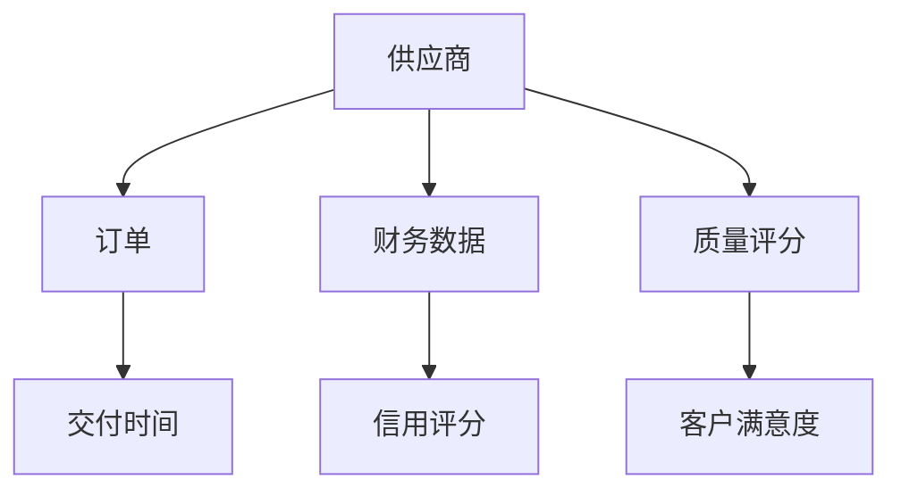
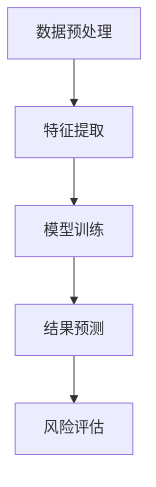
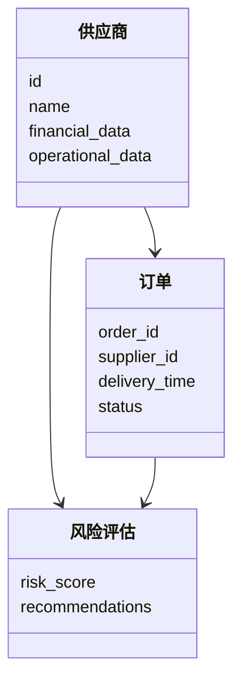
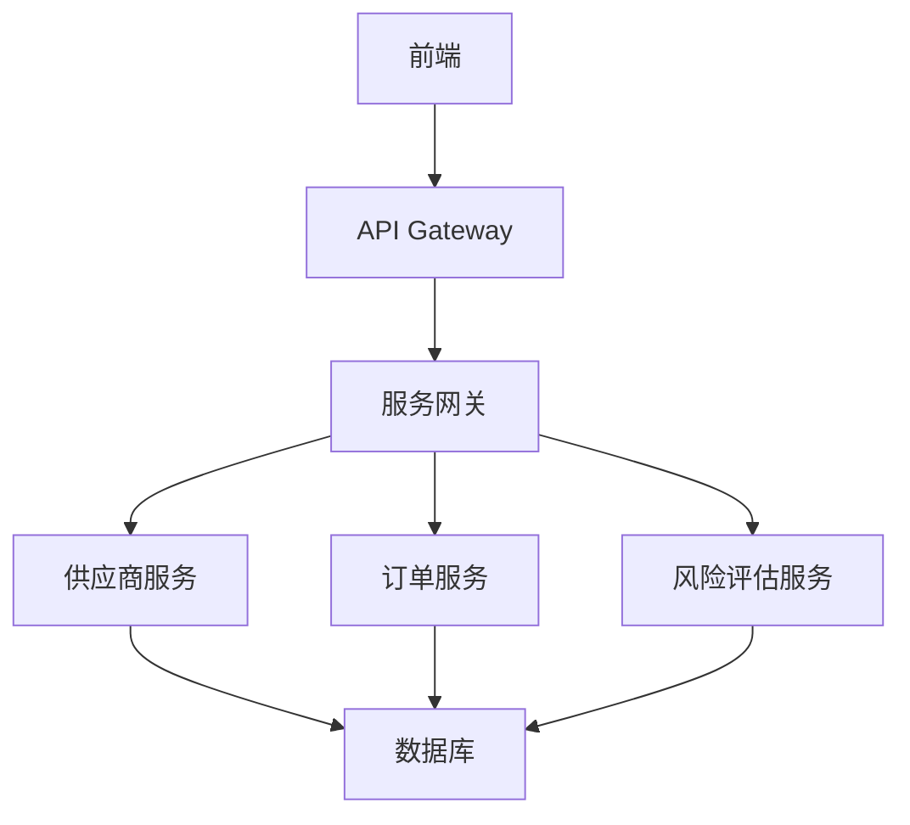
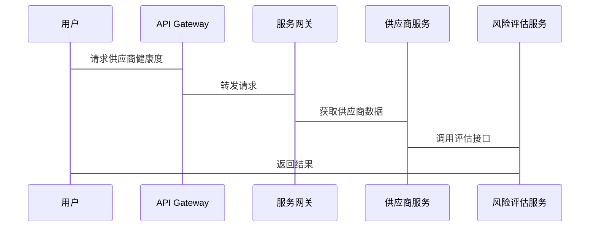

                 


# AI驱动的供应商健康度分析：评估上游风险

## 关键词：AI，供应商健康度，供应链风险管理，机器学习，风险评估

## 摘要：  
本文详细探讨了利用人工智能技术进行供应商健康度分析的方法，旨在通过数据驱动的手段评估上游风险。文章从背景介绍、核心概念、算法原理、系统架构、项目实战等多个维度展开，结合实际案例和代码实现，深入剖析AI在供应链管理中的应用潜力。通过本文的学习，读者将能够掌握如何利用AI技术构建高效的供应商健康度分析系统，从而有效降低供应链风险。

---

## 第一部分：AI驱动的供应商健康度分析基础

### 第1章：供应商健康度分析概述

#### 1.1 供应商健康度分析的背景与意义
- **1.1.1 供应链风险管理的重要性**  
  供应链是企业运营的核心环节，供应商的健康状况直接影响企业的运营效率和成本控制。传统的供应商评估方法依赖人工经验，难以覆盖海量数据和复杂场景。AI技术的引入为供应链风险管理提供了新的解决方案。

- **1.1.2 传统供应商评估的局限性**  
  传统供应商评估方法通常基于少量的财务数据和历史交易记录，难以捕捉供应商的潜在风险。例如，供应商可能因为原材料价格上涨或政策变化而导致成本激增，这些因素在传统评估中难以被发现。

- **1.1.3 AI技术在供应链管理中的应用潜力**  
  AI技术可以通过对海量数据的分析，发现潜在风险，预测供应商的健康状况，并提出优化建议。例如，通过自然语言处理技术分析供应商的新闻报道，识别潜在的财务危机。

#### 1.2 AI驱动的供应商健康度分析的核心概念
- **1.2.1 供应商健康度的定义**  
  供应商健康度是指供应商在财务、运营、交付能力等多个维度上的综合表现，反映了其在未来一段时间内履行合同的能力。

- **1.2.2 供应商健康度分析的关键维度**  
  - 财务稳定性：包括利润率、资产负债率、现金流等财务指标。  
  - 运营效率：包括交货准时率、生产效率等。  
  - 信用记录：包括历史违约情况、信用评级等。  
  - 市场风险：包括原材料价格波动、政策变化等外部因素。  

- **1.2.3 AI在供应商健康度分析中的作用**  
  AI技术可以通过机器学习模型，从海量数据中提取特征，预测供应商的健康状况，并生成风险评估报告。

#### 1.3 供应商健康度分析的流程与框架
- **1.3.1 数据采集与处理**  
  需要收集供应商的财务数据、交易记录、市场新闻、行业趋势等多源数据，并进行清洗和预处理。

- **1.3.2 数据分析与建模**  
  使用机器学习算法（如随机森林、逻辑回归等）对供应商健康度进行建模，并评估模型的性能。

- **1.3.3 结果评估与反馈**  
  根据模型预测结果，生成供应商健康度报告，并提供风险缓解建议。

#### 1.4 本章小结  
本章介绍了供应商健康度分析的重要性和核心概念，为后续的算法实现和系统设计奠定了基础。

---

### 第2章：供应商健康度分析的核心概念与联系

#### 2.1 核心概念原理
- **2.1.1 供应商健康度的多维度评估**  
  供应商健康度分析需要综合考虑多个维度的数据，例如财务数据、市场数据和运营数据。

- **2.1.2 数据驱动的分析方法**  
  通过机器学习算法，从数据中提取特征，构建供应商健康度评估模型。

- **2.1.3 AI算法在风险评估中的应用**  
  使用监督学习算法对供应商进行分类，预测其健康状况。

#### 2.2 核心概念属性特征对比
- **2.2.1 供应商健康度的特征分析**  
  表1：供应商健康度分析的特征对比

| 特征维度       | 好供应商特征                  | 差供应商特征                  |
|----------------|-----------------------------|-----------------------------|
| 财务稳定性      | 利润率高，现金流充足          | 利润率低，现金流不足          |
| 运营效率        | 交货准时，生产能力强          | 交货延迟，生产能力不足        |
| 信用记录        | 信用评级高，历史无违约        | 信用评级低，历史有违约        |
| 市场风险        | 原材料价格稳定，政策风险低     | 原材料价格波动大，政策风险高   |

- **2.2.2 不同评估维度的对比表格**  
  通过表格对比不同评估维度的特征，帮助读者更好地理解供应商健康度的多维度评估。

- **2.2.3 数据特征的可视化展示**  
  图1：供应商健康度的分布图（假设使用柱状图展示不同供应商的健康评分分布）。

#### 2.3 ER实体关系图架构


#### 2.4 本章小结  
本章通过对比分析，明确了供应商健康度的多维度特征，并通过ER图展示了数据之间的关系。

---

## 第二部分：AI驱动的供应商健康度分析的算法原理

### 第3章：供应商健康度分析的算法原理

#### 3.1 算法原理概述
- **3.1.1 机器学习在供应商健康度分析中的应用**  
  机器学习算法可以对供应商的历史数据进行建模，预测其未来的健康状况。

- **3.1.2 常见算法的优缺点对比**  
  表2：常见算法的对比

| 算法名称       | 优点                          | 缺点                          |
|----------------|-------------------------------|-------------------------------|
| 随机森林       | 高准确性，易于解释             | 对特征工程依赖较高             |
| 逻辑回归       | 解释性强，适合二分类问题       | 对非线性关系拟合较差            |
| 支持向量机     | 高维数据表现好                 | 参数敏感性高                   |

- **3.1.3 算法选择的依据**  
  根据数据特征和业务需求选择合适的算法。

#### 3.2 算法实现流程


#### 3.3 算法实现代码
```python
import pandas as pd
from sklearn.model import RandomForestClassifier

# 数据加载
data = pd.read_csv('supplier_data.csv')

# 特征提取
X = data.drop('risk_score', axis=1)
y = data['risk_score']

# 模型训练
model = RandomForestClassifier()
model.fit(X, y)

# 预测结果
 predictions = model.predict(X)
```

#### 3.4 本章小结  
本章详细介绍了机器学习算法在供应商健康度分析中的应用，并通过代码示例展示了算法的实现流程。

---

## 第三部分：AI驱动的供应商健康度分析的系统架构

### 第4章：系统架构设计

#### 4.1 问题场景介绍
- 本系统旨在帮助企业管理供应商健康度，降低供应链风险。

#### 4.2 领域模型设计


#### 4.3 系统架构设计


#### 4.4 系统接口设计
- API接口：`/api/supplier/health-check`，输入供应商ID，输出健康度评分和风险建议。

#### 4.5 系统交互设计


#### 4.6 本章小结  
本章通过系统架构设计，展示了如何构建一个高效的供应商健康度分析系统。

---

## 第四部分：项目实战与案例分析

### 第5章：项目实战

#### 5.1 项目介绍
- 数据来源：公开的供应商数据集，包含财务数据、订单记录和市场新闻。

#### 5.2 核心代码实现
```python
import pandas as pd
from sklearn.metrics import accuracy_score

# 数据加载
data = pd.read_csv('supplier_data.csv')

# 数据分割
X_train, X_test, y_train, y_test = train_test_split(data.drop('risk_score', axis=1), data['risk_score'], test_size=0.2)

# 模型训练
model = RandomForestClassifier()
model.fit(X_train, y_train)

# 模型评估
y_pred = model.predict(X_test)
print("准确率：", accuracy_score(y_test, y_pred))
```

#### 5.3 案例分析
- 案例1：某供应商因原材料价格上涨导致成本激增，模型预测其健康度下降。
- 案例2：某供应商因政策变化导致交货延迟，模型预测其健康度为中风险。

#### 5.4 本章小结  
通过项目实战，展示了如何利用AI技术实现供应商健康度分析，并提供风险评估建议。

---

## 第五部分：总结与展望

### 第6章：总结与展望

#### 6.1 最佳实践
- 数据质量是关键，需要确保数据的完整性和准确性。
- 结合业务场景选择合适的算法，提升模型的实用性。

#### 6.2 注意事项
- 数据隐私保护：供应商数据可能包含敏感信息，需注意数据安全。
- 模型更新：定期更新模型，避免因数据变化导致预测偏差。

#### 6.3 未来展望
- 结合区块链技术，构建更安全的供应链管理系统。
- 利用深度学习技术，提升模型的预测精度。

#### 6.4 本章小结  
本文总结了AI驱动的供应商健康度分析的核心内容，并展望了未来的发展方向。

---

## 作者：AI天才研究院/AI Genius Institute & 禅与计算机程序设计艺术 /Zen And The Art of Computer Programming

---

通过本文的系统介绍，读者可以全面了解AI驱动的供应商健康度分析的理论与实践。从背景介绍到算法实现，再到系统设计和项目实战，文章内容详实，逻辑清晰，为供应链风险管理提供了有力的技术支持。

