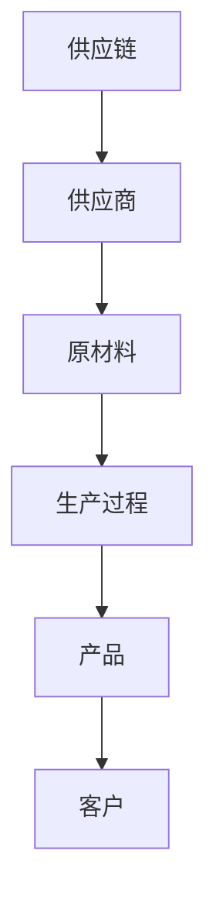
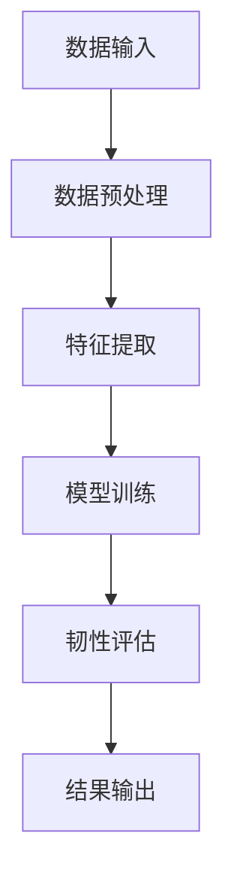
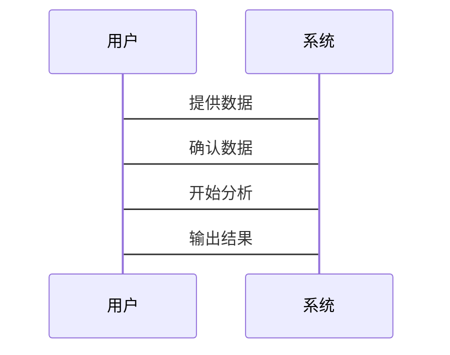

                 


# AI驱动的供应链韧性分析：评估公司长期竞争力

---

## 关键词：
AI, 供应链韧性, 供应链管理, 企业竞争力, 数学模型, 机器学习, 供应链优化

---

## 摘要：
本文深入探讨了AI驱动的供应链韧性分析方法，通过结合数学模型和机器学习算法，评估企业供应链的长期竞争力。文章首先介绍了供应链韧性的定义及其重要性，然后分析了AI在供应链管理中的应用及其优势。接着，详细讲解了供应链韧性分析的核心概念与原理，包括数据驱动的供应链分析、AI算法的应用和评估指标的选择。文章还通过实际案例分析，展示了如何利用AI技术优化供应链韧性，并提供了系统的架构设计方案与项目实战指导。最后，总结了AI驱动供应链韧性分析的关键要点，为企业提升供应链韧性提供了实践建议。

---

# 第一部分: 供应链韧性分析基础

## 第1章: 供应链韧性与AI驱动分析概述

### 1.1 供应链韧性的定义与重要性
#### 1.1.1 供应链韧性的定义
供应链韧性是指在面对不确定性（如自然灾害、疫情、市场波动等）时，供应链能够维持或快速恢复稳定运营的能力。一个具有韧性的供应链不仅能够在危机中生存，还能在危机中抓住机会，实现业务增长。

#### 1.1.2 供应链韧性的重要性
供应链是企业的生命线，其韧性直接影响企业的运营效率、成本控制和市场响应能力。AI技术的引入，使得供应链韧性分析更加智能化和精准化，帮助企业更好地应对复杂多变的市场环境。

#### 1.1.3 供应链韧性与企业长期竞争力
供应链韧性是企业长期竞争力的重要组成部分。通过AI驱动的供应链韧性分析，企业可以识别潜在风险，优化供应链结构，提升整体竞争力。

### 1.2 AI在供应链分析中的作用
#### 1.2.1 AI技术在供应链管理中的应用场景
AI技术在供应链管理中的应用场景包括需求预测、库存优化、供应商选择、物流路径优化、风险评估等。

#### 1.2.2 AI驱动供应链分析的优势
AI技术的优势在于其强大的数据处理能力和算法优化能力。通过AI，企业可以快速分析海量数据，发现潜在问题，并提出优化方案。

#### 1.2.3 供应链韧性分析的挑战与机遇
供应链韧性分析的挑战包括数据质量、模型复杂性和计算成本等问题。而机遇在于AI技术的快速发展为企业提供了新的工具和方法。

### 1.3 供应链韧性分析的核心问题
#### 1.3.1 供应链韧性分析的背景与问题背景
供应链韧性分析的背景是全球化的供应链日益复杂，企业需要应对更多的不确定性。问题背景包括供应链中断、成本上升、客户需求变化等。

#### 1.3.2 问题描述与目标
问题描述：如何利用AI技术分析供应链的韧性，识别潜在风险，优化供应链结构，提升企业的长期竞争力。

目标：构建一个基于AI的供应链韧性分析模型，帮助企业评估和优化供应链韧性。

#### 1.3.3 问题解决的思路与方法
思路：通过数据采集、特征提取、模型训练和结果分析，构建一个AI驱动的供应链韧性分析系统。

方法：结合机器学习算法和数学模型，分析供应链的关键节点和潜在风险。

#### 1.3.4 边界与外延
边界：供应链韧性分析仅关注供应链本身的韧性，不涉及企业外部的市场环境。

外延：供应链韧性分析可以扩展到企业风险管理、运营优化等领域。

#### 1.3.5 核心要素与概念结构
核心要素包括供应链节点、数据来源、分析模型和评估指标。

概念结构：通过ER图展示供应链韧性分析的核心概念及其关系。

---

# 第二部分: 供应链韧性分析的核心概念与联系

## 第2章: 核心概念与原理

### 2.1 供应链韧性分析的核心概念
#### 2.1.1 数据驱动的供应链分析
数据驱动的供应链分析依赖于海量数据，通过数据分析技术发现供应链中的潜在问题，并提出优化建议。

#### 2.1.2 AI算法在供应链分析中的应用
AI算法（如机器学习、深度学习）在供应链分析中的应用包括需求预测、风险评估和优化建议。

#### 2.1.3 供应链韧性评估指标
供应链韧性评估指标包括供应链的响应速度、恢复能力、成本控制能力等。

### 2.2 核心概念的属性特征对比
#### 2.2.1 数据来源与特征对比
| 数据来源 | 数据特征 |
|----------|----------|
| 历史数据 | 可量化的、可分析的 |
| 实时数据 | 及时性高、动态性强 |

#### 2.2.2 模型算法的特征对比
| 算法类型 | 特征 |
|----------|------|
| 线性回归 | 简单、易于解释 |
| 聚类分析 | 适用于无监督学习 |

#### 2.2.3 评估指标的特征对比
| 评估指标 | 特征 |
|----------|------|
| 响应速度 | 可量化、可优化 |

### 2.3 实体关系图与流程图
#### 2.3.1 供应链韧性分析的ER实体关系图


#### 2.3.2 供应链韧性分析的流程图
```mermaid
graph TD
    A[数据输入] --> B[数据预处理]
    B --> C[特征提取]
    C --> D[模型训练]
    D --> E[韧性评估]
    E --> 

---

# 第三部分: 供应链韧性分析的算法原理

## 第3章: 供应链韧性分析的数学模型与算法

### 3.1 线性回归模型
#### 3.1.1 线性回归的数学公式
线性回归的数学公式为：
$$ y = \beta_0 + \beta_1x + \epsilon $$
其中，$y$ 是目标变量，$x$ 是自变量，$\beta_0$ 和 $\beta_1$ 是回归系数，$\epsilon$ 是误差项。

#### 3.1.2 线性回归的应用
线性回归可以用于预测供应链中的需求量，优化库存管理。

### 3.2 聚类分析算法
#### 3.2.1 聚类分析的数学公式
聚类分析的目标是将数据点分成若干簇，使得簇内数据点的相似性最大化。常用的聚类算法包括K-means和层次聚类。

#### 3.2.2 聚类分析的应用
聚类分析可以用于识别供应链中的相似供应商，优化采购策略。

### 3.3 神经网络模型
#### 3.3.1 神经网络的数学公式
神经网络的数学公式较为复杂，通常涉及多个层和激活函数。

#### 3.3.2 神经网络的应用
神经网络可以用于供应链中的需求预测和风险评估。

---

# 第四部分: 供应链韧性分析的系统架构

## 第4章: 系统分析与架构设计

### 4.1 系统功能设计
#### 4.1.1 领域模型类图
```mermaid
classDiagram
    class 供应链韧性分析系统 {
        + 数据输入模块
        + 数据预处理模块
        + 特征提取模块
        + 模型训练模块
        + 韧性评估模块
    }
```

### 4.2 系统架构设计
#### 4.2.1 系统架构图


### 4.3 系统接口设计
#### 4.3.1 系统接口设计
供应链韧性分析系统的接口包括数据输入接口、模型训练接口和结果输出接口。

#### 4.3.2 系统交互序列图


---

# 第五部分: 供应链韧性分析的项目实战

## 第5章: 项目实战与案例分析

### 5.1 项目环境安装
#### 5.1.1 安装Python环境
```bash
pip install numpy
pip install scikit-learn
pip install matplotlib
```

### 5.2 系统核心实现
#### 5.2.1 数据预处理代码
```python
import pandas as pd
import numpy as np

data = pd.read_csv('supply_chain.csv')
data.dropna(inplace=True)
data = data[['supplier', 'cost', 'delivery_time']]
```

#### 5.2.2 特征提取代码
```python
from sklearn.preprocessing import StandardScaler

scaler = StandardScaler()
X = data[['cost', 'delivery_time']]
X_scaled = scaler.fit_transform(X)
```

#### 5.2.3 模型训练代码
```python
from sklearn.linear_model import LinearRegression

model = LinearRegression()
model.fit(X_scaled, data['supplier'])
```

#### 5.2.4 韧性评估代码
```python
import matplotlib.pyplot as plt

y_pred = model.predict(X_scaled)
plt.scatter(data['supplier'], y_pred)
plt.xlabel('Supplier')
plt.ylabel('Predicted Cost')
plt.show()
```

### 5.3 案例分析
#### 5.3.1 案例背景
某制造企业希望优化其供应链韧性，减少因供应商中断导致的生产延误。

#### 5.3.2 数据分析与结果解读
通过AI驱动的供应链韧性分析，企业发现部分供应商的交货时间不稳定，建议 diversifying suppliers to reduce risks.

#### 5.3.3 案例小结
通过AI技术，企业成功识别了供应链中的潜在风险，并采取了优化措施，显著提升了供应链韧性。

---

# 第六部分: 最佳实践与总结

## 第6章: 最佳实践与总结

### 6.1 本章小结
本文详细介绍了AI驱动的供应链韧性分析方法，从理论到实践，为企业提供了系统的解决方案。

### 6.2 小结
供应链韧性是企业长期竞争力的重要组成部分，AI技术为供应链分析提供了新的工具和方法。

### 6.3 注意事项
在实际应用中，企业需要结合自身特点，选择合适的AI技术，并确保数据质量和模型的可解释性。

### 6.4 拓展阅读
推荐阅读《供应链管理：原理与应用》和《机器学习实战》等书籍，深入理解供应链管理和AI技术的应用。

---

# 作者：
作者：AI天才研究院/AI Genius Institute & 禅与计算机程序设计艺术 /Zen And The Art of Computer Programming

---

以上是《AI驱动的供应链韧性分析：评估公司长期竞争力》的技术博客文章的完整内容，涵盖了从理论到实践的各个方面，为企业提供了一套完整的供应链韧性分析解决方案。

