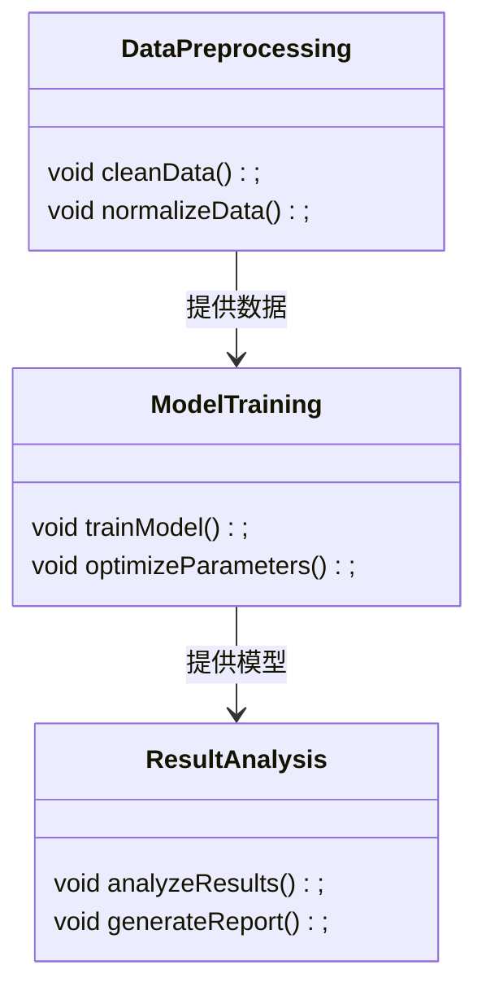
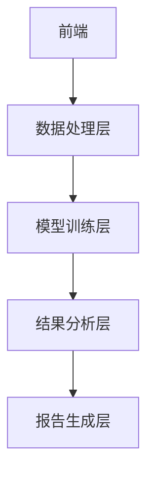
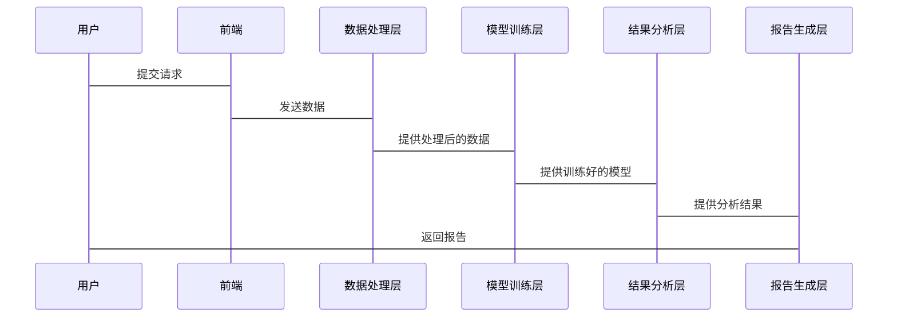

                 


# AI驱动的保险欺诈模式识别

> 关键词：保险欺诈，人工智能，模式识别，机器学习，深度学习

> 摘要：随着保险行业的快速发展，欺诈行为日益猖獗，传统的欺诈检测方法逐渐暴露出效率低下、准确性差等局限性。本文将探讨如何利用人工智能技术，特别是机器学习和深度学习，来识别和预测保险欺诈模式。文章从保险欺诈的背景、AI技术的优势、算法原理、系统架构设计到项目实战，详细分析AI在保险欺诈模式识别中的应用，并结合实际案例，展示如何通过AI技术提升欺诈检测的效率和准确性。

---

# 第1章: 保险欺诈模式识别的背景与问题描述

## 1.1 保险行业的欺诈问题现状

### 1.1.1 保险欺诈的定义与类型

保险欺诈是指通过故意虚构、夸大或隐瞒事实，骗取保险金的行为。常见的保险欺诈类型包括：

- **虚构投保人**：虚构投保人身份，骗取保险金。
- **夸大损失**：夸大实际损失金额，获取更多赔偿。
- **恶意欺诈**：故意制造事故或事件，骗取保险金。
- **重复索赔**：在不同保险公司重复索赔同一事件。

### 1.1.2 保险欺诈对行业的影响

保险欺诈不仅增加了保险公司的赔付成本，还可能导致保费上涨，影响保险行业的健康发展。据统计，保险欺诈造成的损失约占保险行业总赔付的20%~30%。

### 1.1.3 传统欺诈检测方法的局限性

传统的欺诈检测方法主要依赖人工审核和规则-based检测，存在以下问题：

- **效率低下**：人工审核耗时长，难以应对海量数据。
- **准确性差**：规则-based方法依赖于预定义的规则，难以捕捉复杂的欺诈模式。
- **漏判与误判**：规则的不完善可能导致漏判或误判。

## 1.2 AI技术在保险欺诈检测中的应用价值

### 1.2.1 AI技术的核心优势

人工智能技术，特别是机器学习和深度学习，具有以下优势：

- **高效性**：能够快速处理海量数据，提高检测效率。
- **准确性**：通过学习数据特征，能够发现复杂的欺诈模式。
- **可扩展性**：适用于各种保险产品和业务场景。

### 1.2.2 保险欺诈检测中的关键问题

- **数据特征提取**：如何从海量数据中提取有效的特征，用于欺诈检测。
- **模型选择与优化**：选择合适的算法，并进行调优以提高检测准确率。
- **结果解释与反馈**：模型的预测结果需要可解释，以便业务人员理解和优化。

### 1.2.3 保险欺诈模式识别的边界与外延

保险欺诈模式识别不仅关注单一事件的检测，还涉及跨时间、跨场景的关联分析。例如，识别同一投保人短时间内多次索赔的异常行为。

## 1.3 保险欺诈模式识别的核心要素

### 1.3.1 数据来源与特征

- **数据来源**：包括投保人信息、索赔记录、事故记录等。
- **数据特征**：如投保金额、索赔时间、事故类型、地理位置等。

### 1.3.2 模型特征

- **监督学习**：基于标签数据，学习欺诈特征。
- **无监督学习**：发现数据中的异常模式。
- **深度学习**：提取非线性特征，提高检测精度。

### 1.3.3 业务特征

- **业务规则**：结合保险行业的业务规则，优化模型。
- **风险评估**：评估不同业务场景下的欺诈风险。

## 1.4 本章小结

本章介绍了保险欺诈的现状及其对行业的影响，分析了传统检测方法的局限性，并探讨了AI技术在欺诈检测中的应用价值。通过AI技术，可以显著提高欺诈检测的效率和准确性，为保险行业带来更大的价值。

---

# 第2章: 保险欺诈模式识别的核心概念

## 2.1 保险欺诈模式识别的定义与特点

### 2.1.1 定义

保险欺诈模式识别是指利用AI技术，从海量保险数据中识别出潜在的欺诈行为或模式。

### 2.1.2 核心特点

- **数据驱动**：基于大量数据进行模式识别。
- **实时性**：能够快速识别欺诈行为。
- **可扩展性**：适用于多种保险业务场景。

## 2.2 保险欺诈模式识别的关键要素

### 2.2.1 数据特征

- **时间特征**：如索赔时间间隔、事故时间等。
- **空间特征**：地理位置分布、事故发生的区域等。
- **行为特征**：投保人的行为模式，如多次索赔、异常登录等。

### 2.2.2 模型特征

- **特征工程**：通过提取关键特征，提高模型性能。
- **模型选择**：选择适合的算法，如随机森林、神经网络等。
- **模型优化**：通过调参和数据增强，提高模型准确率。

### 2.2.3 业务特征

- **业务规则**：结合保险行业的业务规则，优化模型。
- **风险评估**：评估不同业务场景下的欺诈风险。

## 2.3 保险欺诈模式识别与相关概念的对比

### 2.3.1 与传统欺诈检测的对比

- **传统方法**：依赖人工审核和规则-based检测，效率低，准确性差。
- **AI方法**：利用机器学习和深度学习，能够自动识别复杂模式。

### 2.3.2 与AI技术的其他应用对比

- **医疗AI**：用于疾病诊断和治疗方案优化。
- **金融AI**：用于信用评估和欺诈检测。

## 2.4 保险欺诈模式识别的ER实体关系图

```mermaid
erDiagram
    customer[客户] {
        id : int
        name : string
        policy : string
        claim : string
        }
    claim[索赔] {
        id : int
        amount : float
        date : date
        status : string
        }
    fraud_pattern[欺诈模式] {
        id : int
        pattern_type : string
        description : string
        }
    customer --> claim : 提出索赔
    claim --> fraud_pattern : 属于欺诈模式
```

## 2.5 本章小结

本章详细阐述了保险欺诈模式识别的定义、特点和关键要素，并通过ER实体关系图展示了欺诈模式识别的实体关系。通过对比传统方法和其他AI应用，进一步明确了保险欺诈模式识别的独特性和重要性。

---

# 第3章: 保险欺诈模式识别的算法原理

## 3.1 监督学习算法

### 3.1.1 逻辑回归

逻辑回归是一种常用的分类算法，适用于二分类问题。其数学模型如下：

$$ P(y=1|x) = \frac{e^{\beta_0 + \beta_1x}}{1 + e^{\beta_0 + \beta_1x}} $$

其中，$\beta$为模型参数，通过最大似然估计求解。

### 3.1.2 支持向量机

支持向量机（SVM）适用于高维数据的分类问题。其核心思想是通过找到一个超平面，将数据分成两类。

### 3.1.3 决策树

决策树是一种基于树状结构的分类算法，适用于数据特征较多的场景。常用算法包括ID3、C4.5和CART。

## 3.2 无监督学习算法

### 3.2.1 K-means聚类

K-means是一种常用的聚类算法，适用于无标签数据的欺诈模式识别。其核心思想是将数据划分为K个簇，使得簇内数据点的相似性最大化。

### 3.2.2 Isolation Forest

Isolation Forest是一种基于树状结构的异常检测算法，适用于无监督场景下的欺诈检测。

## 3.3 深度学习算法

### 3.3.1 神经网络

神经网络是一种强大的非线性模型，适用于复杂的欺诈模式识别。常用的网络结构包括卷积神经网络（CNN）和循环神经网络（RNN）。

### 3.3.2 长短期记忆网络（LSTM）

LSTM适用于时间序列数据的欺诈检测，能够捕捉数据中的长距离依赖关系。

---

## 3.4 保险欺诈模式识别的数学模型与公式

### 3.4.1 逻辑回归的损失函数

$$ L(\theta) = -\sum_{i=1}^{n} [y_i \ln h(x_i) + (1 - y_i) \ln (1 - h(x_i))] $$

其中，$h(x_i) = \frac{e^{\theta^T x_i}}{1 + e^{\theta^T x_i}}$。

### 3.4.2 梯度下降公式

$$ \theta = \theta - \eta \frac{\partial L}{\partial \theta} $$

其中，$\eta$为学习率，$\frac{\partial L}{\partial \theta}$为损失函数对$\theta$的偏导数。

## 3.5 本章小结

本章详细介绍了保险欺诈模式识别中常用的算法，包括监督学习、无监督学习和深度学习算法，并给出了相关数学公式和模型。通过对比不同算法的优缺点，为实际应用提供了参考。

---

# 第4章: 保险欺诈模式识别的系统分析与架构设计

## 4.1 系统分析

### 4.1.1 问题场景介绍

保险欺诈检测系统需要处理海量的索赔数据，识别潜在的欺诈行为。系统需要具备高效性、准确性和可扩展性。

### 4.1.2 系统功能设计

- **数据预处理**：清洗、归一化、特征提取。
- **模型训练**：选择合适的算法，进行模型训练和优化。
- **结果分析**：对模型输出的结果进行分析，生成报告。

### 4.1.3 领域模型类图



## 4.2 系统架构设计

### 4.2.1 系统架构图



### 4.2.2 系统接口设计

- **数据接口**：数据预处理模块与数据源的接口。
- **模型接口**：模型训练模块与特征提取模块的接口。
- **结果接口**：结果分析模块与报告生成模块的接口。

### 4.2.3 系统交互图



## 4.3 本章小结

本章从系统分析的角度，介绍了保险欺诈检测系统的功能设计和架构设计，并通过类图和交互图展示了系统模块的交互关系。

---

# 第5章: 保险欺诈模式识别的项目实战

## 5.1 环境搭建

### 5.1.1 Python环境安装

安装Python和相关库：

```bash
pip install numpy pandas scikit-learn tensorflow
```

### 5.1.2 数据集准备

下载保险欺诈数据集，例如Kaggle上的“Insurance Fraud Dataset”。

## 5.2 数据预处理

### 5.2.1 数据清洗

删除重复数据，处理缺失值：

```python
import pandas as pd

data = pd.read_csv('insurance_fraud.csv')
data.drop_duplicates(inplace=True)
data.dropna(inplace=True)
```

### 5.2.2 特征提取

提取关键特征，例如投保金额、索赔时间等：

```python
features = data[['amount', 'date', 'policy_type']]
```

## 5.3 模型实现

### 5.3.1 逻辑回归模型

训练逻辑回归模型：

```python
from sklearn.linear_model import LogisticRegression

model = LogisticRegression()
model.fit(features, labels)
```

### 5.3.2 深度学习模型

训练神经网络模型：

```python
import tensorflow as tf

model = tf.keras.Sequential([
    tf.keras.layers.Dense(64, activation='relu'),
    tf.keras.layers.Dense(1, activation='sigmoid')
])
model.compile(optimizer='adam', loss='binary_crossentropy', metrics=['accuracy'])
model.fit(features, labels, epochs=10, batch_size=32)
```

## 5.4 结果分析

### 5.4.1 模型评估

计算模型的准确率、召回率和F1分数：

```python
from sklearn.metrics import accuracy_score, recall_score, f1_score

y_pred = model.predict(features)
print(f"Accuracy: {accuracy_score(labels, y_pred)}")
print(f"Recall: {recall_score(labels, y_pred)}")
print(f"F1 Score: {f1_score(labels, y_pred)}")
```

### 5.4.2 案例分析

分析模型预测结果，识别潜在的欺诈行为：

```python
fraud_cases = data[labels != model.predict(features)]
print(fraud_cases.head())
```

## 5.5 本章小结

本章通过实际项目案例，展示了保险欺诈模式识别的环境搭建、数据预处理、模型实现和结果分析过程。通过代码实现，进一步验证了AI技术在保险欺诈检测中的应用价值。

---

# 第6章: 保险欺诈模式识别的最佳实践与小结

## 6.1 最佳实践

### 6.1.1 数据隐私保护

在处理保险数据时，需遵守相关隐私保护法规，如GDPR。

### 6.1.2 模型可解释性

选择具有可解释性的算法，便于业务人员理解和优化。

### 6.1.3 模型优化

通过交叉验证和超参数调优，进一步提高模型性能。

## 6.2 本章小结

本章总结了保险欺诈模式识别项目的最佳实践，强调了数据隐私保护、模型可解释性和优化的重要性，并对未来的发展方向进行了展望。

---

# 作者：AI天才研究院/AI Genius Institute & 禅与计算机程序设计艺术 /Zen And The Art of Computer Programming

---

这篇文章系统地介绍了AI驱动的保险欺诈模式识别的核心概念、算法原理、系统架构设计和项目实战。通过理论与实践相结合，展示了如何利用AI技术提升保险行业的欺诈检测效率和准确性。

