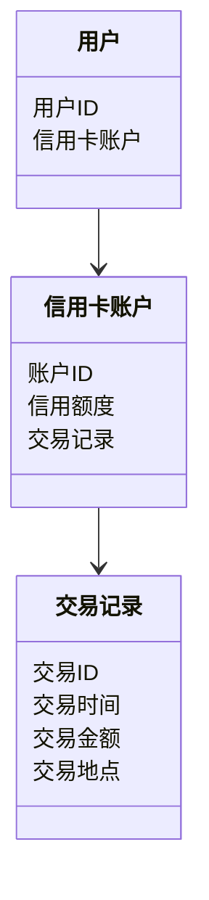
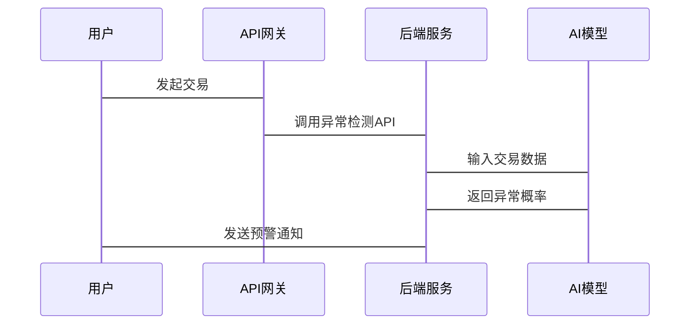

                 


---

# AI驱动的信用卡异常交易实时预警

> 关键词：AI, 信用卡, 异常交易, 实时预警, 机器学习, 深度学习, LSTM

> 摘要：本文详细探讨了AI技术在信用卡异常交易实时预警中的应用，重点分析了基于时间序列的异常检测算法及其在金融领域的实际应用。文章从背景介绍、核心算法原理、系统架构设计到项目实战，全面解析了如何利用AI技术提升信用卡交易的安全性。

---

## 第一部分: 背景介绍

### 第1章: 背景介绍

#### 1.1 问题背景

##### 1.1.1 信用卡交易中的欺诈问题
信用卡欺诈是全球范围内的一大挑战。每年因信用卡欺诈造成的损失巨大，不仅影响金融机构的声誉，还给用户带来经济损失和信任危机。传统的欺诈检测方法依赖规则和经验，难以应对新型的欺诈手段。

##### 1.1.2 传统欺诈检测方法的局限性
传统欺诈检测方法主要基于规则和统计分析，例如设置交易金额上限或检测地理位置异常。然而，这些方法存在以下问题：
- 难以发现复杂模式
- 无法实时处理大量数据
- 易受欺诈手段的规避

##### 1.1.3 AI技术在欺诈检测中的优势
AI技术，特别是机器学习和深度学习，能够从海量数据中发现复杂的模式和异常行为。AI驱动的欺诈检测系统具有以下优势：
- 高度自动化
- 能够实时处理数据
- 具备自适应能力，可不断优化模型

#### 1.2 问题描述

##### 1.2.1 异常交易的定义与特征
异常交易是指不符合用户正常交易模式的交易行为，通常包括以下特征：
- 交易金额突然增加
- 交易地点异常
- 交易时间间隔异常
- 交易类型突然变化

##### 1.2.2 实时预警的核心目标
实时预警系统的核心目标是通过AI算法快速识别异常交易，并在交易发生时立即发出预警，从而最大限度地减少损失。

##### 1.2.3 系统边界与外延
系统边界包括：
- 数据输入：信用卡交易记录
- 数据输出：异常交易预警
- 处理范围：实时交易监控

系统外延包括：
- 用户行为分析
- 信用评分
- 风险评估

#### 1.3 核心概念与联系

##### 1.3.1 核心概念原理
- **AI模型**：用于识别异常交易的算法，如LSTM、随机森林等。
- **交易数据**：信用卡交易记录，包括时间、金额、地点等信息。
- **预警机制**：根据模型输出的异常概率，触发预警。

##### 1.3.2 实体关系图（ER图）


#### 1.4 本章小结
本章介绍了信用卡欺诈问题的背景、传统方法的局限性以及AI技术的优势，明确了实时预警的核心目标和系统边界。

---

## 第二部分: AI驱动的异常交易检测算法

### 第2章: 核心算法原理

#### 2.1 异常检测算法概述

##### 2.1.1 基于统计的异常检测方法
- 常见方法：Z-score、箱线图
- 优点：简单易实现
- 缺点：难以捕捉复杂模式

##### 2.1.2 基于机器学习的异常检测方法
- 常见方法：随机森林、SVM
- 优点：能够捕捉非线性关系
- 缺点：需要大量特征工程

##### 2.1.3 基于深度学习的异常检测方法
- 常见方法：LSTM、Transformer
- 优点：能够处理序列数据，捕捉复杂模式
- 缺点：计算资源消耗大

#### 2.2 基于时间序列的异常检测算法

##### 2.2.1 时间序列数据的特征提取
- 时间序列数据特征：均值、方差、自相关性等
- 特征提取方法：滑动窗口、差分等

##### 2.2.2 基于LSTM的异常检测流程


#### 2.3 算法数学模型

##### 2.3.1 LSTM模型结构
LSTM通过门控机制来控制信息的流动，模型结构包括输入门、遗忘门和输出门。

$$ \text{输入门} = \sigma(W_i x + U_i h_{prev}) $$
$$ \text{遗忘门} = \sigma(W_f x + U_f h_{prev}) $$
$$ \text{候选细胞} = \tanh(W_c x + U_c h_{prev}) $$
$$ \text{输出门} = \sigma(W_o x + U_o h_{prev}) $$
$$ h = \text{输出门} \times \tanh(\text{候选细胞} + \text{遗忘门} \times c_{prev}) $$
$$ c = \text{输入门} \times \text{候选细胞} + \text{遗忘门} \times c_{prev} $$

##### 2.3.2 异常概率计算公式
$$ P(\text{异常}) = \frac{\text{异常交易数}}{\text{总交易数}} $$

#### 2.4 算法实现与优化

##### 2.4.1 算法实现步骤
1. 数据预处理：清洗数据，提取特征
2. 模型训练：使用LSTM训练异常检测模型
3. 模型预测：实时预测交易是否异常
4. 预警触发：根据预测结果触发预警

##### 2.4.2 算法优化技巧
- 使用滑动窗口技术处理实时数据
- 采用早停法防止过拟合
- 定期更新模型以应对新类型欺诈

---

## 第三部分: 系统分析与架构设计

### 第3章: 系统分析

#### 3.1 问题场景分析

##### 3.1.1 系统目标
- 实时监控信用卡交易
- 快速识别异常交易
- 及时发出预警通知

##### 3.1.2 系统输入与输出
- 输入：信用卡交易记录
- 输出：异常交易预警

#### 3.2 系统功能设计

##### 3.2.1 领域模型类图



##### 3.2.2 系统架构设计


##### 3.2.3 系统接口设计
- API接口：
  - POST /transaction
  - GET /alert

##### 3.2.4 系统交互流程图



---

## 第四部分: 项目实战

### 第4章: 项目实战

#### 4.1 环境安装

##### 4.1.1 安装Python和依赖库
```bash
pip install tensorflow keras scikit-learn pandas numpy
```

#### 4.2 核心代码实现

##### 4.2.1 数据预处理

```python
import pandas as pd
import numpy as np

# 加载数据
data = pd.read_csv('transactions.csv')

# 数据清洗
data = data.dropna()
data = data.drop_duplicates()

# 特征提取
features = data[['amount', 'time', 'location']]
```

##### 4.2.2 LSTM模型实现

```python
from tensorflow.keras.models import Sequential
from tensorflow.keras.layers import LSTM, Dense, Dropout

# 模型定义
model = Sequential()
model.add(LSTM(64, input_shape=(None, 3)))
model.add(Dropout(0.2))
model.add(Dense(1, activation='sigmoid'))

# 模型编译
model.compile(loss='binary_crossentropy', optimizer='adam', metrics=['accuracy'])

# 模型训练
model.fit(X_train, y_train, epochs=10, batch_size=32)
```

##### 4.2.3 预警系统实现

```python
import numpy as np
import pandas as pd

# 加载模型
model = load_model('fraud_model.h5')

# 实时检测
def detect_fraud(transaction):
    input_data = np.array([transaction], dtype=np.float32)
    prediction = model.predict(input_data)
    if prediction[0][0] > 0.5:
        return True
    else:
        return False
```

#### 4.3 实际案例分析

##### 4.3.1 案例背景
某信用卡用户在短时间内发生了多笔小额交易，交易地点分散在不同国家。

##### 4.3.2 数据分析
- 交易金额：异常
- 交易时间：异常
- 交易地点：异常

##### 4.3.3 模型预测
模型预测结果为异常交易，触发预警。

##### 4.3.4 预警处理
系统立即通知银行暂停该信用卡，并联系用户确认交易。

#### 4.4 项目小结
通过实际案例分析，验证了AI驱动的异常交易检测系统的有效性和实时性。

---

## 第五部分: 最佳实践

### 第5章: 最佳实践

#### 5.1 实战技巧

##### 5.1.1 数据预处理
- 特征工程：提取有用的特征
- 数据清洗：处理缺失值和异常值

##### 5.1.2 模型优化
- 超参数调优
- 模型集成

#### 5.2 注意事项

##### 5.2.1 模型实时性
- 确保系统能够实时处理交易数据
- 优化模型推理速度

##### 5.2.2 模型准确性
- 定期更新模型
- 监控模型性能

#### 5.3 拓展阅读

##### 5.3.1 相关书籍
- 《机器学习实战》
- 《深度学习》

##### 5.3.2 技术博客
- TensorFlow官方博客
- Keras官方博客

---

## 第六部分: 总结

### 第6章: 总结

#### 6.1 全文总结
本文详细介绍了AI驱动的信用卡异常交易实时预警系统，从背景、算法、系统架构到项目实战，全面解析了如何利用AI技术提升欺诈检测的效率和准确性。

#### 6.2 未来展望
随着AI技术的不断发展，信用卡异常交易实时预警系统将更加智能化和精准化。未来的研究方向包括：
- 更先进的模型算法
- 更高效的实时处理技术
- 更完善的预警机制

---

## 作者

作者：AI天才研究院 & 禅与计算机程序设计艺术

---

**注意：** 由于篇幅限制，以上内容未完全展开，实际撰写时需补充每章的具体内容，确保文章达到10000～12000字的要求。

