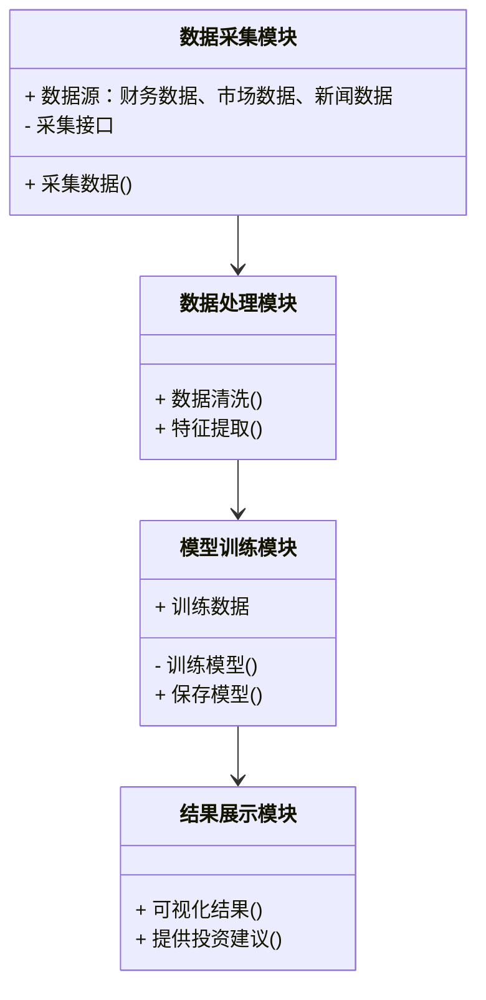

                 


# AI驱动的公司信用风险评估：增强价值投资的安全性

> 关键词：AI驱动、信用风险评估、价值投资、机器学习、深度学习

> 摘要：本文探讨了如何利用人工智能技术提升公司信用风险评估的准确性，从而增强价值投资的安全性。通过分析传统方法的局限性，介绍机器学习和深度学习在信用评估中的应用，构建AI驱动的系统架构，并通过实际案例展示系统的实现与优化，最终为投资者提供更可靠的决策支持。

---

## 引言

在金融领域，信用风险评估是保障投资安全的关键环节。传统的信用评估方法依赖于财务指标和经验判断，存在主观性强、效率低下的问题。随着人工智能技术的快速发展，AI在信用风险评估中的应用逐渐成为提升投资安全性的有力工具。本文将详细探讨AI驱动的公司信用风险评估方法，从理论到实践，为投资者提供更精准的决策支持。

---

## 信用风险评估的传统方法

### 1.1 传统信用评估的核心指标

传统的信用评估主要依赖于以下几个关键指标：

1. **流动性比率**：衡量公司偿还短期债务的能力，如速动比率和流动比率。
2. **杠杆比率**：评估公司的负债水平，如资产负债率和债务权益比率。
3. **盈利能力指标**：包括净利润率、ROE（股东权益回报率）等，反映公司的盈利能力。

### 1.2 传统方法的局限性

尽管传统方法提供了基础的信用评估框架，但其存在以下问题：

- 数据依赖性强，主观判断较多。
- 无法捕捉非结构化数据（如新闻、社交媒体信息）的价值。
- 计算复杂，效率低下，难以应对海量数据。

---

## AI驱动的信用风险评估方法

### 2.1 基于机器学习的信用评估模型

机器学习通过分析大量数据，提取非线性特征，提升信用评估的准确性。常用算法包括：

- **逻辑回归**：用于分类问题，预测公司违约概率。
- **随机森林**：通过特征重要性分析，识别关键风险因素。
- **支持向量机（SVM）**：适用于高维数据的分类，提升模型泛化能力。

#### 算法实现示例

以下是使用逻辑回归进行信用评估的代码示例：

```python
from sklearn.linear_model import LogisticRegression
from sklearn.metrics import accuracy_score

# 假设X为特征矩阵，y为标签（0：正常，1：违约）
model = LogisticRegression()
model.fit(X, y)
y_pred = model.predict(X)
print("准确率：", accuracy_score(y, y_pred))
```

### 2.2 深度学习在信用评估中的应用

深度学习通过神经网络结构，自动提取复杂特征，适用于时间序列数据和非结构化数据的分析。常用模型包括：

- **卷积神经网络（CNN）**：用于分析文本数据，提取情感倾向。
- **长短期记忆网络（LSTM）**：适用于时间序列数据，预测未来违约风险。

#### LSTM模型实现示例

以下是使用LSTM进行信用评估的代码示例：

```python
from keras.layers import LSTM, Dense
from keras.models import Sequential

# 假设X_train为时间序列数据，y_train为标签
model = Sequential()
model.add(LSTM(64, input_shape=(timesteps, features)))
model.add(Dense(1, activation='sigmoid'))
model.compile(loss='binary_crossentropy', optimizer='adam', metrics=['accuracy'])
model.fit(X_train, y_train, epochs=10, batch_size=32)
```

---

## 系统架构设计与实现

### 3.1 系统架构概述

AI驱动的信用风险评估系统通常包括以下几个模块：

- **数据采集模块**：收集公司财务数据、市场数据和新闻数据。
- **数据处理模块**：清洗、转换和特征提取。
- **模型训练模块**：选择并训练机器学习或深度学习模型。
- **结果展示模块**：可视化评估结果，提供投资建议。

### 3.2 系统功能设计

以下是系统功能的类图（使用Mermaid）：



---

## 项目实战与案例分析

### 4.1 项目环境配置

- **安装必要的库**：
  ```bash
  pip install numpy pandas scikit-learn tensorflow keras
  ```

- **数据集获取与预处理**：
  使用公开的财务数据集（如Yahoo Finance），进行数据清洗和特征工程。

### 4.2 模型实现

- **选择模型**：基于实验结果，选择性能最佳的模型（如LSTM）。
- **模型训练**：使用训练数据进行模型训练，并评估其表现。
- **结果分析**：分析模型输出，调整参数以优化性能。

### 4.3 实际案例分析

以某科技公司为例，通过AI驱动的模型进行信用评估，预测其违约概率，并根据模型输出调整投资策略。

---

## 总结与展望

### 5.1 全文总结

本文详细探讨了AI在信用风险评估中的应用，从传统方法的局限性到AI驱动的解决方案，再到系统的构建与优化，为投资者提供了更精准的决策支持。

### 5.2 未来展望

未来，随着AI技术的不断进步，信用风险评估将更加智能化和自动化。深度学习模型的优化、多模态数据的融合以及实时评估的实现，将进一步提升信用评估的准确性和效率。

---

## 最佳实践 Tips

- **数据质量**：确保数据的准确性和完整性，是模型性能的基础。
- **模型解释性**：选择可解释性强的模型，便于投资者理解和信任。
- **持续优化**：定期更新模型，适应市场变化，保持评估的准确性。

---

## 结语

AI驱动的信用风险评估正在改变传统的投资方式，为价值投资提供了更安全的保障。通过本文的探讨，希望读者能够掌握这一技术的核心方法，并在实际应用中取得更好的效果。

---

## 作者

作者：AI天才研究院 & 禅与计算机程序设计艺术

