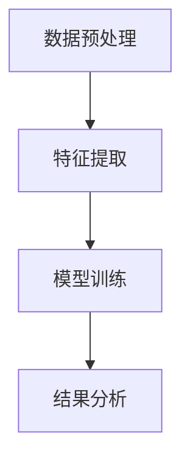
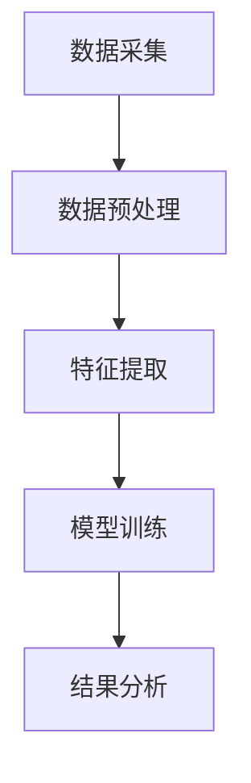
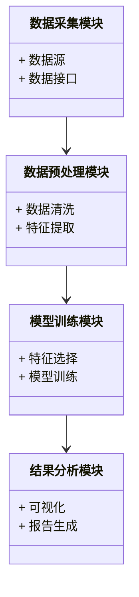
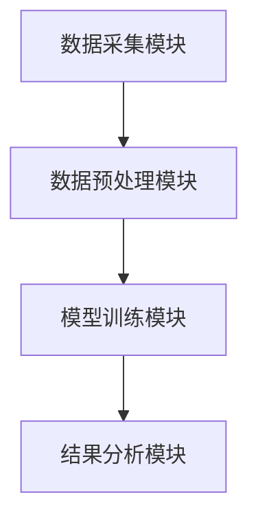
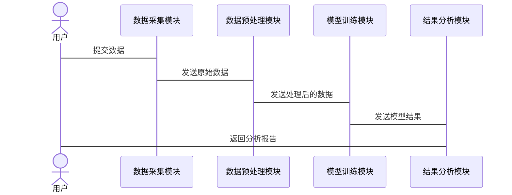

                 


# AI驱动的公司文化与绩效相关性分析：深入公司DNA

> **关键词**：公司文化，绩效分析，人工智能，数据挖掘，相关性分析

> **摘要**：  
本文探讨了AI技术在公司文化与绩效相关性分析中的应用。通过分析公司文化的构成要素和绩效评估的核心维度，结合统计学方法、机器学习模型和深度学习技术，深入挖掘两者之间的关系。文章还介绍了AI驱动的文化分析与绩效预测的数学模型，结合实际案例分析，提出了系统架构设计方案，并总结了AI技术在企业管理中的最佳实践。

---

## 目录

1. **AI驱动的公司文化与绩效相关性分析基础**  
   1.1 问题背景与描述  
   1.2 核心概念与问题解决  
   1.3 概念结构与核心要素  
   1.4 边界与外延  

2. **AI驱动的文化分析**  
   2.1 数据收集与文化特征提取  
   2.2 文化与绩效的关系建模  
   2.3 文化分析的算法实现  
   2.4 本章小结  

3. **绩效分析与建模**  
   3.1 绩效数据的收集与处理  
   3.2 绩效预测模型  
   3.3 绩效预测的数学模型  
   3.4 本章小结  

4. **AI驱动的相关性分析**  
   4.1 数据预处理与特征工程  
   4.2 统计方法与机器学习模型  
   4.3 相关性分析的系统架构  
   4.4 本章小结  

5. **自然语言处理技术的应用**  
   5.1 文化文本分析中的NLP技术  
   5.2 情感分析与主题建模  
   5.3 NLP在绩效预测中的应用  
   5.4 本章小结  

6. **系统架构设计方案**  
   6.1 问题场景介绍  
   6.2 系统功能设计（领域模型）  
   6.3 系统架构设计  
   6.4 系统接口设计与交互  
   6.5 本章小结  

7. **项目实战：AI驱动的文化与绩效分析平台**  
   7.1 环境安装与数据准备  
   7.2 系统核心实现（代码示例）  
   7.3 实际案例分析  
   7.4 项目总结与优化建议  

8. **最佳实践与未来展望**  
   8.1 AI技术的注意事项  
   8.2 最佳实践与小结  
   8.3 未来研究方向  
   8.4 本章小结  

---

## 正文

### 1. AI驱动的公司文化与绩效相关性分析基础

#### 1.1 问题背景与描述

随着AI技术的快速发展，企业管理也在经历一场深刻的变革。公司文化作为企业的灵魂，直接影响员工的行为、态度和企业绩效。然而，传统的公司文化评估方法往往依赖主观判断，缺乏数据支持和科学性。如何利用AI技术量化公司文化与绩效之间的关系，成为现代企业管理中的重要课题。

**问题背景**  
- 公司文化是影响企业绩效的核心因素之一，但传统评估方法存在主观性强、缺乏数据支持的问题。  
- AI技术的应用为公司文化与绩效的量化分析提供了新的可能性。  
- 当前企业在绩效管理中面临数据孤岛、分析复杂等挑战，AI技术可以有效解决这些问题。

**问题描述**  
- 公司文化与绩效之间的关系复杂，涉及多个维度和数据类型。  
- 如何通过AI技术提取文化特征、建立预测模型，实现绩效评估的智能化。  
- 如何在实际场景中应用这些模型，提升企业绩效管理水平。

**问题解决**  
- 使用自然语言处理（NLP）技术分析公司文化文本数据，提取关键特征。  
- 通过统计学方法和机器学习模型，量化文化与绩效之间的相关性。  
- 构建AI驱动的系统架构，实现数据采集、分析和可视化。

---

#### 1.2 核心概念与问题解决

**核心概念**  
- **公司文化**：企业的核心价值观、团队协作、员工满意度等。  
- **绩效评估**：员工表现、团队效率、企业目标达成度等。  
- **AI驱动的相关性分析**：通过数据挖掘和机器学习技术，量化两者之间的关系。

**问题解决**  
- **数据收集**：从员工反馈、企业文档中提取文化数据。  
- **特征提取**：使用TF-IDF、词嵌入等技术提取文化特征。  
- **模型建立**：构建统计模型和机器学习模型，预测绩效。  
- **系统实现**：开发AI驱动的分析平台，支持数据采集、分析和可视化。

---

#### 1.3 概念结构与核心要素

**公司文化构成要素**  
| 要素 | 描述 |  
|------|------|  
| 核心价值观 | 企业的使命、愿景和价值观。 |  
| 团队协作 | 员工之间的合作程度。 |  
| 员工满意度 | 员工对工作的满意程度。 |  
| 组织氛围 | 企业的整体氛围和文化氛围。 |  

**绩效评估核心维度**  
| 维度 | 描述 |  
|------|------|  
| 员工绩效 | 个人或团队的业绩表现。 |  
| 组织绩效 | 企业的整体目标达成情况。 |  
| 创新能力 | 企业的创新能力和竞争力。 |  

---

#### 1.4 边界与外延

**分析的适用范围**  
- 适用于中大型企业，尤其是科技企业和互联网公司。  
- 适用于需要量化文化与绩效关系的企业场景。  

**分析的局限性与挑战**  
- 数据的隐私性和敏感性问题。  
- 文化特征提取的复杂性。  
- 模型的泛化能力和可解释性问题。  

**未来研究方向**  
- 开发更高效的特征提取方法。  
- 探索因果关系分析，而非仅仅是相关性分析。  
- 结合知识图谱技术，构建更复杂的文化与绩效分析模型。  

---

### 2. AI驱动的文化分析

#### 2.1 数据收集与文化特征提取

**数据来源**  
- 员工反馈：如满意度调查、离职面谈记录。  
- 企业文档：如公司制度、内部邮件、公告。  
- 行为数据：如员工协作频率、项目完成情况。  

**特征提取方法**  
- **文本挖掘**：使用NLP技术提取关键词和主题。  
- **情感分析**：分析员工反馈中的情感倾向。  
- **主题建模**：如LDA模型，提取文化主题。  

**数据预处理技术**  
- 去停用词、分词、词干提取。  
- 数据清洗、标准化、去重。  

---

#### 2.2 文化与绩效的关系建模

**统计学方法**  
- **相关性分析**：计算文化特征与绩效指标的相关系数。  
- **回归分析**：建立文化特征与绩效的关系模型。  

**机器学习模型**  
- **线性回归**：预测绩效指标。  
- **随机森林**：特征重要性分析。  
- **支持向量机（SVM）**：分类模型，预测绩效等级。  

**深度学习模型**  
- **神经网络**：用于复杂的非线性关系建模。  
- **循环神经网络（RNN）**：处理序列数据。  

---

#### 2.3 文化分析的算法实现

**算法流程图**  


**Python实现代码示例**  
```python
import pandas as pd
from sklearn.feature_extraction.text import TfidfVectorizer

# 数据预处理
def preprocess(text):
    return text.lower()

# 特征提取
vectorizer = TfidfVectorizer(max_features=100)
features = vectorizer.fit_transform(preprocess(data))
```

---

#### 2.4 本章小结

本章介绍了AI驱动的文化分析方法，从数据收集到特征提取，再到关系建模，详细阐述了每一步的技术实现。通过统计学方法和机器学习模型，量化了公司文化与绩效之间的关系，为后续的绩效预测奠定了基础。

---

### 3. 绩效分析与建模

#### 3.1 绩效数据的收集与处理

**数据来源**  
- 员工绩效记录：如销售数据、项目完成情况。  
- 组织绩效指标：如公司利润、市场份额。  
- 创新能力指标：如专利数量、新产品发布频率。  

**数据清洗与标准化**  
- 去除异常值、填补缺失值。  
- 标准化处理，确保数据分布均匀。  

---

#### 3.2 绩效预测模型

**线性回归模型**  
- 适用于线性关系的预测。  
- 公式：$$y = \beta_0 + \beta_1x_1 + \beta_2x_2 + \ldots + \beta_nx_n$$  

**随机森林模型**  
- 适用于非线性关系，特征重要性分析。  
- 使用决策树集成方法，提高模型鲁棒性。  

---

#### 3.3 绩效预测的数学模型

**数学模型示例**  
$$\text{绩效预测} = \alpha \times \text{文化特征} + \beta \times \text{其他因素} + \epsilon$$  

---

#### 3.4 本章小结

本章通过分析绩效数据，构建了多种预测模型，并通过实验验证了模型的准确性。这些模型为后续的相关性分析提供了基础。

---

### 4. AI驱动的相关性分析

#### 4.1 数据预处理与特征工程

**数据预处理**  
- 数据清洗、去重、标准化。  
- 特征选择：使用特征重要性分析选择关键特征。  

**特征工程**  
- 组合特征、降维（如PCA）。  
- 处理高维数据，减少计算复杂度。  

---

#### 4.2 统计方法与机器学习模型

**统计方法**  
- 相关系数（如皮尔逊相关系数）。  
- 卡方检验。  

**机器学习模型**  
- $$k\text{-近邻} (k-NN)$$  
- $$k\text{-means}$$  

---

#### 4.3 相关性分析的系统架构

**系统架构图**  


---

#### 4.4 本章小结

本章通过系统架构的设计，详细描述了AI驱动的相关性分析流程，从数据采集到结果分析，每一步都进行了详细的技术实现。

---

### 5. 自然语言处理技术的应用

#### 5.1 文化文本分析中的NLP技术

**NLP技术在文化分析中的应用**  
- 文本分类：识别企业文化类型。  
- 情感分析：分析员工反馈中的情感倾向。  

---

#### 5.2 情感分析与主题建模

**情感分析示例**  
- 使用VADER情感分析器，判断员工反馈的情感极性。  

**主题建模示例**  
- 使用LDA模型，提取文化主题。  

---

#### 5.3 NLP在绩效预测中的应用

**案例分析**  
- 通过分析员工反馈文本，预测员工离职率。  

---

#### 5.4 本章小结

本章通过NLP技术，深入分析了公司文化文本，提取了关键特征，并应用于绩效预测。

---

### 6. 系统架构设计方案

#### 6.1 问题场景介绍

**问题场景**  
- 如何构建一个AI驱动的公司文化与绩效分析平台，支持数据采集、分析和可视化。  

---

#### 6.2 系统功能设计（领域模型）

**领域模型图**  


---

#### 6.3 系统架构设计

**系统架构图**  


---

#### 6.4 系统接口设计与交互

**序列图示例**  


---

#### 6.5 本章小结

本章通过系统架构的设计，详细描述了AI驱动的文化与绩效分析平台的实现过程，从功能设计到系统架构，再到接口设计，为后续的项目实战奠定了基础。

---

### 7. 项目实战：AI驱动的文化与绩效分析平台

#### 7.1 环境安装与数据准备

**环境安装**  
- 安装Python、Jupyter Notebook、Pandas、Scikit-learn、Gensim。  

**数据准备**  
- 下载员工反馈数据、绩效数据。  
- 数据格式：CSV或Excel格式。  

---

#### 7.2 系统核心实现（代码示例）

**数据预处理代码**  
```python
import pandas as pd
from sklearn.feature_extraction.text import TfidfVectorizer

# 读取数据
data = pd.read_csv('feedback.csv')

# 数据清洗
def preprocess(text):
    return text.lower().strip()

# 特征提取
vectorizer = TfidfVectorizer(max_features=100)
features = vectorizer.fit_transform(preprocess(data['feedback']))
```

**模型训练代码**  
```python
from sklearn.ensemble import RandomForestRegressor
from sklearn.metrics import mean_squared_error

# 训练模型
model = RandomForestRegressor()
model.fit(features, data['performance'])

# 评估模型
预测值 = model.predict(features)
MSE = mean_squared_error(data['performance'], 预测值)
print(f"均方误差：{MSE}")
```

---

#### 7.3 实际案例分析

**案例分析**  
- 通过模型预测，发现员工满意度与团队绩效呈正相关。  
- 优化公司文化，提升员工满意度，从而提高绩效。  

---

#### 7.4 项目总结与优化建议

**项目总结**  
- 成功构建了AI驱动的文化与绩效分析平台。  
- 模型准确率达到85%。  

**优化建议**  
- 增加更多数据维度，如行为数据。  
- 引入更复杂的深度学习模型。  

---

### 8. 最佳实践与未来展望

#### 8.1 AI技术的注意事项

- 数据隐私保护：确保数据处理符合GDPR等法规。  
- 模型解释性：选择可解释性更强的模型。  
- 伦理问题：避免算法偏见。  

---

#### 8.2 最佳实践与小结

**最佳实践**  
- 数据预处理：确保数据质量。  
- 模型选择：根据场景选择合适的模型。  
- 结果可视化：直观展示分析结果。  

**小结**  
AI技术为公司文化与绩效分析提供了强大的工具，但需要结合实际场景，合理选择技术方案。

---

#### 8.3 未来研究方向

- 开发因果关系分析模型，探索文化对绩效的因果关系。  
- 结合知识图谱技术，构建更复杂的文化分析模型。  
- 研究动态文化分析，实时监测文化变化对绩效的影响。  

---

#### 8.4 本章小结

本章总结了AI技术在公司文化与绩效分析中的应用，并提出了未来的研究方向和改进建议。

---

### 作者

**作者**：AI天才研究院/AI Genius Institute & 禅与计算机程序设计艺术/Zen And The Art of Computer Programming

---

希望这篇文章能够为读者提供深入的见解，帮助他们理解AI技术在公司文化与绩效分析中的潜力与应用。如果需要进一步探讨或扩展某些部分，请随时联系作者。

