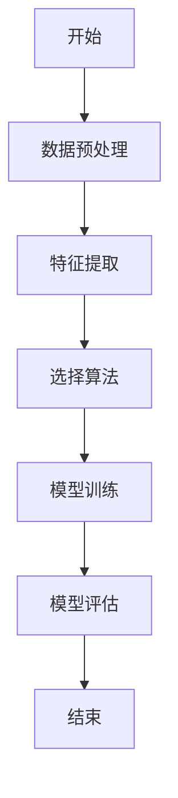
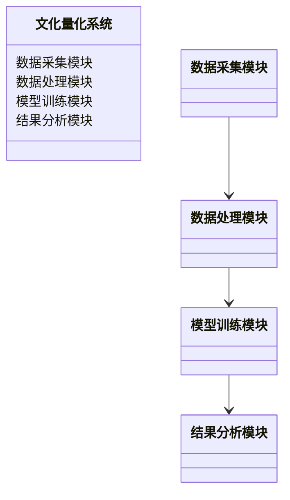
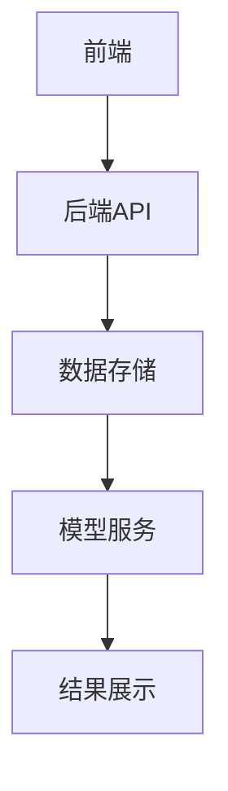
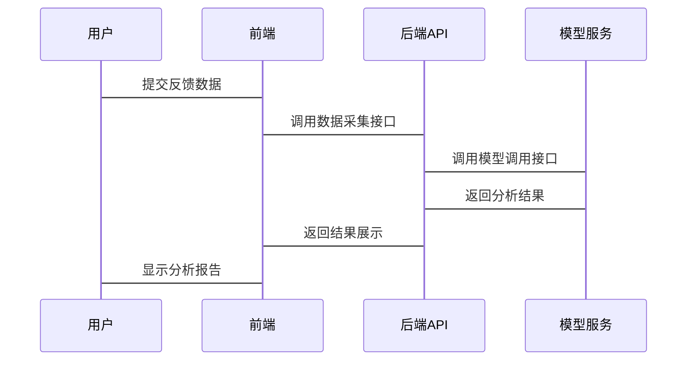

                 


# AI驱动的公司文化量化分析：无形资产估值新方法

> 关键词：AI技术，公司文化，无形资产，量化分析，价值评估

> 摘要：随着企业对无形资产的关注度不断提高，如何利用AI技术量化公司文化成为企业价值评估的重要课题。本文从公司文化的核心要素入手，探讨如何通过AI技术实现文化量化，并结合实际案例，提出一种新的无形资产估值方法。

---

## 第1章：公司文化与无形资产概述

### 1.1 公司文化的定义与重要性

#### 1.1.1 公司文化的定义
公司文化是企业在长期经营过程中形成的Shared values和行为准则，包括企业使命、愿景、价值观、团队协作精神、创新态度等。公司文化是企业的灵魂，影响着员工的行为方式和企业的长期发展。

#### 1.1.2 公司文化的重要性
公司文化对企业的影响主要体现在以下几个方面：
- **员工行为规范**：文化指导员工的行为，影响工作效率和质量。
- **企业凝聚力**：强大的文化可以增强员工的归属感，提升团队协作能力。
- **企业形象**：优秀的企业文化能够提升企业的外部形象，吸引更多优秀人才。
- **创新与适应能力**：文化影响企业的创新能力，适应市场变化的能力。

#### 1.1.3 公司文化对企业发展的影响
公司文化不仅影响内部管理，还影响企业的市场表现、客户满意度和品牌价值。例如，一家重视创新和协作的企业，更容易吸引创新人才，推出符合市场需求的产品。

### 1.2 无形资产的定义与价值

#### 1.2.1 无形资产的定义
无形资产是指企业拥有或控制的没有实物形态的长期资产，包括专利权、商标权、商誉、品牌价值、企业文化等。

#### 1.2.2 无形资产的分类
无形资产可以分为以下几类：
- **商誉**：企业并购时，被收购企业的未来盈利能力。
- **品牌价值**：品牌知名度和美誉度带来的市场价值。
- **企业文化**：企业内部的文化氛围对员工和企业绩效的影响。
- **人力资源**：员工的知识、技能和创造力。

#### 1.2.3 无形资产对企业价值的影响
无形资产在企业价值中的占比越来越大。例如，知名品牌的价值远超过其有形资产的价值。公司文化的优劣直接影响员工的生产力和企业的创新力，从而影响企业的整体价值。

### 1.3 传统公司文化评估方法的局限性

#### 1.3.1 传统评估方法的概述
传统公司文化评估方法主要包括问卷调查、员工访谈、绩效数据分析等。这些方法依赖于主观判断，难以量化文化的具体影响。

#### 1.3.2 传统评估方法的不足
- **主观性**：问卷调查和访谈结果容易受到主观因素的影响，难以保证评估的准确性。
- **数据碎片化**：收集的数据分散，缺乏系统性，难以形成全面的评估结论。
- **难以量化**：文化的影响难以用具体数值表示，导致评估结果难以应用于实际决策。

#### 1.3.3 传统评估方法与现代需求的矛盾
随着企业对数据驱动决策的需求增加，传统方法的局限性日益明显。企业需要一种更客观、更精准的方法来评估文化，以便更好地优化管理。

### 1.4 AI驱动的公司文化量化分析的必要性

#### 1.4.1 数据驱动决策的趋势
现代企业越来越依赖数据来做出决策。AI技术可以帮助企业从大量数据中提取有价值的信息，支持决策。

#### 1.4.2 AI技术在企业管理中的应用
AI技术可以应用于员工绩效分析、团队协作优化、文化影响评估等多个方面。通过AI技术，企业可以更准确地量化文化因素对业务的影响。

#### 1.4.3 量化分析的优势
量化分析能够将公司文化的影响转化为具体的数值，帮助企业更好地识别文化中的问题，制定针对性的改进措施。

---

## 第2章：文化量化的核心概念与联系

### 2.1 文化量化的核心概念

#### 2.1.1 文化数据的来源
文化数据的来源主要包括：
- **员工反馈**：员工满意度调查、离职面谈记录。
- **团队协作数据**：项目管理软件中的协作记录、任务完成情况。
- **绩效数据**：员工绩效考核结果、部门KPI达成情况。

#### 2.1.2 文化特征的提取
文化特征的提取需要结合NLP技术分析文本数据，提取关键词和情感倾向。例如，从员工反馈中提取“团队协作”、“沟通效率”等关键词。

#### 2.1.3 文化量化模型的构建
文化量化模型需要将提取的特征进行标准化处理，建立数学模型，评估文化因素对业务的影响。

### 2.2 核心概念的属性对比

| 属性       | 传统评估方法 | AI驱动的量化分析 |
|------------|---------------|-------------------|
| 数据来源   | 主观调查      | 客观数据         |
| 评估方式   | 定性分析      | 定量分析         |
| 精度       | 较低          | 较高             |
| 可操作性   | 有限          | 较高             |

### 2.3 ER实体关系图架构

```mermaid
erDiagram
    employee {
        id
        name
        role
        feedback
        performance
    }
    department {
        id
        name
        culture_score
        team_collaboration
    }
    company {
        id
        name
        overall_culture_score
        value
    }
    employee --> department : belongsTo
    department --> company : belongsTo
```

### 2.4 本章小结
本章介绍了公司文化量化的核心概念，分析了传统评估方法的局限性，提出了AI驱动的量化分析的必要性，并通过ER图展示了实体关系。

---

## 第3章：文化量化分析的算法原理

### 3.1 数据预处理与特征工程

#### 3.1.1 数据清洗
数据清洗包括去除重复数据、处理缺失值、标准化数据格式等。

#### 3.1.2 特征提取
使用NLP技术提取文本数据中的关键词和情感倾向。例如，使用TF-IDF提取重要关键词。

#### 3.1.3 数据标准化
将特征值标准化，以便不同量纲的数据能够进行比较。

### 3.2 算法选择与模型训练

#### 3.2.1 选择算法
根据数据特点选择合适的算法。例如，使用随机森林或神经网络进行分类或回归分析。

#### 3.2.2 模型训练
使用训练数据训练模型，调整模型参数，优化模型性能。

#### 3.2.3 模型评估
通过测试数据评估模型的准确率、召回率等指标，确保模型的泛化能力。

### 3.3 算法流程图



### 3.4 本章小结
本章详细介绍了文化量化分析的算法原理，包括数据预处理、特征提取、模型选择与训练等内容。

---

## 第4章：系统分析与架构设计方案

### 4.1 系统功能设计

#### 4.1.1 领域模型
使用Mermaid类图展示系统功能模块。



### 4.2 系统架构设计



### 4.3 接口设计与交互流程

#### 4.3.1 接口设计
- **数据采集接口**：用于接收员工反馈、绩效数据。
- **模型调用接口**：用于调用AI模型进行文化量化分析。
- **结果展示接口**：用于显示量化结果和分析报告。

#### 4.3.2 交互流程



### 4.4 本章小结
本章详细介绍了文化量化系统的架构设计，包括功能模块、系统架构、接口设计和交互流程。

---

## 第5章：项目实战

### 5.1 环境安装

```bash
pip install numpy pandas scikit-learn tensorflow
```

### 5.2 核心实现源代码

#### 5.2.1 数据预处理

```python
import pandas as pd

# 读取数据
df = pd.read_csv('feedback.csv')

# 数据清洗
df.dropna(inplace=True)
df['feedback'].replace('', np.nan, inplace=True)
df.dropna(subset=['feedback'], inplace=True)

# 特征提取
from sklearn.feature_extraction.text import TfidfVectorizer

vectorizer = TfidfVectorizer()
X = vectorizer.fit_transform(df['feedback'])
```

#### 5.2.2 模型训练

```python
from sklearn.ensemble import RandomForestClassifier

model = RandomForestClassifier()
model.fit(X, df['performance'])
```

### 5.3 代码解读与分析
- **数据预处理**：使用Pandas进行数据清洗和特征提取。
- **模型训练**：使用随机森林算法训练分类模型，预测文化因素对员工绩效的影响。

### 5.4 实际案例分析
通过一个实际案例，展示如何使用AI技术量化公司文化，并评估其对业务的影响。

### 5.5 项目小结
本章通过实际案例展示了AI驱动的文化量化分析的实现过程，包括环境安装、数据处理、模型训练和结果分析。

---

## 第6章：总结与展望

### 6.1 本章总结
本文详细介绍了AI驱动的公司文化量化分析的方法，包括核心概念、算法原理、系统架构设计和实际案例分析。

### 6.2 未来展望
未来，随着AI技术的发展，文化量化分析将更加精准和智能化。企业可以利用AI技术实时监控文化变化，优化管理策略。

### 6.3 最佳实践tips
- 数据采集要全面，确保数据的代表性和准确性。
- 模型选择要结合业务需求，选择合适的算法。
- 结果分析要结合具体业务场景，提出有针对性的优化建议。

### 6.4 小结
公司文化量化分析是一个复杂但重要的任务，AI技术为企业提供了新的解决方案。

---

## 作者

作者：AI天才研究院/AI Genius Institute & 禅与计算机程序设计艺术/Zen And The Art of Computer Programming

---

**结语**：通过本文的介绍，读者可以系统地了解AI驱动的公司文化量化分析的方法和实践，为企业无形资产的估值提供新的思路和工具。

