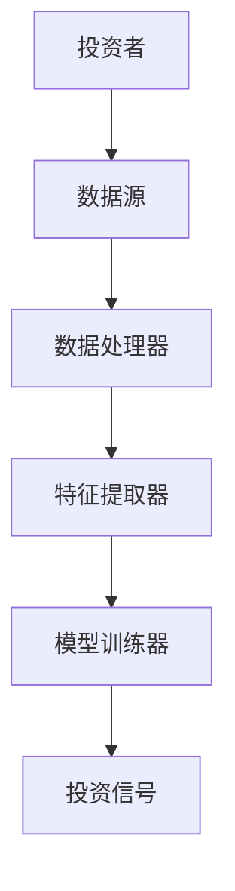
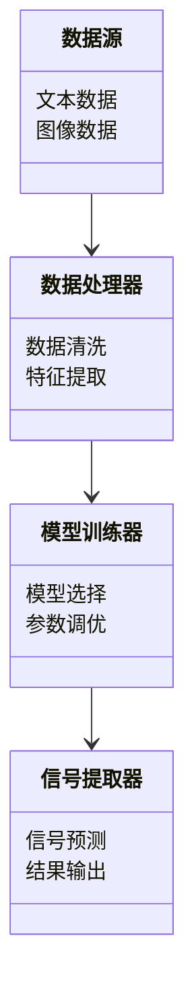
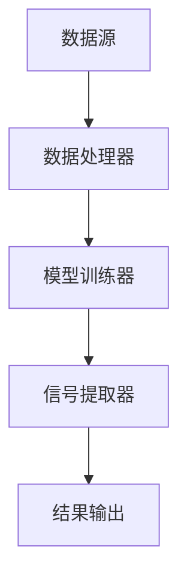
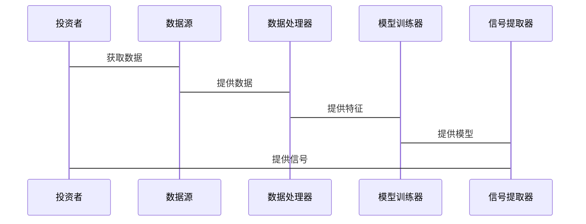

                 


# AI驱动的另类数据投资信号提取

## 关键词：AI、另类数据、投资信号、文本挖掘、时间序列分析、深度学习

## 摘要：本文将探讨如何利用人工智能技术从另类数据中提取投资信号。通过分析文本、社交媒体、卫星图像等非传统数据源，结合先进的算法和系统架构设计，构建高效的投资信号提取系统。文章从背景、核心概念、算法原理到项目实战，全面解析AI驱动的另类数据投资信号提取的实现过程。

---

# 第1章 背景介绍

## 1.1 问题背景

### 1.1.1 投资信号提取的现状与挑战
传统金融市场分析主要依赖于价格、成交量等传统数据，但这些数据的局限性日益显现。投资者需要从社交媒体、新闻、卫星图像等另类数据中获取更多信息，以捕捉市场波动的早期信号。

### 1.1.2 另类数据的定义与特点
另类数据是指传统金融数据之外的非结构化数据，如文本、图像、音频等。这些数据具有实时性、丰富性和多样性的特点，能够提供更多的市场洞察。

### 1.1.3 AI技术在投资信号提取中的作用
人工智能技术，尤其是自然语言处理和深度学习，能够从大量非结构化数据中提取有用的特征，帮助投资者做出更明智的决策。

## 1.2 问题描述

### 1.2.1 投资信号提取的核心问题
如何从另类数据中提取有用的信号，并将其转化为投资决策的依据。

### 1.2.2 另类数据的获取与处理
数据清洗、特征提取和数据增强是处理另类数据的关键步骤。

### 1.2.3 AI驱动的信号提取方法
通过构建机器学习模型，从另类数据中提取潜在的市场信号。

## 1.3 问题解决

### 1.3.1 数据预处理与特征提取
对另类数据进行清洗、分词和特征提取，为后续分析奠定基础。

### 1.3.2 AI模型的选择与优化
选择适合的机器学习模型，并通过参数调优提高模型性能。

### 1.3.3 信号提取的实现流程
从数据获取到模型训练，再到信号提取的完整流程。

## 1.4 边界与外延

### 1.4.1 投资信号提取的边界条件
数据质量、模型性能和计算能力等因素对信号提取的影响。

### 1.4.2 另类数据的外延与扩展
从社交媒体到卫星图像，另类数据的种类和应用场景不断扩展。

### 1.4.3 AI驱动方法的适用范围
AI技术在不同市场环境下的适用性和局限性。

## 1.5 核心要素组成

### 1.5.1 数据来源与类型
包括社交媒体、新闻、卫星图像等多种数据来源。

### 1.5.2 AI模型的关键参数
如学习率、批量大小、模型层数等关键参数。

### 1.5.3 信号提取的评价指标
如准确率、召回率、F1分数等评价指标。

---

# 第2章 另类数据与投资信号基础

## 2.1 另类数据的定义与分类

### 2.1.1 另类数据的定义
另类数据是指传统金融数据之外的非结构化数据，如文本、图像等。

### 2.1.2 另类数据的分类
包括文本数据、图像数据、音频数据等。

### 2.1.3 另类数据的获取方法
通过爬虫、API接口等方式获取另类数据。

## 2.2 投资信号的定义与特征

### 2.2.1 投资信号的定义
投资信号是指从数据中提取的能够影响投资决策的有用信息。

### 2.2.2 投资信号的特征
如相关性、及时性和可操作性等。

### 2.2.3 投资信号的分类
如情绪信号、趋势信号和突发事件信号等。

## 2.3 另类数据与投资信号的关系

### 2.3.1 另类数据在投资信号提取中的作用
通过分析社交媒体上的情绪数据，捕捉市场情绪变化。

### 2.3.2 另类数据与传统数据的对比
从数据类型、数据量和数据实时性等方面进行对比。

### 2.3.3 另类数据对投资决策的影响
通过另类数据发现市场波动的早期信号，辅助投资决策。

---

# 第3章 AI驱动的另类数据投资信号提取核心概念

## 3.1 核心概念原理

### 3.1.1 数据预处理
对另类数据进行清洗、分词和特征提取。

### 3.1.2 特征提取
通过文本挖掘、图像处理等技术提取有用特征。

### 3.1.3 模型训练
构建机器学习模型，对提取的特征进行训练。

### 3.1.4 信号提取
通过模型预测，提取投资信号。

## 3.2 核心概念属性特征对比

| 特征 | 描述 |
|------|------|
| 数据类型 | 文本、图像等非结构化数据 |
| 数据量 | 大规模数据 |
| 数据实时性 | 高实时性 |

## 3.3 ER实体关系图



---

# 第4章 AI驱动的另类数据投资信号提取算法原理

## 4.1 文本挖掘算法

### 4.1.1 算法流程
1. 数据清洗：去除停用词、标点符号等。
2. 分词：将文本分割成词语或短语。
3. 词频统计：计算每个词语的出现频率。
4. 情感分析：判断文本的情感倾向。

### 4.1.2 Python代码示例

```python
import nltk
from nltk.corpus import stopwords

text = "This is a sample text. It contains some words."
tokens = nltk.word_tokenize(text)
stop_words = set(stopwords.words('english'))
filtered_tokens = [token for token in tokens if token not in stop_words]
print(filtered_tokens)
```

### 4.1.3 数学模型
$$ \text{TF-IDF} = \frac{\text{term frequency}}{\text{inverse document frequency}} $$

## 4.2 时间序列分析

### 4.2.1 算法流程
1. 数据预处理：平滑、差分等。
2. 模型选择：ARIMA、LSTM等。
3. 模型训练：拟合数据。
4. 信号提取：预测未来趋势。

### 4.2.2 Python代码示例

```python
import pandas as pd
import numpy as np

data = pd.read_csv('time_series.csv')
data['smoothed'] = data['value'].rolling(7).mean()
print(data.head())
```

### 4.2.3 数学模型
$$ \text{ARIMA}(p, d, q) $$

## 4.3 深度学习模型

### 4.3.1 算法流程
1. 数据预处理：归一化、填充缺失值。
2. 模型构建：搭建LSTM网络。
3. 模型训练：反向传播优化。
4. 信号提取：模型预测。

### 4.3.2 Python代码示例

```python
import tensorflow as tf
from tensorflow.keras import layers

model = tf.keras.Sequential()
model.add(layers.LSTM(64, input_shape=(None, 1)))
model.add(layers.Dense(1))
model.compile(loss='mean_squared_error', optimizer='adam')
model.fit(x_train, y_train, epochs=10)
```

### 4.3.3 数学模型
$$ \text{LSTM}(t) = \text{sigmoid}(W_{xh}x_t + W_{hh}h_{t-1} + b_h) $$

---

# 第5章 系统架构设计

## 5.1 问题场景介绍

### 5.1.1 系统目标
构建一个高效的投资信号提取系统，从另类数据中提取有用的投资信号。

### 5.1.2 项目介绍
本项目旨在利用AI技术，从社交媒体、新闻等另类数据中提取投资信号。

## 5.2 系统功能设计

### 5.2.1 领域模型


## 5.3 系统架构设计

### 5.3.1 系统架构图


### 5.3.2 接口设计
1. 数据接口：提供数据获取API。
2. 模型接口：提供模型训练和预测的API。

### 5.3.3 交互流程


---

# 第6章 项目实战

## 6.1 环境安装

### 6.1.1 安装Python
安装Python 3.8或更高版本。

### 6.1.2 安装依赖
安装必要的库，如 `nltk`, `pandas`, `tensorflow` 等。

## 6.2 系统核心实现

### 6.2.1 数据预处理
编写代码进行数据清洗和特征提取。

```python
import pandas as pd
import numpy as np

def preprocess_data(data):
    data.dropna(inplace=True)
    data['label'] = data['label'].astype(int)
    return data

data = pd.read_csv('dataset.csv')
processed_data = preprocess_data(data)
print(processed_data.head())
```

### 6.2.2 模型实现
实现文本挖掘和时间序列分析模型。

```python
from sklearn.feature_extraction.text import TfidfVectorizer

vectorizer = TfidfVectorizer()
X = vectorizer.fit_transform(text_data)
print(X)
```

## 6.3 实际案例分析

### 6.3.1 数据获取
从社交媒体获取情绪数据。

### 6.3.2 数据分析
分析情绪数据与股票价格的关系。

### 6.3.3 结果解读
解读模型预测结果，提取投资信号。

---

# 第7章 总结与展望

## 7.1 总结

### 7.1.1 核心内容回顾
从另类数据中提取投资信号的方法和步骤。

### 7.1.2 应用前景
AI技术在投资信号提取中的广泛应用前景。

## 7.2 展望

### 7.2.1 技术进步
深度学习和自然语言处理技术的进一步发展。

### 7.2.2 数据扩展
更多类型的另类数据的应用。

## 7.3 最佳实践 tips

### 7.3.1 数据质量
确保数据的准确性和完整性。

### 7.3.2 模型调优
通过交叉验证和超参数优化提高模型性能。

### 7.3.3 合规性
确保数据使用符合相关法律法规。

## 7.4 小结

### 7.4.1 重要性
AI驱动的另类数据投资信号提取的重要性。

### 7.4.2 展望
未来的发展方向和潜力。

## 7.5 注意事项

### 7.5.1 数据隐私
保护数据隐私和用户隐私。

### 7.5.2 模型风险
避免模型过拟合和欠拟合。

### 7.5.3 市场变化
关注市场变化，及时调整模型。

## 7.6 拓展阅读

### 7.6.1 相关书籍
推荐一些相关书籍和论文。

### 7.6.2 在线资源
推荐一些在线资源和工具。

---

# 作者：AI天才研究院/AI Genius Institute & 禅与计算机程序设计艺术 /Zen And The Art of Computer Programming

---

以上是《AI驱动的另类数据投资信号提取》的技术博客文章的完整内容，涵盖从背景到项目实战的各个方面，结构清晰，内容详实。

