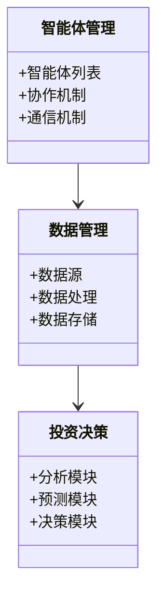
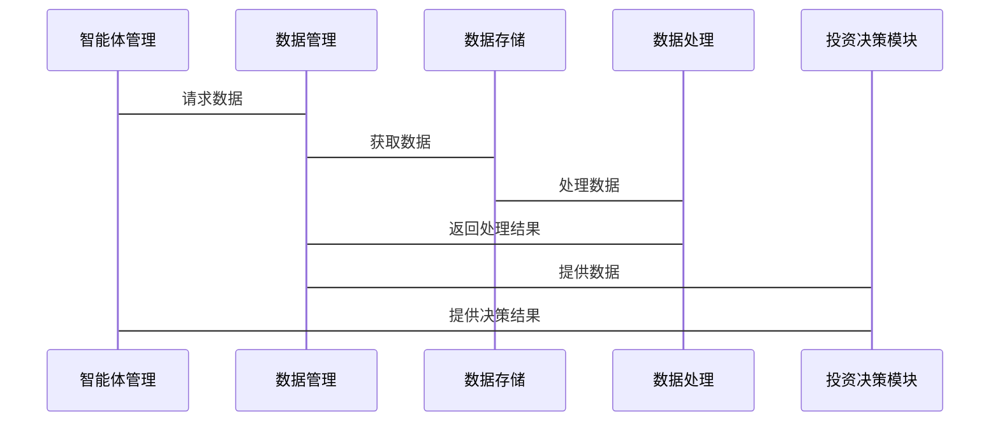

                 


# AI驱动的商业生态系统分析：价值投资中的多智能体应用

**关键词**：AI驱动，商业生态系统，多智能体，价值投资，协作机制，算法原理，系统架构

**摘要**：随着人工智能技术的快速发展，商业生态系统正在经历一场深刻的变革。AI驱动的多智能体系统在价值投资中的应用，不仅提高了投资决策的效率和准确性，还为商业生态系统的优化和创新提供了新的可能性。本文将从背景介绍、核心概念、算法原理、系统架构、项目实战等多个方面，详细探讨AI驱动的商业生态系统在价值投资中的多智能体应用，分析其工作原理和实际应用案例，为读者提供全面的了解和深入的见解。

---

## 第1章: AI驱动的商业生态系统概述

### 1.1 问题背景与问题描述

#### 1.1.1 商业生态系统的核心概念
商业生态系统是指由企业、供应商、客户、合作伙伴等多方利益相关者共同构成的复杂系统。传统的商业生态系统依赖于人类的决策和市场分析，但随着数据量的爆炸式增长和复杂性增加，传统的投资方法逐渐暴露出效率低下、决策不准确等问题。

#### 1.1.2 AI驱动的商业生态系统的定义
AI驱动的商业生态系统是指通过人工智能技术，利用多智能体系统来优化商业生态的运作，包括市场分析、投资决策、风险控制等环节。这种系统能够实时分析海量数据，提供精准的预测和决策支持，从而提升商业生态的效率和竞争力。

#### 1.1.3 多智能体在商业生态系统中的作用
多智能体系统能够在商业生态系统中扮演多种角色，例如市场分析智能体、投资决策智能体、风险评估智能体等。这些智能体通过协作和竞争，共同优化商业生态系统的整体表现。

### 1.2 问题解决与边界分析

#### 1.2.1 AI驱动的商业生态系统的核心问题
AI驱动的商业生态系统需要解决的核心问题包括数据处理的高效性、多智能体的协作性、投资决策的准确性等。通过引入AI技术，这些问题可以得到有效缓解。

#### 1.2.2 系统边界与外延
AI驱动的商业生态系统的边界主要在于其应用场景和数据来源。例如，在价值投资中，系统的边界可能包括市场数据、财务数据、新闻数据等。外延则包括对商业生态系统其他部分的优化和创新。

#### 1.2.3 核心要素与组成结构
AI驱动的商业生态系统的核心要素包括数据源、智能体、协作机制、决策系统等。这些要素共同构成了系统的整体结构，确保系统的高效运行和智能决策。

### 1.3 本章小结
本章从背景介绍和问题描述入手，分析了AI驱动的商业生态系统的核心概念和多智能体的作用。通过问题解决和边界分析，明确了系统的边界和组成结构，为后续章节的深入分析奠定了基础。

---

## 第2章: 多智能体系统的核心概念与联系

### 2.1 多智能体系统的原理

#### 2.1.1 多智能体系统的定义
多智能体系统是由多个智能体组成的分布式系统，这些智能体能够通过协作和竞争完成特定任务。在商业生态系统中，多智能体系统可以用于市场分析、投资决策等多个领域。

#### 2.1.2 多智能体系统的组成要素
多智能体系统的主要组成要素包括智能体、环境、通信机制、协作机制等。这些要素共同作用，确保系统的高效运行。

#### 2.1.3 多智能体系统的通信机制
多智能体系统中的通信机制是智能体之间协作的基础。通过通信机制，智能体可以共享信息、协调行动，从而实现共同目标。

### 2.2 商业生态系统中的多智能体关系

#### 2.2.1 实体关系分析
在商业生态系统中，多智能体之间的关系可以通过实体关系图（ER图）进行分析。例如，市场分析智能体与投资决策智能体之间的关系可以通过ER图展示。

#### 2.2.2 多智能体间的协作与竞争
多智能体系统中的协作与竞争是动态变化的。例如，多个智能体可能在市场分析中协作，但在投资决策中形成竞争关系。

#### 2.2.3 商业生态系统的动态性
商业生态系统的动态性要求多智能体系统具备高度的灵活性和适应性。通过动态调整智能体的行为和协作方式，系统可以更好地应对市场变化。

### 2.3 价值投资中的多智能体应用

#### 2.3.1 价值投资的基本原理
价值投资是一种以内在价值为基础的投资策略，强调通过分析公司的基本面来判断其投资价值。AI驱动的多智能体系统可以通过分析海量数据，帮助投资者更准确地评估公司的内在价值。

#### 2.3.2 多智能体在价值投资中的角色
在价值投资中，多智能体系统可以扮演多种角色，例如数据采集智能体、分析智能体、决策智能体等。这些智能体通过协作，为投资者提供全面的支持。

#### 2.3.3 多智能体与传统投资方法的对比
与传统投资方法相比，多智能体系统在数据处理能力、决策效率和准确性方面具有显著优势。例如，传统方法依赖人工分析，而多智能体系统可以实时处理海量数据，提供实时决策支持。

### 2.4 核心概念对比分析

#### 2.4.1 多智能体与单智能体的对比
多智能体系统与单智能体系统的主要区别在于协作性和适应性。多智能体系统能够通过协作实现更复杂的任务，而单智能体系统则依赖单一智能体的决策。

#### 2.4.2 商业生态系统与传统商业模式的对比
商业生态系统与传统商业模式的主要区别在于系统的复杂性和动态性。商业生态系统是一个复杂的网络，而传统商业模式则相对简单和静态。

#### 2.4.3 价值投资与AI驱动投资的对比
价值投资与AI驱动投资的主要区别在于数据处理能力和决策效率。价值投资依赖人工分析，而AI驱动投资则通过多智能体系统实现自动化和高效决策。

### 2.5 本章小结
本章从多智能体系统的原理出发，分析了商业生态系统中的多智能体关系，并重点探讨了价值投资中的多智能体应用。通过对比分析，明确了多智能体系统在商业生态系统中的独特优势。

---

## 第3章: 多智能体协作机制的算法原理

### 3.1 多智能体协作机制的数学模型

#### 3.1.1 协作机制的定义
多智能体协作机制是指智能体之间通过共享信息、协调行动来实现共同目标的过程。

#### 3.1.2 协作机制的数学表达
协作机制可以用数学模型进行描述。例如，可以通过博弈论模型来描述智能体之间的协作与竞争关系。

#### 3.1.3 协作机制的实现算法
协作机制的实现算法包括分布式算法、协商算法等。例如，分布式算法可以通过局部信息实现全局协作。

### 3.2 多智能体协作的博弈论模型

#### 3.2.1 博弈论的基本概念
博弈论是研究智能体之间策略选择的理论。在多智能体系统中，博弈论可以用来描述智能体之间的协作与竞争关系。

#### 3.2.2 博弈论在多智能体协作中的应用
博弈论在多智能体协作中的应用包括纳什均衡、囚徒困境等模型。这些模型可以帮助分析智能体之间的最优策略。

#### 3.2.3 博弈论模型的数学公式
博弈论模型可以用数学公式进行描述。例如，纳什均衡的定义如下：

$$ \text{纳什均衡：对于每个智能体i，其策略s_i是最佳反应，即对于所有其他智能体的策略s_{-i}，s_i \in \text{argmax}_s \text{ payoff}(s_i, s_{-i})} $$

### 3.3 多智能体协作的强化学习算法

#### 3.3.1 强化学习的基本原理
强化学习是一种通过智能体与环境的互动来学习策略的方法。智能体通过试错学习，逐步优化其行为策略。

#### 3.3.2 多智能体强化学习的挑战
多智能体强化学习的主要挑战包括策略协调、通信机制设计等。例如，智能体之间的通信可以通过共享信息或直接互动来实现。

#### 3.3.3 多智能体强化学习的实现
多智能体强化学习的实现可以通过分布式算法和通信机制来实现。例如，可以使用Q-learning算法来训练多个智能体的协作策略。

### 3.4 本章小结
本章从数学模型和算法原理出发，详细探讨了多智能体协作机制的实现方法。通过博弈论和强化学习的结合，为读者提供了多智能体协作机制的全面理解。

---

## 第4章: 商业生态系统中的多智能体协作架构

### 4.1 商业生态系统中的多智能体协作场景

#### 4.1.1 价值投资中的多智能体协作场景
在价值投资中，多智能体系统可以用于市场分析、财务数据处理、投资决策等多个环节。例如，数据采集智能体可以实时收集市场数据，分析智能体可以对数据进行处理和分析，决策智能体可以基于分析结果制定投资策略。

#### 4.1.2 商业生态系统的动态性与协作需求
商业生态系统的动态性要求多智能体系统具备高度的灵活性和适应性。通过动态调整智能体的行为和协作方式，系统可以更好地应对市场变化。

#### 4.1.3 多智能体协作的系统架构设计
多智能体协作的系统架构设计需要考虑系统的可扩展性、可维护性和可扩展性。例如，可以采用分层架构，将系统分为数据层、业务逻辑层和应用层。

### 4.2 系统功能设计

#### 4.2.1 领域模型类图
领域模型类图可以通过Mermaid图表示。例如：



#### 4.2.2 系统架构设计
系统架构设计可以通过Mermaid图表示。例如：


#### 4.2.3 系统接口设计
系统接口设计需要考虑智能体之间的通信和数据交互。例如，智能体之间可以通过API进行通信，数据可以通过数据库进行存储和管理。

#### 4.2.4 系统交互流程
系统交互流程可以通过Mermaid图表示。例如：



### 4.2 本章小结
本章从商业生态系统中的多智能体协作场景出发，设计了系统的功能和架构。通过领域模型类图和系统架构图，展示了系统的整体结构和交互流程，为读者提供了清晰的理解和指导。

---

## 第5章: 项目实战——价值投资中的多智能体应用

### 5.1 项目背景与目标

#### 5.1.1 项目背景
本项目旨在通过多智能体系统实现价值投资的自动化和高效决策。通过分析市场数据、评估公司基本面，系统可以为投资者提供精准的投资建议。

#### 5.1.2 项目目标
项目的具体目标包括：
- 实现多智能体系统的数据采集、分析和决策功能。
- 通过多智能体协作提高投资决策的准确性和效率。
- 为投资者提供实时的投资建议和风险评估。

### 5.2 项目环境与工具安装

#### 5.2.1 环境要求
项目需要以下环境和工具：
- Python编程语言
- 机器学习框架（如TensorFlow、PyTorch）
- 数据库（如MySQL、MongoDB）
- 云服务（如AWS、阿里云）

#### 5.2.2 工具安装
安装必要的工具和库，例如：
- 安装Python和pip
- 安装TensorFlow和Keras
- 安装数据库驱动和连接库

### 5.3 项目核心实现

#### 5.3.1 数据采集智能体
数据采集智能体负责从多个数据源获取市场数据，例如：

```python
class DataCollector:
    def __init__(self):
        self.datasources = ['market_data', 'news_data', 'financial_data']
    
    def collect_data(self):
        # 从多个数据源获取数据
        pass
```

#### 5.3.2 数据分析智能体
数据分析智能体负责对数据进行处理和分析，例如：

```python
class DataAnalyzer:
    def __init__(self):
        self.models = {'sentiment_analysis', 'time_series_analysis'}
    
    def analyze_data(self, data):
        # 使用模型对数据进行分析
        pass
```

#### 5.3.3 投资决策智能体
投资决策智能体负责基于分析结果制定投资策略，例如：

```python
class InvestmentDecisor:
    def __init__(self):
        self.strategies = ['long_term_investment', 'short_term_trading']
    
    def make_decision(self, analysis_results):
        # 基于分析结果制定投资策略
        pass
```

#### 5.3.4 系统集成与测试
通过系统集成测试，确保多智能体系统的各个部分能够协同工作。例如，测试数据采集智能体与数据分析智能体之间的通信，确保数据能够正确传递和处理。

### 5.4 项目应用案例分析

#### 5.4.1 案例背景
假设我们有一个价值投资项目，目标是通过多智能体系统分析股票市场的内在价值。

#### 5.4.2 数据采集与分析
数据采集智能体从多个数据源获取股票市场的数据，包括历史价格、财务数据、新闻数据等。数据分析智能体对这些数据进行处理和分析，生成投资建议。

#### 5.4.3 投资决策与执行
投资决策智能体基于分析结果制定投资策略，并将决策结果传递给投资执行模块。投资执行模块根据决策结果执行具体的交易操作。

#### 5.4.4 案例结果与分析
通过案例分析，我们可以看到多智能体系统在价值投资中的优势。例如，系统可以实时处理海量数据，提供精准的投资建议，从而提高投资效率和准确性。

### 5.5 项目小结
本章通过具体项目实战，展示了多智能体系统在价值投资中的实际应用。通过数据采集、分析和决策的流程，读者可以清晰地看到系统的整体架构和实现细节。

---

## 第6章: 总结与展望

### 6.1 本项目总结

#### 6.1.1 核心技术总结
本项目的核心技术包括多智能体协作机制、博弈论模型、强化学习算法等。这些技术为系统的高效运行和智能决策提供了理论基础。

#### 6.1.2 系统设计总结
系统的整体设计包括数据采集、分析、决策等多个模块。通过模块化设计，系统的可扩展性和可维护性得到了有效提升。

#### 6.1.3 项目成果总结
通过本项目的实施，我们成功实现了多智能体系统在价值投资中的应用，验证了系统的可行性和有效性。

### 6.2 未来研究与展望

#### 6.2.1 研究方向
未来的研究方向包括：
- 多智能体系统的优化与改进
- 强化学习算法的创新与应用
- 商业生态系统中的多智能体协作机制

#### 6.2.2 技术发展趋势
随着人工智能技术的不断发展，多智能体系统在商业生态系统中的应用将更加广泛和深入。例如，未来的系统将更加智能化和自动化，能够更好地适应市场变化和客户需求。

#### 6.2.3 应用前景展望
多智能体系统在价值投资中的应用前景广阔。通过不断优化系统架构和算法，未来的系统将能够更好地满足投资者的需求，提供更加精准和高效的投资服务。

### 6.3 本章小结
本章总结了本项目的核心技术和系统设计，并展望了未来的研究方向和技术发展趋势。通过本章的总结，读者可以对多智能体系统在商业生态系统中的应用有一个全面的了解。

---

## 作者：AI天才研究院/AI Genius Institute & 禅与计算机程序设计艺术 /Zen And The Art of Computer Programming

---

以上就是《AI驱动的商业生态系统分析：价值投资中的多智能体应用》的技术博客文章。文章从背景介绍、核心概念、算法原理、系统架构、项目实战等多个方面，详细探讨了AI驱动的商业生态系统在价值投资中的多智能体应用。通过理论与实践相结合，文章为读者提供了一个全面、深入的了解和指导。

