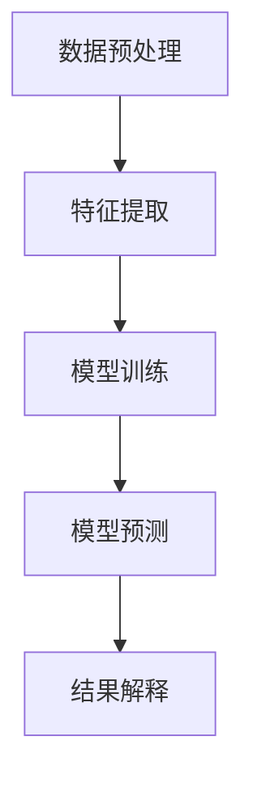
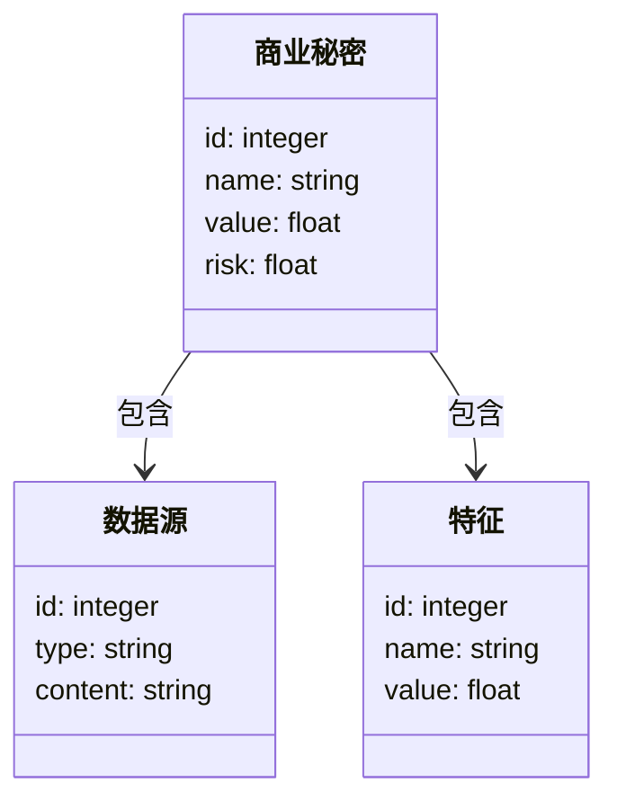
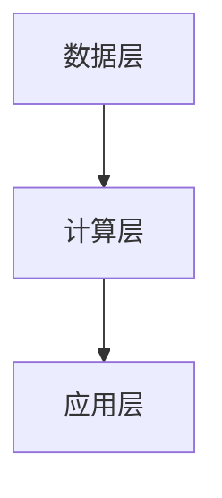
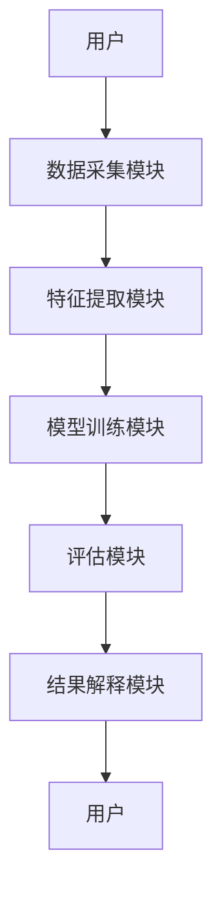

                 


# AI驱动的商业秘密价值评估：挖掘隐藏的公司资产

---

## 关键词：
商业秘密、AI驱动、价值评估、公司资产、数据分析、知识产权保护、技术实现

---

## 摘要：
随着企业竞争的加剧，商业秘密作为企业核心资产的重要性日益凸显。传统的商业秘密价值评估方法往往依赖人工经验，存在主观性强、效率低、覆盖面有限等问题。而人工智能技术的快速发展为企业提供了新的解决方案。通过AI驱动的商业秘密价值评估，企业能够更精准地识别和量化商业秘密的价值，从而优化资源配置、提升竞争力。本文将从商业秘密的基本概念、AI驱动评估的原理、算法实现、系统架构设计以及实际案例分析等方面展开讨论，全面揭示AI在商业秘密价值评估中的应用与潜力。

---

# 第一部分: 背景介绍与核心概念

## 第1章: 商业秘密与AI驱动评估的背景介绍

### 1.1 商业秘密的基本概念

#### 1.1.1 商业秘密的定义与特征

商业秘密是指企业在经营活动中所掌握的、具有商业价值的、未公开的、不为公众所知悉的信息。其主要特征包括：

1. **秘密性**：信息未被公开，且采取了合理的保密措施。
2. **价值性**：信息能够为企业带来经济利益。
3. **可保护性**：信息可以通过法律手段进行保护。

#### 1.1.2 商业秘密的法律保护框架

商业秘密的保护主要依赖相关法律法规。例如：

- **《反不正当竞争法》**：规定了商业秘密的保护范围和侵权行为的法律责任。
- **《民法典》**：提供了商业秘密的民事保护途径。
- **《刑法》**：对商业秘密的刑事保护进行了明确规定。

#### 1.1.3 商业秘密在企业中的价值体现

商业秘密是企业核心竞争力的重要组成部分，通常包括技术秘密、经营秘密、客户信息等。例如：

- **技术秘密**：如专利、配方、工艺流程。
- **经营秘密**：如商业模式、市场策略、供应链管理。
- **客户信息**：如客户名单、交易记录、合作意向。

### 1.2 AI技术在商业秘密评估中的作用

#### 1.2.1 AI技术的基本概念与特点

人工智能（AI）是模拟人类智能的计算机系统，具有以下特点：

1. **数据驱动**：AI依赖大量数据进行学习和推理。
2. **自动化**：能够自动处理数据并输出结果。
3. **可扩展性**：能够处理海量数据，适用于复杂场景。

#### 1.2.2 AI在商业秘密评估中的优势

AI技术在商业秘密价值评估中的优势主要体现在以下几个方面：

1. **高效性**：AI可以快速处理大量数据，提高评估效率。
2. **准确性**：通过机器学习模型，AI能够发现隐藏在数据中的规律，提高评估准确性。
3. **全面性**：AI能够从多个维度对商业秘密进行分析，确保评估结果的全面性。

#### 1.2.3 AI驱动评估的现状与发展趋势

当前，AI技术在商业秘密评估中的应用还处于起步阶段，但其潜力巨大。随着技术的不断进步，未来AI将更加智能化、个性化，能够为企业提供更加精准的商业秘密价值评估服务。

---

## 第2章: 商业秘密价值评估的核心概念

### 2.1 商业秘密价值评估的定义与目标

#### 2.1.1 价值评估的定义

商业秘密价值评估是指通过对商业秘密的属性、市场价值、法律保护等因素进行综合分析，量化其经济价值的过程。

#### 2.1.2 评估目标的确定

评估目标通常包括以下几个方面：

1. **量化价值**：确定商业秘密的经济价值。
2. **风险评估**：评估商业秘密被泄露的可能性及潜在损失。
3. **保护策略**：制定商业秘密的保护措施。

### 2.2 AI驱动评估的核心要素

#### 2.2.1 数据来源与特征

AI驱动的商业秘密价值评估需要依赖多源异构数据，包括：

1. **文本数据**：如技术文档、市场报告。
2. **结构化数据**：如财务数据、客户信息。
3. **非结构化数据**：如音频、视频。

#### 2.2.2 模型构建与优化

AI模型的构建需要考虑以下几个方面：

1. **特征选择**：选择与商业秘密价值相关的特征。
2. **模型训练**：使用机器学习算法对模型进行训练。
3. **模型优化**：通过调参和验证提升模型性能。

#### 2.2.3 评估结果的解释与应用

评估结果需要能够被企业理解和应用，通常包括：

1. **价值评分**：对商业秘密的价值进行量化评分。
2. **风险预警**：预测商业秘密被泄露的风险。
3. **保护建议**：基于评估结果提出保护策略。

### 2.3 商业秘密与AI驱动评估的关系

#### 2.3.1 商业秘密的属性与AI的结合

商业秘密的属性决定了AI驱动评估的方式。例如：

- **技术秘密**：需要通过NLP技术提取技术特征。
- **客户信息**：需要通过聚类算法分析客户行为。

#### 2.3.2 AI驱动评估的边界与外延

AI驱动评估的边界主要在于数据质量和模型的泛化能力。其外延则包括对商业秘密的全生命周期管理。

#### 2.3.3 核心概念的结构与组成

商业秘密价值评估的核心概念包括：

- 数据源：商业秘密相关的数据。
- 模型：AI算法。
- 输出：评估结果。

### 2.4 核心概念对比分析

#### 2.4.1 商业秘密与知识产权的对比

| 特性       | 商业秘密              | 知识产权          |
|------------|----------------------|------------------|
| 定义       | 未公开的商业信息      | 法律保护的智力成果|
| 保护方式   | 保密措施            | 法律授权          |
| 保护期限   | 无固定期限          | 有限期限          |

#### 2.4.2 AI驱动评估与传统评估方法的对比

| 特性       | 传统评估方法          | AI驱动评估       |
|------------|----------------------|------------------|
| 效率       | 低                   | 高               |
| 准确性     | 主观性强             | 客观性高          |
| 覆盖范围   | 有限                 | 全面             |

---

# 第三部分: AI驱动商业秘密价值评估的算法原理

## 第3章: AI驱动评估的算法原理

### 3.1 自然语言处理（NLP）在商业秘密识别中的应用

#### 3.1.1 NLP的基本原理

自然语言处理（NLP）是人工智能的核心技术之一，主要用于处理人类语言数据。其基本原理包括：

1. **文本预处理**：如分词、去停用词。
2. **特征提取**：如词袋模型、TF-IDF。
3. **模型训练**：如词嵌入、神经网络。

#### 3.1.2 商业秘密识别的NLP模型设计

商业秘密识别的NLP模型需要能够从文本中提取关键信息。例如：

- **技术文档分析**：提取技术关键词。
- **市场报告分析**：提取市场趋势。

### 3.2 机器学习模型在价值评估中的应用

#### 3.2.1 机器学习的基本原理

机器学习是一种人工智能技术，通过数据训练模型，使其能够对新数据进行预测或分类。其基本原理包括：

1. **特征提取**：选择输入特征。
2. **模型训练**：通过优化目标函数训练模型。
3. **预测与验证**：对新数据进行预测并验证结果。

#### 3.2.2 基于机器学习的商业秘密价值评估模型

商业秘密价值评估的机器学习模型通常包括以下几个步骤：

1. **数据收集**：收集商业秘密相关数据。
2. **特征工程**：提取特征。
3. **模型训练**：训练分类或回归模型。
4. **结果解释**：解释模型输出。

### 3.3 深度学习模型的优化与应用

#### 3.3.1 深度学习的基本原理

深度学习是一种机器学习技术，通过多层神经网络进行特征提取和学习。其基本原理包括：

1. **网络结构**：如卷积神经网络（CNN）、循环神经网络（RNN）。
2. **训练方法**：如反向传播、梯度下降。
3. **模型优化**：如Dropout、Batch Normalization。

#### 3.3.2 基于深度学习的商业秘密价值评估优化

深度学习在商业秘密价值评估中的优化主要体现在：

1. **特征提取**：深度学习能够自动提取复杂的特征。
2. **模型泛化能力**：深度学习模型具有较强的泛化能力。
3. **处理非结构化数据**：深度学习能够处理图像、音频等非结构化数据。

### 3.4 算法流程图

以下是商业秘密价值评估的算法流程图：



---

# 第四部分: 商业秘密价值评估的数学模型与公式

## 第4章: 数学模型与公式

### 4.1 商业秘密价值评估的数学模型

商业秘密价值评估的数学模型通常基于回归分析。其基本公式如下：

$$ V = \beta_0 + \beta_1 x_1 + \beta_2 x_2 + \ldots + \beta_n x_n $$

其中：
- \( V \) 表示商业秘密的价值。
- \( \beta_0, \beta_1, \beta_2, \ldots, \beta_n \) 表示模型参数。
- \( x_1, x_2, \ldots, x_n \) 表示影响价值的特征。

### 4.2 基于概率论的评估模型

#### 4.2.1 条件概率公式

条件概率公式在商业秘密价值评估中用于评估某个商业秘密被泄露的概率：

$$ P(A|B) = \frac{P(B|A)P(A)}{P(B)} $$

其中：
- \( P(A|B) \) 表示在事件B发生的情况下，事件A发生的概率。
- \( P(B|A) \) 表示在事件A发生的情况下，事件B发生的概率。
- \( P(A) \) 表示事件A发生的先验概率。
- \( P(B) \) 表示事件B发生的先验概率。

#### 4.2.2 贝叶斯定理在评估中的应用

贝叶斯定理可以用于商业秘密的价值评估，例如：

$$ P(V|D) = \frac{P(D|V)P(V)}{P(D)} $$

其中：
- \( P(V|D) \) 表示在数据D的情况下，商业秘密价值为V的概率。
- \( P(D|V) \) 表示在商业秘密价值为V的情况下，数据D出现的概率。
- \( P(V) \) 表示商业秘密价值为V的先验概率。
- \( P(D) \) 表示数据D出现的先验概率。

### 4.3 基于统计模型的评估方法

#### 4.3.1 线性回归模型

线性回归模型可以用于商业秘密价值的预测：

$$ y = \beta_0 + \beta_1 x_1 + \beta_2 x_2 + \ldots + \beta_n x_n $$

其中：
- \( y \) 表示商业秘密的价值。
- \( x_1, x_2, \ldots, x_n \) 表示影响价值的特征。
- \( \beta_0, \beta_1, \beta_2, \ldots, \beta_n \) 表示回归系数。

---

# 第五部分: 系统分析与架构设计

## 第5章: 系统分析与架构设计

### 5.1 问题场景介绍

商业秘密价值评估系统需要解决以下问题：

1. 如何高效地识别和提取商业秘密。
2. 如何准确地评估商业秘密的价值。
3. 如何保护评估过程中的数据安全。

### 5.2 项目介绍

本项目旨在开发一个基于AI的商业秘密价值评估系统，实现以下目标：

1. 自动识别商业秘密。
2. 精准评估商业秘密价值。
3. 提供数据安全保护。

### 5.3 系统功能设计

系统功能设计包括以下几个方面：

1. **数据采集模块**：负责采集商业秘密相关数据。
2. **特征提取模块**：负责从数据中提取特征。
3. **模型训练模块**：负责训练AI模型。
4. **评估模块**：负责对商业秘密进行价值评估。
5. **结果解释模块**：负责解释评估结果。

#### 5.3.1 领域模型

以下是领域模型的类图：



### 5.4 系统架构设计

系统架构设计包括以下几个部分：

1. **数据层**：存储商业秘密相关数据。
2. **计算层**：负责数据处理和模型训练。
3. **应用层**：提供用户界面和评估结果。

#### 5.4.1 系统架构图

以下是系统架构图：



### 5.5 系统接口设计

系统接口设计包括以下几个方面：

1. **数据接口**：提供数据采集和存储接口。
2. **模型接口**：提供模型训练和预测接口。
3. **用户接口**：提供用户查询和结果展示接口。

#### 5.5.1 系统交互流程图

以下是系统交互流程图：



---

# 第六部分: 项目实战

## 第6章: 项目实战

### 6.1 环境安装

项目实战需要以下环境：

1. **Python**：3.8以上版本。
2. **机器学习库**：如scikit-learn、TensorFlow。
3. **NLP库**：如spaCy、NLTK。

### 6.2 系统核心实现源代码

以下是系统核心实现的源代码：

```python
import numpy as np
from sklearn.feature_extraction.text import TfidfVectorizer
from sklearn.linear_model import LinearRegression

# 数据预处理
def preprocess(text):
    # 假设text是商业秘密相关的文本数据
    # 这里仅进行简单的文本处理
    return text.lower()

# 特征提取
def extract_features(texts):
    vectorizer = TfidfVectorizer(max_features=1000)
    features = vectorizer.fit_transform(texts)
    return features.toarray()

# 模型训练
def train_model(X, y):
    model = LinearRegression()
    model.fit(X, y)
    return model

# 评估与解释
def evaluate(model, X, y_true):
    y_pred = model.predict(X)
    print("预测值:", y_pred)
    print("真实值:", y_true)
    print("预测与真实值的差值:", y_pred - y_true)

# 示例数据
texts = ["This is a secret technology document.", "Customer data is confidential."]
y = [0.8, 0.6]

# 实现
processed_texts = [preprocess(text) for text in texts]
features = extract_features(processed_texts)
model = train_model(features, y)
evaluate(model, features, y)
```

### 6.3 代码应用解读与分析

以上代码实现了以下功能：

1. **数据预处理**：将文本数据转换为小写。
2. **特征提取**：使用TF-IDF算法提取特征。
3. **模型训练**：使用线性回归模型进行训练。
4. **评估与解释**：输出预测值和真实值的对比。

### 6.4 实际案例分析

假设我们有以下商业秘密数据：

| 商业秘密内容                          | 价值（V） |
|---------------------------------------|------------|
| 高端芯片制造技术                    | 0.9        |
| 客户名单                             | 0.7        |
| 独特商业模式                          | 0.8        |

通过上述代码，我们可以对这些商业秘密进行价值评估。

### 6.5 项目小结

通过项目实战，我们能够了解AI驱动的商业秘密价值评估的基本实现过程。需要注意的是，实际应用中需要考虑更多的因素，如数据安全、模型优化等。

---

# 第七部分: 最佳实践与小结

## 第7章: 最佳实践与小结

### 7.1 最佳实践

1. **数据安全**：在处理商业秘密数据时，必须采取严格的保密措施。
2. **模型优化**：根据实际需求不断优化模型。
3. **结果解释**：确保评估结果能够被业务部门理解和应用。

### 7.2 小结

本文详细探讨了AI驱动的商业秘密价值评估的核心概念、算法原理、系统架构设计以及实际应用。通过AI技术，企业能够更高效、更准确地评估商业秘密的价值，从而更好地保护和利用这一核心资产。

---

# 作者

作者：AI天才研究院/AI Genius Institute & 禅与计算机程序设计艺术/Zen And The Art of Computer Programming

---

**注**：以上内容为示例性内容，实际撰写时需要根据具体需求进行调整和补充。

