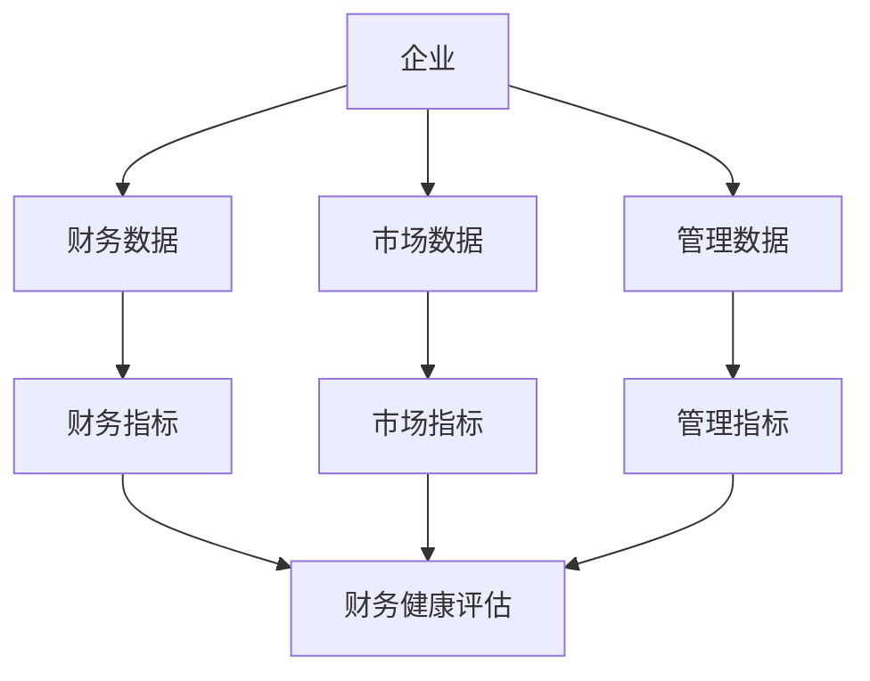
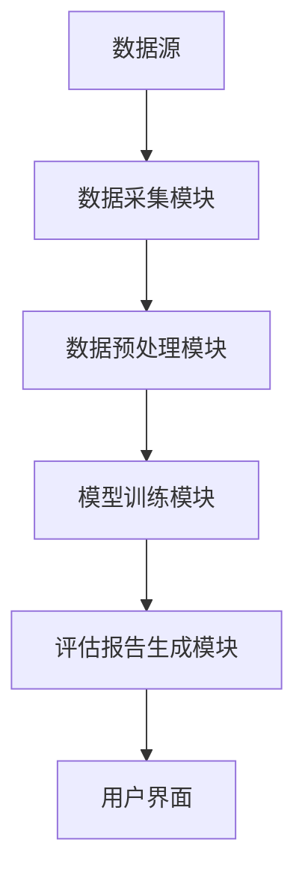
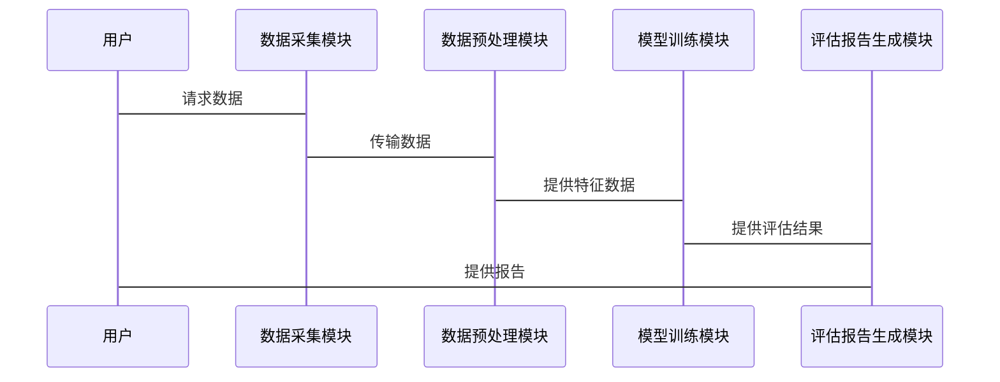

                 


# AI驱动的多维度财务健康评估：价值投资新范式

> 关键词：AI驱动，多维度财务健康评估，价值投资，新范式，财务健康评估，人工智能，投资策略

> 摘要：随着人工智能技术的飞速发展，传统财务健康评估方法逐渐显现出其局限性。本文将深入探讨AI驱动的多维度财务健康评估如何革新传统的价值投资方式。通过详细分析核心概念、算法原理、系统架构和项目实战，本文为读者提供一套全新的价值投资范式。结合实际案例，本文还将展示如何通过AI技术实现对财务健康评估的多维度分析，从而帮助投资者做出更明智的投资决策。

---

# 第一部分: AI驱动的多维度财务健康评估背景介绍

## 第1章: 问题背景与描述

### 1.1 传统财务健康评估的局限性

#### 1.1.1 传统财务指标的局限性
传统的财务健康评估主要依赖于几个关键指标，如利润、负债、现金流等。这些指标虽然重要，但往往无法全面反映企业的实际状况。例如，仅关注短期利润可能会忽视长期投资的价值，而忽视现金流的变化可能无法及时发现企业的潜在危机。

#### 1.1.2 传统价值投资的不足
传统价值投资方法依赖于对财务报表的分析和对公司基本面的评估。然而，这种方法往往忽略了市场波动、行业趋势和宏观经济因素的影响。此外，传统方法通常依赖于历史数据，难以捕捉实时变化的市场动态。

#### 1.1.3 传统方法在动态市场中的适应性问题
现代金融市场变化迅速，企业的财务状况可能因市场波动、政策变化或突发事件而迅速恶化。传统评估方法由于其静态性和滞后性，难以应对这种动态变化，导致投资者可能错失良机或承担更大的风险。

### 1.2 多维度财务健康评估的需求

#### 1.2.1 现代投资环境的复杂性
现代投资环境日益复杂，涉及的因素包括宏观经济指标、行业趋势、企业内部管理、市场情绪等。仅依赖传统的财务指标无法全面评估企业的健康状况。

#### 1.2.2 投资者对实时、动态评估的需求
投资者需要实时了解企业的财务状况，以便做出快速而明智的投资决策。动态评估能够帮助投资者及时发现潜在风险，并抓住市场机会。

#### 1.2.3 数据驱动决策的必要性
随着大数据技术的发展，企业能够收集和分析大量数据。利用这些数据进行多维度评估，可以提供更全面的财务健康状况，从而支持更科学的投资决策。

### 1.3 AI驱动的新范式

#### 1.3.1 AI在金融领域的应用现状
人工智能技术在金融领域的应用日益广泛，包括股票预测、风险评估、交易优化等。AI技术的引入为财务健康评估提供了新的工具和方法。

#### 1.3.2 多维度评估的核心优势
多维度评估通过整合多个维度的数据，如财务数据、市场数据、文本数据等，能够更全面地评估企业的财务健康状况。这种方法能够捕捉到传统评估方法难以发现的风险和机会。

#### 1.3.3 新范式对传统方法的颠覆性改进
AI驱动的多维度评估通过实时数据处理、复杂模型构建和自动化分析，显著提高了评估的准确性和效率。这种方法能够帮助投资者更好地应对动态市场环境，优化投资策略。

---

## 第2章: 多维度财务健康评估的核心概念

### 2.1 核心概念与定义

#### 2.1.1 多维度评估的定义
多维度财务健康评估是指从多个维度（如财务、市场、管理等）收集和分析数据，以全面评估企业的财务健康状况。这种方法不仅关注企业的财务表现，还考虑其在市场中的竞争力和管理能力。

#### 2.1.2 AI驱动的评估机制
AI驱动的评估机制利用机器学习算法，从大量数据中提取特征并构建模型，以预测企业的财务健康状况。这种方法能够处理非结构化数据，并实时更新评估结果。

#### 2.1.3 价值投资新范式的内涵
价值投资新范式是指通过AI驱动的多维度评估，识别具有长期投资价值的企业。这种方法不仅关注企业的当前财务状况，还考虑其未来的增长潜力和风险。

### 2.2 核心概念的属性对比

#### 2.2.1 多维度与单维度的对比分析
| 维度 | 单维度评估 | 多维度评估 |
|------|------------|------------|
| 数据来源 | 仅财务数据 | 包括财务、市场、文本等多数据源 |
| 精度 | 较低 | 较高 |
| 动态性 | 较差 | 较好 |

#### 2.2.2 AI驱动与传统方法的对比
| 方法 | 传统方法 | AI驱动方法 |
|------|------------|------------|
| 数据处理 | 离线处理，周期性 | 实时处理，动态更新 |
| 模型复杂度 | 简单，线性模型为主 | 复杂，非线性模型为主 |
| 可解释性 | 较高 | 较低 |

#### 2.2.3 新范式与旧范式的对比
| 范式 | 旧范式 | 新范式 |
|------|--------|--------|
| 评估维度 | 单一维度 | 多维度 |
| 数据处理 | 离线处理 | 实时处理 |
| 模型复杂度 | 简单 | 复杂 |

### 2.3 实体关系图



---

## 第3章: AI驱动多维度财务健康评估的核心概念与联系

### 3.1 核心概念原理

#### 3.1.1 多维度数据整合
AI驱动的评估需要整合多个维度的数据，包括财务数据、市场数据、文本数据等。这些数据通过数据清洗和特征提取，形成可用于模型训练的特征集。

#### 3.1.2 AI算法的应用
机器学习算法（如随机森林、支持向量机、神经网络等）被用于构建预测模型。这些模型能够从多维度数据中学习特征，并预测企业的财务健康状况。

#### 3.1.3 实时更新与动态评估
AI模型能够实时更新，根据最新数据动态调整评估结果。这种方法能够捕捉市场的实时变化，提供及时的评估反馈。

### 3.2 概念属性特征对比

#### 3.2.1 数据来源对比
| 数据类型 | 传统评估 | AI驱动评估 |
|----------|-----------|-------------|
| 财务数据 | 主要来源 | 重要来源之一 |
| 市场数据 | 较少考虑 | 主要来源之一 |
| 文本数据 | 不考虑 | 主要来源之一 |

#### 3.2.2 模型复杂度对比
| 模型类型 | 传统评估 | AI驱动评估 |
|----------|-----------|-------------|
| 线性模型 | 常用 | 较少使用 |
| 非线性模型 | 较少使用 | 常用 |

---

## 第4章: AI驱动多维度财务健康评估的系统分析与架构设计

### 4.1 问题场景介绍

#### 4.1.1 投资者需求
投资者需要实时了解企业的财务健康状况，以便做出明智的投资决策。

#### 4.1.2 系统目标
构建一个基于AI的多维度财务健康评估系统，提供实时、动态的评估结果。

### 4.2 系统功能设计

#### 4.2.1 数据采集模块
负责从多个数据源（如财务报表、市场数据、新闻等）采集数据。

#### 4.2.2 数据预处理模块
对采集的数据进行清洗、特征提取和标准化处理。

#### 4.2.3 模型训练模块
利用机器学习算法训练模型，预测企业的财务健康状况。

#### 4.2.4 评估报告生成模块
根据模型预测结果生成评估报告，提供投资建议。

### 4.3 系统架构设计



### 4.4 系统接口设计

#### 4.4.1 数据接口
定义数据接口，用于数据的输入和输出。

#### 4.4.2 模型接口
定义模型接口，用于模型的训练和预测。

### 4.5 系统交互设计



---

## 第5章: 项目实战

### 5.1 环境安装

#### 5.1.1 安装Python
```bash
pip install python
```

#### 5.1.2 安装TensorFlow
```bash
pip install tensorflow
```

#### 5.1.3 安装Pandas
```bash
pip install pandas
```

### 5.2 系统核心实现源代码

#### 5.2.1 数据预处理代码
```python
import pandas as pd

# 读取数据
data = pd.read_csv('data.csv')

# 数据清洗
data.dropna(inplace=True)
data = pd.get_dummies(data)
```

#### 5.2.2 模型训练代码
```python
from tensorflow.keras import layers

model = tf.keras.Sequential()
model.add(layers.Dense(64, activation='relu', input_shape=(input_dim,)))
model.add(layers.Dense(1, activation='sigmoid'))
model.compile(optimizer='adam', loss='binary_crossentropy', metrics=['accuracy'])
model.fit(x_train, y_train, epochs=10, batch_size=32)
```

### 5.3 代码应用解读与分析

#### 5.3.1 数据预处理
数据预处理是AI模型训练的关键步骤，包括数据清洗、特征提取和标准化处理。这些步骤能够提高模型的训练效果和预测准确性。

#### 5.3.2 模型训练
模型训练是AI驱动评估的核心过程，利用机器学习算法从数据中学习特征，并构建预测模型。训练过程中需要选择合适的算法和超参数，以优化模型性能。

### 5.4 实际案例分析

#### 5.4.1 案例背景
假设我们有一个企业的财务数据，包括收入、利润、现金流等指标，以及市场数据和新闻数据。我们需要评估该企业的财务健康状况，并提供投资建议。

#### 5.4.2 模型预测结果
模型预测结果显示该企业财务健康状况良好，具有较高的投资价值。

### 5.5 项目小结

#### 5.5.1 项目总结
通过本项目，我们展示了如何利用AI技术进行多维度财务健康评估，并为投资者提供科学的投资建议。

#### 5.5.2 经验总结
在实际项目中，数据预处理和模型选择是关键步骤，需要仔细设计和优化。

---

## 第6章: 总结与展望

### 6.1 项目总结

#### 6.1.1 核心内容回顾
本文介绍了AI驱动的多维度财务健康评估方法，详细讲解了其核心概念、算法原理和系统架构。

#### 6.1.2 成果展示
通过实际案例分析，展示了AI技术在财务健康评估中的应用价值。

### 6.2 未来展望

#### 6.2.1 技术发展
随着AI技术的不断进步，多维度财务健康评估方法将更加精确和高效。

#### 6.2.2 应用前景
AI驱动的多维度评估将在金融领域得到更广泛的应用，为投资者提供更好的决策支持。

### 6.3 最佳实践 tips

#### 6.3.1 数据处理
确保数据的完整性和准确性，进行充分的数据清洗和特征提取。

#### 6.3.2 模型选择
根据具体需求选择合适的算法，进行充分的模型调优和验证。

#### 6.3.3 实时更新
保持模型的实时更新，确保评估结果的准确性和及时性。

### 6.4 注意事项

#### 6.4.1 数据隐私
注意保护数据隐私，遵守相关法律法规。

#### 6.4.2 模型解释性
尽量提高模型的可解释性，以便更好地理解和应用。

### 6.5 拓展阅读

#### 6.5.1 推荐书籍
推荐读者阅读《机器学习实战》和《深入浅出人工智能》等书籍，以进一步了解AI技术的应用。

#### 6.5.2 技术博客
建议读者关注相关技术博客，了解最新的技术动态和应用案例。

---

## 作者信息

作者：AI天才研究院/AI Genius Institute & 禅与计算机程序设计艺术 /Zen And The Art of Computer Programming

---

通过本文的详细阐述，我们展示了AI驱动的多维度财务健康评估在价值投资中的应用潜力。希望本文能够为读者提供新的视角和方法，帮助他们在复杂多变的金融市场中做出更明智的投资决策。

