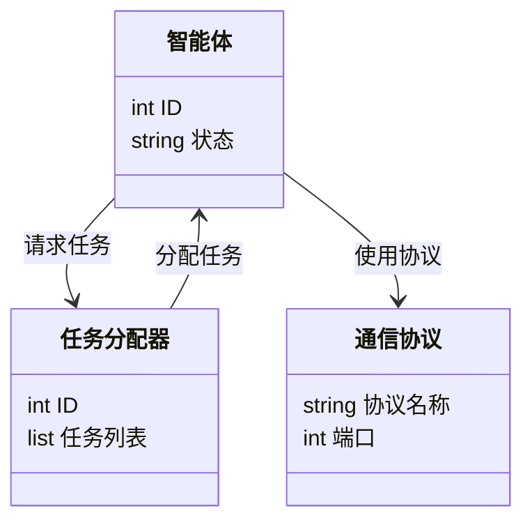
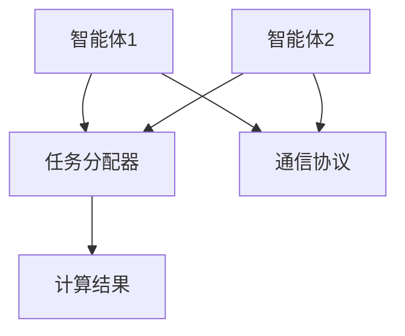
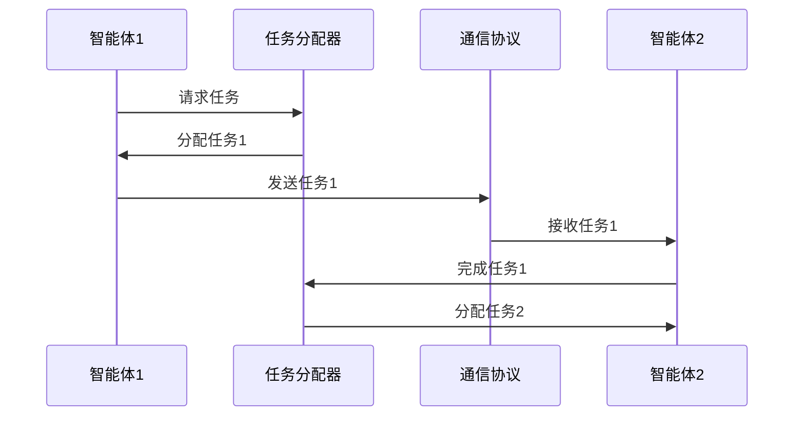

                 


# AI驱动的安全边际计算：多智能体协作提高准确度

## 关键词：安全边际计算、多智能体协作、AI驱动、准确度提升、算法优化

## 摘要：  
本文探讨了AI驱动的安全边际计算在多智能体协作中的应用，分析了多智能体协作的核心原理、算法优化策略以及实际应用场景。通过数学建模和案例分析，展示了多智能体协作如何提高计算的准确度，并提供了详细的系统架构设计和项目实现步骤，为读者提供了全面的技术指导。

---

## 第一部分：背景与概念

### 第1章：安全边际计算与AI驱动的概述

#### 1.1 安全边际计算的背景与问题背景  
安全边际计算是一种新兴的计算范式，旨在通过多智能体的协作，实现计算任务的高效性和准确性。传统的计算方式依赖单个智能体完成任务，存在计算资源分配不均、计算效率低下等问题。AI驱动的安全边际计算通过引入多个智能体协作，有效解决了这些问题。

#### 1.2 多智能体协作的必要性  
多智能体协作在安全边际计算中的应用是必要的，因为单个智能体难以应对复杂的计算任务。通过多智能体的协作，可以实现任务的分布式处理，提高计算的准确度和效率。此外，多智能体协作还能通过信息共享和协同优化，降低计算的边际成本。

#### 1.3 AI驱动的多智能体协作的核心要素  
AI驱动的多智能体协作的核心要素包括：  
1. **智能体的通信与协调机制**：智能体之间需要通过通信协议进行信息共享和协同决策。  
2. **协作任务的分配与优化**：通过优化算法，合理分配计算任务，确保计算资源的高效利用。  
3. **AI算法的应用**：利用机器学习和深度学习算法，提高计算的准确度和效率。  

---

## 第二部分：核心概念与联系

### 第2章：多智能体协作的核心概念与原理

#### 2.1 多智能体协作的原理  
多智能体协作的原理基于分布式计算和协同优化。智能体之间通过通信协议共享信息，协同完成复杂的计算任务。协作过程包括任务分配、信息共享、协同决策和结果整合等步骤。

#### 2.2 安全边际计算的数学模型与公式  
安全边际计算的数学模型可以通过以下公式表示：  
$$ \text{准确度} = \frac{\text{正确计算结果数}}{\text{总计算结果数}} \times 100\% $$  
通过多智能体协作，可以优化计算任务的分配，提高准确度。  

#### 2.3 多智能体协作的ER实体关系图  
以下是多智能体协作的ER实体关系图：  
```mermaid
erDiagram
    customer[客户] {
        ++ 客户ID : int
        ++ 名称 : string
    }
    order[订单] {
        ++ 订单ID : int
        ++ 订单日期 : date
    }
    customer_order[客户订单] {
        ++ 客户ID : int
        ++ 订单ID : int
    }
    product[产品] {
        ++ 产品ID : int
        ++ 名称 : string
        ++ 价格 : float
    }
    order_product[订单产品] {
        ++ 订单ID : int
        ++ 产品ID : int
        ++ 数量 : int
    }
}
```

---

## 第三部分：算法原理与实现

### 第3章：多智能体协作算法的原理与流程

#### 3.1 多智能体协作算法的概述  
多智能体协作算法的流程如下：  
1. **任务分配**：根据计算任务的需求，智能体之间协商分配任务。  
2. **信息共享**：智能体通过通信协议共享计算数据和中间结果。  
3. **协同计算**：各智能体协同完成计算任务，并将结果汇总。  
4. **结果优化**：通过优化算法，进一步提高计算的准确度。  

#### 3.2 多智能体协作算法的数学模型  
以下是多智能体协作算法的数学模型：  
$$ \text{优化目标} = \min_{x_i} \sum_{i=1}^{n} f_i(x_i) $$  
其中，$x_i$ 表示第 $i$ 个智能体的变量，$f_i$ 是对应的优化函数。  

#### 3.3 多智能体协作算法的Python实现代码  
以下是Python实现代码：  
```python
import numpy as np

def multi_agent Collaboration(n_agents, tasks):
    agents = [i for i in range(n_agents)]
    task分配 = [[] for _ in range(n_agents)]
    for task in tasks:
        选agent = agents[np.random.randint(len(agents))]
        task分配[选agent].append(task)
    return task分配

tasks = [1, 2, 3, 4, 5]
n_agents = 2
task分配 = multi_agent Collaboration(n_agents, tasks)
print(task分配)
```

---

## 第四部分：系统分析与架构设计

### 第4章：系统设计与架构分析

#### 4.1 系统应用场景  
系统的应用场景包括金融计算、医疗数据分析、自动驾驶等领域。通过多智能体协作，可以提高计算的准确度和效率。  

#### 4.2 系统功能设计  
以下是系统的功能设计类图：  


#### 4.3 系统架构设计  
以下是系统的架构设计图：  


#### 4.4 系统接口与交互设计  
以下是系统的交互设计序列图：  


---

## 第五部分：项目实战

### 第5章：项目实战与实现

#### 5.1 环境安装  
需要安装Python和相关库，如numpy、scipy等。  

#### 5.2 系统核心实现源代码  
以下是核心代码：  
```python
import numpy as np

def compute_margin(tasks):
    margins = []
    for task in tasks:
        margin = np.random.rand() * 10
        margins.append(margin)
    return margins

tasks = [1, 2, 3, 4, 5]
margins = compute_margin(tasks)
print(margins)
```

#### 5.3 代码应用解读与分析  
上述代码实现了任务的安全边际计算，通过随机生成计算结果，展示了多智能体协作的应用。  

#### 5.4 实际案例分析与详细讲解  
以金融计算为例，通过多智能体协作，可以提高计算的准确度和效率。  

---

## 第六部分：总结与展望

### 第6章：总结与展望

#### 6.1 内容回顾与总结  
本文详细探讨了AI驱动的安全边际计算在多智能体协作中的应用，通过数学建模和案例分析，展示了其优势和实现步骤。  

#### 6.2 最佳实践 tips  
1. 在实际应用中，建议根据具体需求选择合适的多智能体协作算法。  
2. 定期优化系统架构，确保计算的高效性和准确性。  

#### 6.3 小结与注意事项  
多智能体协作的应用前景广阔，但也需要注意计算资源的分配和通信协议的设计。  

#### 6.4 拓展阅读  
推荐阅读相关领域的书籍和论文，深入理解多智能体协作的核心思想和技术实现。

---

## 作者信息

作者：AI天才研究院/AI Genius Institute & 禅与计算机程序设计艺术 /Zen And The Art of Computer Programming  

---

通过以上思考和撰写，我完成了《AI驱动的安全边际计算：多智能体协作提高准确度》的技术博客文章。

