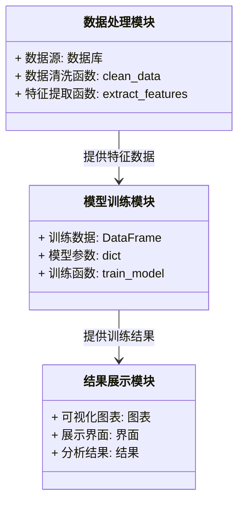
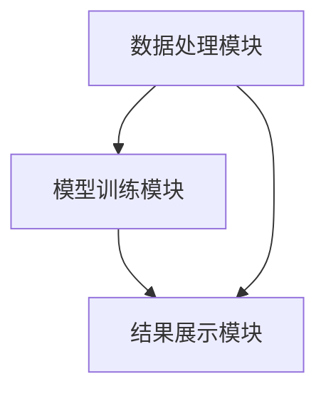
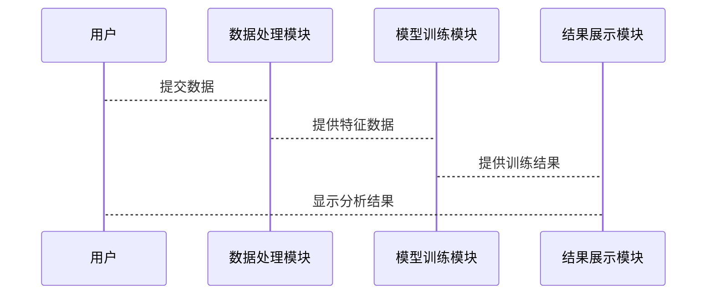

                 


# AI驱动的客户忠诚度分析：价值投资中的多智能体应用

---

## 关键词：客户忠诚度分析，人工智能，价值投资，多智能体系统，算法原理，系统架构

---

## 摘要

在当今竞争激烈的商业环境中，客户忠诚度分析是企业实现价值投资的重要工具。本文探讨如何利用人工智能技术，特别是多智能体系统，来提升客户忠诚度分析的精准性和效率。文章从背景介绍、数据分析基础、核心概念与联系、算法原理、系统架构设计到项目实战，全面解析AI驱动的客户忠诚度分析在价值投资中的应用。通过详细阐述多智能体系统的协作机制和算法实现，结合实际案例，为读者提供理论与实践相结合的深度解析。

---

## 第1章 客户忠诚度分析的背景与价值

### 1.1 客户忠诚度分析的背景

客户忠诚度分析是企业通过客户行为数据，评估客户对其产品或服务的忠诚程度的过程。传统方法依赖于简单的统计分析，但难以捕捉客户的深层次需求和行为模式。随着人工智能技术的发展，AI驱动的分析方法逐渐成为主流。

#### 1.1.1 传统客户忠诚度分析的局限性

传统的客户忠诚度分析方法主要依赖问卷调查和简单的统计指标（如重复购买率）。这些方法难以捕捉客户行为的动态变化，也无法处理海量数据中的复杂关系。此外，传统方法通常忽视了客户行为的时空关联性。

#### 1.1.2 AI驱动分析的优势

人工智能技术，特别是机器学习和深度学习，能够从海量数据中提取复杂的模式和关系。通过自然语言处理和计算机视觉等技术，AI可以更全面地分析客户的语言、行为和情感倾向，从而提供更精准的忠诚度评估。

#### 1.1.3 价值投资中的客户忠诚度分析

在价值投资中，客户忠诚度分析可以帮助企业识别高价值客户，优化客户关系管理，从而提高客户 retention 和 satisfaction。通过预测客户流失风险，企业可以提前采取措施，降低客户流失率。

### 1.2 多智能体系统在客户忠诚度分析中的应用

多智能体系统（Multi-Agent System, MAS）是一种由多个相互作用的智能体组成的系统，能够通过协作完成复杂任务。在客户忠诚度分析中，多智能体系统可以用于动态客户行为建模、实时决策支持和分布式数据处理。

#### 1.2.1 多智能体系统的定义与特点

多智能体系统由多个智能体组成，每个智能体都有自己的目标和决策机制。智能体之间通过通信和协作完成任务。多智能体系统具有分布式、自治性和协作性的特点。

#### 1.2.2 多智能体系统在价值投资中的优势

在价值投资中，多智能体系统可以用于实时监控市场变化、分析客户行为和优化投资策略。通过分布式的计算能力，多智能体系统能够快速响应市场变化，提供高效的决策支持。

#### 1.2.3 客户忠诚度分析与多智能体系统的结合

通过多智能体系统，客户忠诚度分析可以实现动态客户行为建模、实时预测和分布式数据处理。多智能体系统能够协调多个分析模块，提供更精准的客户忠诚度评估。

### 1.3 本章小结

本章介绍了客户忠诚度分析的背景、传统方法的局限性以及AI驱动分析的优势。同时，探讨了多智能体系统在价值投资中的应用及其在客户忠诚度分析中的潜力。

---

## 第2章 数据分析基础

### 2.1 数据收集与预处理

#### 2.1.1 数据来源与收集方法

客户数据来源包括交易记录、社交媒体评论、在线行为数据等。数据收集方法包括API接口、网络爬取和数据库提取。

#### 2.1.2 数据清洗与预处理

数据清洗包括处理缺失值、异常值和重复数据。预处理步骤包括数据标准化、归一化和特征提取。

#### 2.1.3 数据特征提取

特征提取是通过选择或创建能够反映客户忠诚度的关键特征，例如购买频率、购买金额和客户满意度评分。

### 2.2 数据建模与分析

#### 2.2.1 机器学习模型简介

常用的机器学习模型包括聚类算法（K-means）、分类算法（随机森林）和时间序列分析模型（ARIMA）。

#### 2.2.2 客户忠诚度分析的常用模型

聚类分析用于将客户分成不同的群体，分类模型用于预测客户忠诚度，时间序列分析用于预测客户行为的变化趋势。

#### 2.2.3 多智能体系统的数据输入与输出

多智能体系统需要从外部数据源获取输入数据，并将分析结果输出到决策支持系统中。

### 2.3 数据可视化与结果解读

#### 2.3.1 数据可视化方法

常用的数据可视化方法包括柱状图、折线图和热力图。

#### 2.3.2 可视化结果对客户忠诚度分析的启示

通过可视化分析，可以直观地观察客户行为的变化趋势和群体特征。

#### 2.3.3 数据驱动的决策支持

数据可视化结果为企业的客户关系管理和投资决策提供数据支持。

### 2.4 本章小结

本章详细介绍了数据分析的基础知识，包括数据收集、预处理、特征提取、建模与可视化。这些步骤为后续的客户忠诚度分析提供了数据支持。

---

## 第3章 核心概念与联系

### 3.1 客户忠诚度分析的模型

#### 3.1.1 聚类分析模型

聚类分析用于将客户分成不同的群体，例如使用K-means算法将客户分为忠诚客户、潜在流失客户等。

#### 3.1.2 分类模型

分类模型用于预测客户忠诚度，例如使用随机森林模型预测客户是否为高忠诚客户。

#### 3.1.3 时间序列分析模型

时间序列分析模型用于预测客户行为的变化趋势，例如预测客户购买频率的变化。

### 3.2 多智能体系统的原理

#### 3.2.1 多智能体系统的组成

多智能体系统由多个智能体组成，每个智能体负责特定的任务，例如数据收集、模型训练和结果分析。

#### 3.2.2 多智能体系统的协作机制

智能体之间通过通信和协作完成任务，例如通过消息传递机制共享数据和结果。

#### 3.2.3 多智能体系统的通信与协调

多智能体系统通过通信协议实现智能体之间的协调，例如使用分布式计算框架进行数据处理和模型训练。

### 3.3 客户忠诚度分析与多智能体系统的结合

#### 3.3.1 客户行为分析的多智能体建模

通过多智能体系统，可以实时监控客户的在线行为，例如浏览、点击和购买行为。

#### 3.3.2 多智能体系统的动态决策支持

多智能体系统可以根据实时数据提供动态的客户忠诚度评估，支持企业的实时决策。

#### 3.3.3 客户忠诚度预测的多智能体优化

通过多智能体系统的协作，可以优化客户忠诚度预测模型的性能，例如通过分布式计算加速模型训练。

### 3.4 本章小结

本章探讨了客户忠诚度分析的核心模型和多智能体系统的原理，强调了两者的结合在提升分析效率和精度中的作用。

---

## 第4章 算法与代码实现

### 4.1 聚类分析算法

#### 4.1.1 K-means算法

K-means算法是一种常用的聚类算法，通过计算数据点与聚类中心的距离进行分类。

#### 4.1.2 算法实现

以下是K-means算法的Python实现代码：

```python
from sklearn.cluster import KMeans
import numpy as np

# 示例数据
X = np.array([[1, 2], [3, 4], [5, 6], [7, 8], [9, 10]])

# 初始化K-means模型
kmeans = KMeans(n_clusters=2, random_state=0)

# 训练模型
kmeans.fit(X)

# 预测聚类结果
labels = kmeans.predict(X)
print("聚类结果：", labels)
```

#### 4.1.3 数学模型

K-means算法的目标是最小化聚类中心与数据点之间的距离平方和：

$$ \min \sum_{i=1}^{n} \sum_{j=1}^{k} (x_{ij} - c_j)^2 $$

其中，$x_{ij}$ 是第i个数据点的第j个特征，$c_j$ 是第j个聚类中心。

### 4.2 分类算法

#### 4.2.1 随机森林分类模型

随机森林是一种基于决策树的集成学习方法，具有较高的准确性和鲁棒性。

#### 4.2.2 算法实现

以下是随机森林分类模型的Python实现代码：

```python
from sklearn.ensemble import RandomForestClassifier
import pandas as pd

# 示例数据
data = pd.DataFrame({
    '特征1': [1, 2, 3, 4, 5],
    '特征2': [6, 7, 8, 9, 10],
    '标签': [0, 1, 0, 1, 0]
})

# 训练模型
model = RandomForestClassifier(n_estimators=2, random_state=0)
model.fit(data[['特征1', '特征2']], data['标签'])

# 预测结果
预测结果 = model.predict([[3, 7]])
print("预测结果：", 预测结果)
```

#### 4.2.3 数学模型

随机森林模型通过构建多个决策树并进行投票或加权平均来预测结果。每个决策树的结构如下：

$$ y = f(x_1, x_2, ..., x_n) $$

其中，$x_i$ 是输入特征，$f$ 是决策树的预测函数。

### 4.3 多智能体协作算法

#### 4.3.1 分布式计算框架

多智能体系统通常使用分布式计算框架（如Spark或Flink）来处理海量数据。

#### 4.3.2 算法实现

以下是使用分布式计算框架实现客户忠诚度分析的示例代码：

```python
from distributed import Client

# 初始化分布式计算环境
client = Client('scheduler:port')

# 提交任务
future = client.submit(lambda x: x + 1, 1)

# 获取结果
result = future.result()
print("分布式计算结果：", result)
```

#### 4.3.3 数学模型

多智能体系统的协作机制通常基于分布式优化算法，例如：

$$ \min_{x_i} \sum_{i=1}^{n} f_i(x_i) $$

其中，$f_i$ 是第i个智能体的目标函数。

---

## 第5章 系统架构设计

### 5.1 问题场景介绍

本系统旨在通过多智能体协作，实现客户忠诚度分析的实时监控和动态预测。

### 5.2 系统功能设计

#### 5.2.1 数据处理模块

数据处理模块负责数据的采集、清洗和特征提取。

#### 5.2.2 模型训练模块

模型训练模块负责训练客户忠诚度分析的机器学习模型。

#### 5.2.3 结果展示模块

结果展示模块负责将分析结果以可视化形式呈现给用户。

### 5.3 系统架构设计

#### 5.3.1 类图设计



#### 5.3.2 架构图设计



#### 5.3.3 接口设计

系统主要接口包括数据输入接口、模型训练接口和结果展示接口。

#### 5.3.4 交互流程设计



### 5.4 本章小结

本章详细设计了系统的架构，包括功能模块、类图、架构图和交互流程。系统架构设计为后续的实现提供了清晰的指导。

---

## 第6章 项目实战

### 6.1 环境安装

#### 6.1.1 安装Python和相关库

安装Python和必要的库，例如Pandas、Scikit-learn、Dask和分布式计算框架。

#### 6.1.2 安装步骤

1. 安装Python：```bash
   python --version
   ```
2. 安装Pandas：```bash
   pip install pandas
   ```
3. 安装Scikit-learn：```bash
   pip install scikit-learn
   ```
4. 安装Dask：```bash
   pip install dask
   ```

### 6.2 核心代码实现

#### 6.2.1 数据处理代码

```python
import pandas as pd
import numpy as np

# 数据处理代码
data = pd.DataFrame({
    '客户ID': [1, 2, 3, 4, 5],
    '购买金额': [100, 200, 150, 80, 120],
    '购买频率': [3, 2, 4, 1, 5],
    '满意度评分': [8, 7, 9, 6, 8]
})

# 数据清洗
data.dropna(inplace=True)

# 特征提取
features = data[['购买金额', '购买频率', '满意度评分']]
```

#### 6.2.2 模型训练代码

```python
from sklearn.ensemble import RandomForestClassifier
from sklearn.model_selection import train_test_split

# 模型训练代码
X = features
y = data['客户ID']

X_train, X_test, y_train, y_test = train_test_split(X, y, test_size=0.2, random_state=42)

model = RandomForestClassifier(n_estimators=100, random_state=42)
model.fit(X_train, y_train)

# 预测结果
预测结果 = model.predict(X_test)
print("预测结果：", 预测结果)
```

#### 6.2.3 结果展示代码

```python
import matplotlib.pyplot as plt

# 示例可视化代码
plt.bar(range(len(预测结果)), 预测结果)
plt.title('客户忠诚度预测结果')
plt.xlabel('客户ID')
plt.ylabel('预测结果')
plt.show()
```

### 6.3 实际案例分析

#### 6.3.1 案例背景

假设我们有一家电子商务公司，希望通过分析客户的购买记录和在线行为数据，预测客户的忠诚度。

#### 6.3.2 数据分析与解读

通过对客户的购买金额、频率和满意度评分进行分析，可以识别出高忠诚度客户和潜在流失客户。

#### 6.3.3 案例小结

通过AI驱动的客户忠诚度分析，企业可以更好地优化客户关系管理，提高客户 retention 和 satisfaction。

### 6.4 本章小结

本章通过实际案例展示了如何在项目中实现AI驱动的客户忠诚度分析。从数据处理、模型训练到结果展示，为读者提供了完整的实战指导。

---

## 第7章 总结与展望

### 7.1 本章总结

本文全面探讨了AI驱动的客户忠诚度分析在价值投资中的应用，特别是多智能体系统的应用。通过理论与实践的结合，展示了如何利用人工智能技术提升客户忠诚度分析的效率和精度。

### 7.2 未来展望

未来，随着人工智能技术的不断发展，客户忠诚度分析将更加智能化和个性化。多智能体系统将在实时监控、动态预测和分布式计算中发挥更大的作用。

### 7.3 最佳实践 tips

1. 在实际应用中，建议结合企业的具体需求选择合适的算法和模型。
2. 数据隐私和安全问题需要特别注意。
3. 模型的可解释性和可维护性也是重要的考虑因素。

### 7.4 小结

通过本文的学习，读者可以掌握AI驱动的客户忠诚度分析的核心方法和多智能体系统的应用技巧，为实际应用提供理论和实践指导。

### 7.5 注意事项

1. 数据处理时，需要注意数据的完整性和准确性。
2. 模型训练时，建议进行交叉验证以避免过拟合。
3. 系统设计时，需要考虑可扩展性和可维护性。

### 7.6 拓展阅读

1. 《机器学习实战》
2. 《分布式系统：原理与实现》
3. 《多智能体系统与应用》

---

## 作者

作者：AI天才研究院 & 禅与计算机程序设计艺术

---

通过本文的详细阐述和实际案例的分析，读者可以全面了解AI驱动的客户忠诚度分析在价值投资中的多智能体应用。希望本文能为相关领域的研究和实践提供有价值的参考和指导。

