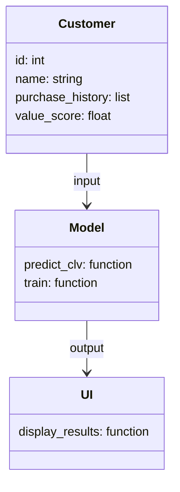
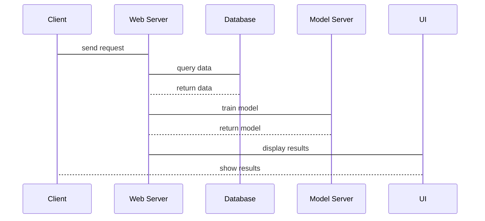

                 


# AI驱动的客户终身价值分析：深入理解公司的收入质量

## 关键词：AI, 客户终身价值, 收入质量, 数据驱动, 机器学习, 深度学习, 客户分析

## 摘要：本文将深入探讨如何利用人工智能技术分析客户的终身价值，从而帮助公司优化收入质量。通过介绍客户终身价值的基本概念、AI在客户分析中的应用、相关算法原理、系统架构设计以及实际案例分析，本文旨在帮助读者全面理解如何通过数据驱动的方式提升公司的收入质量。

---

## 第一部分: AI驱动的客户终身价值分析基础

## 第1章: 客户终身价值与收入质量概述

### 1.1 客户终身价值的基本概念

#### 1.1.1 什么是客户终身价值（Customer Lifetime Value, CLV）
客户终身价值（CLV）是指一个客户在与公司建立关系的整个生命周期中，对公司带来的总收入减去获取和维护该客户所花费的成本。CLV是衡量客户价值的重要指标，也是公司制定客户管理策略的重要依据。

#### 1.1.2 CLV与公司收入质量的关系
CLV直接反映了客户的购买行为和对公司贡献的价值。通过分析CLV，公司可以识别高价值客户，优化资源分配，提升整体收入质量。CLV的计算结果可以帮助公司制定更精准的市场策略，提高客户满意度和忠诚度。

#### 1.1.3 AI在CLV分析中的作用
AI技术，特别是机器学习和深度学习，能够从海量数据中提取有价值的信息，帮助公司更准确地预测客户行为，优化CLV的计算方法。通过AI驱动的CLV分析，公司可以实时监控客户价值变化，及时调整市场策略。

### 1.2 客户价值分析的重要性

#### 1.2.1 客户价值分析的定义与目标
客户价值分析是通过对客户行为、偏好和购买记录的分析，识别高价值客户并制定针对性的市场策略。其目标是提高客户满意度、忠诚度，从而提升公司的收入质量。

#### 1.2.2 CLV在企业经营中的战略意义
CLV是企业制定客户管理策略的重要依据。通过分析CLV，企业可以识别高价值客户，优化资源分配，降低客户流失率，提升整体收入质量。

#### 1.2.3 数据驱动的客户价值管理
数据驱动的客户价值管理通过收集和分析客户数据，帮助企业更准确地预测客户行为，优化市场策略。AI技术的应用使得数据驱动的客户价值管理更加高效和精准。

### 1.3 AI驱动的客户价值分析的优势

#### 1.3.1 传统客户价值分析的局限性
传统客户价值分析方法通常依赖于简单的统计分析，难以从海量数据中提取有价值的信息。此外，传统方法难以实时监控客户价值变化，难以制定动态市场策略。

#### 1.3.2 AI技术如何提升客户价值分析的效率
AI技术可以通过机器学习和深度学习算法，从海量数据中提取有价值的信息，帮助公司更准确地预测客户行为，优化CLV的计算方法。AI驱动的客户价值分析可以实时监控客户价值变化，及时调整市场策略。

#### 1.3.3 数据挖掘与机器学习在CLV分析中的应用
数据挖掘和机器学习技术在CLV分析中的应用可以帮助公司识别高价值客户，优化资源分配，降低客户流失率，提升整体收入质量。

### 1.4 本章小结
本章介绍了客户终身价值的基本概念，分析了CLV与公司收入质量的关系，探讨了AI在CLV分析中的作用。通过数据驱动的方式，公司可以更准确地预测客户行为，优化市场策略，提升收入质量。

---

## 第2章: 客户终身价值分析的核心概念与联系

### 2.1 客户终身价值分析的模型与方法

#### 2.1.1 基于数据的CLV计算模型
基于数据的CLV计算模型通常采用统计分析方法，通过分析客户的历史购买记录和行为数据，预测客户未来的购买行为和贡献价值。

#### 2.1.2 不同行业的CLV分析特点
不同行业的CLV分析特点主要体现在数据来源、分析方法和模型复杂度上。例如，零售行业通常关注客户的购买频率和购买金额，而金融行业则更关注客户的信用风险和还款能力。

#### 2.1.3 AI驱动的CLV预测模型
AI驱动的CLV预测模型通常采用机器学习和深度学习算法，通过分析客户的多维数据，预测客户未来的贡献价值和流失风险。

### 2.2 客户数据特征与分析方法

#### 2.2.1 客户行为数据的特征提取
客户行为数据的特征提取包括分析客户的购买频率、购买金额、购买时间、购买渠道等行为特征，以及客户的年龄、性别、职业等人口统计特征。

#### 2.2.2 数据预处理与特征工程
数据预处理包括数据清洗、数据转换和数据标准化等步骤。特征工程则是通过对原始数据进行特征提取、特征选择和特征组合，构建适合机器学习算法的特征向量。

#### 2.2.3 基于特征的客户分群方法
基于特征的客户分群方法通常采用聚类分析、决策树和随机森林等算法，通过对客户特征的相似性进行度量，将客户分为不同的群组，以便制定针对性的市场策略。

### 2.3 AI算法在CLV分析中的应用

#### 2.3.1 常见的机器学习算法对比
常见的机器学习算法包括线性回归、逻辑回归、支持向量机（SVM）、决策树、随机森林和梯度提升树（如XGBoost、LightGBM等）。这些算法在CLV分析中的应用各有优劣，具体选择取决于数据特征和业务需求。

#### 2.3.2 算法选择的依据与原则
算法选择的依据包括数据特征、模型复杂度、计算效率和业务需求。通常情况下，简单问题可以采用线性回归或决策树，复杂问题则需要采用随机森林或梯度提升树。

#### 2.3.3 算法性能评估指标
算法性能评估指标包括准确率、精确率、召回率、F1分数、AUC值等。这些指标可以帮助公司评估不同算法在CLV分析中的表现。

### 2.4 本章小结
本章详细介绍了客户终身价值分析的模型与方法，探讨了客户数据特征与分析方法，分析了AI算法在CLV分析中的应用。通过对比不同算法的特点和性能，公司可以选择适合自身需求的分析方法，优化客户价值管理。

---

## 第3章: AI驱动的客户价值分析算法原理

### 3.1 机器学习算法在CLV分析中的应用

#### 3.1.1 线性回归模型
线性回归模型是一种简单而有效的预测模型，适用于分析客户行为的线性关系。其数学模型为：
$$ y = \beta_0 + \beta_1x + \epsilon $$
其中，$y$ 是目标变量，$x$ 是自变量，$\beta_0$ 和 $\beta_1$ 是回归系数，$\epsilon$ 是误差项。

#### 3.1.2 支持向量机（SVM）
支持向量机（SVM）是一种监督学习算法，适用于分类和回归问题。SVM通过构建支持向量，将数据映射到高维空间，找到最优分割超平面。

#### 3.1.3 随机森林与梯度提升树
随机森林是一种基于决策树的集成学习算法，通过随机采样和特征选择，构建多个决策树，最终通过投票或平均的方式得到预测结果。梯度提升树（如XGBoost、LightGBM）是一种基于树的集成学习算法，通过迭代优化，逐步减少预测误差。

### 3.2 深度学习算法在CLV分析中的应用

#### 3.2.1 神经网络模型
神经网络模型是一种模仿人脑神经网络结构的深度学习算法，适用于处理复杂的非线性关系。其数学模型包括输入层、隐藏层和输出层，通过激活函数和损失函数优化网络参数。

#### 3.2.2 卷积神经网络（CNN）
卷积神经网络（CNN）是一种专门用于处理图像数据的深度学习算法，通过卷积层、池化层和全连接层提取图像特征。在CLV分析中，CNN可以用于分析客户的图像数据，如产品图片和广告图片。

#### 3.2.3 循环神经网络（RNN）
循环神经网络（RNN）是一种适用于处理序列数据的深度学习算法，通过循环层处理时间序列数据。在CLV分析中，RNN可以用于分析客户的购买时间序列数据，预测未来的购买行为。

### 3.3 算法原理的数学模型与公式

#### 3.3.1 线性回归的数学模型
$$ y = \beta_0 + \beta_1x + \epsilon $$

#### 3.3.2 决策树的分类原理
决策树是一种基于特征分割的树状结构，通过信息增益或基尼指数选择最优特征，构建分类或回归树。

#### 3.3.3 随机森林的集成学习原理
随机森林通过随机采样和特征选择，构建多个决策树，最终通过投票或平均的方式得到预测结果。其数学模型包括多个决策树的预测结果，通过集成学习优化预测性能。

### 3.4 本章小结
本章详细介绍了机器学习和深度学习算法在CLV分析中的应用，分析了不同算法的数学模型和原理。通过对比不同算法的特点，公司可以选择适合自身需求的分析方法，优化客户价值管理。

---

## 第4章: 系统分析与架构设计方案

### 4.1 问题场景介绍

#### 4.1.1 项目背景
本文将通过一个实际案例，介绍如何利用AI技术分析客户的终身价值，优化公司的收入质量。项目背景包括数据来源、业务目标和实施步骤。

#### 4.1.2 项目介绍
项目介绍包括项目目标、项目范围和项目计划。项目目标是通过AI技术分析客户的终身价值，优化公司的收入质量。项目范围包括数据收集、数据处理、模型训练和结果分析。项目计划包括时间安排和资源分配。

### 4.2 系统功能设计

#### 4.2.1 领域模型mermaid类图
领域模型mermaid类图展示了系统的功能模块和交互关系。例如：


#### 4.2.2 系统架构设计mermaid架构图
系统架构设计mermaid架构图展示了系统的整体架构和模块交互。例如：


#### 4.2.3 系统接口设计
系统接口设计包括API接口和数据接口。API接口用于前端和后端的数据交互，数据接口用于数据存储和处理。

#### 4.2.4 系统交互mermaid序列图
系统交互mermaid序列图展示了系统的功能模块和交互流程。例如：


### 4.3 本章小结
本章详细介绍了系统分析与架构设计方案，包括问题场景介绍、系统功能设计、系统架构设计和系统交互设计。通过mermaid图展示了系统的功能模块和交互关系，帮助读者更好地理解系统的整体架构和模块交互。

---

## 第5章: 项目实战

### 5.1 环境安装与配置

#### 5.1.1 安装Python
安装Python 3.8或更高版本，确保系统兼容性。

#### 5.1.2 安装依赖库
安装必要的Python库，如NumPy、Pandas、Scikit-learn、XGBoost、TensorFlow和Keras。

#### 5.1.3 安装开发环境
安装Jupyter Notebook或VS Code，配置开发环境。

### 5.2 系统核心实现源代码

#### 5.2.1 数据预处理
```python
import pandas as pd
import numpy as np

# 加载数据
data = pd.read_csv('customer_data.csv')

# 数据清洗
data = data.dropna()
data = data.replace({np.nan: 0})

# 特征工程
from sklearn.preprocessing import StandardScaler
scaler = StandardScaler()
X_scaled = scaler.fit_transform(data.drop('target', axis=1))
```

#### 5.2.2 模型训练
```python
from sklearn.ensemble import RandomForestRegressor
from sklearn.metrics import mean_absolute_error

# 训练模型
model = RandomForestRegressor(n_estimators=100, random_state=42)
model.fit(X_scaled, data['target'])

# 预测结果
y_pred = model.predict(X_scaled)
print(mean_absolute_error(data['target'], y_pred))
```

#### 5.2.3 模型评估
```python
from sklearn.metrics import classification_report
print(classification_report(data['target'], y_pred))
```

### 5.3 代码应用解读与分析

#### 5.3.1 数据预处理代码解读
数据预处理部分包括数据加载、数据清洗和特征工程。数据加载使用Pandas库，数据清洗使用Dropna和Replace方法，特征工程使用StandardScaler对数据进行标准化处理。

#### 5.3.2 模型训练代码解读
模型训练部分使用随机森林回归器，通过Scikit-learn库训练模型，并使用MeanAbsoluteError评估模型性能。

#### 5.3.3 模型评估代码解读
模型评估部分使用ClassificationReport评估模型性能，输出准确率、精确率、召回率和F1分数。

### 5.4 实际案例分析与详细讲解剖析
通过实际案例分析，展示如何利用AI技术分析客户的终身价值，优化公司的收入质量。例如，通过随机森林算法分析客户的购买行为和贡献价值，识别高价值客户，制定针对性的市场策略。

### 5.5 本章小结
本章通过实际案例分析，展示了如何利用AI技术分析客户的终身价值，优化公司的收入质量。通过代码实现和结果分析，帮助读者更好地理解理论知识的应用。

---

## 第6章: 最佳实践、小结、注意事项和拓展阅读

### 6.1 最佳实践

#### 6.1.1 数据预处理
数据预处理是AI驱动的客户价值分析的重要步骤。建议在数据预处理阶段，进行数据清洗、特征工程和数据标准化，确保数据质量。

#### 6.1.2 模型选择
模型选择是AI驱动的客户价值分析的关键。建议在模型选择阶段，对比不同算法的性能，选择适合自身需求的分析方法。

#### 6.1.3 模型优化
模型优化是AI驱动的客户价值分析的重要步骤。建议在模型优化阶段，通过参数调优、特征选择和模型集成，提高模型性能。

### 6.2 小结
本文通过详细介绍AI驱动的客户价值分析的方法和步骤，展示了如何利用AI技术分析客户的终身价值，优化公司的收入质量。通过实际案例分析，帮助读者更好地理解理论知识的应用。

### 6.3 注意事项

#### 6.3.1 数据隐私
在进行客户价值分析时，必须遵守数据隐私法规，保护客户隐私。

#### 6.3.2 模型解释性
在进行客户价值分析时，必须关注模型的解释性，确保模型结果的可解释性。

#### 6.3.3 模型更新
在进行客户价值分析时，必须定期更新模型，确保模型的准确性和实时性。

### 6.4 拓展阅读

#### 6.4.1 推荐书籍
推荐书籍包括《机器学习实战》、《深度学习》和《Python机器学习》。

#### 6.4.2 推荐在线课程
推荐在线课程包括Coursera上的《机器学习》和Udemy上的《深度学习》。

#### 6.4.3 推荐技术博客
推荐技术博客包括Towards Data Science和Medium上的机器学习和深度学习文章。

### 6.5 本章小结
本章总结了AI驱动的客户价值分析的最佳实践，提出了数据预处理、模型选择和模型优化的注意事项，推荐了相关的书籍、课程和博客，帮助读者进一步学习和应用。

---

## 作者：AI天才研究院/AI Genius Institute & 禅与计算机程序设计艺术 /Zen And The Art of Computer Programming

---

通过以上步骤，我们可以看到AI在客户终身价值分析中的应用，以及如何通过数据分析和机器学习算法优化公司的收入质量。希望本文能为读者提供有价值的技术见解和实践指导。

