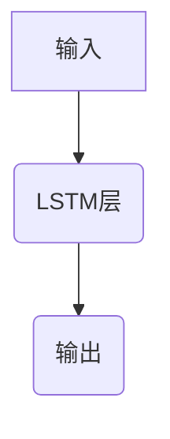
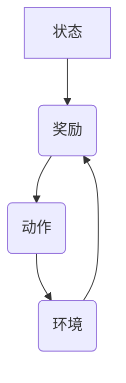
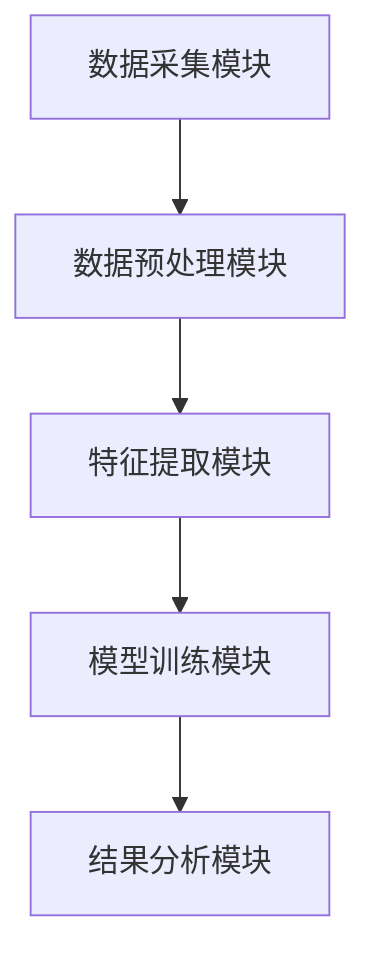

                 


# AI驱动的市场微观结构变化影响预测

> 关键词：AI驱动，市场微观结构，变化预测，时间序列分析，强化学习，LSTM，DQN

> 摘要：本文深入探讨了人工智能技术如何驱动市场微观结构的变化，并分析了这些变化对市场预测的影响。通过结合时间序列分析和强化学习等算法，我们提出了一种创新的预测方法，并通过实际案例展示了该方法在金融市场中的应用。本文还详细阐述了系统架构设计和项目实现过程，为读者提供了从理论到实践的全面指导。

---

# 第一部分: AI驱动的市场微观结构变化概述

## 第1章: 市场微观结构的基本概念

### 1.1 市场微观结构的定义

市场微观结构是指金融市场的基本组成要素及其相互作用的机制，主要包括市场参与者、交易行为、订单簿、价格动态等核心要素。AI技术的引入使得我们能够更精准地捕捉这些要素之间的关系，并预测市场变化。

### 1.2 AI在市场微观结构中的作用

AI技术通过分析海量数据，识别市场中的隐性模式和潜在规律，帮助我们更好地理解市场微观结构的变化。例如，通过自然语言处理技术分析新闻数据，AI可以预测市场情绪的变化，从而影响市场微观结构。

### 1.3 问题背景与目标

传统的市场微观结构分析依赖于统计学方法，但在面对高频交易和复杂市场环境时，这些方法往往力不从心。AI技术的引入为市场微观结构的分析提供了新的思路。本文的目标是通过AI技术，预测市场微观结构的变化，并评估这些变化对市场的影响。

---

## 第2章: 市场微观结构的核心概念与联系

### 2.1 市场微观结构的核心要素

市场微观结构的核心要素包括：

- **订单簿（Order Book）**：记录市场上所有未成交的订单，包括买价、卖价、订单数量等信息。
- **交易行为（Trading Behavior）**：投资者在市场中的交易策略和行为模式。
- **价格动态（Price Dynamics）**：市场价格的波动规律和趋势。

### 2.2 AI驱动的市场微观结构变化

AI技术可以通过以下方式影响市场微观结构的变化：

- **数据驱动的市场分析**：通过分析历史数据，识别市场中的规律和模式。
- **智能算法的应用**：利用机器学习算法预测市场行为和价格变化。
- **实时预测与反馈**：通过实时数据反馈，优化预测模型，进一步影响市场微观结构。

### 2.3 实体关系图（ER图）

以下是市场微观结构的核心概念的ER图：

```mermaid
er
    actor 市场参与者 {
        <---(o:订单)
        <---(p:价格)
        <---(t:时间)
    }
    entity 订单簿 {
        o:订单
        p:价格
        t:时间
    }
    entity 交易行为 {
        o:订单
        p:价格
        t:时间
    }
```

---

## 第3章: AI驱动的市场微观结构变化预测算法原理

### 3.1 时间序列分析

时间序列分析是预测市场微观结构变化的重要工具。常用的算法包括ARIMA、Prophet等。

#### 3.1.1 LSTM网络的原理与实现

LSTM（长短期记忆网络）是一种特殊的RNN，能够有效捕捉时间序列中的长周期依赖关系。



以下是LSTM的Python实现示例：

```python
import keras
from keras.layers import LSTM, Dense
from keras.models import Sequential

# 定义模型
model = Sequential()
model.add(LSTM(64, input_shape=(timesteps, features)))
model.add(Dense(1))
model.compile(loss='mean_squared_error', optimizer='adam')

# 训练模型
model.fit(X_train, y_train, epochs=100, batch_size=32)
```

#### 3.1.2 DQN算法的原理与实现

DQN（深度强化学习）是一种基于Q-learning的强化学习算法，适用于动态环境下的决策问题。



以下是DQN的Python实现示例：

```python
import numpy as np

class DQN:
    def __init__(self, state_space, action_space):
        self.state_space = state_space
        self.action_space = action_space
        self.memory = []
        self.gamma = 0.99
        self.epsilon = 1.0

    def remember(self, state, action, reward, next_state):
        self.memory.append((state, action, reward, next_state))

    def act(self, state):
        if np.random.random() < self.epsilon:
            return np.random.randint(self.action_space)
        else:
            return np.argmax(self.qnetwork.predict(state))

    def train(self, batch_size):
        mini_batch = np.random.choice(len(self.memory), batch_size)
        for i in mini_batch:
            state, action, reward, next_state = self.memory[i]
            target = reward + self.gamma * np.max(self.qnetwork.predict(next_state))
            target_f = self.qnetwork.predict(state)
            target_f[0][action] = target
            self.qnetwork.fit(state, target_f, epochs=1, verbose=0)
```

---

## 第4章: 系统架构与项目实战

### 4.1 系统架构设计

以下是系统架构图：



### 4.2 项目实战

#### 4.2.1 环境安装

```bash
pip install numpy pandas keras tensorflow
```

#### 4.2.2 核心代码实现

以下是LSTM模型的完整实现：

```python
import numpy as np
import pandas as pd
from keras.layers import LSTM, Dense
from keras.models import Sequential
from sklearn.preprocessing import MinMaxScaler

# 加载数据
data = pd.read_csv('market_data.csv')
data = data.values

# 数据归一化
scaler = MinMaxScaler()
data_scaled = scaler.fit_transform(data)

# 划分训练集和测试集
train_size = int(len(data_scaled) * 0.8)
X_train = data_scaled[:train_size, :-1]
y_train = data_scaled[:train_size, -1]
X_test = data_scaled[train_size:, :-1]
y_test = data_scaled[train_size:, -1]

# 构建LSTM模型
model = Sequential()
model.add(LSTM(64, input_shape=(X_train.shape[1], X_train.shape[2])))
model.add(Dense(1))
model.compile(loss='mean_squared_error', optimizer='adam')

# 训练模型
model.fit(X_train, y_train, epochs=100, batch_size=32, validation_data=(X_test, y_test))
```

---

## 第5章: 最佳实践与总结

### 5.1 小结

通过本文的分析，我们可以看到，AI技术在市场微观结构变化预测中的应用具有巨大的潜力。结合时间序列分析和强化学习算法，我们可以更精准地预测市场变化，并优化投资策略。

### 5.2 注意事项

- 数据质量对模型性能影响重大，需确保数据的完整性和准确性。
- 模型的可解释性在实际应用中同样重要，需关注模型的解释性。
- 在实际应用中，需结合具体市场环境和业务需求调整模型参数。

### 5.3 未来研究方向

- 研究更复杂的时间序列模型，如Transformer。
- 结合图神经网络，分析市场网络结构的变化。
- 探讨多模态数据的融合，提升模型的预测能力。

### 5.4 拓展阅读

- 《Deep Learning for Time Series Forecasting》
- 《Reinforcement Learning: Theory and Algorithms》
- Keras官方文档：https://keras.io/

---

# 作者

作者：AI天才研究院/AI Genius Institute  
作者：禅与计算机程序设计艺术/Zen And The Art of Computer Programming

