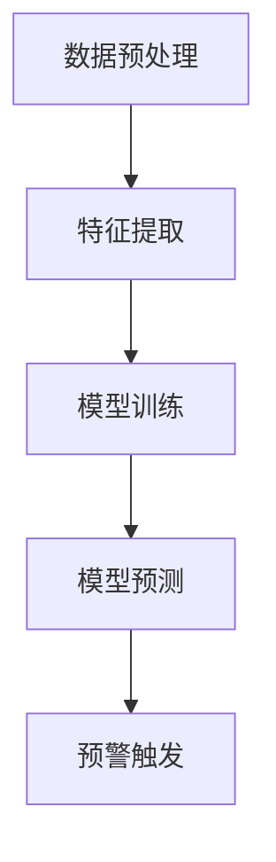
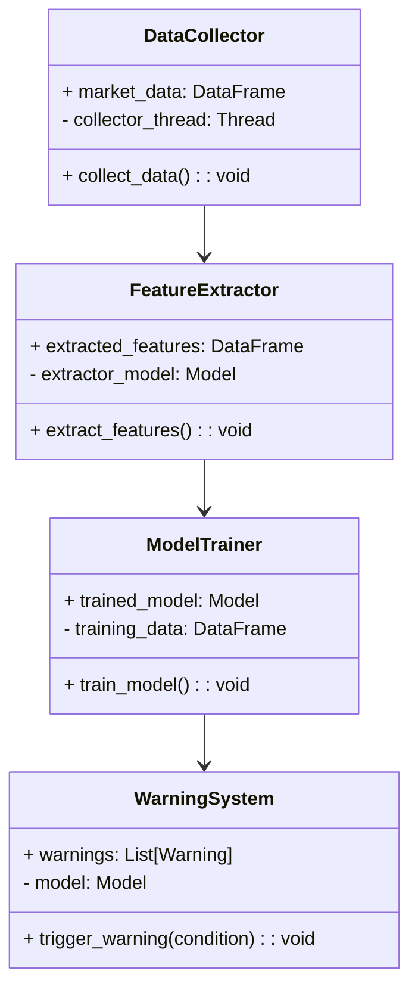

                 


# AI驱动的市场流动性枯竭预警

## 关键词：市场流动性、AI技术、流动性预警、时间序列分析、机器学习、深度学习、金融风险管理

## 摘要：  
本文深入探讨了如何利用人工智能技术实现市场流动性枯竭的预警。通过结合金融市场的流动性分析和AI技术的核心算法，本文详细阐述了AI驱动的流动性预警系统的构建过程，包括数据预处理、特征提取、模型训练与优化、系统架构设计等关键环节。文章还通过实际案例分析，展示了AI技术在流动性预警中的应用效果，并总结了该系统的潜在价值和未来发展方向。

---

## 第一部分: AI驱动的市场流动性枯竭预警概述

## 第1章: 市场流动性与AI技术的结合

### 1.1 问题背景与定义

#### 1.1.1 市场流动性问题的背景
市场流动性是指在特定时间内，资产能够以合理价格迅速买卖而不受价格波动影响的能力。流动性枯竭意味着市场无法快速成交，可能导致价格大幅波动或交易停滞。这种情况在金融市场上尤为危险，可能引发系统性风险。

#### 1.1.2 AI技术在金融市场的应用
人工智能技术（AI）在金融市场中的应用日益广泛，尤其是在高频交易、风险管理和市场预测等领域。AI能够通过大数据分析和机器学习算法，快速识别市场中的潜在风险，为投资者提供实时预警。

#### 1.1.3 流动性枯竭预警的必要性
流动性枯竭预警是金融市场风险管理的重要组成部分。通过AI技术，可以提前识别潜在的流动性危机，帮助市场参与者采取措施，降低风险损失。

---

### 1.2 市场流动性与AI技术的核心概念

#### 1.2.1 市场流动性的定义
市场流动性可以分为整体市场流动性（全市场流动性）和个股流动性。整体流动性反映市场资金的充裕程度，个股流动性则反映特定资产的交易活跃程度。

#### 1.2.2 流动性枯竭的特征
流动性枯竭通常表现为市场深度不足、买卖价差扩大、交易量骤减等现象。在极端情况下，可能出现“流动性危机”，导致市场恐慌性抛售和价格崩盘。

#### 1.2.3 AI驱动的流动性预警机制
AI驱动的流动性预警机制通过分析市场数据，识别潜在的流动性风险。常见的方法包括时间序列分析、机器学习模型和深度学习模型等。

---

## 第2章: AI驱动的流动性预警算法原理

### 2.1 算法原理概述

#### 2.1.1 时间序列分析
时间序列分析是流动性预警的重要工具。通过对历史交易数据的分析，可以预测未来的市场流动性变化。

#### 2.1.2 机器学习模型
机器学习模型（如随机森林、支持向量机）可以用于分类和回归任务，帮助识别流动性风险的特征。

#### 2.1.3 深度学习模型
深度学习模型（如LSTM、Transformer）能够捕捉市场数据中的复杂模式，适用于时间序列预测和非线性关系建模。

---

### 2.2 算法实现与流程图

#### 2.2.1 算法流程图（mermaid）


#### 2.2.2 算法实现代码
```python
def preprocess(data):
    # 数据预处理代码
    return processed_data

def feature_engineering(data):
    # 特征提取代码
    return features

def model_train(features, labels):
    # 模型训练代码
    return model

def model_predict(model, new_data):
    # 模型预测代码
    return predictions
```

---

## 第3章: 系统分析与架构设计方案

### 3.1 问题场景介绍
流动性枯竭预警系统需要实时监控市场数据，分析潜在风险，并在必要时触发预警。系统需要处理大量的高频交易数据，并保证预测的实时性。

### 3.2 系统功能设计

#### 3.2.1 领域模型（mermaid类图）


---

## 第4章: 项目实战

### 4.1 环境安装与配置
```bash
pip install pandas numpy scikit-learn tensorflow matplotlib
```

### 4.2 系统核心实现源代码
```python
import pandas as pd
import numpy as np
from sklearn.ensemble import RandomForestClassifier
from tensorflow.keras.models import Sequential
from tensorflow.keras.layers import LSTM, Dense

# 数据预处理
def preprocess(data):
    # 假设data是一个DataFrame
    data['return'] = data['close'].pct_change()
    data['volatility'] = data['return'].std()
    return data

# 特征提取
def feature_engineering(data):
    features = data[['return', 'volatility', 'volume']]
    return features

# 模型训练
def model_train(features, labels):
    # 划分训练集和测试集
    X_train = features[:-100]
    y_train = labels[:-100]
    X_test = features[-100:]
    y_test = labels[-100:]

    # 训练随机森林模型
    model_RF = RandomForestClassifier()
    model_RF.fit(X_train, y_train)

    # 训练LSTM模型
    model_LSTM = Sequential()
    model_LSTM.add(LSTM(64, input_shape=(X_train.shape[1], 1)))
    model_LSTM.add(Dense(1, activation='sigmoid'))
    model_LSTM.compile(loss='binary_crossentropy', optimizer='adam')
    model_LSTM.fit(X_train.values.reshape((-1, X_train.shape[1], 1)), y_train, epochs=10)

    return model_RF, model_LSTM

# 预测与预警
def predict_and_warn(model_RF, model_LSTM, new_data):
    # 使用随机森林模型进行预测
    prob_RF = model_RF.predict_proba(new_data)[:, 1]

    # 使用LSTM模型进行预测
    prob_LSTM = model_LSTM.predict(new_data.values.reshape((-1, new_data.shape[1], 1)))

    # 综合预测结果
    if prob_RF > 0.7 or prob_LSTM > 0.5:
        print("流动性风险预警：请采取措施！")
```

---

## 第5章: 总结与展望

### 5.1 总结
本文详细探讨了AI技术在市场流动性枯竭预警中的应用，通过算法分析和系统设计，展示了如何利用AI技术实现高效的流动性管理。

### 5.2 展望
未来，随着AI技术的不断发展，市场流动性预警系统将更加智能化和精准化。深度学习模型的优化和多模态数据的引入，将进一步提升系统的预测能力。

---

## 作者：AI天才研究院/AI Genius Institute & 禅与计算机程序设计艺术/Zen And The Art of Computer Programming

